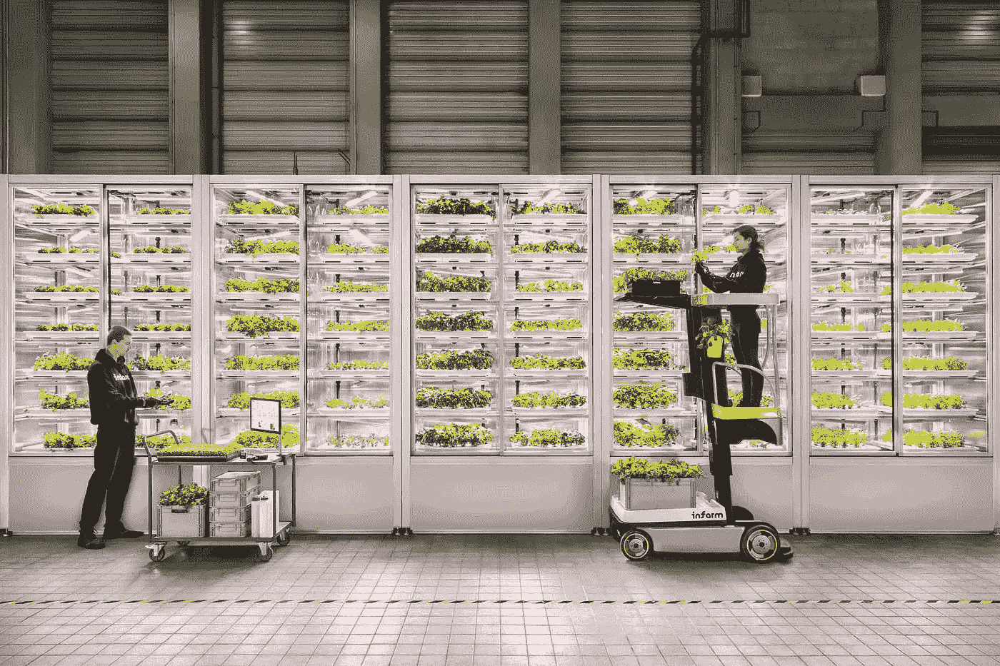
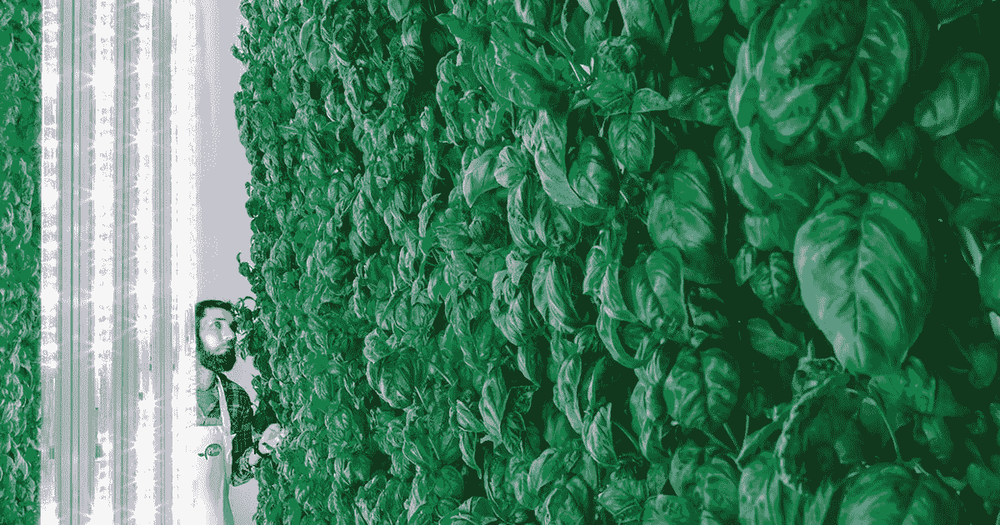
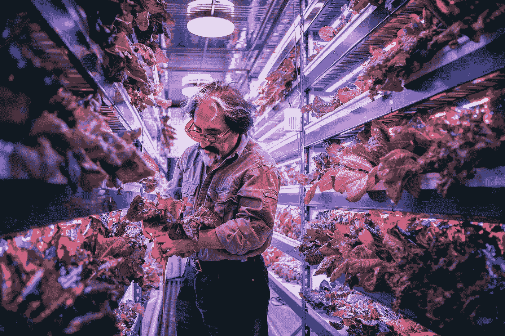
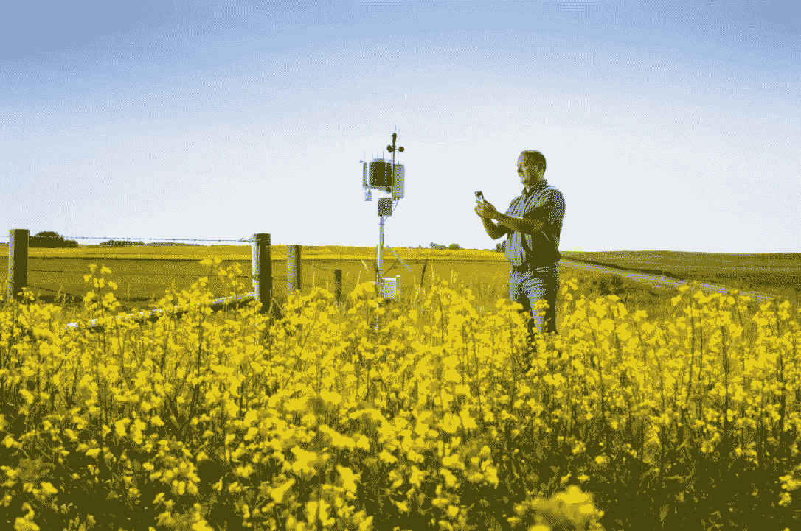

# 农业科技|农民已经不是过去的他们了(而且他们热爱农业科技)

> 原文：<https://medium.datadriveninvestor.com/agtech-farmers-are-not-what-they-used-to-be-and-they-love-it-c0e86eddf4ba?source=collection_archive---------15----------------------->

# 有没有想过放弃这一切去务农？好主意。但是如果你考虑用锄头代替你的电脑，请三思。因为如果有一个进入农业的时刻，那就是现在。只要你对人工智能了解很多…

“西兰花或卷心菜叶作为零食来啃。不是因为它们对你有好处，而是因为它们味道好到让你忘记薯片和其他垃圾食品”。

 [## 忘记石油吧，水是未来。-数据驱动型投资者

### 我们不会耗尽燃料的替代品。能源行业曾经是投资者的荣耀，无论…

www.datadriveninvestor.com](https://www.datadriveninvestor.com/2018/11/14/forget-about-oil-water-is-the-future/) 

## 马特·巴纳德(Matt Barnard)来到我们在里斯本的网络峰会上的约会——这是世界上最酷的 startupper 活动——展示了一个技术工程师的形象:polo 衫和毛衣，海洋剃过的头发。然而，他所说的有新时代的回声。

“营养、美味、当地采购的食物应该是每个人的权利”，他说。作为一名农业工人，我的梦想是为一个更健康的世界服务。

是的，马修·巴纳德实际上是一名农民(他自豪地补充道，“也是农民的儿子”)。很难想象他拿着锄头和耙子的样子，因为他从事农业的方式是非常非常高科技的。因此，人们在证券交易所谈论的东西比在市场上谈论的多。

封面照片: [**Infarm**](https://infarm.com/) ，这是一家总部位于柏林的初创公司，它在大城市附近创建垂直农场，提供 km 0 食物

## 他创办的食品初创公司 Plenty 目前由两个超高科技垂直农场组成

(一个在三藩市南部，另一个在怀俄明州的拉莱米)，去年吸引了日本软银巨头、Eric Schmidt(Alphabet 董事会主席)和亚马逊杰夫·贝索斯的赞助人的兴趣。结果:2 亿美元的投资。人们认为这仅仅是个开始:去年 1 月，巴纳德甚至来到了达沃斯。

Plenty vertical farm

## “很多人并没有真正的农场。相反，我们认为我们的增长空间就像人工智能应用于农作物的培训中心”，他解释道。

为我们工作的“农民”是数据分析师、专门研究味觉的化学家、设计师、工程师、机器学习专家。
在 Plenty's，蔬菜生长在垂直的柱子上，led 提供相当于阳光的能量。这里没有土壤，因为庄稼是用营养丰富的水喂养的，而非常高水平的环境控制消除了寄生虫问题。垂直农场并不新鲜。但是，根据巴纳德的说法，Plenty 是第一个彻底应用人工智能和科学的农场。

[**你喜欢这样吗？在 design large**T3 上看过类似的故事](http://www.designatlarge.it/category/analysis/?lang=en)

## “六年来，我们测试了灌溉、矿物质、湿度和光照变化对农作物的影响”。

“配方从来都不是通用的:它因植物而异，即使是同一种作物，在生命周期中也会有变化。由于这种研究方法，我们现在能够完美地设计环境，并产生无与伦比的感官质量。毫不奇怪，目前我们为星级餐厅服务。但我们的梦想是将高质量、价格合理、本地采购的蔬菜带到每个人的餐桌上”。

Crop One Holding, vertical farm in Dubai

## 这是等待我们的未来吗？这并不坏。

而事实上，巴纳德在美国做的 [**也在欧洲发生**](https://www.eu-startups.com/2018/11/10-european-agtech-startups-preparing-us-for-the-next-green-revolution/) 。

但据 Smart AgriFood 天文台的科学主任、布雷西亚大学教授马可·佩罗娜说，这不是一条适合意大利的道路。一个精确的战略选择。
“像投入大量资金的这种大型投资，与我们希望在意大利等国家看到的情况相去甚远。

> 通过 LED 灯在建筑物内制作的非常规和超技术作物生产水果和蔬菜，其明确目标是将生产地点尽可能靠近消费集中的大城市。

这肯定会有利于降低生产成本和更加合理和经济的物流。然而，这与欧洲的逻辑背道而驰(意大利强烈支持):即支持领土、受控制的原产地食品和受保护的原产地食品”。

## 意大利没有人工智能控制的农场。但这并不意味着我们的农业劳动力在谈到农业 4.0 时会放弃一切

这也从质量的角度允许生产的合理化和改进。

> 正如沃达丰业务部门物联网经理 Stefania Gilli 所说，“意大利农民对创新非常开放。即使与其他制造业企业家相比，他们应该已经跟上了工业 4.0 的速度。解决方案”。

Weather stations connected to sensors can already change the agricoltural performance dramatically

吉利已经与 CIA(意大利农民联合会)和 AGIA 合作多年。(青年农业企业家协会)关于联网农场的话题，她非常了解她的观众。“今天的农民是企业家。他们智力活跃，年轻，好奇。他们相信质量、建立竞争力和捍卫意大利制造的价值观。他们知道技术可以帮助他们做到这一切”。

## 在物联网解决方案的价格开始下降后，即使是小农场现在也能负担得起联网的气象站、传感器和大数据存储和分析系统。

例如，为了向农民提供预测模型，一个小型气象站连接到传感器，由太阳能电池板供电，并配备有一个带有物联网 Sim 的调制解调器，可以实时将数据从云发送到云分析。

“由于这些数据使我们能够进行准确的预测，农民可以合理灌溉，针对天气问题采取预防措施，定制植物检疫处理方法。例如，如果预计会有干燥和风，那么在葡萄藤上喷洒铜绿就没有意义。如果多余的水来了，最好喷点防霉剂。

## 物联网允许所有这一切，还可以在机器出现故障之前实时干预，或者避免效率低下。

并根据高峰活动更好地规划投资。我们谈论的是在水和产品方面非常可观的节约。但物联网也降低了保险成本和典型传统工具的数字化成本，例如乡村笔记本，农民必须在这种工具上记录土地上的植物检疫处理，这样就可以实时拍摄认证照片，而不必拜访测量员”。

## 物联网也有助于动物护理。

例如，在装有谷物的筒仓中，传感器可以自动激活热空气或冷空气的输入，以防止它们变湿。(这对鸡的伤害很大)。由于在奶牛尾巴上应用了一种设备(称为 Moocall，使用沃达丰技术)，当奶牛即将分娩时，饲养员会收到一条短信提醒，以找到动物并测量分娩前的收缩，从而将小牛死亡率降低了 30%。

## 即使是有机农业，技术也成了难以割舍的加分项。

Gilli 总结道:“它用于监测食品的跟踪、保存和包装方法，以及收获后食品保持静止、储存的时间。”。

未来有什么期待？有点像佩罗尼，吉利同意超越现实，如丰富，或使用非常创新的技术，如无人机。(“无人机在意大利也很受欢迎，但它们在大型农业地区尤其有用”)首先，数据分析将会有越来越显著的发展，从精准农业向决策驱动型农业转变，生成的数据可以帮助做出明智的决策，以生产高质量的食品”。

与此同时，作为农业科技越来越年轻的证据，两位年轻的企业家 Lorenzo Cilli 和 Valerio Carconi 刚刚创建了 Youfarmer，这是一个共同种植平台，允许每个人在附近的农场采用有机花园。食物一旦生长出来，就会通过直接在家里的取货点被送到城市。与计算机化的大片绿色相比，这听起来有点科技含量低，但也许它更有意大利风情…

*原载于 2019 年 6 月 3 日*[*http://www . designatlarge . it*](http://www.designatlarge.it/agtech-how-ai-is-changing-agriculture/?lang=en)*。*