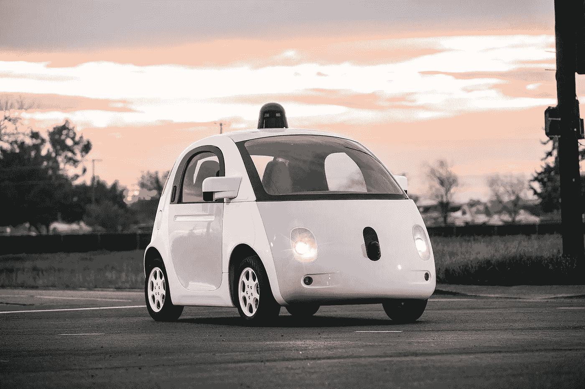

# AI 4 ALL

> 原文：<https://medium.datadriveninvestor.com/ai-4-all-a8158113495f?source=collection_archive---------11----------------------->

在我的整个高中生涯中，我一直在努力寻找方法来更多地了解我周围的社区。去年，我在学校成立了“编程女孩”分会，以弥合我们周围激动人心的科技行业与我所在高中之间的差距。

我知道我想更深入地了解这个俱乐部，让它在我的学校里真正发挥作用；许多类似主题的俱乐部来了又走，但很大程度上只是大学申请驱动，提供每周会议的免费披萨。为了帮助我们的 GWC 俱乐部避免类似的命运，我需要扩展我的 STEM 知识，所以我转向谷歌，搜索我可以在今年夏天申请的 STEM 机会。

这一搜索引导我进入了一个名为 AI4ALL 的项目，该项目由神奇的伯克利人工智能研究(BAIR)小组主办。除了看到 Waymo 面包车在当地红灯时突然停下来，我对人工智能一无所知，并认为这是我学习的绝佳机会。

AI4ALL 是一个代表性不足的以少数族裔为重点的阵营，旨在培养下一代技术领导者和思想家。在阳光明媚的 5 天里，我每天从加州米尔皮塔斯的家通勤到 40 英里以北的加州大学伯克利分校。

# 第一天

夏令营的第一天主要是向学生们介绍彼此和主题。在此之前，我不知道 AI 是什么，也不知道它在现实世界中是如何使用的。在讲座结束时，我明白了人工智能并没有一个正式的定义，它有可能极大地影响我们的世界。

我们本周的项目是让一个机器人从头开始跑。我只在当地的社区大学上过 Python 入门课程，如果我说我没有被吓倒，那是在撒谎。我已经有一段时间没有编写简单的计算器了，更不用说机器人了。

我们的营地辅导员教我们让我们的机器人工作所需的适当的 Python 库和函数，并给我们许多练习题来帮助我们应用和保留材料。我的耳朵里充满了对未来的兴奋，我登上了回家的地铁。

# 第二天

第二天早上，我们有一位演讲嘉宾，他谈到了人工智能中一直存在的伦理争论。她讨论了我们需要如何控制人工智能系统中的偏见，以使它们的行为公平。例如，在司法系统中决定假释的人工智能系统很容易对有色人种产生偏见，这取决于用于训练模型的数据。为了有效地使用人工智能，我们需要确保人工智能系统反映我们的价值观。接下来是对监督学习及其利弊/使用案例的快速讨论。

下午，我们开始着手我们的项目。我们从熟悉代码库开始。营地辅导员给了我们三个“机器人”的模板:一只猎豹、一只蚂蚁和一只步行者。我们的目标是让三个机器人中的两个能跑。我们修修补补了一段时间，改变身体形状参数，细化步长，并通过阅读库来找出哪些函数必须被调用。

一旦我意识到如何让我的机器人运行，我就开始优化距离。我把赌注押在了猎豹身上，我认为出于某种原因，一只机器猎豹一定是以真正的动物命名的。事实证明，我是对的！

# 第三天

今天的讲座是关于人工智能的各种应用。我们了解了人工智能今天的许多成就，例如让不同语言和背景的人更容易通过谷歌翻译进行交流，帮助销售团队通过自动消息系统与客户保持联系，以及通过优步和 Lyft 给数十亿人带来身体移动的礼物。我很惊讶地听说，我每天使用的许多产品中都有人工智能。

我脑海中的下一个问题是:我怎样才能真正制作出这些应用程序？我们下一课的中心是训练一个机器算法。数学比我预期的要多得多，但幸运的是，我写了一点 Python 逻辑，为我完成了困难的计算。

我最喜欢的部分是参观旧金山中心的游轮自动化。Cruise 是一家致力于让自动驾驶汽车成为现实的初创公司。我们花了一下午参观他们的办公室，了解各种汽车和帮助优化他们路线的实验(*哈！)*走向大众市场的自动驾驶商品。

# 第四天

实地考察结束后，我们回来做了一个关于可解释性和模仿学习的演讲，这是一个机器可以从一些真理“专家”那里学习的想法在这个例子中，我们看到一个未经训练的机器人在向一个训练有素的机器人学习。至少可以说，这种体验是元体验。

# 第五天

我们参观了校园里的一些研究实验室，亲眼目睹了他们的工作。在我们参观的一个实验室里，我们看到一个机器人在铺床和整理物品。这种创新的意义是显而易见的:想象一下这种机器人对老年护理行业的积极影响！

参观结束后，我做了一个自己的演示:一个基于神经网络的猎豹机器人，可以跑近 100 米。我们以闭幕式结束了这一天，现在是我向一个新的社区告别的时候了。

# 我学到了什么

1.  多样性在创建和告知道德人工智能系统方面至关重要。没有一套多样化的训练数据，人工智能很容易变得有偏见，并与我们的道德原则相抵触。
2.  从医疗保健到农业，人工智能在每个领域都有巨大的潜力。机会确实是无穷无尽的。
3.  人工智能并不是我过去认为的可怕的、仅供研究的话题。AI4ALL 是一次令人难以置信的成长经历，因为我发现在我的年龄组中还有其他人有着相似的兴趣、抱负和好奇心。

卡尔，谢谢你给了我一个美好的夏天！直到明年夏天:)