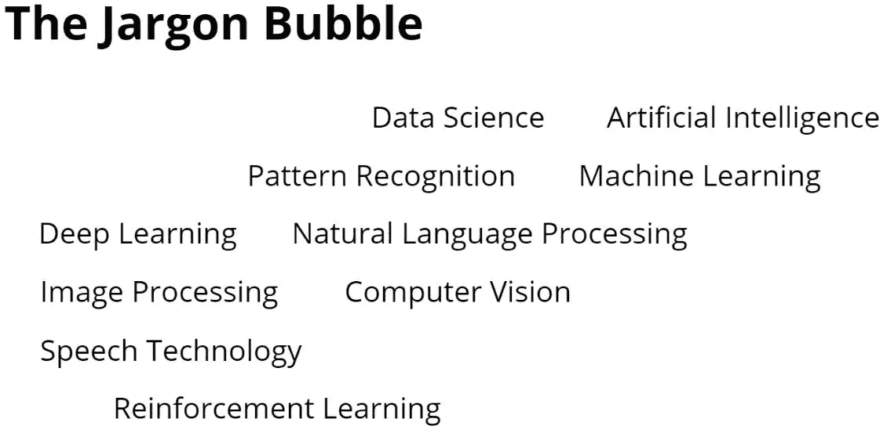
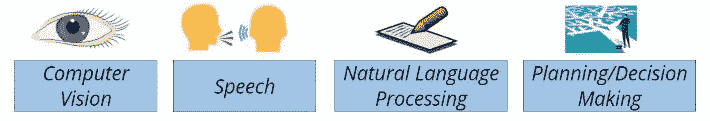
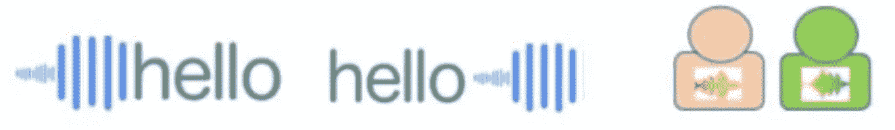
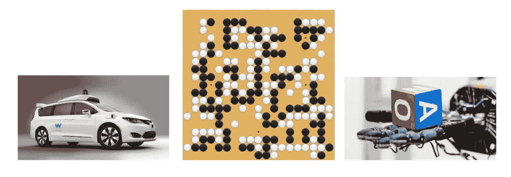
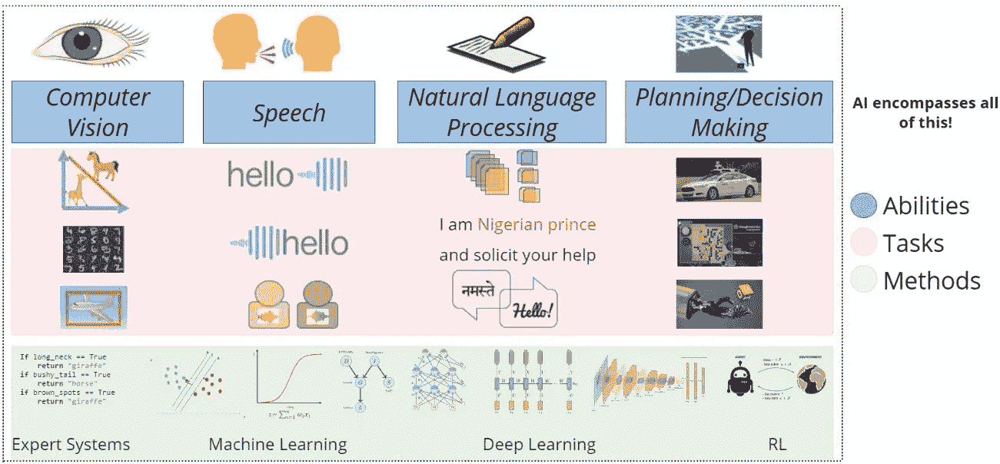
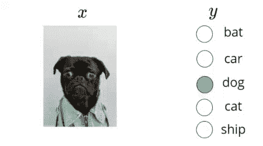
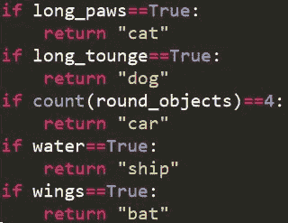
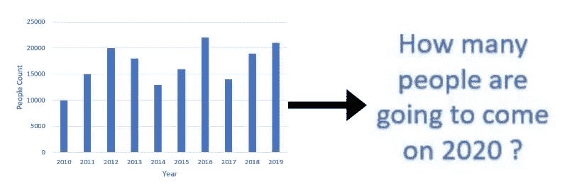

# 艾:夸夸其谈的行话

> 原文：<https://medium.datadriveninvestor.com/ai-a-bombastic-jargon-1211f519fe85?source=collection_archive---------9----------------------->

Jargon Bubble — Image Credits : Mitesh M. Khapra, Pratyush Kumar, One Fourth Labs ([https://slides.com/ofl/jargon-busting-two-of-two#/0/1](https://slides.com/ofl/jargon-busting-two-of-two#/0/1))

一个对数据分析着迷的新手带着探索这个领域的渴望而来。可悲的是，许多不受欢迎、冷漠和令人困惑的术语吓走了他。我总是建议你不要被人们使用的花哨术语冲昏头脑，相反，要遵从这样的说法:“行话让我们用华丽的言辞 来掩饰知识的贫乏。”

现在，在开始之前，我想感谢*四分之一实验室*的*深度学习课程*。你可以在他们的网站上找到详细信息——https://padhai.onefourthlabs.in/

到本文结束时，你将能够以更好的方式将周围发生的事情分类为“人工智能”、“机器学习”、“深度学习”、“深度强化学习”、“计算机视觉”、“数据科学”、“模式识别”等等。

那么，这些特殊术语是什么意思呢？我试图用简单的术语来解释它们，而不是给你传统的书呆子式的定义。

**人工智能**

有时被称为机器智能。人里面有上帝，机器里面也有人。这是机器展示的智能，与人类展示的自然智能形成对比。

**机器学习**

计算机科学的一个领域，利用统计技术赋予计算机系统无需显式编程就能“学习”数据的能力。

**数据科学**

一个跨学科领域，使用科学方法、流程、算法和系统从各种形式的数据中提取知识和见解，包括结构化数据(表格)和非结构化数据(图像、视频)。

**模式识别**

它是对数据中模式和规律的自动识别。

**计算机视觉**

它是一个跨学科的领域，研究如何让计算机从数字图像或视频中获得高层次的理解，并自动完成人类视觉系统可以完成的任务。

**深度学习**

这是机器学习研究的一个新兴领域，其引入的目的是使机器学习更接近其最初的目标之一:人工智能。

现在看了这么多定义，你清楚意思了吗？还是还在迷茫？

说我，我很迷茫！

-AI 不涉及统计技术、数据、学习吗？

-是不是只有显式编程才称之为 AI？

-AI/ML 不是交叉学科吗，还是它们不处理结构化数据，或者科学方法？

-对模式的识别不就是类似于“智能”、“从数据中洞察”、“从数据中学习”吗？

**戳破行话泡沫**

让我们用另一种方法来解决这个问题，把所有事情分成 3 类

-能力

-任务

-方法

**能力:**

*   视觉(计算机视觉)
*   说和听(演讲)
*   阅读和写作(自然语言处理)
*   决策(强化学习)

Abilities — image Credit : Mitesh M. Khapra, Pratyush Kumar, One Fourth Labs ([https://slides.com/ofl/jargon-busting-two-of-two#/0/11](https://slides.com/ofl/jargon-busting-two-of-two#/0/11))

**任务:**

1.  计算机视觉

*   使用人口统计学对两种或多种动物进行分类。
*   识别手写数字。
*   检测图像中的对象，如咖啡、电话、眼镜等。

Tasks Done Using Computer Vision

2.演讲:

*   通过声音识别检索信息。
*   将这篇文章转换成演讲。
*   听到两个不同的人说话，并能够区分声音

Tasks Done Using Speech

3.自然处理语言

*   对垃圾邮件进行分类。
*   把北印度语写成的东西翻译成英语，反之亦然。

Tasks Done Using Natural Language Processing(NLP)

4.强化学习

*   我们所知道的最常见的例子就是“自动驾驶”。
*   阿尔法行动。
*   教机器人根据重量举起东西。

Tasks Done Using Reinforcement Learning

**方法**

所有上述任务都可以用专家系统、逻辑回归、SVM、图表方法、递归神经网络(RNN)、卷积神经网络(CNN)等等来解决。

**那么什么是 AI 呢？**

人工智能包括所有这些东西，即能力、任务、方法。

AI Map — Image Credit : Mitesh M. Khapra, Pratyush Kumar, One Fourth Labs ([https://slides.com/ofl/jargon-busting-two-of-two#/0/11](https://slides.com/ofl/jargon-busting-two-of-two#/0/11))

**深入研究机器学习**

当我将以下数据提供给模型，并得到一个专家系统程序作为回报时，因为机器本身创建了一些逻辑和规则来得出这个结论。这是监督学习的一个例子。大多数机器学习只包括监督学习。

Machine takes the Labeled Input Data and generates an Expert System Program — Image Credits : Mitesh M. Khapra, Pratyush Kumar, One Fourth Labs ([https://slides.com/ofl/jargon-busting-two-of-two#/0/1](https://slides.com/ofl/jargon-busting-two-of-two#/0/11)2)

**大多数人工智能任务需要模式识别**

模式识别有什么不同？

模式识别领域涉及使用计算机算法自动发现数据中的规则，这些规则采取诸如**分类、回归、聚类等行动。**

**图像处理和计算机视觉有区别吗？**

计算机视觉和图像处理有很小的区别。计算机视觉使用经过处理的输入图像作为输入。例如，如果输入图像对于模型来说大小不规则，而 CV 模型只接受 128x128 图像的输入大小，则必须调整图像的大小，然后将它们发送到模型。

进行这种转换称为图像处理。

**什么是数据科学？**

如果我给你数据，绘制成下面的柱状图，然后让你告诉我明年，也就是 2020 年，将会有多少人来，会怎么样？

Predictive Analytics being done using Descriptive Analytics

因此，当我们单独处理数字数据(如数据库表、销售、客户、收入等)时，我更喜欢使用术语**数据科学**。).

**结论:**

所以，文章的结尾来了。我希望你能清楚人工智能、ML、PR 等术语。并恰当地使用这些术语。

**参考文献**

我想提一下 Youtube 上的第四个实验讲座，名为“术语破除”。

要看视频，你可以去这里【https://www.youtube.com/watch?v=OMGt-jcMlCs 。

## 来自 DDI 的相关故事:

 [## 数据科学和软件工程哪个更有前途？

### 大约一个月前，当我坐在咖啡馆里为一个客户开发网站时，我发现了这个女人…

medium.com](https://medium.com/datadriveninvestor/which-is-more-promising-data-science-or-software-engineering-7e425e9ec4f4)  [## 用 7 个步骤解释深度学习

### 和猫一起

medium.com](https://medium.com/datadriveninvestor/deep-learning-explained-in-7-steps-9ae09471721a)