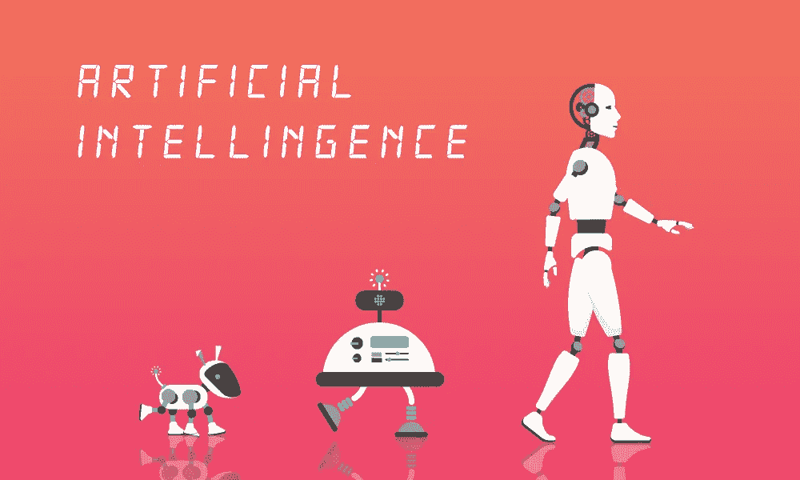
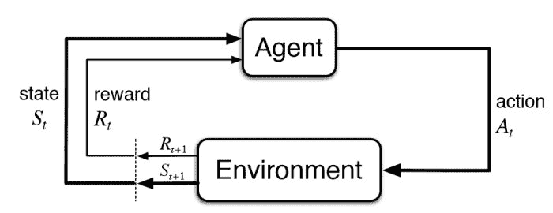
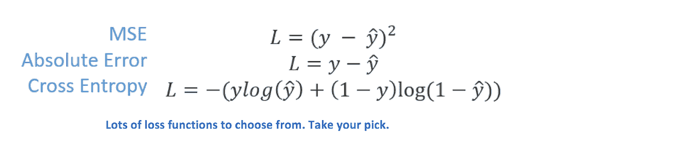
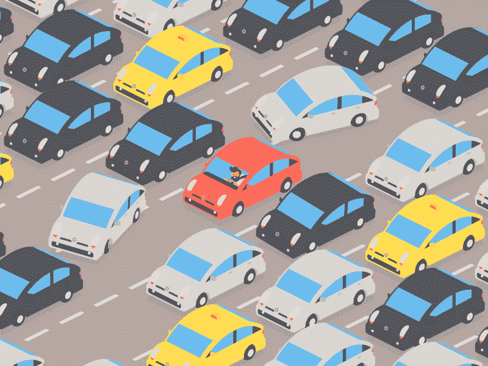
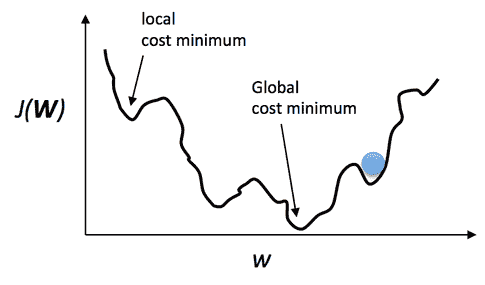
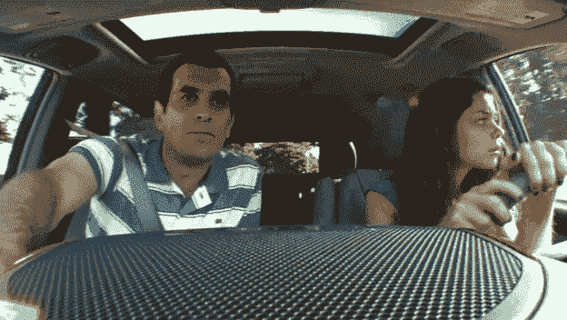

# AI…一个生命的隐喻？

> 原文：<https://medium.datadriveninvestor.com/ai-a-metaphor-for-life-b0649342db75?source=collection_archive---------7----------------------->

你有没有想过我们周围的技术与人类有多么相似？好吧，让我来分析一下，以一个婴儿为例。我们假设婴儿在一个有壁炉的房间里。婴儿看到了壁炉，开始向火爬去。当婴儿靠近炉火时，他开始感到温暖和舒适。这就对火的热量产生了积极的反应。婴儿觉得爬近火会得到“奖励”。现在，天真无邪的宝宝决定去摸火。哎哟！。婴儿刚刚烧伤了他/她的手指。

在这件事之后，大脑已经被编程识别出火在一定距离上是一件积极的事情。然而，如果你试图靠得太近，结果是一件消极的事情，你最终会伤害自己。这是通过与环境和我们周围的互动来学习。同样，人工智能的一个分支是计算机通过交互进行学习的方法，称为强化学习。

当计算机通过强化学习进行学习时，它使用试错法来寻找获得最多回报的最佳方式。

在强化学习中，你有一个代理人。因为代理从状态(S0)开始。代理完成一个动作(A0)并获得一些奖励(R1)，你的环境经历一个状态变化(S1)(不是化学变化，而是框架变化)。

这产生了一个**状态、奖励和动作**的循环

这都是由最大化累积回报的目标所驱动的。和人类差不多。我们都有一个不断提高自己的目标，我们被驱使在生活中收集“奖励”。

好的，这个很有意思。

以神经网络为例。神经网络是处理信息的神经元网络。神经网络由三个主要层组成，即输入层、隐藏层和最终输出层。神经网络是模仿人脑的，人脑是我们这个时代最先进的处理机器。我们的大脑接收输入，处理它并提供输出，例如，你的反射动作(即，当你烧伤手指时，你下意识地缩回手来保护它。都是你脑子的魔术！)

同样，在神经网络中，有一堆输入节点和一个输出节点。输入要素包含在输入向量 x 中，我们希望计算单个标量预测ŷ.这是通过将输入特征传递给使用权重、偏差和一些激活函数进行线性运算的层来计算的。然而，为了获得准确的预测，你的神经网络必须经过训练。就像你的大脑一样。你的大脑也必须接受训练，以做出准确的决定(你不会知道火是有害的，直到你经历它！).

目标是最小化损失函数。

最后，训练神经网络以最小化误差并提供准确的输出。

神经网络的功能与我们每天的工作如此接近。人类总是在试图解决最优化问题。例如，当你今天早上开车去学校或工作时，你是否选择了最快的路线或随机的高速公路和道路最终到达你的目的地？当你第二天有一个作业要交的时候，你是花时间浏览你的 Instagram 新闻，还是把手机放在一边开始工作。所有这些场景的目标都是减少压力和问题，这些压力和问题可能被认为是神经网络输出的“错误”或“差异”。神经网络的目标是优化并提供准确的结果。

然而，很有可能你第一次开车去上班/上学的时候，你没有选择最有效的路线。

当你成为习惯时，你会尽可能高效地找出往返目的地的最佳路线。

当你觉得自己似乎无法打破渴望再看一季《布鲁克林九九》的冲动，或者当你认为没有办法减轻学校和工作带来的压力时，你会怎么想？这类似于机器学习中的**局部极小值**或**鞍点**。在 ML 中，这些点的梯度几乎为 0，这就形成了一条水平线。这使得 f(x)很难最小化。对抗这些局部最小值需要二次优化函数和更复杂的技术。同样，在生活中，你可能会遇到这样的时刻，你觉得自己无能为力，但看看你的周围，你一定会找到一种方法来进一步最小化你生活的损失函数。

好吧，最后一个例子:

在强化学习中，有一种策略叫做ε贪婪策略。这种策略用于对抗勘探和开采的权衡。ε比率决定了人工智能是否会优先探索(随机行动)更大区域的更大奖励，以换取更低的概率。当ε比率较小时，人工智能优先使用现有信息来指示最佳动作。

类似地，当人类做决定时，我们的大脑会实施一种类似的技术来指导我们的决策过程。假设你有两个选择。你可以选择和朋友一起去跳伞，也可以呆在家里看《网飞》。在这里，你已经通过狂看网飞的一个节目建立了你的舒适水平，你知道做这个活动会有一个稳定的预期回报。然而，你也可能争论说和朋友一起去跳伞会更有趣(回报更高)，但你不确定跳伞是否是你想做的事情(获得有趣体验的概率很低)。

Source: [https://dzone.com/articles/why-machine-learning-is-a-metaphor-for-life](https://dzone.com/articles/why-machine-learning-is-a-metaphor-for-life)

基于这些，谷歌的自动驾驶汽车是一项非凡的创新，它融合了人工智能的各个方面。巴斯蒂安·特龙是谷歌无人驾驶汽车、谷歌 X、谷歌眼镜和许多其他产品的幕后策划者。2005 年，他赢得了 DARPA 大挑战，因为他创造了一种叫做斯坦利的自动驾驶汽车。

自动驾驶汽车背后的底层技术是**监督学习**，这是**机器学习**的一种形式。人工智能被输入带标签的数据，汽车被带到车道上，学习模仿人类驾驶。这和人类学开车是一样的。我们首先观察一个有经验的司机如何驾驶，然后轮到我们试着向我们的教练学习。这叫**学榜样！**

我可以继续研究人工智能与人类的相似程度。但这里的关键点是，随着人工智能的发展，它将成为我们生活中不可或缺的一部分，并带来巨大的潜力，根据它与我们的相似程度，彻底改变我们的生活。

如果你喜欢读这篇文章，给它一个赞，分享一下。关注我了解更多！

灵感来自:[https://adeshpande 3 . github . io/Why-Machine-Learning-is-a-beauty-For-Life](https://adeshpande3.github.io/Why-Machine-Learning-is-a-Metaphor-For-Life)