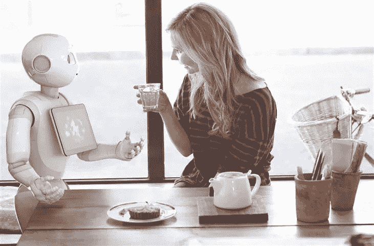

# 艾:都是理想还是其实阴险？

> 原文：<https://medium.datadriveninvestor.com/ai-all-ideal-or-actually-insidious-bb4ae6141265?source=collection_archive---------23----------------------->

1956 年:猫王发行他的第一首热门歌曲《心碎旅馆》的那一年年，IBM 发明了第一个硬盘驱动器，人工智能(AI)一词首先由达特茅斯学院教授约翰·麦卡锡提出。人工智能，通常被称为“AI”，是一门制造具有智能行为的硬件的科学。今天，我们正处于下一次工业革命之中，人工智能正在推动这场革命，它进入了从汽车到医疗保健到基础设施的几乎每个领域。仅到 2021 年，人工智能医疗保健市场就有望达到 66 亿美元，显然人工智能的力量不可低估。今天，人工智能被恰当地称为[【狭义人工智能】](https://futureoflife.org/background/benefits-risks-of-artificial-intelligence/)，意思是应用程序被设计来执行狭义的任务，如面部识别或驾驶汽车。从亚马逊最近推出的基于云的个人助理 Alexa 到谷歌的自动驾驶项目 Waymo，我们所知道的生活已经发生了变化，人工智能还处于起步阶段。

人工智能应用经常被视为非凡的创造或相反的恐惧。我们惊叹于 iPhone 的虚拟个人助理 Siri 如何告诉我们秘鲁的首都是哪里，最近的星巴克在哪里。如果无人驾驶汽车实现其防止大量交通事故的承诺，[每十年可以挽救 30 万条生命](https://www.theatlantic.com/technology/archive/2015/09/self-driving-cars-could-save-300000-lives-per-decade-in-america/407956/)。所有这些发展都是为了一个原因:改变我们的生活方式，让它变得更加简单和高效。如果是这样的话，那么为什么我们这么多人害怕在一个由人工智能主导的世界里做一个人类将意味着什么？

人类总会找到通过机器复制人类表现的手段。在哥本哈根的一个旅游信息中心，游客受到阿布萨隆的欢迎。这个四英尺高、闪闪发光的机器人用“你好，我是阿布萨隆”来问候你。我是一个机器人，可以帮你发现哥本哈根令人兴奋的景点。”阿布萨隆是你新的旅游信息官。根据 Travelzoo 的一项全球调查，79%的旅行者认为这些机器人是有益的，因为它们更擅长处理不同的语言。

*[Image: Dan Rang]*

人类多才多艺。我们很有创造力，当合适的工具放在合适的人手里，结果几乎可以改变生活。艾玛·杨(Emma Yang)在很小的时候就学会了编程。看着她的祖母努力认出自己的家人，艾玛启发她使用人工智能和面部识别来帮助她和其他患有阿尔茨海默氏症的人。现在她 14 岁了，她的应用程序“T0”Timeless 填补了市场上的一个空白，帮助阿尔茨海默氏症患者的日常生活。患者可以滚动浏览朋友和家人的照片，应用程序将使用面部识别技术揭示这个人是谁以及他们与患者的关系。该应用程序还被设计为在患者试图重复呼叫联系人时生成快速提醒——这种情况因疾病而经常发生。如果病人这样做了，应用程序会快速提示:*“你确定要打电话吗？你不到五分钟前才打过电话。”*“永恒”不仅让艾玛的奶奶保持了活力，还让她的护理人员能够继续照顾她的病人。护理人员需要帮助将事件放在日历上，并邀请朋友和家人发送照片，面部识别算法可以使用这些照片来识别他们。

[Image: Emma Yang]

人工智能解决方案也对数据管理和药物管理产生了重大影响。作为医疗保健的基础，病历必须易于获取。因此，使用机器人收集、存储、重新格式化和跟踪数据已经成为人工智能和数字自动化最广泛的应用。同样，在药物管理方面，美国国立卫生研究院(National Institutes of Health)创建了一个 [AiCure ap p](http://novatiosolutions.com/10-common-applications-artificial-intelligence-healthcare/) ，通过手机上的网络摄像头与人工智能的合作，确认患者正在服用他们的处方。普通用户可能是患有严重疾病的人和倾向于违背医生建议的患者。在这里，显然 AI 不仅仅是一种“炒作”。AI 在拯救生命。

大多数人关心的是人工智能的长期目标，虽然 IBM 的沃森可能在下棋方面胜过人类，但“强人工智能”是目标，人工智能几乎在每个认知任务上都胜过人类。根据管理咨询公司普华永道(PwC)2017 年[的分析](https://pwc.blogs.com/press_room/2017/03/up-to-30-of-existing-uk-jobs-could-be-impacted-by-automation-by-early-2030s-but-this-should-be-offse.html)，这一目标可能在未来 15 年内变得非常现实。普华永道的首席经济学家 John Hawksworth 声称“到 21 世纪 30 年代初，多达 30%的现有英国工作岗位会受到自动化的影响”。据称，面临自动化风险最高的部门是运输和仓储(56%)、制造业(46%)以及批发和零售业(44%)。

现在，自然，机器人日益增长的智能是一个值得关注的问题。然而，感觉和表情的能力是人类的两个属性，数据科学家还没有找到算法。生活在地球村意味着人类的情感范围在不断变化。对我们中的一些人来说，通过向所爱的人发送关于脸书的信息来减轻孤独感。然而，结果是，我们被数字化了。我们是否被剥夺了与人性接触的能力？具有讽刺意味的是，就像技术改变了我们的情感一样，我们似乎有了一种新的欲望，想用情感来改变技术。无数的工作需要创造性的智慧，Siri 自己的声音，[苏珊·班尼特](https://www.nytimes.com/roomfordebate/2016/12/05/is-artificial-intelligence-taking-over-our-lives/if-ai-replaces-humans-will-siri-lead-us-into-the-sea)思考，*“人工智能应用将能够创造艺术、音乐、文学和喜剧吗？”在人工智能变得更强大并能够模仿人类情感之前，我们必须认识到，并非所有人类任务都可以被取代。*

AI 不再是科幻电影的题材。这是真的。它正在增加，并将不可避免地影响我们所有人的生活。因此，我们需要拥抱人工智能的可能性。对于那些对工作替换高度焦虑的人来说，你必须将这场革命视为一个体验创新激增的机会。Gartner 预测，到 2020 年，虽然 180 万个工作岗位将因人工智能而被淘汰，但 230 万个工作岗位将被创造出来。是的，工作的性质正在发生变化。将会有挑战，一些比另一些更明显。然而，确保人工智能的发展得到指导，以便仍然保持以人为本的方法，最终将意味着我们不必将人工智能视为一种超自然活动。我们有责任以开放的心态与人工智能合作，为所有人创造一个安全、智能和理想的世界。