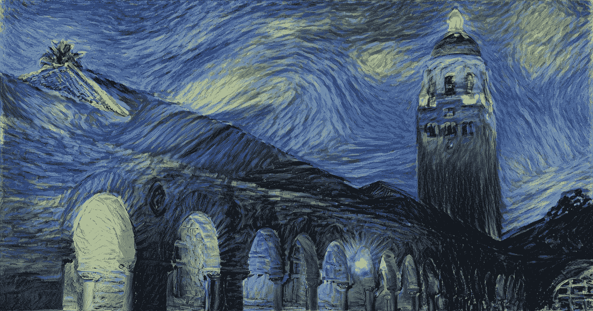
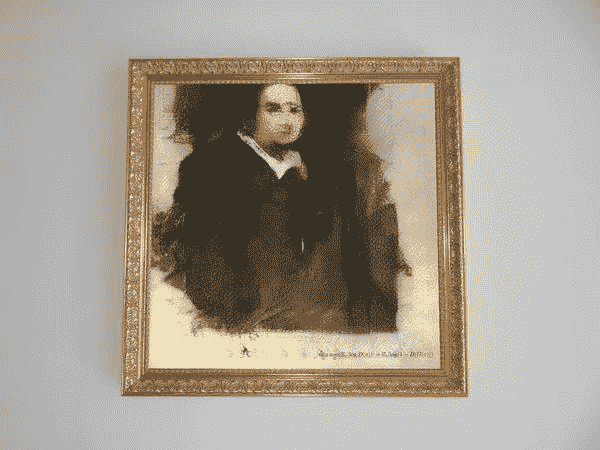

# 人工智能和艺术|为什么甘斯卖 40 万美元

> 原文：<https://medium.datadriveninvestor.com/ai-and-art-why-gans-sold-for-400k-6e27c06371c1?source=collection_archive---------17----------------------->

神经风格转移可以概括为创造一个内容与图像 ***c*** 相似、风格与图像 ***s*** 相似的仿作 ***p*** 。这项工作由[一种艺术风格的神经算法](http://arxiv.org/abs/1508.06576)推广。

[https://medium.com/artists-and-machine-intelligence/neural-artistic-style-transfer-a-comprehensive-look-f54d8649c199](https://medium.com/artists-and-machine-intelligence/neural-artistic-style-transfer-a-comprehensive-look-f54d8649c199)

神经类型转移只是个人开始以独特和创造性的方式应用机器学习算法的一个领域。谷歌的 DeepDream 是另一个经典的例子，它的创建部分是因为需要试图了解我们的神经网络到底在学习什么。

[最近有一件由生殖对抗网络(GAN)创作的艺术品，售价超过 40 万美元](https://www.christies.com/features/A-collaboration-between-two-artists-one-human-one-a-machine-9332-1.aspx)。

[https://www.nytimes.com/2018/10/25/arts/design/ai-art-sold-christies.html](https://www.nytimes.com/2018/10/25/arts/design/ai-art-sold-christies.html)

我不想陷入荒谬的境地，即运行原始 GANs 来制作一幅价值 40 万美元的图片，但我想开始问这样的问题:为什么在 ***上帝的绿色地球上*** 会发生这种情况。

我有一个信念，人们不了解技术，更具体到这个话题，人工智能的现状。即使在我目前就读的大学(卡内基梅隆大学)，我经常与之交谈的计算机科学专业的学生也不明白人工智能是如何或什么，除非他们特意去研究它。这指向了一个普遍的、有点明显的说法，即人们对他们没有被教过的东西一无所知。

我认为，人工智能领域之外的大多数人对现有的算法和程序的数学或能力知之甚少，这是非常合理的。原则上这并没有什么错，但是这导致了一个问题，那就是人们会对令人惊讶的简单实现和想法感到惊讶。人们被利用了。

我最近有这个想法，主要是因为脸书和谷歌最近举行的令人悲伤的国会听证会。国会议员甚至不知道该问什么问题，或者为什么他们的问题毫无意义，这一事实证明了整体情况。

一般公众(作为一个整体)不了解，以任何方式塑造或形成他们正在使用的技术，它正在收集什么数据或如何工作。我并不是说人们需要了解技术的每个方面才能使用它，那将是浪费时间，但是人们应该了解技术的原理。他们不需要知道晶体管和逻辑门的一切，但他们需要知道一些东西。那东西是什么，我不确定。

如果人们知道些什么，那么任何人和他们的母亲在卧室里创作的那幅画就不会卖到 40 万美元。我相信艺术更多的是关于目的和意图，而不是结果或实现，但我个人认为这件作品的意图是从几十万美元中诈骗一些可怜的笨蛋。

作为一个整体，人工智能社区有责任为那些不完全理解正在发生的事情的所有本质细节的人制作可消费的信息，否则，狗屎艺术可能在不久的将来成为一种合法的流派。