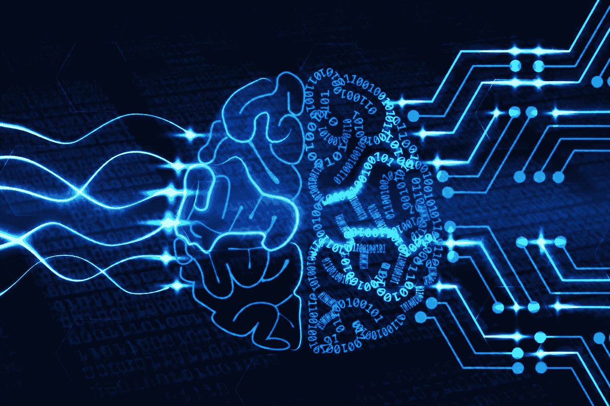
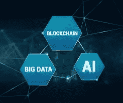

# 人工智能和区块链——天造地设的一对

> 原文：<https://medium.datadriveninvestor.com/ai-and-block-chain-a-pair-made-in-heaven-3b14e89d68ca?source=collection_archive---------30----------------------->

任何程序都有两个组成部分，一个是对算法的处理，一个是对数据库的存储。这是我们大脑的一小部分，它有记忆和处理器，使我们能够存储和检索我们想要的任何东西。算法是 AI 的开始。最好的算法是那些能够更快地检索信息并具有更好相关性的算法。

随着越来越多的软件被开发出来，产生了更多的数据，这意味着产生了更多的算法，从而产生了更多的数据。由于数据产量变高，结果是算法必须适应数据分析。这是大数据分析出现的时候，不仅需要算法，还需要能够执行一些实时分析的并行算法。最初，人们开始编写高效和优化的代码，以减少机器的处理时间。但是后来，出现了一种情况，当生成的数据变得如此之高，以至于编写、优化和高效的代码没有太大的影响。这也是大数据分析备受关注的时候。

大数据分析产生了大量数据，人类无法对其进行分析。当机器被设计成能自我学习时，处理如此多数据的复杂性大大降低了。因此，当分析失去其重要性时，机器必须学习和分析，这导致了机器学习的演变。当一个巨大的采矿过程进行时，产出的黄金数量非常少。大数据分析就是这种情况，尽管对大量数据进行了分析，但只产生了很小的价值。它学习的数据越多，它理解的就越多，而不仅仅是处理它们。

人工智能的未来是深度学习，机器不仅仅是创建数据，而是根据之前获得的输入，在大量信息中连接正确的数据。事实上，这超出了任何个人的能力。

**区块链的演变**

君主统治的出现是因为国王们知道人们之间可能不会团结。仍然有一个神话，使权力集中，能够更好地治理。与此相反，已经到了一个阶段，权力必须在人们之间分配，使数据更加分散，从而为区块链技术铺平道路。

区块链是一种开放的分布式分类账，记录两个对等方之间的交易。它由对等网络管理，遵守节点之间的通信协议。一个重大突破是，他们通过密钥进行身份验证。一旦数据被记录在数据块中，任何人都不能更改它。该块充当网络上发生的所有交易的分类账。

对等网络最初的应用是非法的，比如使用种子下载电影。一个单独的内容被分割并存储在不同的系统中，这意味着在链中无法跟踪具有该文件的源，因为不存在对块中数据的认证。

非法使用对等网络的缺点在区块链的帮助下被克服了。顾名思义，它由数据结构块组成，这些数据结构块在最初的区块链实现中能够专门保存数据，在某些实现中能够同时保存数据和程序，每个块保存批量的单个事务和任何区块链执行的结果。每个块包含一个时间戳和将它链接到前一个块的信息。这清楚地表明，区块链仅在数据的帮助下发挥作用。

**互连**

AI 需要更多的数据。但当人工智能被某人控制时，事实证明控制人工智能的人可以访问任何事情和所有事情的个人数据。因此，应该有这样的东西，人工智能不应该被控制，这意味着区块链和人工智能可能是有史以来最好的一对。