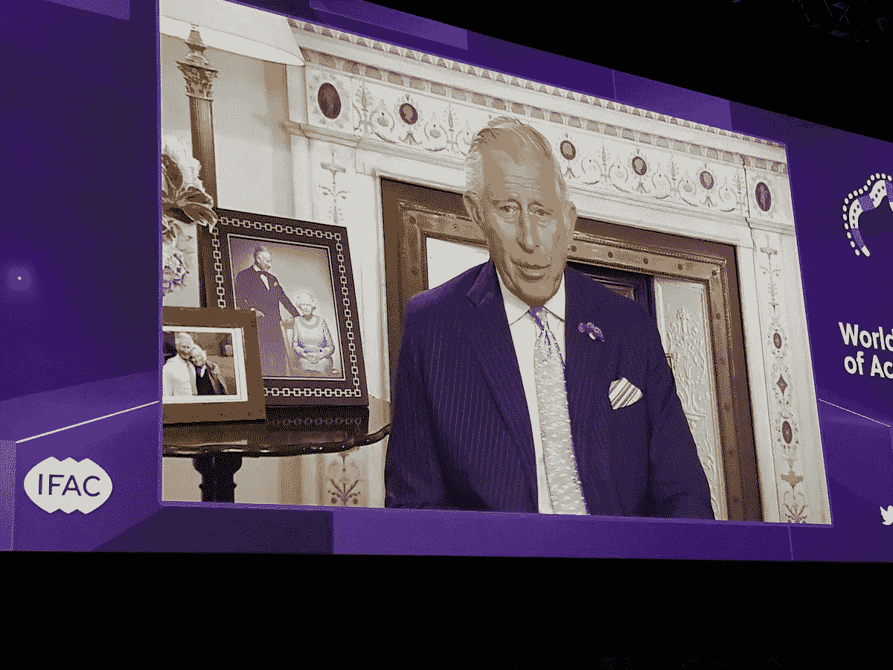
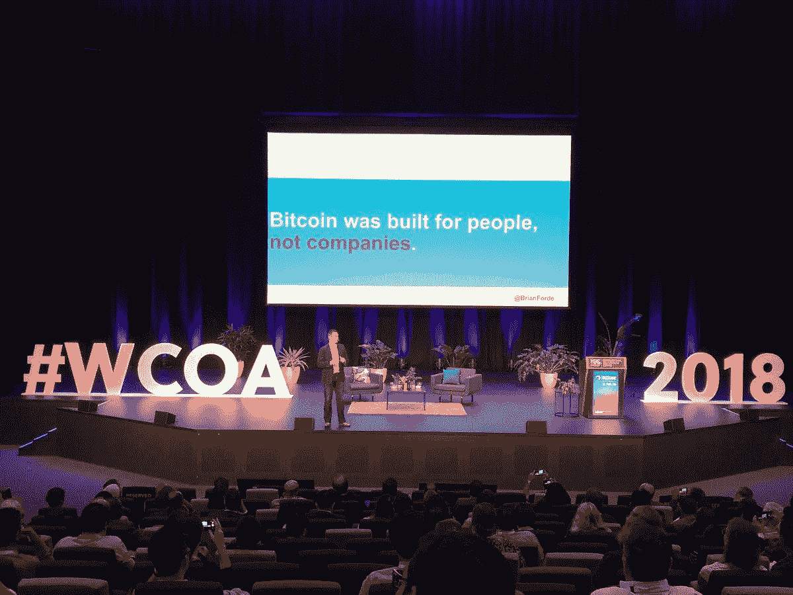
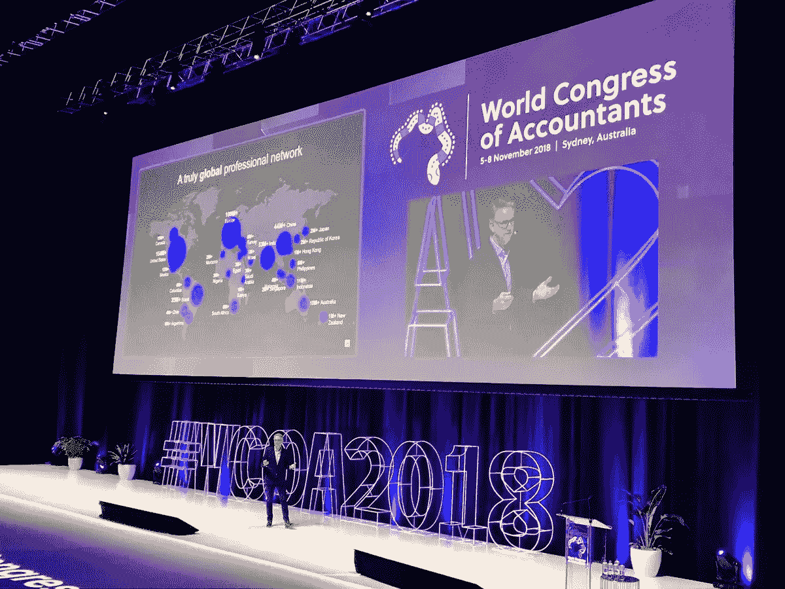
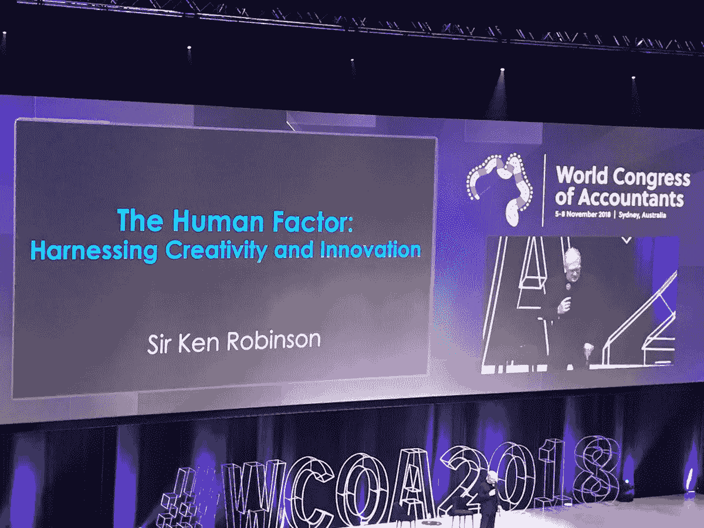

# 人工智能和区块链将影响数十亿白领

> 原文：<https://medium.datadriveninvestor.com/ai-and-blockchain-will-affect-billions-of-white-collar-workers-962fd3bd7224?source=collection_archive---------12----------------------->

## 这是在 2018 年世界会计师大会上对艾和区块链的评论

我最近代表 [**超人类主义澳洲**](https://www.transhumanism.com.au/) 参加了在悉尼举行的 2018 年世界会计师大会。这是一个声望很高的会计会议，每四年在不同的城市举行。有点像奥运会。

在特别主题会议上，查尔斯王子殿下发表了视频致辞，前联合国秘书长潘基文强调了气候变化的总体影响，否认气候变化是“政治上危险的，经济上不负责任的，科学上完全错误的”。

这次会议给我留下深刻印象的是，它涵盖的主题与任何其他技术会议都一样。新兴技术被广泛报道，其中大部分关注人工智能和区块链。

作为一名在会计和税务领域都工作过的开发人员，我处在一个独特的位置，目睹了这些职业中发生的快速变化和阻力，这些职业是颠覆的温床。

那么会计师(基本上任何一个白领)已经成为技术专家了吗？如果他们还没有，他们会成为其中一员吗？

以下是会议上关于人工智能和区块链的关键经验，可以很容易地应用于任何白领职业。

> 人工智能将增强人类的能力，但最终可能取代所有人类会计

在人工智能会议中，来自演讲者和小组成员的关键信息是，人工智能将增强人类的能力，事务性和重复性任务正变得越来越自动化。

例如，今天的人工智能可以在这些领域增强人类会计:

*   日记帐过帐的自动化
*   预算中的预测
*   通过分析辅助决策
*   个性化
*   对话界面

大多数发言者指出，会计师在使用他们的软技能与客户和企业沟通方面发挥着越来越重要的作用，而这些软技能在人工智能中很难复制。

来自 Hyper Anna 的 Natalie Nguyen 认为，预算、治理、战略和政策仍然是人类的领域。这可能是因为这些领域有很高的人情味，太技术性或有太多的变量需要考虑。

会议没有深入探讨人类长期不需要战略投入和洞察力的可能性。我的预测是，随着人工智能能力的成熟，这可能会在四年后的下一次会议上成为一个更大的话题。

人工智能最终可能会达到比人类更快、更准确地执行推理和预见任务的阶段。大部分战略和政策都是模式识别和数据分析，这是机器已经非常擅长的，并且每天都在变得更好。

今天的人工智能能力太狭窄，无法处理超出人工智能训练范围的复杂任务。下一代人工智能将能够超越人类训练人工智能的范围进行推理，并且需要的数据比今天的人工智能服务少得多。最终，人工智能将变得更像人类，例如 SingularityNET 正在开发的服务，这是一个用于人工智能服务的去中心化平台。

> **区块链可以免去会计的合规、记录、验证工作**

来自软件开发公司 Lakeba 的 arren Younger 谈到了区块链的用例。在问答环节&,有很多关于使用什么技术来构建区块链，以及它将如何影响会计行业的问题。

达伦介绍了区块链的三个关键概念:

*   分布式分类帐
*   智能合同
*   符号化

分布式账本是一种在计算设备之间复制、共享和同步的数据库。在所有设备之间处理和验证信息。区块链只是分布式账本的一种。

智能合约是一种计算机应用程序，它指定在交易发生并在区块链上记录之前必须满足的条件或应遵循的规则。

代币化是将现实生活资产的权利转换为代币，也称为加密货币，位于区块链上。

以下内容不在达伦的演讲中，而是我自己对区块链如何改变会计师角色的看法。

分布式分类账可以消除会计师的月末结账。会计师必须结清前一个月的账目，并调整过去错误记录的交易。当交易记录有滞后时，这可能会延迟账户关闭过程。分布式分类帐在交易发生时记录交易，并可以实时验证，消除了结清账户和调整过去交易的需要。

智能合约可能会改变应付账款的运作方式。货物到达并付款后，日记账分录可以自动记录下来。会计通常手工输入这些日记账分录。

令牌化将允许会计师轻松跟踪任何资产，如股票、债券、所有权、契约和存货。花店可以选择发行代币来代表它库存的每一朵花。顾客可以购买一些鲜花代币，并选择将其兑换成真正的玫瑰。代币的购买和交换由区块链跟踪，因此交易记录是自动完成的。

区块链可能有助于消除会计师的重复和管理任务。它将特别消除对审计员的需要，因为区块链维护数据完整性并实时执行审计。整合、验证、合规、记录只是可以通过区块链技术自动完成的部分工作。

> **人的因素:通过人的能力，我们已经拥有了无限的资源**

R 在 2018 年世界会计师大会上，埃斯基尔是最受关注的人。澳大利亚和新西兰 LinkedIn 的经理 Matt Tindale 谈到了过去两年人们对会计师的关键技能的需求。

Python、JavaScript、Java、C、SQL 和 CSS 位列榜首。技术技能和数据分析似乎是雇主优先考虑的一个角色，传统上将解决问题、计算和沟通列为员工最需要的技能。

有趣的是，数字营销和客户关系管理(CRM)出现在会计师需要的技能清单上。虽然注意到核心会计技能，如财务分析、报告、审计和 MS Excel 仍然是非常可取的。

马特还指出了 LinkedIn 上变得明显的三个趋势:人工智能和自动化、技能差距以及越来越多的人从事自由职业等独立工作。

因此，尽管会计师可能不得不重新掌握技能，TED 演讲者兼作家肯·罗宾逊爵士提醒我们不要忘记我们成长、学习和创造的能力。

肯爵士还强调，只要员工的独特才能得到培养，并为他们提供学习的机会，我们就不应该低估现有团队成员改变和提出新方法的能力。

会计师和其他白领今天仍然扮演着重要的角色，他们需要开始与技术专家一起工作，或者自己成为一名技术专家，以跟上他们职业的变化。在 [**超人类主义澳洲**](https://www.transhumanism.com.au/) 我们不断探索这些变化。

