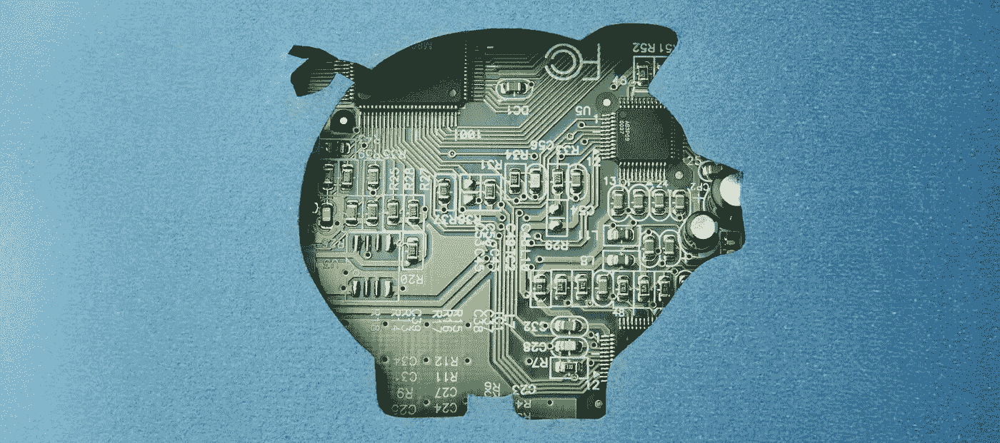
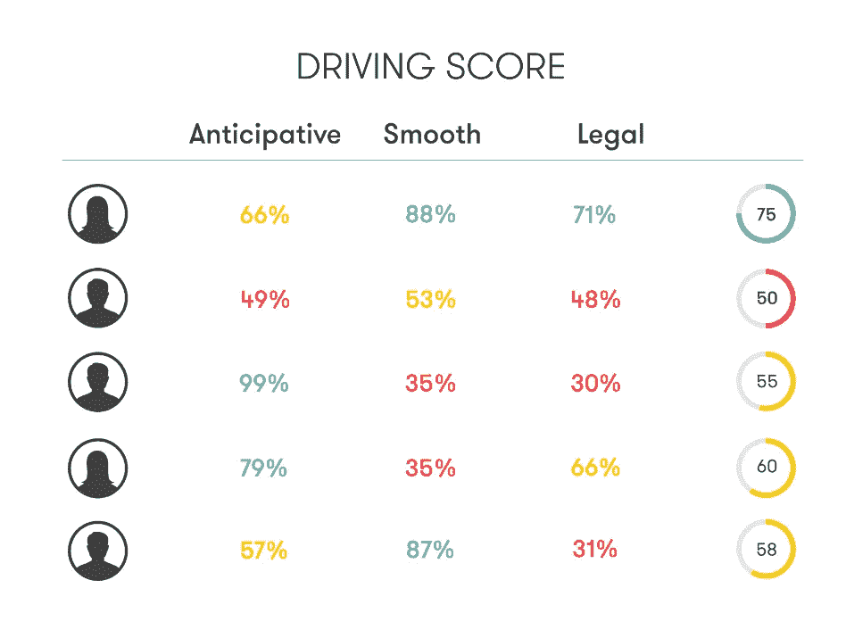
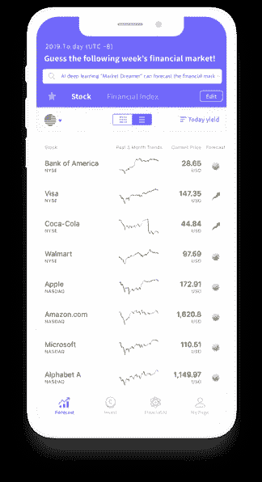
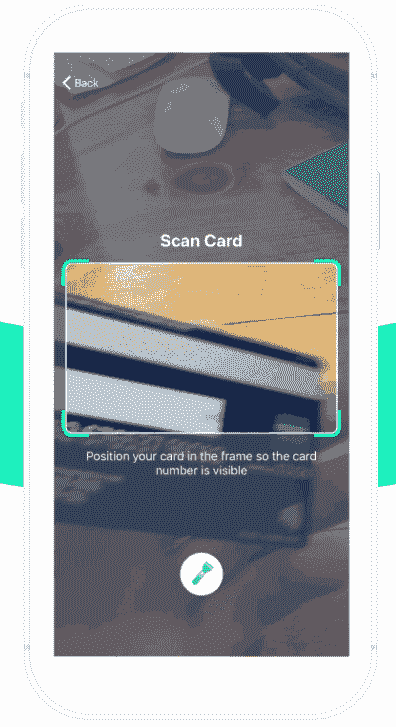

# 金融中的人工智能和机器学习:银行、保险、投资和 CX 中的用例

> 原文：<https://medium.datadriveninvestor.com/ai-and-machine-learning-in-finance-use-cases-in-banking-insurance-investment-and-cx-42666968ca21?source=collection_archive---------2----------------------->

就在 30 年前，你必须等上好几天银行才能批准你的信用卡。或者在一次小车祸后，花几周的时间被保险公司的官僚作风所困扰，只为了得到退款。如今，这些操作只需不到一天的时间，因为文档是在线提交和处理的，很少或根本没有人工干预。在本文中，我们将介绍一系列有望改变整个金融领域经营理念的技术。

人工智能——它仅仅是放在你的登陆页面上的一个时髦词语，还是一个随时可以创新的用例？答案是……都有。当然，我们将讨论在金融行业的几个领域使用人工智能的真实例子。

 [## 分散金融的出现|数据驱动的投资者

### 当前的全球金融体系为拥有资源、知识和财富的人创造了巨大的财富

www.datadriveninvestor.com](https://www.datadriveninvestor.com/2019/03/14/the-emergence-of-decentralized-finance/) 

# 保险

## 索赔自动化

许多基于机器学习的技术使保险公司能够自动化索赔过程，减少等待时间，并使代理人能够从事不太日常的工作。识别人类语音有助于数字化索赔处理。由于客户服务代表的大部分时间都花在通过电话处理索赔上，语音识别可以帮助记录和解释信息。另一个未开发的潜力是文本识别。它可以帮助数字化手写笔记和报告，以及实时转录音频信息和通话，使用语音 API，如[谷歌云语音转文本](https://cloud.google.com/speech-to-text/)或 [IBM 语音转文本](https://www.ibm.com/watson/services/speech-to-text/)。查看我们的独立文章，了解更多关于[数据科学和机器学习在保险](https://www.altexsoft.com/blog/datascience/ai-in-insurance-business-process-automation-brings-digital-insurer-performance-to-a-new-level/?utm_source=MediumCom&utm_medium=referral&utm_campaign=shares)中的应用。

**如何应用**。IT 服务提供商 Cognizant [构建了一个解决方案](https://www.cognizant.com/case-studies/ai-claims-automation)，帮助一家财产和意外保险公司实时记录索赔电话，创建电话摘要，然后提交给代理进行审查。他们还分析了 25，000 个保存的呼叫，以确定最常见的索赔和活动。

一家保险技术公司[转变技术](https://www.shift-technology.com)为索赔自动化和欺诈检测提供解决方案。其 SaaS 产品与保险公司的系统集成，并为索赔处理的每一步启动自动化流程。它还为每项索赔生成一个欺诈分值，创建详细的可疑报告，并为复杂案件建议调查活动。

## 个性化

通过为客户创建个性化的保险档案，保险公司可以在吸引新客户和留住老客户方面取得显著成效。根据投保人的历史和个人数据以及统计数据，算法可以注意到人类不清楚的依赖关系，公司可以对每个客户进行单独的风险评分。

这种方法特别受健康保险提供商的欢迎:而且，个性化与风险和价格有关。那些健康状况更好、生活方式更健康、不太倾向于健康风险的人可以获得折扣。虽然这种方法引发了对个人数据隐私的担忧，但埃森哲的研究表明[80%的消费者愿意](https://insuranceblog.accenture.com/a-powerful-business-case-for-personalized-insurance-services)分享他们的个人信息，如果这能带来更好的服务。

**如何应用。** [Sentiance](https://www.sentiance.com/) 是一家数据科学公司，为物联网、健康、保险和商业提供数据跟踪和分析解决方案。他们提供了一种移动解决方案，使用智能手机传感器来跟踪、记录、分析和记录驾驶员的行为。基于这些输入，它对驾驶行为进行评分，以便保险公司可以增加或减少客户的保费。

Driving score from Sentiance behavior intelligence platform. Source: Sentiance

健康保险公司 BlueCross BlueShield 拥有 BCBS Axis 系统，该系统应用健康问题的数据，帮助公司定制政策以适应其员工群体。该系统分析了来自 96%的美国医疗保健机构和专业人士的 23 亿个医疗程序的数据，以帮助他们的客户雇主做出明智的决策。

# 银行业务

## 欺诈检测

欺诈仍然是客户和银行财务安全最敏感的问题之一:使用新账户的信用卡欺诈是身份盗窃网络犯罪中的头号。我们已经提到了人工智能算法如何识别欺诈性的保险索赔，但这个问题在信用卡操作中更普遍。随着支付变得更加无摩擦，银行无法依赖常规的基于规则的欺诈检测，因此基于机器学习的欺诈检测系统进入了舞台。要了解其工作原理，请参阅我们关于用于欺诈检测的 [ML 方法](https://www.altexsoft.com/whitepapers/fraud-detection-how-machine-learning-systems-help-reveal-scams-in-fintech-healthcare-and-ecommerce/?utm_source=MediumCom&utm_medium=referral&utm_campaign=shares)的详细白皮书。

在银行业，ML 系统通常通过将纸质文档与系统数据进行比较或使用交易历史来验证个人来评估数据可信度。他们还会注意到相同交易的副本，从而区分误点击和实际诈骗。最常见的情况之一是检测异常购买并自动向客户发送验证请求。

**如何应用。**万事达卡使用 [Vocalink](https://www.vocalink.com/) 解决方案在每个交易周期开始时评估所有新客户交易，在早期阶段防止欺诈。他们的防欺诈解决方案监控交易，并通知金融机构需要进一步考虑的可疑流程。除了防止欺诈之外，它还提供分析报告并防止洗钱。

[Kount](https://www.kount.com/) 是一款数字防欺诈解决方案，为支付和新账户以及账户保护提供防欺诈服务。该系统使用数据网络和先进的机器学习技术。它还通过提供每次登录的详细数据来支持无摩擦支付，这些数据随后用于检测异常情况和纠正客户体验。

## 信用评分

如果手动完成，信用评分需要很多时间，因为需要处理大量不同的数据:个人信息、收入、支付历史，甚至来自其他银行的信用历史，这些都可以通过各种[金融 API](https://www.altexsoft.com/blog/engineering/open-banking-and-financial-apis-how-to-integrate-your-company-into-digital-financial-ecosystem/?utm_source=MediumCom&utm_medium=referral&utm_campaign=shares)获得。此外，传统的信用评分通常需要将人们分为几个明显可区分的群体，所以这往往是一个非黑即白的情况，没有多少灰色地带。

大多数基于 ML 的信用评分解决方案使用预测算法来判断客户是否会还款。此外，他们可能会使用不同的机器学习方法，包括自然语言处理来分析社交媒体数据。拥有大量客户数据的银行可以通过基于人工智能的信用评分向那些原本无法获得信贷的人提供信贷。

**如何应用。** [Lenddo](https://www.lenddo.com/index.html) 是一家信用评分提供商，使用预测算法，并提供与在线和移动服务的集成。即使申请信贷的人没有信用历史，该解决方案也可以为他们提供分数，分析他们的数字足迹(如社交媒体活动、地理位置和搜索引擎活动)。

GiniMachine 是一个信用评分平台，为金融机构提供服务。他们为个人和企业评分提供数据分析。GiniMachine 使用自己的信用评分模型，基于已发放贷款的历史数据，状态为已偿还和逾期。该平台使用深度学习神经网络分析数据，然后创建报告，符合分数计算的条件。

# 投资和交易

## 财务顾问

金融业易受各种风险的影响，尤其是在投资的时候。人工智能技术可以帮助做出明智的投资决策，并使用数据分析、深度学习和机器学习算法预测可能的风险。其中一些作为应用数据分析或其他解决方案的分析平台而存在。

机器人顾问是新兴趋势之一。他们像普通的财务顾问一样工作。一般来说，它们瞄准的是资源有限、希望管理自己基金的投资者，比如中小企业或个人。基于人工智能的机器人顾问为他们的用户创建金融投资组合，并应用历史数据处理，包括在某些情况下的风险评估算法。这些解决方案涵盖以下领域:

*KOSHO robo-advisor interface. Source:* [*KOSHO*](https://www.kosho.ai/)

如何应用。机器人顾问以不同的形式存在。比如韩国 app [KOSHO](https://www.kosho.ai/) 就是一个针对个人的解决方案。它使用深度学习和金融市场的历史数据分析了三个关键市场因素(VIX、PMI 和通货膨胀)。

## 情感分析

你可以通过整天滚动新闻和出版物、雇人帮你做或者使用情绪分析来跟踪当前的市场趋势。这种方法通过句子分析文本，区分积极的、消极的和中性的意义。在交易中，[情绪分析工具](https://www.altexsoft.com/blog/business/sentiment-analysis-types-tools-and-use-cases/?utm_source=MediumCom&utm_medium=referral&utm_campaign=shares)分析[市场情绪](https://www.investopedia.com/terms/m/marketsentiment.asp)以及投资者投资组合中的公司在新闻或社交媒体上的提及情况。

**如何应用。情绪分析有助于预测交易者和投资者的趋势，并且有专门针对这个市场的解决方案。其中一个例子是 Catana Capital，这是一个处理新闻文章、推文和博客的交易预测工具。**

# 客户体验

## 聊天机器人

无论应用于哪个行业，聊天机器人的主要目标都是改善用户体验。另一个目标是通过与客户沟通并回答他们的问题来减少员工的工作量。在金融行业，聊天机器人大多被用作银行和保险公司前台系统的一个组件。

cognitive[将](https://www.cognizant.com/whitepapers/the-future-of-chatbots-in-insurance-codex4122.pdf)一个有效的聊天机器人定义为一个联合了三个因素的机器人:沟通(分析语言)、理解(上下文、情绪和位置分析)、协作(效用和整合)。聊天机器人有三种功能:

*   基本聊天机器人——没有自然语言处理能力的聊天机器人，基于规则的算法工作，回答基本问题，像 FAQ 服务。
*   中度聊天机器人——一个在所有三个方面都有发展能力的聊天机器人。
*   高级聊天机器人——提供最接近真实人类对话的体验。

他们可以在网站和银行移动应用程序中找到，回答客户关于服务的问题。但是它们的功能可以更广泛。例如，他们可以处理客户回复以个性化服务或处理索赔。

**如何应用。保险公司[柠檬水](https://www.lemonade.com/)使用聊天机器人向客户提供个性化的报价。它向客户询问各种问题，以提供量身定制的保险单，并促进在线索赔处理。**

[另一家保险公司 trv](https://www.trov.com/)有一个应用内聊天机器人，允许用户提问和管理他们的索赔。银行还将聊天机器人作为其应用程序的一部分，帮助客户解决问题或向客户发送通知和报告。 [USAA](https://www.usaa.com/) 有一个[网络聊天机器人](https://www.usaa.com/help/contact/)和应用程序内聊天机器人，可以帮助客户完成各种任务，如报告信用卡被盗或丢失、更改 PIN 码、添加通知。最近，他们通过亚马逊 Alexa 推出了一款声控聊天机器人。

*USAA voice payment*

## 图像识别

图像识别可用于增强客户体验或安全性。前者的一个例子是支付应用程序中的信用卡扫描功能或银行中的 ID 扫描。安全应用需要在移动银行应用中进行身份或生物认证。

有时候不需要身份证，甚至不需要信用卡:你可以用你的脸和相机来支付。在中国，面部识别技术应用于商店的销售点系统。使用[微信支付](https://pay.weixin.qq.com/index.php/public/wechatpay)或[支付宝](https://intl.alipay.com/)等服务的人可以在应用程序中启用面部识别，并使用联网设备支付。温州已经有一条[购物街](http://www.chinadaily.com.cn/a/201901/18/WS5c4142c7a3106c65c34e53dd.html)，在那里你只要对着支付宝设备的摄像头露个脸就能付款。

**如何应用。**上面提到的信用评分解决方案 Lenddo 为移动应用提供了[身份验证功能](https://www.lenddo.com/pdfs/Lenddo_FS_IdentityVerification_201705.pdf)。它包括两种类型的验证:针对 Android 设备的文档和人脸捕捉。

[华侨银行](https://www.ocbc.com/group/group-home.html)从 2017 年开始在他们的[手机应用](https://www.fintechfutures.com/2017/11/ocbc-bank-first-in-singapore-to-launch-face-id-recognition-for-mobile-app/)中为苹果 iPhone X 用户使用面部识别进行登录。[卡扫描](https://cardscan.io/)也有类似的解决方案。这是一种可以与 Android 和 iOS 设备集成的卡片扫描服务。该应用程序具有借记卡和信用卡的实时处理功能，并带有一个软件开发工具包，甚至可以识别和防止使用被盗的卡。

*How CardScan works*

[支付宝](https://intl.alipay.com/)在肯德基推出[微笑支付](https://www.scmp.com/tech/start-ups/article/2109321/alipay-rolls-out-worlds-first-smile-pay-facial-recognition-system-kfc)技术。它通过手机应用程序识别顾客的脸，自动向他们收费。2018 年，支付宝升级了这项技术，推出了带有更先进的面部识别系统的[蜻蜓](http://www.ecns.cn/business/2018-12-14/detail-ifzasznx1605859.shtml) POS 设备，该系统利用照片和视频识别欺诈。

# 金融中的人工智能:下一步是什么？

全球范围内，人工智能方面的商业支出正在增长，目前的研究预测，这一数字还会增长更多。银行业是实施人工智能解决方案的第二大行业。该公司计划到 2022 年花费 56 亿美元。虽然企业将主要关注收入增长，但金融行业实施人工智能的关键领域将是安全、决策和客户体验。然而，金融机构采用这些技术的速度相当缓慢，因为在这一过程中会出现一些挑战。其中包括在数据保护法规、数据质量以及无法控制可能导致的所有风险方面的不明朗结果。根据德勤 2018 年的报告“ [*人工智能和风险管理:充满信心地创新*](https://www2.deloitte.com/content/dam/Deloitte/global/Documents/Financial-Services/deloitte-gx-ai-and-risk-management.pdf) ”，只有 32%的受访公司正在积极实施人工智能，而其中 40%的公司仍在学习如何在业务中应用人工智能，11%的公司根本没有开始实施。

*最初发表于 AltexSoft tech 博客“* [*【金融中的人工智能和机器学习:银行、保险、投资和 CX*](https://www.altexsoft.com/blog/datascience/machine-learning-use-cases-in-finance/?utm_source=MediumCom&utm_medium=referral&utm_campaign=shares)