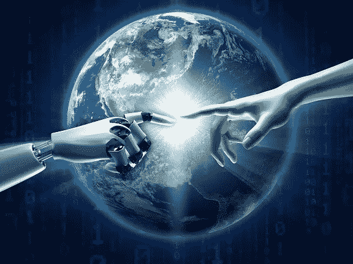

# 人工智能和个性化医疗

> 原文：<https://medium.datadriveninvestor.com/ai-and-personalized-medicine-46081e0c522e?source=collection_archive---------0----------------------->

Artificial Inteligence and personalized medicine

希波克拉底誓言声明:“首先不伤害。”在今天这个个性化医疗的时代，我们试图坚持这个誓言，但我们也打破了它。现代医学已经在许多方面背离了这一誓言。

但是，使个性化医疗成为可能的新技术将是实现希波克拉底愿景的关键。

 [## 大笔资金和尖端技术:人工智能/人工智能投资将如何革新医疗保健…

### 在过去几年人工智能(AI)和机器学习(ML)的显著发展中…

www.datadriveninvestor.com](https://www.datadriveninvestor.com/2018/03/22/big-money-and-cutting-edge-technology-how-investment-in-ai-ml-will-revolutionize-the-healthcare-industry/) 

今天的医生专注于特定的诊断和专门的治疗，这两者都是克尼迪安学派所支持的。自希波克拉底时代以来，医学思想的这种转变在过去的两千年中引起了严重的批评，希波克拉底治疗的被动性受到了特别强烈的谴责；例如，法国医生 M. S. Houdart 称希波克拉底疗法为“对死亡的沉思”。【https://en.m.wikipedia.org/wiki/Hippocrates 号

W **什么是个性化医疗？**

这是否意味着它是根据一个人的需求和喜好而设计的？

**个性化医疗**，也称为精准医疗，是一种将患者分为不同群体的程序，根据患者的预测反应或疾病风险，为其量身定制医疗决策、实践、干预和/或产品。术语个性化医疗、个性化保健、精准医疗、**分层医疗、**和 P4 医疗可互换使用来描述这一概念。

理解基于人群的医疗保健也很重要。这是管理式医疗系统中的一个基本概念。美国医学协会(American Medical Association)将基于人群的医疗保健描述为一种“允许人们评估目标人群的健康状况和健康需求，实施和评估旨在改善该人群健康的干预措施，并以符合社区文化、政策和健康资源价值的方式高效和有效地为该人群成员提供护理”的方法。然而，*医疗保健专业人员似乎不再担心这种方法对患者的个体需求“一刀切”或“千篇一律”的不敏感。咨询师彼得·博兰在 20 世纪 90 年代中期写道，它“并没有减损个性，而是增加了另一个层面，因为个人受益于为他们所属的人群制定的准则。”*

**以人群为基础的医疗保健的优势**

## 以人群为基础的医疗保健方法的主要优势是什么？

它能改善整个人类的健康，而不仅仅是某些人的健康吗？

这种护理模式被描述为由三个部分组成:健康结果、健康决定因素模式以及政策和干预措施。

## 但是人口保健有什么局限性呢？

它的一个问题是，有些人将永远被排除在保健计划之外。健康的社会决定因素(SDOH)与影响个人和群体健康状况差异的经济和社会条件及其在人口中的分布有关。它们是在一个人的生活和工作条件中发现的健康促进因素(如收入、财富、影响力和权力的分配)，而不是影响疾病风险或疾病或伤害脆弱性的个体风险因素(如行为风险因素或遗传)。根据一些观点，社会决定因素的分布是由公共政策决定的，这些政策反映了管辖当局的主流政治意识形态的影响。

## 个性化医疗的好处是什么？

为患者量身定制治疗至少可以追溯到希波克拉底时代，由于新的诊断和信息学方法的发展提供了对疾病分子基础(特别是基因组学)的理解，该术语最近被使用。

## 以人口为基础的医疗保健方法还存在哪些限制？

患者有时会被拒绝治疗，因为关于护理计划的决定是基于对大量人群的平均观察，这使得消费者更难获得为他或她量身定制的医疗保健。

为了实现个性化医疗保健，最重要的决定因素将是我们作为一个社会的教育水平和我们对先进技术的熟练程度，这些技术可以将医疗服务的范围和质量扩展到尽可能多的患者。

提供护理的人口模型是一种具有成本效益的模型，它可以快速响应所有社会经济水平的即时医疗保健需求，在某些情况下，它是向选定社区内的每个成员提供护理的最实用的方法，但它无法根据患者及其个人需求创建可定制的治疗选项。

**为什么现在是个性化护理的时候了**

技术终于成熟了，我们可以第一次实现个性化药物输送。虚拟现实、自动化、远程诊断系统、区块链和人工智能是我们用来提供前所未有的高质量医疗服务的工具。

但是我们需要将这些技术与人类的专业知识相结合，因为真正高质量的医疗保健不仅依赖于先进的工具，还依赖于人性化的服务。当我们将优质护理扩展到发展中国家时，尤其如此。

我们掌握的最强大的技术之一是人工智能(AI)，即能够执行通常需要人类智能才能完成的任务的计算机系统，如视觉感知、语音识别、决策和语言之间的翻译。

在普通人群和医疗保健提供商中有一种误解，即人工智能将在没有任何人工干预的情况下诊断疾病，使每个人都快速奔向那一点。不幸的是，这引起了医疗保健界的更多抵制，许多人不明白人工智能可以为我们做什么，以及它有多大用处。

**人工智能如何改善医疗服务**

人工智能可以帮助医生和患者，但永远无法取代医生。人工智能要求计算机像人类一样学习，以便帮助我们解决问题。数据收集和分析是非常技术密集型的过程，需要时间、范围和多样性。

那么，为了提供真正的解决方案，人工智能还需要改进哪里？当前的解决方案本末倒置。科技界有一个神话，认为人工智能将能够诊断疾病。这不是真的，但人工智能将能够帮助我们扩展诊断，并帮助医生在诊断时快速排除某些疾病。人工智能将帮助我们整合来自多个地点的数据，并帮助医生在鉴别诊断工作中利用这些数据。

为了实现这项技术的全部潜力，我们需要首先创造合适的环境。这需要积极的参与、设计和互操作性。这是一个旅程，而不是目的地。今天，我们有技术、战略和资源。但我们仍然需要独立思考、前瞻性态度和对患者赋权的责任感。

人工智能和机器学习应该被视为程序和用户的“影子”。除了人类的专业知识，人工智能还可以完成任务，并防止所有人中最常见的错误。人工智能可以通过区块链技术继续进化多年。

随着我们开发出更好的医疗保健系统，为更多的患者服务，机器学习和人类接触将是互补的。这项技术与人类的专业知识相结合，将使医疗服务更加实惠，更加容易获得。

当这一天到来时，我们真的将再次实现希波克拉底誓言。