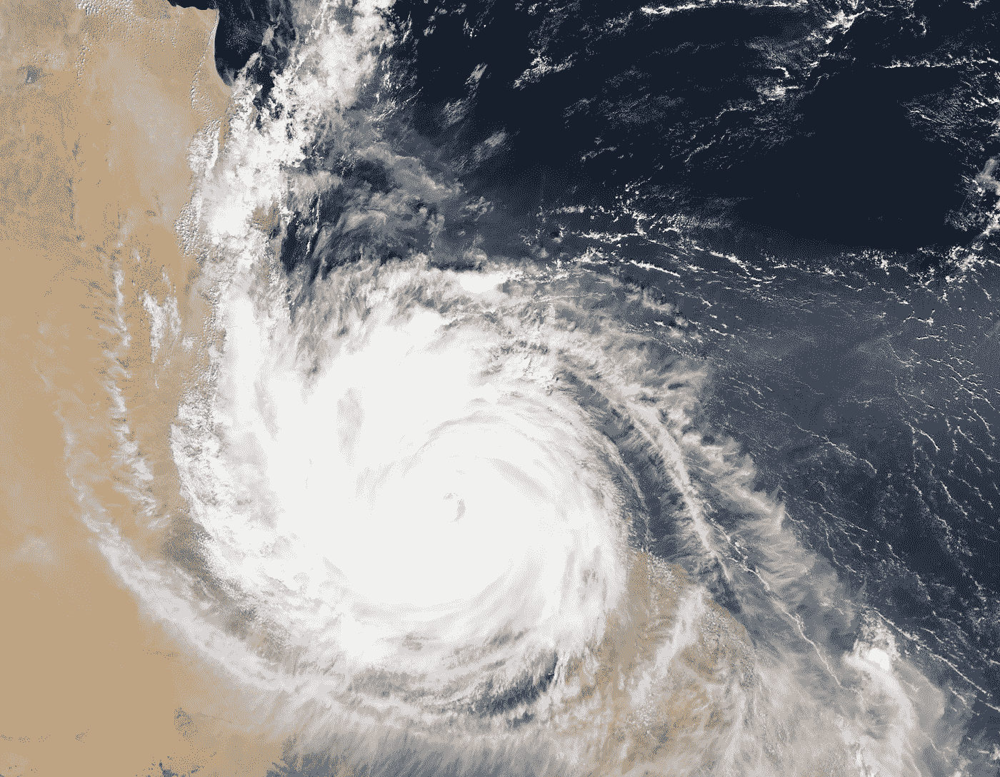

# 人工智能和社交媒体实现快速灾难响应！

> 原文：<https://medium.datadriveninvestor.com/ai-and-social-media-enabling-rapid-disaster-response-e3ce7c20d13f?source=collection_archive---------5----------------------->

今天的灾难响应和应急规划需要人工智能和社交媒体的全面支持才能有效发挥作用。从早期和持续地开发情境意识，到弥合通信和基础设施故障与过多信息之间的差距，甚至协调对最易受影响者的救援工作，人工智能可以真正帮助人类从各种灾难中拯救出来。

# 为什么这很重要？

自然灾害每年都给人类的生命和财产造成严重破坏。有些事件会造成价值数十亿美元的损失，大部分是不可挽回的。举几个例子，例如，北加利福尼亚的火灾、飓风“伊尔玛”和“哈维”以及最近夏威夷的火山爆发。

有一些典型的灾害管理领域是政府和机构一直在努力解决的。

**(a)防灾:**这要求政府和机构睁大眼睛、竖起耳朵，仔细阅读从卫星、传感器、地震仪、无人驾驶飞机或机器人收集的数据，并迅速采取明智的行动(如指挥疏散或隔离)，以控制后果。

**(b)灾害识别:**这需要政府和机构搜索大量数据，及时了解最新消息，与“归零地”的消息来源沟通，并确定救生响应战略最有机会的领域。

**(c)灾害管理:**这需要协调救灾工作，发送援助物资，划分受灾地区，与公众沟通，最大限度地减少损失，扩大救援人员的覆盖范围，并为住房、医院、安全和支助做好准备。

有效的灾害预防、识别和管理的基础是可靠的数据，但数据往往非常零散、不可访问或不完整。它要么埋得太深，要么分散，要么形式多样。这使得人类难以整理和分析数据。但另一方面，人工智能技术可以让导航变得简单、可行和无缝。

# 社交媒体的角色

社交媒体在灾难响应和管理中的作用是巨大的！已经确定并证实，危机期间一些最具可操作性的信息来自社交媒体用户，他们充当向其订阅源报告问题的公民记者，或帮助解决问题的现场工作人员。

Twitter、脸书、Instagram 和 YouTube 可以通过人们正在使用的标签，或者通过分析人们在网上发布的图像/视频和其他数据片段，快速获取发展中的故事。来自这些频道的数字内容可以标记、发出警报、提供早期警告、识别确切位置，并提供事件的实时报告。对于机构来说，这些渠道可以用于众包相关数据。

# 人工智能与应对灾害的循证方法

无论是来自社交媒体，还是来自广告公司使用的数十、数百个其他渠道，数据都是丰富的、源源不断的。我们需要将这些来自杂乱的真实数据集的数据转化为可靠的信息和可操作的见解。

构建热图:机器学习算法聚合并整合数据，协调可变的响应，并将来自所有渠道的信息整合并缝合在一起，以创建一个有凝聚力的故事。该分析生成活动加剧或异常区域的“热图”。[卡塔尔计算研究所和 1 关注](http://bit.ly/2IJOJSP)是这一领域的先锋。

图像处理和深度学习:先进的图像处理和深度学习技术可以分析图像的认知内容，例如——从社交媒体获取的图像中的复杂情绪，可以帮助确定人们经历的创伤程度；以及从卫星图像中解读断层线或海平面变化，这有助于预测灾难的发生。

ML 和自然语言处理:通过将 ML 和 NLP 结合起来，可以得到进一步的增强。这些系统高度智能且反应灵敏。它们使用户能够提出与活动相关的具体问题，并获得有用的答案。 [BlueLine Grid](http://bit.ly/2IJOJSP) 是一个为协助救援工作而开发的通信平台，它使用并利用了自然语言处理能力。

ML 和分析:分析工具也非常有用。当与 ML 结合时，分析可以极大地改善协调和沟通，打开信息传递和移动数据分析的渠道。 [WorkFusion](http://bit.ly/2IrdcsF) 的 ML 和分析相结合的产品在这一领域取得了卓越的成果。