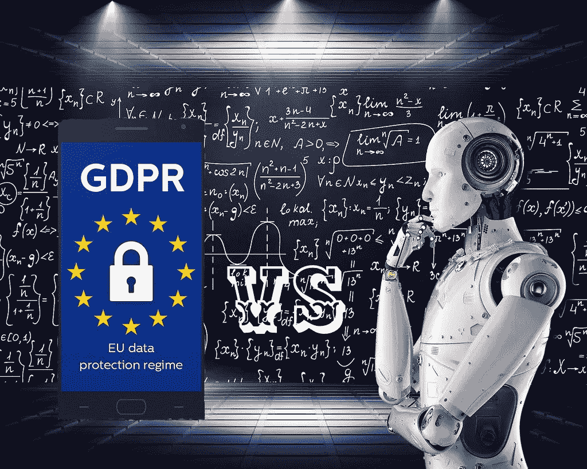

# 艾和一些可能与 GDPR 的紧张局势

> 原文：<https://medium.datadriveninvestor.com/ai-and-some-possible-tensions-with-the-gdpr-93403553866c?source=collection_archive---------6----------------------->

算法是在计算机类型的计算的解决中要遵循的一组规则，即一系列步骤，旨在解决特定的问题；通过它们，你可以通过“或”或“非”这样的范例来指导计算机。这些步骤显然是渐进的、分层次的，也是为了保证计算机机器能够自主学习。

通过“机器学习”的过程，机器在不需要外部人类干预的情况下进行自我指导:这可以比作一个孩子，他通过经验进行学习，但每秒钟可以获得数百万数据，这使他能够以“非人类”的速度进行处理。我们可以开玩笑地把他定义为“一个老小孩”，因为他像一个婴儿一样有求知欲，但却拥有一个老人的丰富经验，从他简单的知识总和中创造出一个飞跃。

机器重新评估模型和重新评估数据，并且在没有任何外部干预的情况下做出假设；也就是说，对于输入和随之而来的输出，它统一了逻辑，精心制作了新的输出。

 [## 人们对隐私的不理解是什么？数据驱动的投资者

### 你知道那种感觉。无论是访问应用程序、订阅还是你最喜欢的运动鞋。你按下…

www.datadriveninvestor.com](https://www.datadriveninvestor.com/2019/04/11/privacy-and-convenience/) 

在人工智能中，通过数百万数据集的关联，我们可以模仿人脑，因此有了神经网络这个术语，并教会它执行一项活动。

人和机器有不同的“能力”:第一种“说话——听——读——聊天——看”，第二种“理解——推理”(不执行计算，只评估和比较假设)——学习——互动(辩论)。

这一领域研究的传播带来了一系列规范和伦理问题，以及一些实际问题，需要研究解决方案和法规。我们已经分析了它最近在工作面试中的一个应用，所谓的“面试机器人”被用来评估候选人的面部表情、模仿和回答，供招聘人员使用和消费。

挪威数据保护局在人工智能和 GDPR 之间形成了三种主要的合规冲突。

在人工智能对数据集进行算法处理的过程中，可以发现的第一个“缺陷”涉及公平因素:GDPR 的叙文 129 已经指出，“监管机构的权力应当按照欧盟和成员国法律规定的适当程序保障，以公正和公平的方式，在合理的时间内行使”。此外,《GDPR》第 12 条规定的透明度原则通过提及向数据主体告知控制者的身份和处理的目的得到了解释，以确保公平和透明的处理(获得有关他们的个人数据处理的确认和沟通的权利)。但最重要的是，GDPR 第 5 条规定并体现了新隐私条例的基本原则，即“合法、正确和透明”、“目的限制”、“数据最小化”、“准确性”、“存储限制”、“完整性和保密性”以及“问责制”。

非营利调查性新闻集团 ProPublica 表示，用于设定保释金的人工智能程序错误地将黑人标记为“有再犯风险”的频率是白人的两倍。

在美国，已经使用了另一种系统，即 C.O.M.P.A.S .(替代性制裁的矫正罪犯管理概况)算法，法官使用这种算法来计算犯罪两年内的累犯概率，美国刑事法院在对一名黑人被拘留者的累犯定罪后收到了上诉，因为该系统偏袒白人而非裔美国人族裔群体！

正如我们所知，神经网络缺乏两个精致的人类组件，理解和直觉。

人工智能的进步和 GDPR 之间的第二个紧张关系是在已经引用的第 5 条阐述的另一个原则中发现的，即数据的最小化:挪威数据保护局认识到人工智能世界中更高层次的混乱，因为不可能预见算法的“输出”，如何才能限制精心设计的目的， *ab origine* ？此外，哪些数据被认为是必要的，哪些不是？在这种情况下，挪威当局将所有责任委托给最终用户，最终用户可以通过任何适当的保险保护来保护自己。

由同一权威机构提出的第三个问题与第二个问题密切相关，并与透明性有关，即，与作为神经网络功能基础的决策过程的清晰而简单的“交流”有关，但是，经常和自愿地，回到这个过程可能是极其复杂的，甚至是不可能的！

研究者和立法者的努力都必须导致一个尽可能详细的规定，并受到持续合作和协作的启发。

版权所有

***拉斐尔·阿格莫，律师***