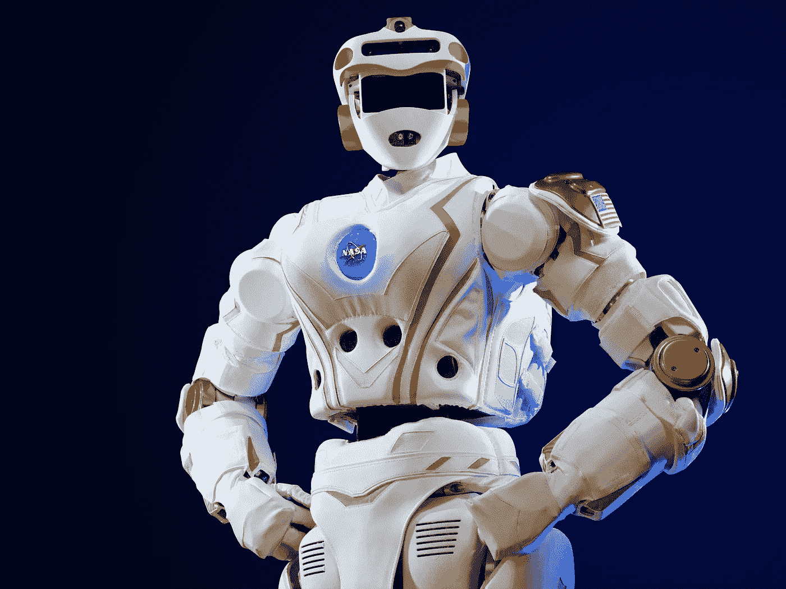
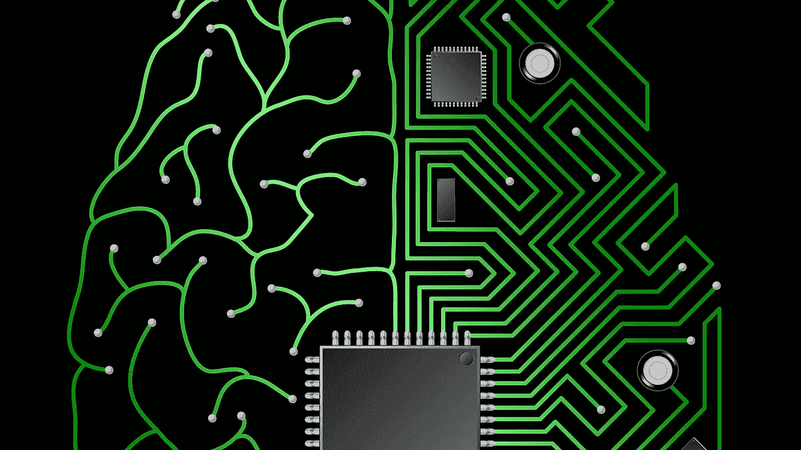
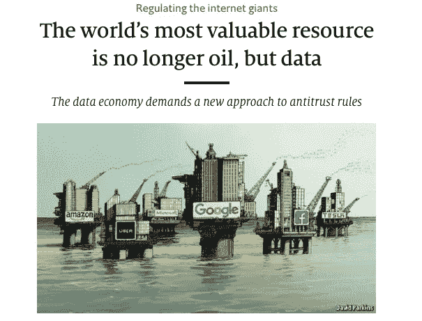
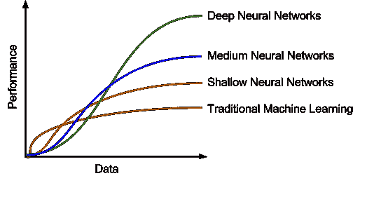

# 人工智能与自动化的歌谣

> 原文：<https://medium.datadriveninvestor.com/ai-and-the-ballad-of-automation-b1679d6f46fd?source=collection_archive---------6----------------------->

## 科技记者对人工智能有哪些误解，为什么智能系统即将吞噬世界

也许今天发展最快的科技新闻类型是这样的:*“人工智能表现令人失望，专家预测混乱。”*

毫无疑问，这是很好的新闻素材，但像这样的文章对理解人工智能技术的现状或未来可能的价值没有太大帮助。当涉及到人工智能时，他们都犯的基本错误是将自动化和增强混为一谈。

人工智能的核心价值在于它能够*增强*人类的能力。这一现实将推动技术发展带来全新的价值浪潮。

为了帮助理解为什么，我们根据我们在 ViewX 构建企业人工智能技术的经验，概述了为什么自动化如此困难，为什么增强如此强大，以及为什么“智能系统”是你将要听到的下一个技术术语。

# **1。自动化很难，而且也不会变得更容易**

关于人工智能，值得欣赏的一个最持久的现实是，人类的能力仍然非常难以复制。

NASA’s Valkyrie robot. Just don’t give it a bottle

以机器人技术为例:颇具影响力的杂志 *Science Robotics* 今年发布的一项[研究](https://www.therobotreport.com/10-biggest-challenges-in-robotics/)指出，在追求机器人技术的过程中，“主要挑战……30 年来基本上没有变化”。

即使是美国宇航局的$2M [瓦尔基里人形机器人](https://www.inverse.com/article/30787-robotics-problems-hands)——为在极端的太空环境中完成任务而建造——仍然在努力实现你会从大多数人类幼儿那里期待的那种手部灵活性。

如果手的运动存在这些挑战，考虑一下复制人脑的表现的难度。

人类的大脑是一个由数十亿个神经元组成的奇迹，这些神经元聚集在一起以大约每秒 1 亿亿次的速度运行，即每秒 10 亿亿次计算。相比之下，[世界上最快的超级计算机](https://www.nytimes.com/2018/06/08/technology/supercomputer-china-us.html)的处理能力只有它的 1/50。

事实上，在 2014 年，一组研究人员试图将他们的超级计算机用于处理人类大脑能够完成的百分之一的工作。花了 40 分钟才完成。

人类大脑如此难以复制的原因是它极其灵活、强大和高效。它的决策能力不仅基于智能，还基于我们的[“大规模并行处理湿件”](http://time.com/4960778/computers-smarter-than-humans/)，它由人类本能、常识和经验等组成。计算机可以用庞大的信息库进行编程，但是——不要过于诗意化——将永远无法像人类一样生活。

# **2。增强要容易得多，而且每天都在变好**

虽然大脑是不可思议的，但它也有很大的局限性。因此，虽然复制人类的能力很难，但增强它们并不难。

Computers are no brain. But brains are also no computers

此外，计算机在多个广泛的领域拥有超越人类的巨大能力优势:它们拥有超强的记忆力，它们可以更快地找到和回忆信息，它们可以更快地被教会，它们在处理复杂信息时更可靠准确，并且它们总体上受外部因素的影响更小。

过去几十年计算能力的巨大进步改变了我们对计算能力的理解。幸运的是，这些进步来得正是时候。

# **3。随着信息变得越来越有价值，计算能力变得越来越重要**

你可能已经注意到，我们生活在一个信息经济中，在这个经济中，成功越来越依赖于我们可以获得的信息的数量、质量和可访问性。

The Economist, featuring an unusually pun-free title

事实上，信息现在对经济成功如此重要，以至于《经济学人》最近宣称数据——取代石油——是世界上最有价值的资源。

然而，数据和石油在许多方面都有所不同。其中最重要的是稀缺性。今天的数据并不匮乏。互联网和经济数字化的结合每天产生惊人的 2.5 万亿字节的数字信息。此外，这些信息正以如此快的速度膨胀，以至于每两年我们就要将在此之前的所有历史中存在的数据量翻一番。

这意味着我们已经到达了一个信息临界点，在这个临界点上，数据量不再是一个区分因素，反而会成为一个更大的劣势。[除非它被正确驾驭](https://becominghuman.ai/training-data-is-the-new-oil-where-should-i-drill-284229f0dae9)。

# 4. **AI 真的很擅长综合信息**

这就是人工智能的独特价值开始成为焦点的地方。尤其是[深度学习](https://www.technologyreview.com/s/513696/deep-learning/)。

深度学习在大型数据集上蓬勃发展。这不仅是因为大型数据集提供了足够的训练数据来看到算法改进开始发生，还因为大型数据集提供了足够的复杂性来让深度学习算法的能力真正闪耀。

Deep Neural Networks: the Energizer Bunny of algorithms

传统算法的性能在特定的数据库规模下趋于稳定，从而限制了它们的影响。另一方面，随着数据输入的增加，深度学习的性能不断提高。这意味着，有了足够的数据，深度学习算法继续产生越来越复杂的见解和模式，将传统的替代方案越来越远。

这给了深度学习巨大的力量。在 ViewX，我们亲眼目睹了这一功能的非凡优势。使用深度学习来支持我们专有的上下文推荐技术，我们能够处理大量的非结构化数据，以确定各种信息集之间最上下文相关的联系。

此外，我们输入的数据越多，性能就越持续改善，现在已经处理了超过 1 亿次人类交互，我们现在看到我们的人工智能推荐超过人类选择 155%。这样做的好处是，我们能够强大地处理大量信息，为人类用户提供他们需要的特定和高度相关的信息，以改善他们的决策并提高他们的生产力。

# **5。智能系统的崛起**

我们与数据关系的这种变化标志着信息时代新阶段的开始。

迄今为止，赢家一直是那些产生了大量有价值信息的人，但这已经不够了。

下一个时代的赢家将由他们不仅生成数据，而且利用数据的能力来定义，特别是以增强用户独特决策能力的方式。

这一现实被智能系统的概念简洁地捕捉到了，格雷洛克伙伴公司的[陈佳瑞](https://medium.com/u/cbf936487bf4?source=post_page-----b1679d6f46fd--------------------------------)将其描述为[“下一代伟大软件公司的源泉”](https://news.greylock.com/the-new-moats-53f61aeac2d9)，它指的是任何能够应用人工智能来连接大量数据集、业务流程和用户工作流的应用程序，以便为他们的用户(无论是客户还是员工)生成有价值的预测洞察力。

The worker of the future: a human, but better

这下一波技术将由增强人类能力的人工智能来定义，而不是试图使它们自动化。

我们很高兴能够站在这一变革的最前沿，应用深度神经网络为人力资本管理发展最快的方面——劳动力发展——构建第一个真正的智能系统。

如今，每个员工面临的现实是，每两个员工中就有一个抱怨他们没有获得成功所需的信息。当信息对成功至关重要时，信息含量低的员工生产率更低、参与度更低、更有可能寻找其他工作就不足为奇了。这种情况目前描述了您 50%的员工。

人工智能提供了一种变革性的解决方案，我们已经利用它来构建一种产品，它可以实时了解每个工人正在做什么，并预测性地向他们提供他们工作所需的信息。

通过使用人工智能来个性化每个员工的信息流，我们增强了他们天生的人类能力，以增加背景并做出有效的决策。通过这样做，我们正在建立一个人工智能支持的劳动力，它比以往任何时候都更有见识、更投入、更有生产力。

# 这对人工智能的未来意味着什么

我们从构建企业人工智能技术中学到的是，人工智能的价值在于它能够增强人类的能力，而不是使其自动化。

虽然我们预计媒体对“人工智能性能”故事的迷恋不会很快结束，但我们预计会看到建立“智能系统”的公司大量增加，这些系统使用人工智能来转变人类的能力，推动下一波技术革命。我们很高兴能乘风破浪。

有兴趣了解更多关于 ViewX 如何构建**人工智能支持的劳动力**的信息吗？点击访问我们的

你也可以直接在 [LinkedIn](https://www.linkedin.com/feed/) 和 [Twitter](https://twitter.com/danielmhburke) 上**关注** **me** 了解更多关于我们人工智能未来的信息。