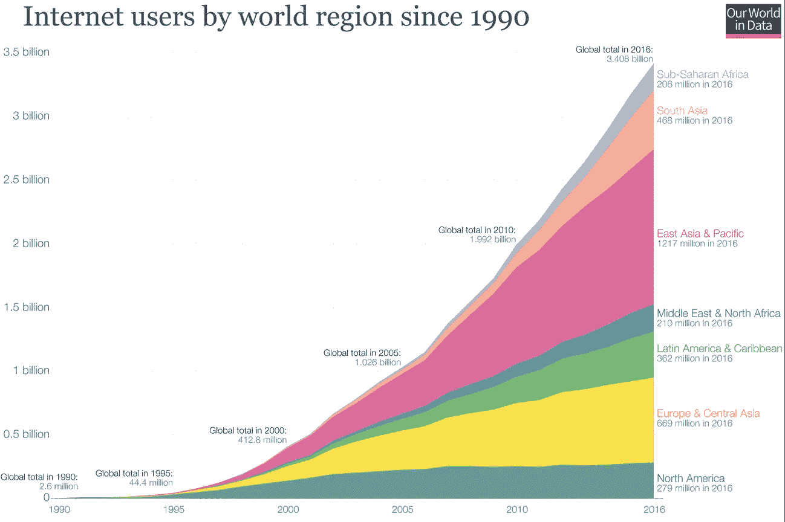

# 人工智能与未来工业

> 原文：<https://medium.datadriveninvestor.com/ai-and-the-industries-of-the-future-f130c20b5a86?source=collection_archive---------9----------------------->

近年来，我们见证了世界上最大的科技公司如何成功地大规模应用人工智能。目前，亚马逊、谷歌和脸书不仅在他们的商业模式中应用人工智能的原则，而且还在其庞大的数字业务的核心中使用它。商店、仓库和设施的逐步自动化，对网上潜在顾客的检测，以及内部管理程序的自动组织，正在把这些公司变成真正的赚钱机器，把同行业的其他公司基本上甩在后面。

Just a nice human being…

但是，在人工智能大规模应用方面，最重要的事情(同时也是最令人担忧的)是，其他行业中与技术不同的其他公司将开始大规模应用相同的人工智能技术，使他们成为本行业中最大和最成功的公司。在我看来，下一个将在全球范围内成功应用人工智能的行业是石油和天然气、制造业，可能还有教育。

 [## 挑战你对人工智能和社会的看法的 4 本书——数据驱动的投资者

### 深度学习、像人类一样思考的机器人、人工智能、神经网络——这些技术引发了…

www.datadriveninvestor.com](https://www.datadriveninvestor.com/2019/02/28/4-books-on-ai/) 

因此，总而言之，我的观点是，那些在各自的商业模式中大规模应用人工智能的公司，将处于整个行业的最顶端。毫无疑问，下一次商业和技术革命的关键是正确使用人工智能。

IBM 首席执行官兼总裁 Ginni Rometty 最近表示，“十年内，全球 100%的工作岗位将受到冲击”，老实说，如果我们考虑第三世界和发展中国家的业务发展情况，我认为这种说法并不准确；我的意思是，即使是穷国最大、最热门的行业领袖也远离富国的公司。贫穷国家的公司需要更好的技术基础设施，当然，最重要的是投资资金。所以，并不是所有的公司，甚至是行业的领导者都对人工智能的应用感兴趣。人工智能在十年内改变全世界 100%的工作岗位是不现实的，但有一点是真实的:那些学会如何大规模恰当应用人工智能资源的公司将处于其行业的巅峰。

**未来的风险**

有一个普遍接受的共识，即在中长期内，人工智能将涉及所有行业，其影响将有益于人类。人工智能的大规模应用给公司带来的好处是显而易见的:自动化、做出更明智和更快速的决策、持续改善劳动力等。但是，当人道劳动变得越来越无关紧要时，会发生什么呢？答案很简单:机器和系统将取代人类从事高强度的工作和高度重复的工作。对于富裕国家来说，如果我们考虑到出生率低，而与贫穷国家相比，平均收入高，这种戏剧性事件就微不足道了。这场戏剧成为第三世界甚至发展中国家的噩梦。目前，这些国家的主要就业来源来自高度劳动密集的活动，如主要是制造业。

因此，一个必须回答的问题是，当人工智能悄悄地用机器和系统取代人类劳动时，会发生什么？直到现在答案还不明确，但似乎也不是很乐观。

**AI 在望**

与此同时，有一个真正的战场，许多公司为了成为每个行业的主导者而殊死搏斗。其他一些人几乎没有出现在互联网上。但是，从一个时刻到另一个时刻，互联网作为商业平台的急剧增长将是这样的，在很短的时间内，所有行业的所有类型的业务都将以这样或那样的方式建立在互联网上。

Data source: Based on data from the World Bank and data from the international Telecommunications Union.”Internet users are people with access to the worldwide network”

作为一个短暂的结论，我只能对那些学习如何大规模应用他们基于人工智能的商业模式的公司说，迟早会悄悄地将他们的意志强加于他们的行业。

**参考文献**

[https://uk . pcmag . com/forward-thinking/118030/ibms-ginni-Rome tty-ai-will-change-百分之百的就业机会](https://uk.pcmag.com/forward-thinking/118030/ibms-ginni-rometty-ai-will-change-100-percent-of-jobs)

 [## 互联网

### 互联网已经改变了我们与世界各地的其他人一起工作、互动和学习的方式。世界上有多少人…

ourworldindata.org](https://ourworldindata.org/internet)