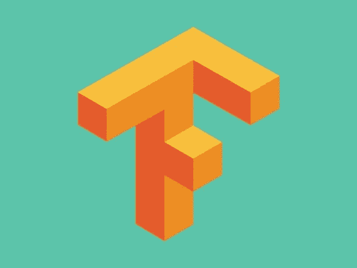
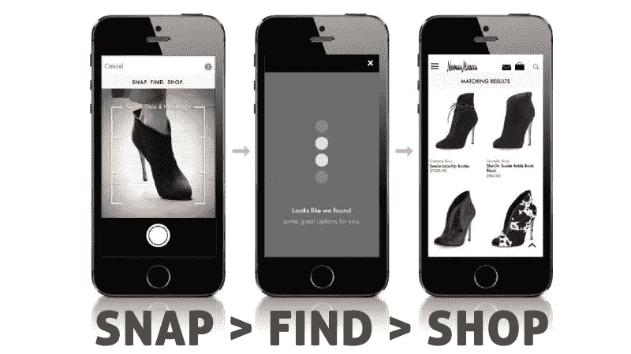
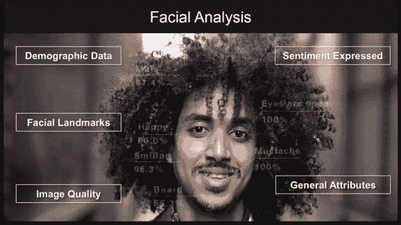

# 人工智能及其对移动技术的强大影响

> 原文：<https://medium.datadriveninvestor.com/ai-and-the-powerful-impact-on-mobile-technology-9bbc8909776?source=collection_archive---------7----------------------->

Image source: telenor.com

你们都听说过人工智能(AI)，但只有少数人知道它到底意味着什么，以及它如何影响我们的日常生活。

当想到 AI 时，许多婴儿潮一代和 X 一族会想到旧的科幻电影和机器活过来接管世界的场景。但这只是人类过去如何感知未知的有趣表现。

如果你还记得以前的电视节目' [Beyond 2000](https://www.imdb.com/title/tt0243689/) '，你可能会回忆起他们的想法和发明在当时是杰出的，这只能说明技术的潜力。

# *什么是真正的人工智能？我们在手机上可以看到哪些例子？*

今天与移动人工智能的不同之处在于，新一代智能手机将基于云的人工智能与硬件上的内置人工智能相结合——这项创新是由谷歌、苹果和华为等科技巨头宣布的。

[人工智能](https://venturebeat.com/2017/06/28/5-steps-to-prepare-your-company-for-the-ai-revolution/)的扩张速度正在加快——医疗保健、教育和金融等部门都在投资人工智能，但移动是人工智能最有前景的领域。

# ***手机软件中的 AI***

# **张量流服务**

TensorFlow 旨在为移动平台提供可靠的深度学习(DL)解决方案。

在移动和嵌入式设备上部署机器学习(ML)应用有两种解决方案: [TensorFlow for Mobile](https://www.tensorflow.org/mobile/mobile_intro) 和 [TensorFlow Lite](https://www.tensorflow.org/mobile/tflite/index) 。

**TensorFlow for Mobile** 具有更全面的支持功能，您应该使用它来涵盖生产案例，而 **TensorFlow Lite** 允许通过[神经网络 API](https://developer.android.com/ndk/guides/neuralnetworks/index.html) 实现目标加速器。

设备上深度学习(DL)的一些常见用例:

- **语音识别** ( *运行在设备上的小型神经网络* [*监听特定关键字*](https://www.tensorflow.org/tutorials/sequences/audio_recognition) *并将对话传输到服务器进行进一步处理*)；

- **图像识别** ( *帮助相机应用合适的滤镜，给照片加标签以便容易找到*)；

- **物体定位** ( *增强现实用例，TensorFlow 提供预训练模型和跟踪代码——跟踪对于你试图计算一段时间内有多少物体存在的应用程序很重要*)；

- **手势识别** ( *一种用手或其他手势部署应用的有效方式，可以从图像中识别，也可以通过分析加速度计传感器数据*)；

- **光学字符识别 OCR** ( *Google Translate 的 live camera view——最简单的方法是将一行文字分割成单个字母，然后对每个*的包围盒应用简单的神经网络；

- **翻译** ( *通常是序列到序列的递归模型，在这种模型中，您可以运行单个图来完成整个翻译，而无需运行单独的解析阶段*)；

- **文本分类** ( *如果你想根据用户之前的阅读向他们建议相关的提示，你需要理解文本的含义，这就是文本分类的用武之地。文本分类是一个总括术语，涵盖了从情感分析到主题发现的所有内容，例如* [*跳过思想*](https://github.com/tensorflow/models/tree/master/research/skip_thoughts/)

- **语音合成** ( *合成语音可以是给用户反馈或帮助无障碍的一种很好的方式，最近的进展如*[*wave net*](https://deepmind.com/blog/wavenet-generative-model-raw-audio/)*表明深度学习可以提供非常自然的语音*)。

# **图像识别功能**

面部识别技术并不新鲜，但预计它将在未来几年见证新的增长机会。

自从拍照手机成为通信的焦点以来，移动应用程序的创作者尝试了以非传统方式应用人工智能技术的新方法。作为这些应用基础的技术有*自我运动估计、增强、特征提取、透视校正、对象检测和文档检索*。

由于亚马逊、塔吉特(Target)和梅西百货(Macy)等零售巨头在其移动应用中提供图像识别功能，该技术可能会成为必备。扫描购买选项使客户能够直接从零售商的目录中购物，店内标牌的需求增加，并成为今天的标准服务。

一些零售商正在采用图像识别技术，允许消费者将手机指向任何物体，并接收类似产品的建议。一个直接的例子是他们为 iOS 开发的 [IKEA Place app](https://itunes.apple.com/us/app/ikea-place/id1279244498?mt=8) ,用户可以在 AR 的帮助下将宜家家具放入家中，并在周围旋转，就像在现实世界中一样。

Photo, Ikea.

# **手机视觉搜索**

移动视觉搜索是创造新利润机会的巨大潜力——品牌正试图利用智能手机摄像头日益复杂的特性来激活消费者并推动销售。在某些情况下，视觉搜索比文本或语音更快更准确，智能手机是视觉搜索技术的完美发射台。

比方说，你看到了你非常喜欢的东西，但你不知道如何找到它，也不知道它是如何命名的——视觉搜索让你找到所有那些你无法用语言描述的东西。

[谷歌镜头](https://www.blog.google/products/google-lens/google-lens-real-time-answers-questions-about-world-around-you/)是一个完美的例子——2017 年，谷歌镜头被引入谷歌照片和助手。截至 2018 年，谷歌宣布了三大更新:第一，智能文本选择(smart text selection)，将你看到的单词与你需要的答案和动作联系起来——你可以从现实世界复制/粘贴文本(食谱等。)到你手机里。

第二个更新是风格匹配，例如，如果你喜欢某件特定的衣服，你可以打开镜头，看到符合你喜欢的风格的相似风格的东西。

第三个更新是，Lens 现在可以实时工作——它允许你只需对准相机就可以浏览你周围的世界。

只需轻轻一拍相机，公司就可以使用技术作为工具来确定其库存的元素，出版商可以使用它来从他们的照片库中获取高质量的视觉内容，数字资产管理(DAM)软件可以包括视觉搜索，以可视化的方式组织和管理客户的内容。

视觉搜索可以帮助电子商务中的企业增加目录发现、客户参与和转化率。

(image source: slyce.it)

# **图像识别 API**

图像识别 API 训练计算机对不同类型的图片进行分析、分类和修改。

让我们列举其中的一些:

独立团队构建了一个能够准确识别大多数实体的系统。与列表中的任何其他 API 不同，它提供了场景识别和额外的视频分析。对于图像，Clarifai 可以执行情感分析、文本识别、徽标和人脸检测，以及更强大的 like 图像属性检测版本:亮度、颜色和主色。

**Google 的云视觉**使开发人员能够通过覆盖 ML 模型来理解图像的内容——它包括 Clarifai 的许多关键功能和一些附加功能，如:[地标检测](https://medium.com/google-cloud/google-cloud-vision-landmark-detection-vacation-photos-41392d4b5765)和一个简单的 REST API。你不能制作自己的模型来测试，但你可以使用谷歌支持的 API，它会不断改进。此外，你可以在你的图像目录上建立元数据，轻松检测你的图像中的各种对象，并从你的众包图像中删除令人不快的内容，这是由谷歌[安全搜索](https://support.google.com/websearch/answer/510)提供支持的。光学字符识别(OCR)允许您检测图像中的文本以及自动语言识别。

另一方面， [**亚马逊 Rekognition**](https://aws.amazon.com/rekognition/) 以一套更强大的面部分析工具而自豪，包括跨图像的面部识别(谷歌或 Clarifai 不提供)，以及胡子识别(是/否)和面部比较(两张脸是同一个人的可能性有多大？).它还承诺与 AWS 服务集成(S3 和兰巴)。

Source: aws.amazon.com

有人会说 Clarifai 的概念建模最强，Google 的场景检测和情感分析最好，Amazon 的面部分析最好。

我们还有**IBM Watson 视觉识别**服务，它使用 DL 算法来分析场景、物体、人脸和其他内容的图像。您可以使用自己的图像集合制作和训练自定义图像分类器，使用案例包括制造、视觉审计、保险、社交监听、社交商务、零售和电子商务。随着视觉识别理解视觉数据，它可以将成堆的图像转化为有组织的信息。有了 IBM Watson 视觉识别服务，构建能够准确检测和分析图像中物体的移动应用程序比以往任何时候都更容易。

# **自然语言处理**

你第一次接触**自然语言处理(NLP)可能会涉及一款 GPS 导航应用，它允许你口头请求前往目的地的方向——它们比过去复杂得多。**

**最知名的 NLP 移动应用是 SIRI，这是一种虚拟助理(VA)技术，其次是其他虚拟助理，包括 Alexa，Cortana 和谷歌助理。**

**NLP 在[医疗和保健部门](http://seventablets.com/blog/tips-for-healthcare-mobile-app-development-examining-security-and-privacy-concerns/)变得更加普遍，因为这里的使用非常广泛。当涉及到允许你使用口头输入的可穿戴[健康应用](https://www.statista.com/statistics/889623/mhealth-apps-market-size-forecast-in-the-us/)时尤其如此，因为这个领域越来越需要免提通信。**

**另一种用法是在检测垃圾邮件消息时，NLP 非常有用。垃圾邮件过滤算法“读取”博客评论、社交媒体或电子邮件等内容。然后，他们将其与已知的垃圾邮件和文本模式进行比较，以识别垃圾邮件。**

**此外，从信息库中创建和提取数据有巨大的潜力——用户可以通过口头输入来搜索过多的电子书、网站、视频、视频等。**

**此外，NLP 在预测领域也有显著的用途——指的是政治和社会事件。**

# **自然语言理解**

**[自然语言理解(NLU)](https://en.wikipedia.org/wiki/Natural_language_understanding) 处理机’*阅读理解*。**

**它将文本片段转换成更正式的插图，如一阶逻辑结构，更易于计算机程序操作。**

**NLU 从多种可能的语义中识别预期的语义，这些语义可以从 NL 表达式中提取，并且通常采用 NL 概念的有组织的符号的形式。**

**不管使用哪种方法，大多数 NLU 系统都有某些共同的元素——系统需要一个语言词典、一个解析器和语法规则来将句子分解成内部表示。“NLU”这个总括术语可以应用于一系列不同的计算机应用——从向机器人发出简短命令这样的简单任务，到完全理解报纸文章这样的高度复杂的任务。**

# ****文本到语音(TTS)系统****

**TTS 是一种高保真语音合成技术，可为一些特定群体提供更好的用户体验，例如有学习障碍的人、有读写困难的人、会说某种语言但不会阅读该语言的人、有视觉障碍和不同学习风格的人、进行多任务处理的人或从移动电话访问内容的人。**

**让你的数字内容听得见有助于在线人群更好地理解文本，随着人们越来越多地走向移动，TTS 可以将任何数字内容转化为多媒体体验，以便人们可以听博客、文章或新闻。**

**截至 2018 年，一些最好的文本到语音转换软件是:**

1.  ****亚马逊波利**——除了 Alexa，亚马逊还创造了一个智能 TTS 系统，名为[波利](https://aws.amazon.com/polly/pricing/)。波利把文本变成栩栩如生的语言。它支持一个 API，让您轻松地将语音合成功能融入电子书、文章和其他媒体。它很容易使用——你只需要通过 API 发送文本，它就会将音频流直接发送回你的应用程序。**
2.  ****语音阅读器 Home 15**——Linguatec 创造了[语音阅读器](https://www.linguatec.de/en/text-to-speech/voice-reader-home-15/)，可以快速将文本(Word 文档、电子邮件、EPUBs 和 pdf)转换成音频文件。你可以在电脑或移动设备上听这些文件。**
3.  **Capti Voice —语音合成应用在教育界很受欢迎，因为它们可以提高理解能力等。 [Capti Voice](https://www.captivoice.com/capti-site/public/entry/get_capti_subscription) 让你听任何你想读的东西。你可以定制学习或教学以及克服语言障碍。**

**谷歌推出的最新 TTS 服务是由 DeepMind AI 开发的软件 WaveNet 支持的云文本到语音转换。**

**它分析人类语音数据库中的波形，并以每秒 24，000 个样本的速度重新创建它们。最终的结果包括带有细微差别的声音，如咂嘴声和口音。谷歌表示，这项新服务提供了 32 种不同的声音，能够说 12 种语言，用户可以自定义音调和速度等因素。**

# ****语音转文本(STT)系统****

**如果你在开会或听讲座，很难记下演讲者说的每一句话，这就是语音识别解决问题的地方。**

**由于它依赖于计算语言学，它识别口语并将其转换为文本。**

**这些系统在能力上可以有所不同，简单的系统只能识别选定的单词，而最先进的系统可以理解自然语言。**

**一些最好的 STT 应用程序是:**

1.  **Android 版 Evernote——[Evernote](https://play.google.com/store/apps/details?id=com.evernote)允许你录制音频笔记，并将其转化为文本。与 Dragon Dictation ( *见下文*)不同，Evernote 将音频和文本文件保存在一起，这样你就可以记录下你的想法，并在以后对数据进行分类。该应用程序是免费的，但由于它使用谷歌 Android 文本转录服务，它需要互联网连接。**
2.  ****龙听写** —这个应用程序只有一个按钮——只需点击它并开始说话，然后[龙听写](https://itunes.apple.com/us/app/dragon-dictation/id341446764?mt=8)会处理剩下的事情。当你完成听写后，文本会显示出来，一旦应用程序完成转录你的讲话，你就可以通过电子邮件发送出去，或者复制并粘贴到另一个应用程序。你也可以直接发布到脸书或推特上，或者只是保存你的文本，以后再用。这款应用在 iPhone 和 iPad 上是免费的，但需要互联网连接。**
3.  ****语音助手**——这款重新设计的应用程序具有快速访问功能，可以很容易地在 Twitter、脸书或电子邮件上发布。使用[语音助手](https://itunes.apple.com/us/app/voice-assistant-just-use-your/id511757903?mt=8)，您可以利用自动复制功能将您的录音发送到其他应用程序，如谷歌搜索、YouTube 等，或者直接发送到无线打印机。它也有语法修正和屏幕编辑，并提供修正建议。**
4.  **[**转录**](https://transcribe.wreally.com/)——这是一款流行的听写应用，由 AI 驱动，你可以从 Dropbox 导入文件。自动转录任何视频或语音备忘录，支持来自世界各地的 80 种语言。一旦文件被转录，您可以将原始文本导出到文字处理器进行编辑。这款应用程序可以免费下载，但如果你想使用其中的大部分功能，你必须购买应用程序内的软件。**
5.  ****演讲注释** — [演讲注释](https://speechnotes.co/)不需要创建账户——只需打开应用程序，点击麦克风图标，一切准备就绪。录制笔记时，您可以通过语音命令轻松听写标点符号。可以快速添加姓名、签名、问候语等。通过使用内置键盘上的自定义键。Speechnotes 应用程序允许你访问大量的字体和文本大小——该应用程序可以从谷歌 Play 商店免费下载，但你必须在应用程序内购买才能访问所有功能。**

****

**Image source: chatbotsmagazine.com**

# ****聊天机器人****

**移动应用的聊天机器人被归类为“最近”的轰动，但它们的开始和发展始于 1966 年的伊莱扎(Eliza)——一个医疗聊天机器人，可以被认为是所有聊天机器人的母亲。**

**聊天机器人非常适合特定的任务，从简单的任务，如回答基本客户问题的基于规则的聊天机器人，到复杂的任务，如帮助客户服务问题。**

**聊天机器人不会取代网站或应用程序，但当它们与相同的应用程序和网站集成时，可以很好地促进与客户的互动。**

**对于公司来说，定期与客户互动至关重要——移动应用是这种互动的最佳平台。如今，几乎每个人都更愿意通过应用程序而不是电子邮件与公司沟通。**

**此外，聊天机器人可以帮助解决隐私问题——这就是为什么许多银行都在建立自己的聊天机器人平台，比如美国银行的[艾丽卡](https://promo.bankofamerica.com/erica/)。使用原生聊天机器人有助于避免隐私问题。**

**聊天机器人的一些很好的例子有: [Duolingo](https://www.duolingo.com/) ，美洲银行的 Erika，[柠檬水玛雅](https://www.welcome.ai/products/customer-support/lemonade-maya)(取代经纪人和官僚主义)，内部通话接线员(处理简单任务的客服聊天机器人)。我还想提一下目前统治网络的聊天机器人(脸书)的信使平台。**

**机器人在移动领域的好处是巨大的——客户互动将更加生动和吸引人，你不需要为一项任务下载应用程序，聊天机器人可以成为你的计算器、预订代理等。，他们会向你推荐新的东西，帮助你完成重复性的任务，并为你节省大量的手机空间，因为他们将是一个应用程序。聊天机器人通过从人工智能获得的智能支持来提高你的移动应用程序的质量，因为它将帮助你提高转化率。**

**开发人员将通过聊天机器人的无缝部署、聊天机器人与其他应用程序的集成看到好处——使用智能聊天机器人，您可以在移动应用程序中添加易于查看的功能和附加功能。**

# ****移动人工智能将如何影响企业？****

**主要的科技公司正在将人工智能算法融入各种设备中，以战略性地留住用户——这有助于企业深度吸引用户，并为使用他们的服务提供更多激励。**

**许多设备和应用程序将编写基于学习到的行为进行调整的算法——这些算法将能够过滤数据，发现趋势，并调整应用程序本身，以创造更多有意义的机会来吸引用户。**

**随着人工智能继续将用户与品牌联系起来，具有前瞻性思维的企业将在人工智能提供的优势下繁荣发展。**

**人工智能和人工智能的新进展正在引发一场革命，改变开发者、企业和用户对移动应用中智能交互的思考方式。**

# **接下来会发生什么**

**人工智能将带来的最明显的变化是*处理速度*和*效率——更快地做事情，并且不用给你的手机多次充电。最终，人工智能的全部意义在于与我们的智能手机建立更加个性化和用户友好的关系。***

**基于技术的进步和对智能应用不断增长的需求，人工智能和移动是**的完美结合**。**