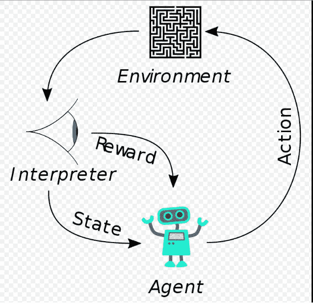
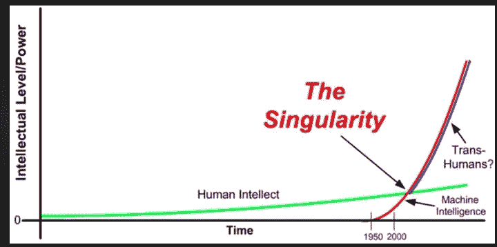

# 人工智能和奇点克服了技术过时

> 原文：<https://medium.datadriveninvestor.com/ai-and-the-singularity-overcome-technological-obsolescence-c66dcc10f187?source=collection_archive---------13----------------------->

20 世纪 70 年代，作为一名在信息技术行业工作的年轻人，我痴迷于技术变革，尤其是技术过时的****。我开始对一个不断壮大的家庭负责，从不希望“*过时*”危及我家人的幸福。讽刺的是，可能正是我对改变的热情导致了我的不幸。****

****随着我事业的发展，我开始超越我的滑雪板，或者超越我自己，尤其是在我发展技能的技术方面超越我的同事。很多次我被认为行为鲁莽，但我真的没有看到。我只是看到其他人改变得不够快。我和“其他人”之间的冲突最终导致我被拒绝，尽管我可能会因为我的滑雪板而出局，但我以前的同事最终被迫“*购买新滑雪板*”。****

**** [## 今年值得关注的人工智能趋势——数据驱动的投资者

### 预计 2019 年人工智能将取得广泛的重大进展。从谷歌搜索到处理复杂的工作，如…

www.datadriveninvestor.com](https://www.datadriveninvestor.com/2019/02/19/artificial-intelligence-trends-to-watch-this-year/) 

然而，我承认从未真正获得的一项技术创新是人工智能。我一直以为更多的是“*人工智能*”而不是真正的“*智能*”。我告诉自己，人工智能缺乏直觉，缺乏在思维上实现巨大飞跃的能力，主要受情感和感觉的驱动。我以为我理解了库兹韦尔关于 [**加速回报**](https://www.kurzweilai.net/the-law-of-accelerating-returns) 的想法，以及变化是如何以指数方式发生的，但我真的不明白到底是什么在加速。

在研究了 [**DeepMind 的 AlphaGo**](https://deepmind.com/research/alphago/) 及其应用的 [**强化学习**](https://en.wikipedia.org/wiki/Reinforcement_learning) 之后我觉得“**我终于明白了**”。在典型的强化学习(RL)场景中:代理在环境中采取行动，这些行动被解释为奖励和状态的表示，并反馈给代理。换句话说，代理“学习”。据 [**戴密斯·哈萨比斯**](https://en.wikipedia.org/wiki/Demis_Hassabis) ，DeepMind 联合创始人

> " *DeepMind 的目标是* ***解决智能*** *然后用它来解决其他一切事情。"*

人工智能(AI)技术不需要表现得像人类智能一样“聪明”。它可以实现自己的智能和学习形式，而不需要像人类那样的“T8、T9、啊哈时刻、T10、T11”。

[**奇点**](https://en.wikipedia.org/wiki/Technological_singularity) 是 [**加速回归**](https://en.wikipedia.org/wiki/Accelerating_change) **定律不可阻挡的结果。**根据 Ray Kurzweil 的说法，各种各样的进化系统(包括但不限于技术的发展)的变化率往往呈指数增长。他预测，这种范式转变已经并将继续变得越来越普遍，导致“如此迅速和深刻的技术变革，它代表了人类历史结构的断裂。”库兹韦尔认为，加速回报法则意味着在 21 世纪末之前，大约在 2045 年左右，将会出现一个技术奇点。他的文章是这样开始的:

> ***奇点*** *是“技术变革变得如此迅速和深刻的时刻，它代表着人类历史结构的断裂”——雷·库兹韦尔*

牛津大学教授马库斯·杜·索托伊没有库兹韦尔那么戏剧化，但他清楚地解释了更多“有效的学习方法”是如何产生的。据杜·索托伊博士说；

> “当我们发现更有效的做事方法时，我们也会发现更有效的学习方法”

通过对 DeepMind 的 [**AlphaGo**](https://deepmind.com/research/alphago/) 技术的研究，Du Sautoy 描述了“ ***DeepMind 如何开发出一种更好的算法*** *，可以击败 AlphaGo 的原始版本。”这个算法* ***避开了显示人类如何玩游戏的需要。****alpha go 第二阶段开发通过* [***强化学习***](https://en.wikipedia.org/wiki/Reinforcement_learning) *后，连 DeepMind 的团队都被新算法的强大程度震惊了”。*

*在三天的强化学习中，其中 AlphaGo Zero* ***与自己对弈 490 万局*** *它能够以一百局的优势将战胜*[***Lee Sedol***](https://en.wikipedia.org/wiki/Lee_Sedol)*的版本 AlphaGo 击败为零。人类花了三千年才完成的事情，*[**alpha go Zero**](https://en.wikipedia.org/wiki/AlphaGo_Zero)*三天就做到了。*

DeepMind 团队的目标变成了“*解决智力问题，然后用它来解决其他一切问题*”，他们已经在没有任何人类的情况下做到了这一点。*啊哈时刻*。

[**博萨尼**](https://www.bons.ai/how-it-works) 称自己的方法为 AI、 ***深度教学*** *”而不是深度学习。他们声称他们的技术自动“将主题专业知识编译成* ***机器学习模型。***

强化学习和机器学习模型的使用正在克服许多关于 [**狭义 AI**](https://en.wikipedia.org/wiki/Weak_AI) **缺点的反对意见。**

强化学习可以应用于机器学习模型可以应用的任何主题，并且其主题可以存储在数据库中。

我只希望这是五十年前。人工智能和机器学习的长寿似乎将长期存在，这肯定会克服我对技术过时的任何焦虑****。****

***最初发布:*[*https://timmccloud . net/blog-ai-and-the-singularity-comprise-technical-obsolution/*](https://timmccloud.net/blog-ai-and-the-singularity-overcome-technological-obsolescence/)******