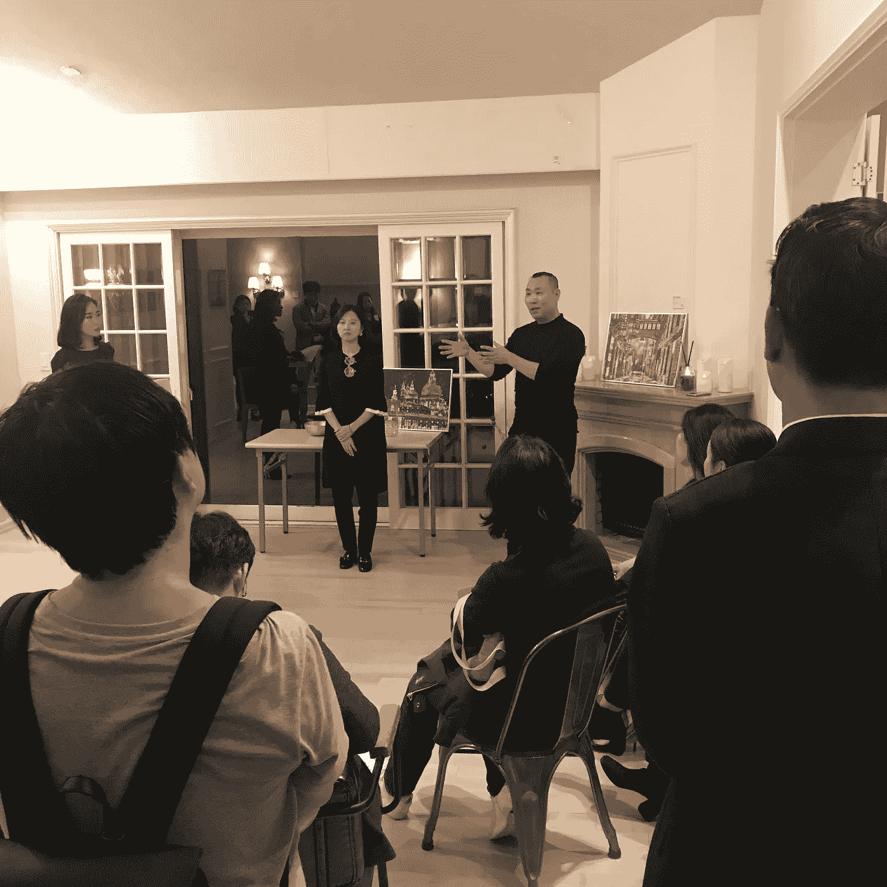
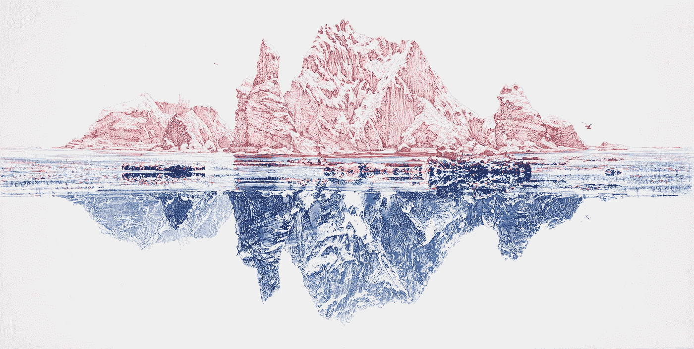
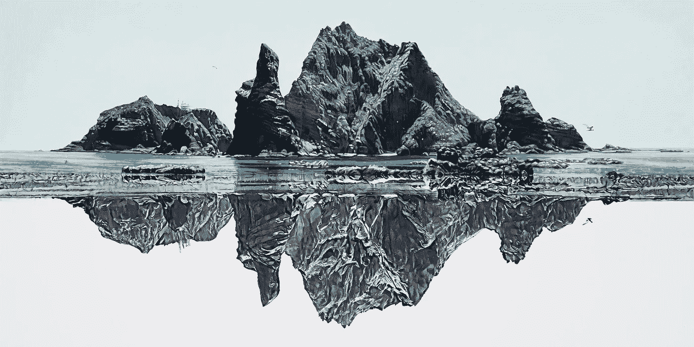
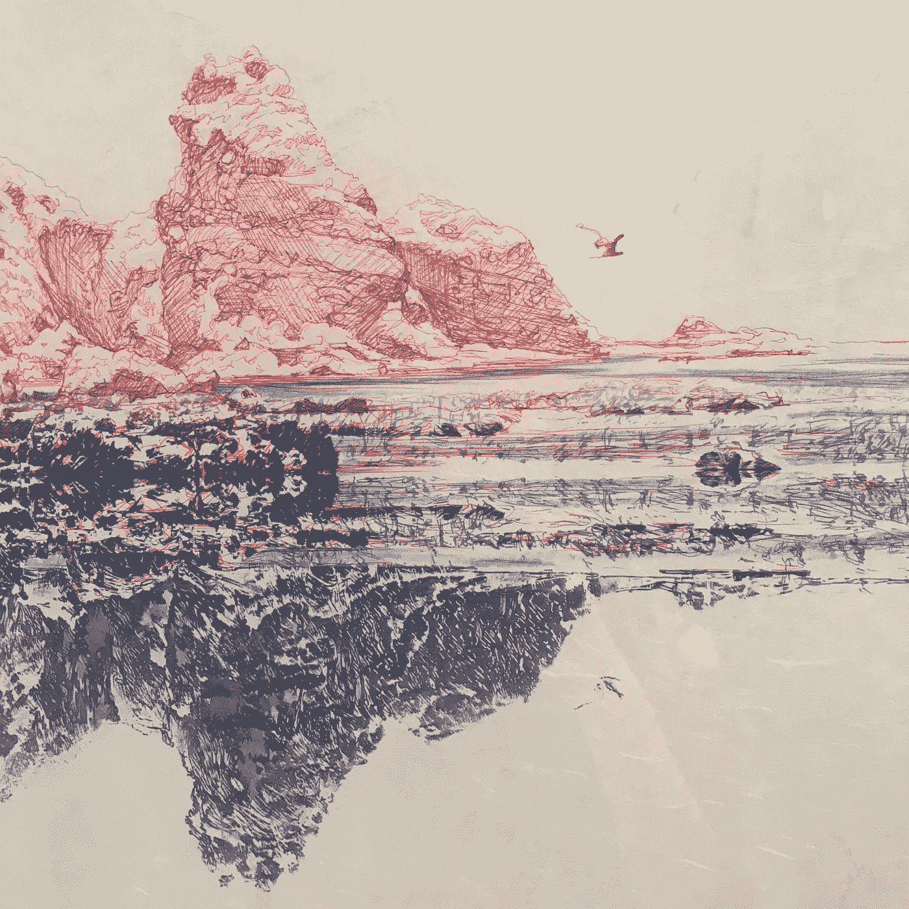

# 韩国的艾艺术:“与……交流”

> 原文：<https://medium.datadriveninvestor.com/ai-art-in-korea-commune-with-31389aa33217?source=collection_archive---------9----------------------->

2019 年 10 月 31 日，韩国第一家人工智能艺术画廊举办了一场特别会议，超现实主义艺术家 Doomin 和人工智能艺术初创公司 [Pulse9](http://www.pulse9studio.com/) Jieun Park 的创始人讨论了“与……交流”项目。据说这是世界上第一次人类艺术家和人工智能之间的艺术合作。

AIA 美术馆位于全球企业家基金会成立的加速器[【HSR 中心】的二楼，目前展出了几幅艾的画作，其中“与……交流”被作为第一次艺术展的中心作品。](http://epicenter.or.kr/gef/)

> 密谈:一起交谈或谈话，通常是非常强烈、亲密地

collaboration art piece #1: Pen Drawing of Dokdo (photo from Pulse 9 website)

collaboration art piece #2: Painting of Dokdo (photo from Pulse 9 website)

《与……交流》由两幅关于独岛[的艺术作品组成，独岛是日韩之间争议最大的地区。在第一件作品中，Pulse 9 的人工智能艺术算法“Imagine AI”在](https://www.nationalgeographic.com/travel/destinations/asia/south-korea/history-dispute-photos-dodko-rocks-islands/)[韩吉](https://en.wikipedia.org/wiki/Korean_paper)(传统的韩国手工纸)的下半部分打印了蓝色钢笔画，而人类艺术家 Doomin 用红色墨水完成了上半部分。在第二幅作品中，“想象艾”使用东方绘画技巧画下半部分，而 Doomin 以西方绘画风格完成了画作的上半部分。

South Korea and Japan have argued over Dokdo Island’s sovereignty for more than 300 years.

> 据韩国称，日本在 1696 年承认独岛为韩国领土，此前日本和韩国渔民发生了口角。但是，在 1905 年，尽管据称这些岛屿处于朝鲜乌尔都郡的正式管辖之下，但在日本占领朝鲜半岛之前，这些岛屿被日本吞并，并持续了 35 年，直到 1945 年。根据韩国的说法，这些岛屿在第二次世界大战结束时“理所当然地”归还给了他们。日本不同意。(亚历山德拉·热诺瓦，《国家地理》)

“AI 在艺术中的出现，和一个相机在艺术史中的出现是一样的。当照相机首次问世时，人们说人类的绘画将会过时，但就像印象派、抽象表现和超现实主义一样，人类的怀疑屈服于只有人类才能表达的方式。

 [## 今年值得关注的 5 大人工智能趋势|数据驱动的投资者

### 预计 2019 年人工智能将取得广泛的重大进展。从谷歌搜索到处理复杂的工作，如…

www.datadriveninvestor.com](https://www.datadriveninvestor.com/2019/02/19/artificial-intelligence-trends-to-watch-this-year/) 

作为这次合作的作者，我相信人工智能艺术不是当前艺术的替代品。**通过相互共存，AI 可以激发艺术家的想象力**并为他们呈现不同的工具。通过为人工智能提供艺术方面的深度学习，艺术家可以为未来社会做出贡献，因为它可能会彻底改变我们的生活。”— Doomin ( [脉冲 9‘想象 AI’简介](http://www.pulse9studio.com/ImagineAI)

在几乎所有报道 Doomin 和“想象人工智能”合作的韩国文章中，反复出现的问题是“人工智能对艺术家是一种威胁吗？”。甚至在人工智能美术馆开幕期间，关于人工智能在创造力光谱中的位置的严肃讨论也在观众中引发。

在《与……交流》中，在水下和陆地上有一个怪诞的时间划分:杜明描绘了独岛生机勃勃的绿色，而人工智能描绘了这座贫瘠岛屿的详细轮廓。但事实是——每个夏天都伴随着秋天，每个冬天都以春天结束。也许许多人也只是选择看到人工智能冰冷的表面，当它可能导致艺术行业最甜美的未来。人工智能擅长解决问题，而艺术是由充斥着人为错误和答案的算法计算出的解决方案。**那么，为什么我们如此怀疑艾的绘画潜力呢？也许这个问题会像独岛一样争议很多年。然而，简单地接受观察人工智能艺术行业的起伏可能是革命性的。**

> “生活中没有什么可怕的，只有需要理解的。现在是了解更多的时候了，这样我们就可以少一些恐惧。”—玛丽·居里

无论公众的意见多么有争议，它将永远是一个充满希望和绝望的孤岛。尽管有分歧，让我们开诚布公地交流吧。