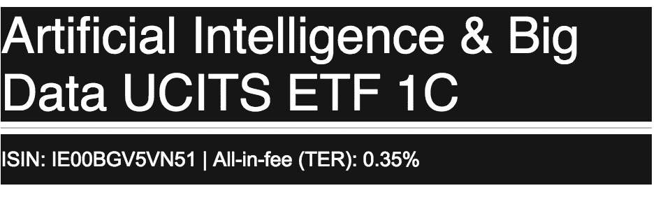
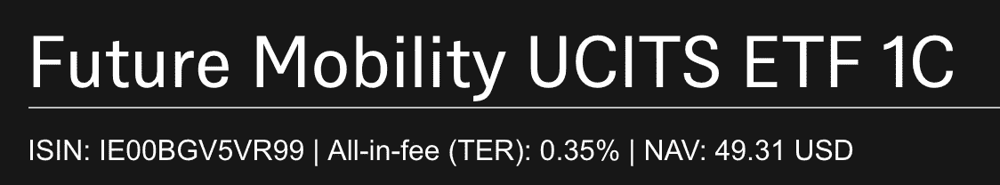
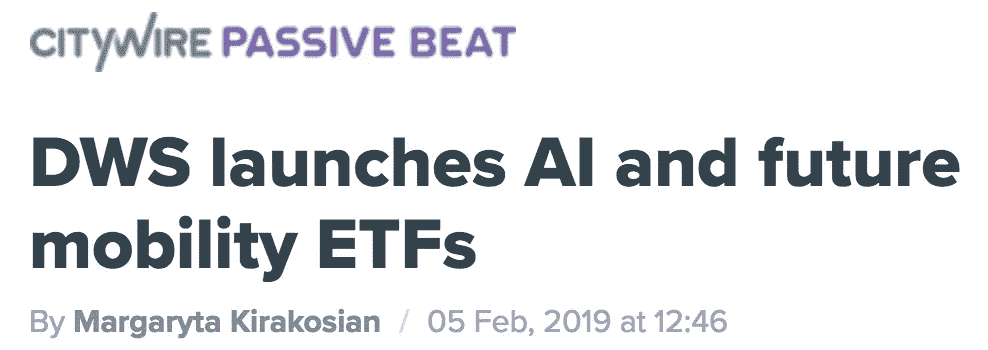

# 与 DWS、纳斯达克和耶诺推出人工智能和未来流动性交易所交易基金

> 原文：<https://medium.datadriveninvestor.com/ai-big-data-etf-ac6f7dda94d8?source=collection_archive---------8----------------------->

*   DWS(前德意志资产管理公司)今天宣布与 Yewno 和纳斯达克合作推出两只 ETF:(I)人工智能和大数据 ETF 和(ii)未来流动性 ETF；
*   人工智能和大数据 ETF 旨在复制纳斯达克 [Yewno](http://yewno.com) 人工智能和大数据指数；
*   未来流动性 ETF 旨在复制纳斯达克全球 [Yewno](http://www.yewno.com/finance) 未来流动性指数；
*   ETF 是我们不断增长的 10+ [Yewno](http://yewno.com) 指数型产品组合的最新成员。

基础指数战略利用 Yewno 的计算语言学技术，通过量化美国专利局和世界知识产权组织授予专利的语义，确定与人工智能、数据处理、数据安全和未来移动性相关主题相关的全球公司。

指数策略是完全自动化的，并采用了基于规则、系统和透明的方法，这在当今大多数其他典型的人工智能金融产品中是找不到的。

**新闻稿**:[https://city wire selector . com/news/dws-launchs-ai-and-future-mobility-ETFs/a 1197877？ref = city wire _ global _ latest _ news _ list](https://citywireselector.com/news/dws-launches-ai-and-future-mobility-etfs/a1197877?ref=citywire_global_latest_news_list)

人工智能&大数据 ETF:[https://ETF . dws . com/en-GB/ie 00 bgv 5 VN 51-人工智能-大数据-ucits-etf-1c/](https://etf.dws.com/en-gb/IE00BGV5VN51-artificial-intelligence-big-data-ucits-etf-1c/)

未来流动性 ETF:[https://ETF . dws . com/en-GB/ie 00 bgv 5 VR 99-future-Mobility-UC its-ETF-1c/](https://etf.dws.com/en-gb/IE00BGV5VR99-future-mobility-ucits-etf-1c/)

Yewno 基于指数的产品组合现在包括:

1.  **Yewno** 旗下 STOXX AI 全球 AI 指数；
2.  纳斯达克 **Yewno** 北美大麻经济指数；
3.  纳斯达克 **Yewno** 全球未来流动性指数；
4.  纳斯达克**耶诺**艾&大数据指数；
5.  纳斯达克 **Yewno** 颠覆性基准指数；
6.  iSTOXX **Yewno** 发达市场区块链指数；
7.  纳斯达克 **Yewno** 全球创新科技指数；
8.  AMUNDI STOXX 全球人工智能 ETF (GOAI)，与 **Yewno** 合作；
9.  Coincapital STOXX 区块链专利创新指数基金(LDGR)，与 **Yewno 合作；**
10.  DWS 的人工智能&大数据 ETF(XAIX:GR)**；**
11.  DWS 未来流动性 ETF
12.  法国巴黎银行富通投资美元全球创新技术笔记。

欲了解更多信息，请访问 www.yewno.com/finance。