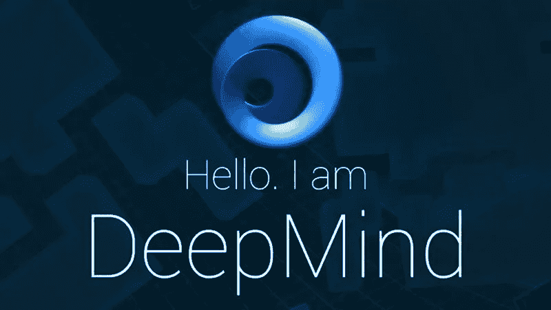
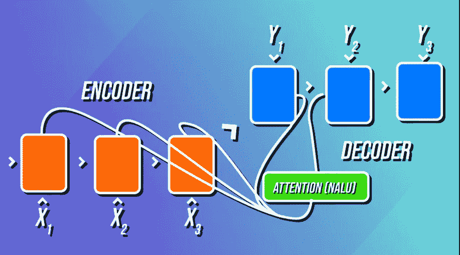
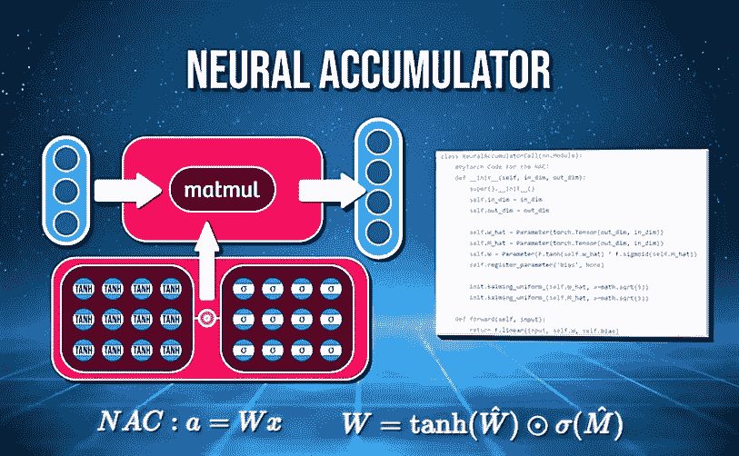
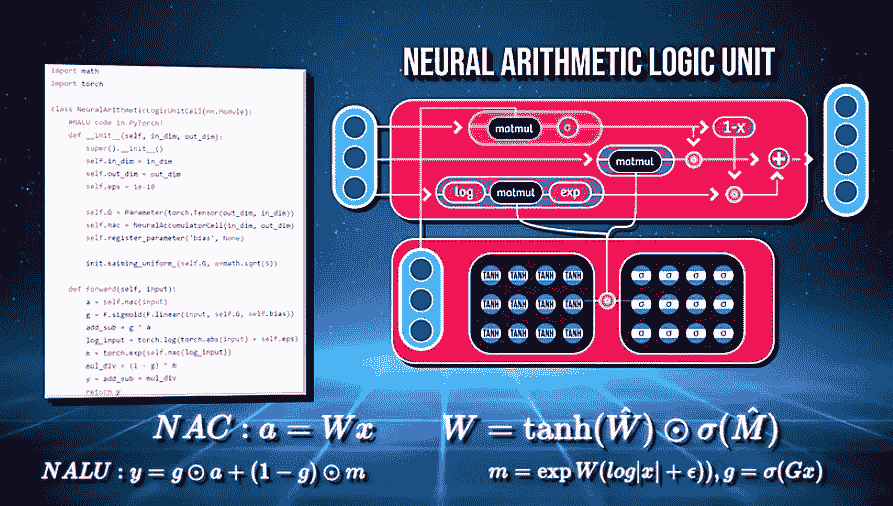
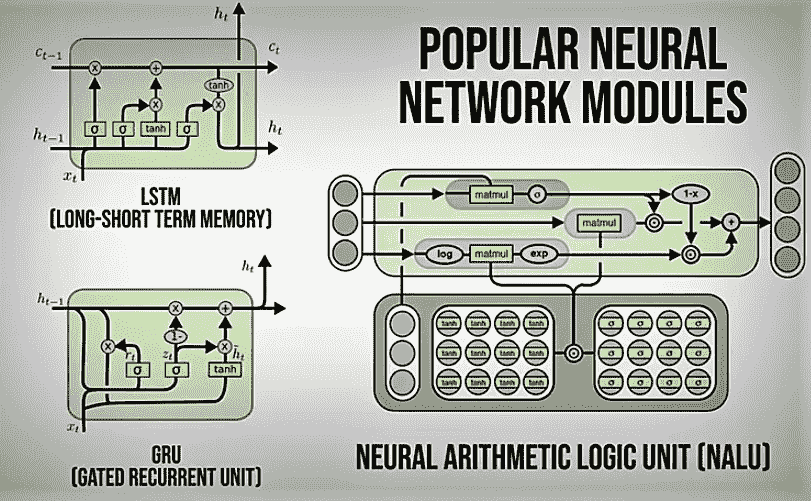

# 人工智能的突破——NALU

> 原文：<https://medium.datadriveninvestor.com/ai-breakthrough-nalu-e16f260d0e8c?source=collection_archive---------0----------------------->

即使深度网络已经发展到目前为止，神经网络也无法计数，但 DeepMind 最近由 [Trask](https://arxiv.org/pdf/1808.00508.pdf) 发表的论文使这成为可能。

他引入了一种叫做 NALU(神经算术逻辑单元)的单元，这种单元可以推断它们被训练的外部数字之间的机制/关系。原来是如下图的注意机制。

在深度学习的历史上第一次，**一个 nn 学习一个数的概念**决定输入的哪一部分&输出应该应用某些函数。

有一个 NAC 神经累加器，其权重矩阵仅由-1、0、1 组成，输出是输入向量的加法/减法，而不是重缩放，这可防止图层在将输入映射到输出时进行重缩放。

NAC 将权重-W 与我们的输入相乘以得到输出-a，其中 W 是 W(hat)的 tanh 激活乘以 M(hat)的 sigmoid 我们可以在这里使用 SGD)

NAC 的一个更健壮的扩展是 NALU，它包括所有复杂的算法，其中每个复杂的计算由每个子单元执行。

因此，就像其他 GRUs & LSTMs 一样，NALU 是一个在学习神经网络方面取得突破的网络模块。

论文显示，他们在几个不同的任务上对 NALU 进行了实验:1 .选择输入并对其使用不同的函数(如+、-、*、/、x)，它可以很好地推断出新的数据。

2.训练它来显示 mnist 数据中有多少类型的图像，它再次表现良好(你可以在论文中看到详细的结果)

3.将文本数字表达式转换为标量值(例如 45 = 45)(LSTM+NALU 实现了最佳外推)

因此，NALU 有能力真正理解数字的含义和它们之间的相互作用，这是非凡的，因此有一个扩展其领域的伟大未来。

http://www.sirajraval.com/[…..我只是创建了一个包装器来理解。](http://www.sirajraval.com/)

有用的链接:

[https://arxiv.org/pdf/1808.00508.pdf](https://arxiv.org/pdf/1808.00508.pdf)

[https://github . com/titu 1994/keras-neural-alu/blob/master/nalu . py](https://github.com/titu1994/keras-neural-alu/blob/master/nalu.py)

[https://deepmind.com/blog/](https://deepmind.com/blog/)