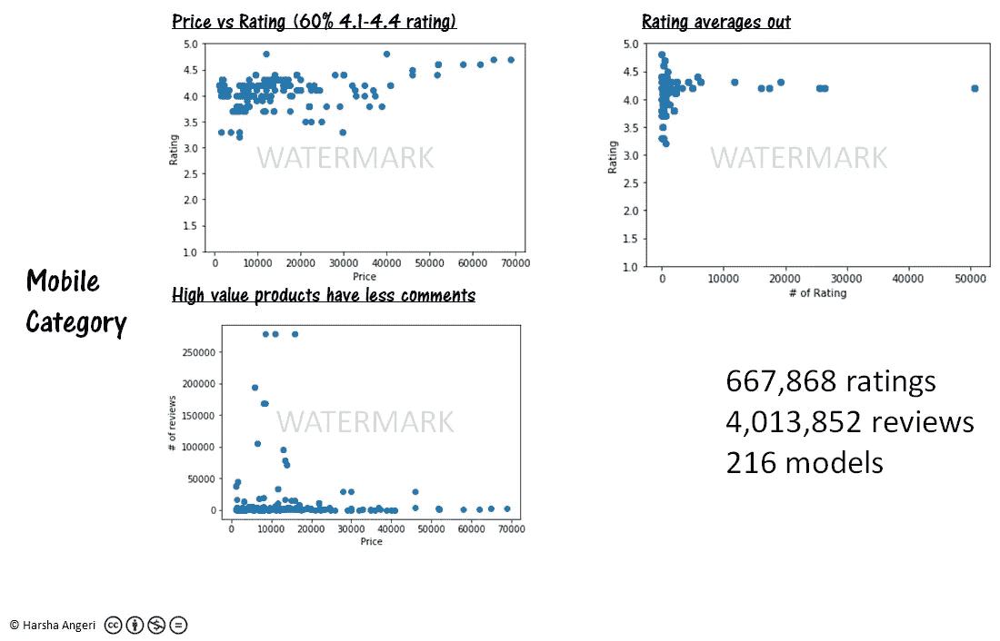
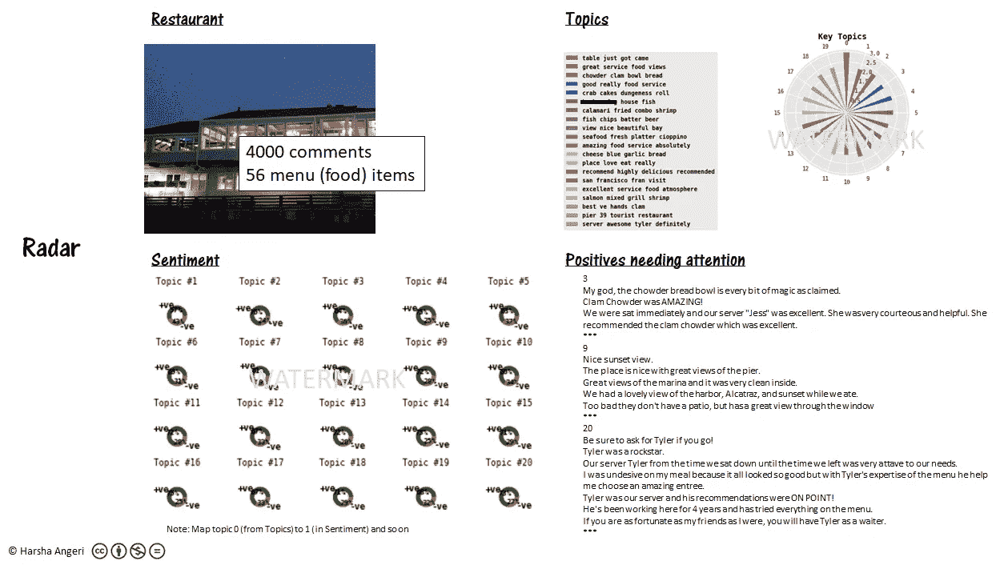
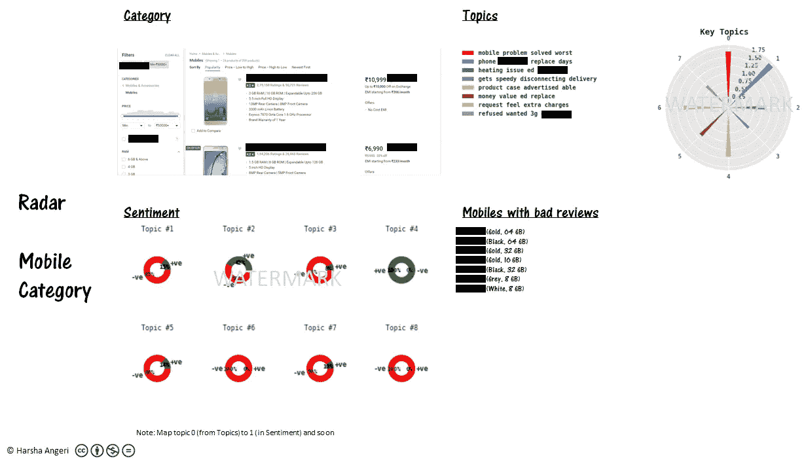
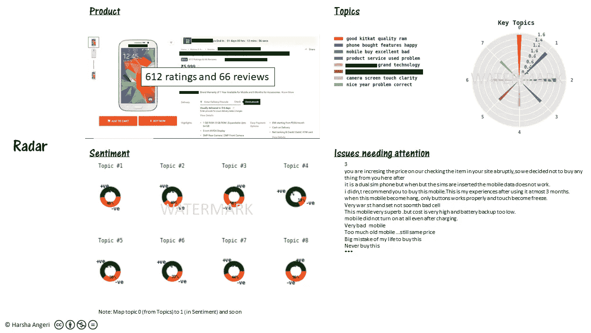
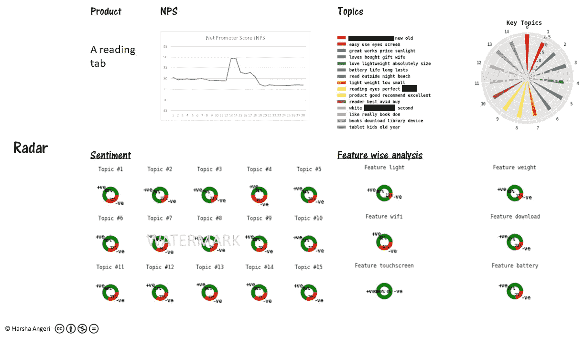
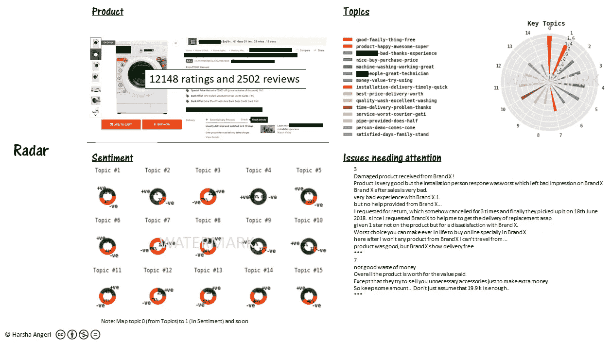
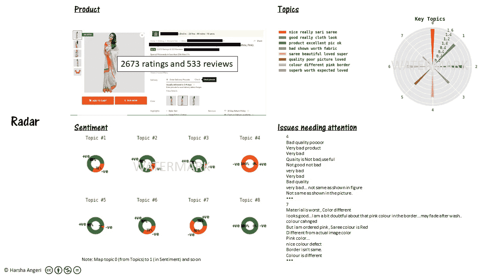
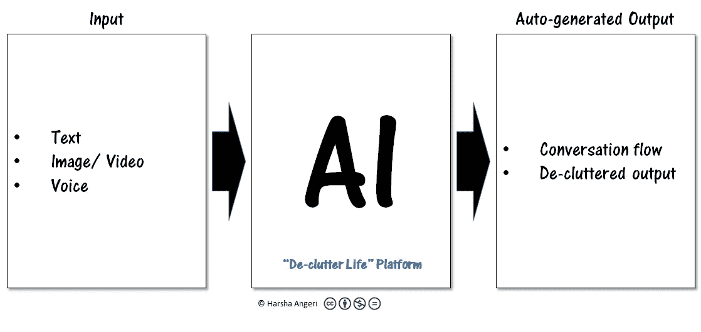

# 人工智能可以消除在线市场中的群体智慧

> 原文：<https://medium.datadriveninvestor.com/ai-can-de-clutter-crowd-wisdom-in-online-marketplaces-329e251ed3de?source=collection_archive---------10----------------------->

网上购物变得越来越复杂。难道不是为了简化吗？钟摆已经摆向了另一边。**为什么？数据太多了，很难解读。**

**你能给我举个例子吗？**以全球顶级移动品牌之一及其在全球最有价值的电子商务网站之一的存在为例。你会发现 216 个模型有 4013852 个评论和 667868 个评分。这是一个网站。哇！！400 万条评论…这是不可能的…哪个人会看它去买手机呢？

**杂乱。**

情况会变得更糟。预计到 2020 年将会产生 47 Zeta 字节的信息。预计其中只有 16%是结构化的和可搜索的。当然，很多都是虚假信息，这是我们今天正在努力解决的问题。

我们需要**清理**并智能地**去利用这些数据背后的群体智慧。**

**AI？**

是的，让我们看看什么是可能的，然后再谈一谈如何实现。在我之前的博客中也解释了这种方法，以及更多关于整理生活的例子( [AI 整理生活](https://medium.com/datadriveninvestor/ai-to-de-clutter-life-fc9c11d84776))。

*注意:为了将讨论的焦点放在概念& AI 上，所有品牌名称都被覆盖/涂黑*

**我们可以使用在电子商务网站上找到的评级吗？**

是也不是。钟摆也在这方面摆动，越来越多的产品类别。回到上面的移动例子，让我们写一段代码来分析评分和评论。参见下面的图 1。

Figure 1 (All charts are auto-generated by code & AI)

关键要点:

1.  60%的产品评分为 4.1-4.4 分(满分为 5 分)。这是没有用的，当收视率拥挤时，它没有任何意义。
2.  随着人们对产品的评价越来越高，产品获得平均评价的机会也越来越大。
3.  高价值产品评论少。这正是一个人需要更多评论的地方，因为花费更多，但买家更少——评论也更少。

高价值产品的评级拥挤和缺乏评论只会增加而不是减少混乱。这越来越让消费者分心。

让我再提供一个数据点来说明评级越来越分散人们的注意力。让我们拿最简单的事情来说。决定去餐馆。如今，大多数餐馆都有 3000 多条评论和 1000 多张 Instagram 图片。让我们使用最大的餐馆评论网站 Yelp 来检查评级。请注意:48%的 Yelp 评论是 5 星，这些无法区分。68%的评论有 4 颗以上的星(来源:[https://www.yelp.com/factsheet](https://www.yelp.com/factsheet))。72%会有推荐评级。杂乱。收视率越来越分散注意力，越来越混乱。除非我仔细阅读评论，否则没有什么能帮助我做出决定。

这给你留下了大量的评论/评论。

如果你有一个如下图(图 2)所示的仪表盘，AI 可以理解所有关于吃什么、看什么和期待什么的评论，会怎么样？

Figure 2 (All charts are auto-generated by code & AI)

这是三藩市的一家面向海港的餐馆，可以看到阿卡特兹和码头。蛤蜊杂烩、蟹肉饼和混合烤三文鱼虾是菜单上的必备菜肴。有点像游客。伟大的服务和微妙的方面，如特别期待泰勒服务员服务。4000 条评论和 56 个菜单项，为您提供方便。去杂波。

**这可能吗？**

是的，而且可重复。我们可以让人工智能建立一个语言模型，它可以理解评论，识别评论中的各种话题/对话，并提出最重要的话题。

**我们能为手机做些什么？**

是的，让我们回到电子商务的讨论，看看手机。我们通过编码发现 60%的手机评级为 4.1-4.4。我们因此减少了大约 40%。让我们把注意力集中在这 60%上，分析评论，找出订购后被退回的手机。AI 提供了下图(图 3)

Figure 3 (All charts are auto-generated by code & AI)

该品牌似乎有发热问题，是产品退货的主要原因。手机外壳中的一些问题和物有所值的认知。这可以帮助我们消除所有这样的差评手机。给了我们一个更小的子集去工作。通过处理输入数据和使用相同的人工智能平台，人们可以在做出决定时进行多次切割。

**如果我最终入围了一个产品，我能得到一个餐厅类型的仪表板吗？**

给你一个特别的手机。图 4 是人工智能提供的仪表板。

Figure 4 (All charts are auto-generated by code & AI)

和餐厅的仪表板一模一样。虽然在餐馆的例子中可以突出积极的一面，但在这里，说明了不同的方面，即“需要注意的问题”。可以像之前一样获取对话/主题来了解产品/服务，但进一步处理以找到围绕每个主题的情绪。这款手机虽然不错，但似乎有触摸屏问题，包括清晰度。好了，我们放大到这款手机最重要的负面影响。现在你决定买还是不买。休息是杂乱的。

各种功能呢？人工智能能解决这些问题吗？

让我们来看看当今世界上销量最大的电子产品之一。图 5 显示了一个类似的仪表板，但是这里我们做了一个特性方面的分析。产品大卖，你可以看到为什么…在各种功能中，人们除了在主题类别中有非常积极的情绪外，还有非常积极的情绪。这些评论可用于提供指标，如净推广者得分(推广者和贬低者百分比之间的差异)，这可以让消费者对产品接受度有一个简单的看法。

Figure 5 (All charts are auto-generated by code & AI)

**我们能看到更多种类的产品吗？**

下面是一台洗衣机。图 6 表明这是一台好的洗衣机。虽然交付情况良好，但安装过程中似乎存在一些初期问题。特别是来安装的人往往会要求额外的钱，并试图出售配件，如支架，以保持机器。只需放大重要的内容，而不是 12148 个评分和 2502 条评论。去杂波。

Figure 6 (All charts are auto-generated by code & AI)

**哦，这还是电子产品，其他类别呢？**

让我们来评论一下像印度人穿的纱丽这样的民族服装。人工智能仪表板(图 7)显示，这件带有粉色边框的纱丽实际上是一件带有红色边框的纱丽。它也有面料问题。按照大众的看法，纱丽看起来仍然很漂亮，所以如果怪癖没问题，那就去做吧。

Figure 7 (All charts are auto-generated by code & AI)

这一切是如何实现的？

去杂波生活平台可以接受各种形式的输入，并使用各种人工智能技术处理它，以找出对话/话题流，并提取重要的对话作为去杂波输出。AI 黑匣子是无监督学习语言模型和流模型、基于深度学习的语言模型、分类器和命名实体识别神经网络的组合，顶部有启发式算法来提取仪表板。通过在语言模型上运行页面等级类型的搜索算法来获得问题等的摘要。更多的细节在我之前的博客中，还有更多关于整理生活的例子( [AI 整理生活](https://medium.com/datadriveninvestor/ai-to-de-clutter-life-fc9c11d84776))

Figure 8

随着数据的爆炸式增长，在保持群体智慧力量的同时，对电子商务、在线食品配送门户、旅游网站、工作网站等在线商务平台进行清理是可能的。AI 可以去杂波。

> 数据掌握着真理。代码+AI 可以解锁。在人工智能的世界里，数据很重要，情报也很重要。

注意:有兴趣在其组织/产品中实施上述知识产权的公司可以通过 [Linkedin](https://www.linkedin.com/in/harshaangeri/) 联系