# 人工智能可以检测路上分心的司机

> 原文：<https://medium.datadriveninvestor.com/ai-can-detect-distracted-drivers-on-the-road-6cebeecb0ead?source=collection_archive---------1----------------------->

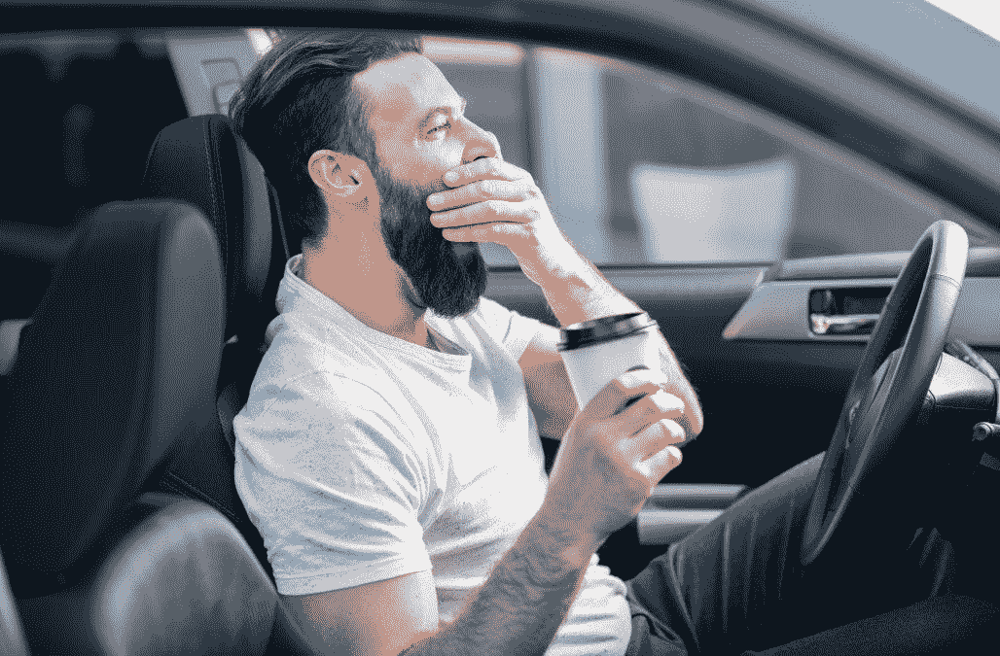

> “发短信是路上最危险、最令人担忧的分心之事”

国家公路交通安全管理局(NHTSA)

根据 NHTSA 的说法，以每小时 55 英里的速度开车时读短信会让一个人的视线离开路面，这相当于蒙着眼睛开车穿过一个足球场的时间。

# 什么是分心驾驶？

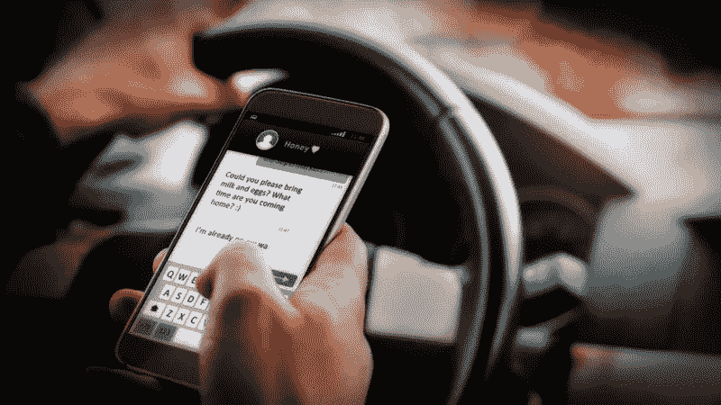

NHTSA 将分心驾驶定义为任何转移驾驶注意力的活动，包括打电话或发短信、吃东西和喝酒、与车内人员交谈、摆弄音响、娱乐或导航系统，以及任何转移安全驾驶注意力的活动。

除非你全神贯注于驾驶，否则你无法安全驾驶。你从事的任何非驾驶活动都有可能分散注意力，增加撞车的风险。

如今，由于新技术的帮助，汽车公司正在将系统与尖端技术相结合，以防止撞车事故并减少伤亡人数。

下一个视频展示了一个名为困倦检测系统的解决方案，这是一个新的汽车安全功能。看看这个:

试想一下，一个小型摄像头、物联网(IoT)和机器学习可以共同创造出一种能够影响安全驾驶的革命性产品。

> [DDI 编辑推荐 Google 云平台上 TensorFlow 的机器学习](http://go.datadriveninvestor.com/dmlb01/matf)

# 国营农场分心司机检测

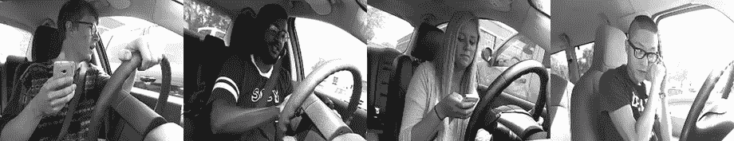

国营农场几年前通过 Kaggle 发起了一场比赛。这项比赛名为**“国营农场分心司机检测”**，给你一些司机图像，每张都是在一辆车里拍摄的，司机在车里做着什么(发短信、吃东西、打电话、化妆、把手伸到后面等等)。目标是预测每张照片中驾驶员行为的可能性。

数据集由 2D 仪表板摄像机图像组成，分为以下几类:

*   c0:安全驾驶
*   c1:发短信——对
*   c2:打电话——对
*   c3:发短信—左侧
*   c4:打电话——左侧
*   c5:操作收音机
*   c6:饮酒
*   c7:伸到后面
*   c8:发型和化妆
*   c9:与乘客交谈

训练和测试数据在驾驶员之间分开，使得一个驾驶员只能出现在训练或测试装置上。

利用我对微软 Azure 定制视觉免费试用的最后几天，我创建了一个模型来检测不同类型的分心司机。

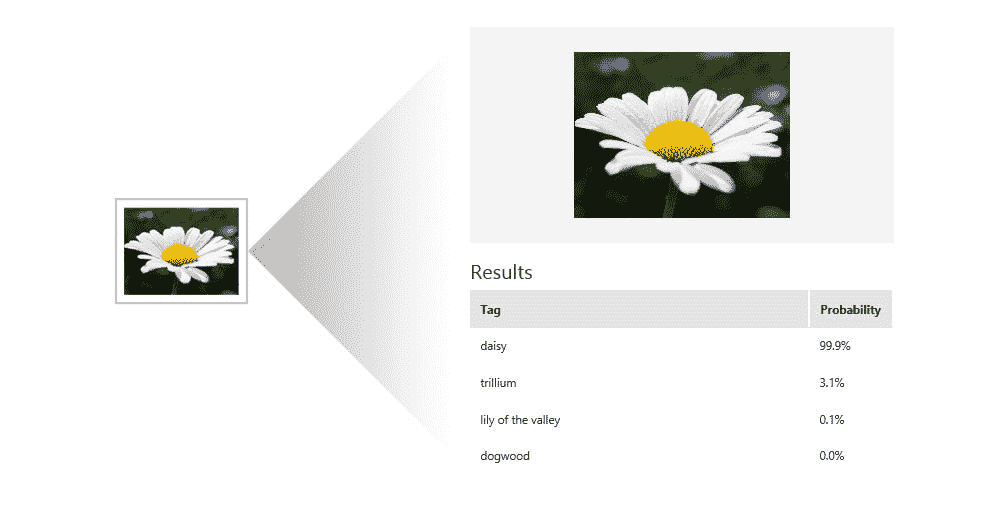

# 上传数据集

自定义视觉不允许我上传所有的图像到项目中，所以我决定每个类别使用 400 张图像。

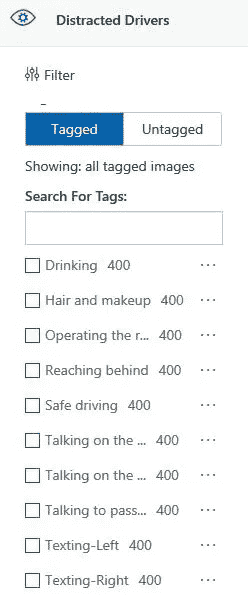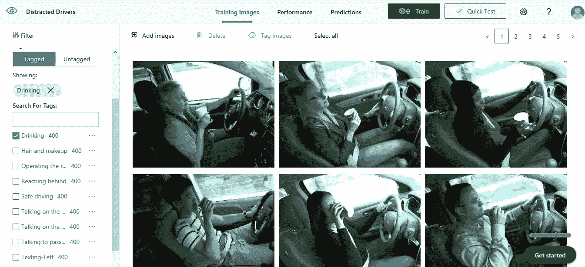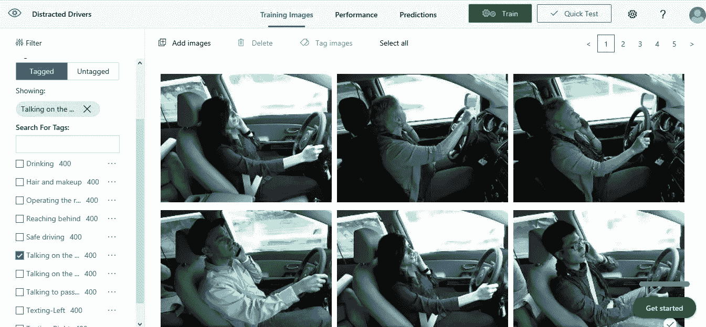

在添加图像并将其标记为不同类别后，就该训练模型了。您将看到这需要几秒钟，具体取决于数据集的大小。结果如下:

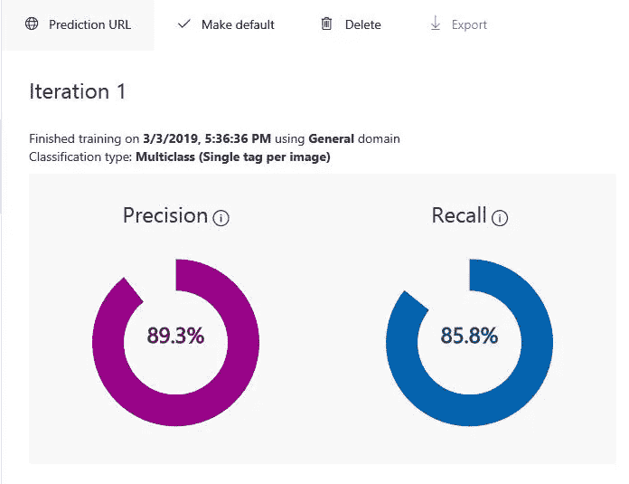

如果在精度和召回图下方，您可以看到每个标签的精度:

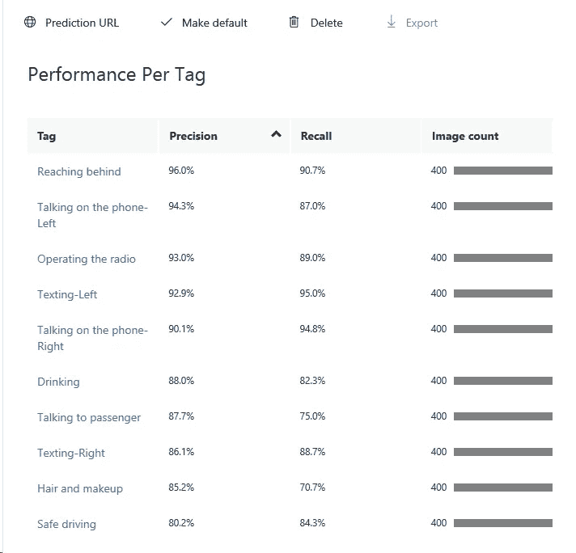

可以看到，**、**、**、**、**、【发短信-对】、**、**、【美发化妆】、**、**、【安全驾驶】、**都是数量较少的类别。

下图属于**“与乘客交谈”**类，但一旦通过模型测试，它就被归类为**“正确发短信”**。第二个猜测确实是**“和乘客说话”**。照片中，右手似乎拿着一部手机。这是计算机视觉模型中的一类问题，有一些类看起来非常相似，模型在做出预测时会遇到困难。

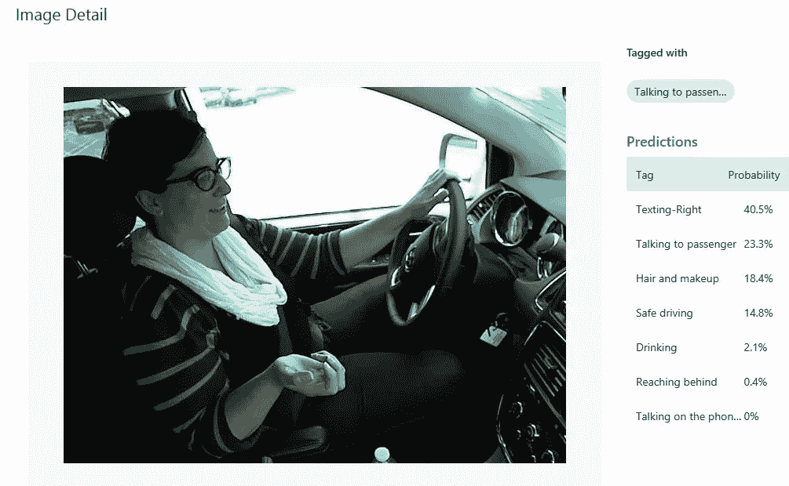

# 预言

检查下一个预测，我认为模型做得相当好！

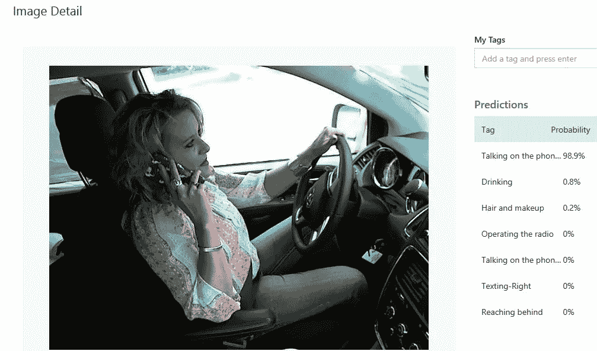

Talking on the phone-Right

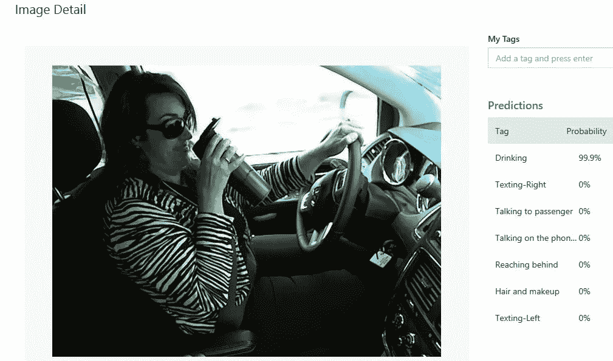

Drinking

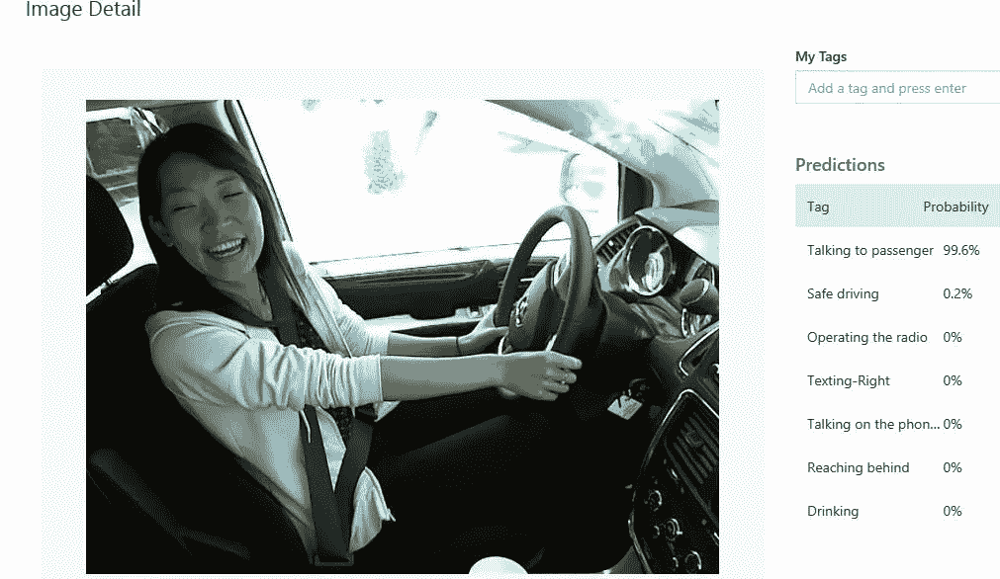

Talking to a passenger

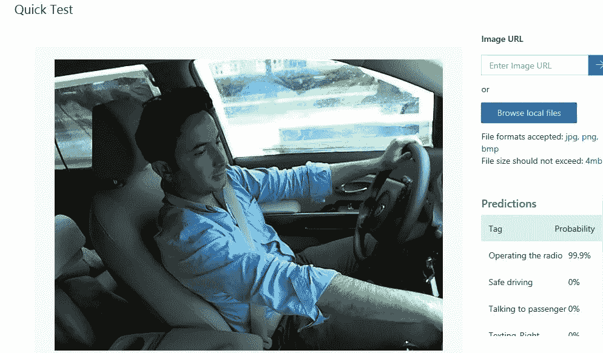

Operating the radio

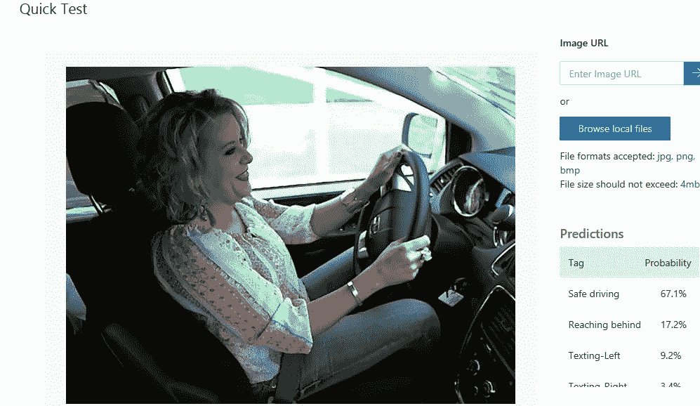

Safe Driving

# 实验:PyTorch 中的模型

现在，让我们尝试在 PyTorch 中创建我们的模型，并使用迁移学习来达到我们的目的:

# 实验详情:

**平台:**谷歌 Colab

**数据:**训练、验证和测试集

**批量:** 64

**数据扩充:**随机旋转(15 度)，随机调整裁剪(224)，随机水平翻转

**技巧:**迁移学习

**预训练模型:** Resnet-152

**判据:**交叉熵损失

**优化器:**亚当

**学习率:** .0001

**历元数:** 20

**准确率:** 82%

# 预言

准确率达到 82%。不过，我们还是可以得到一个更好的数字。

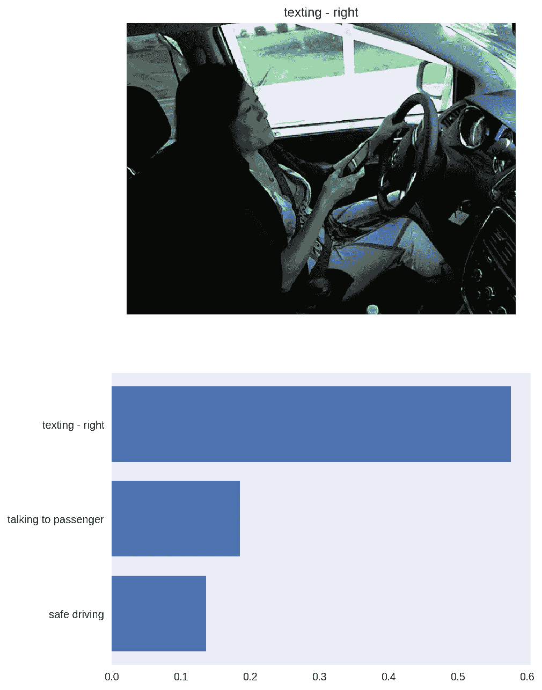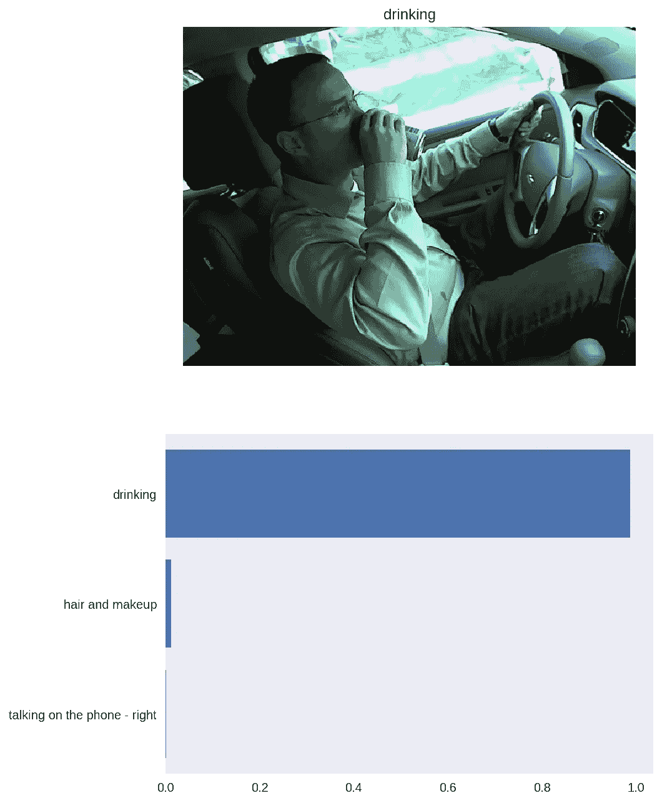

Drinking

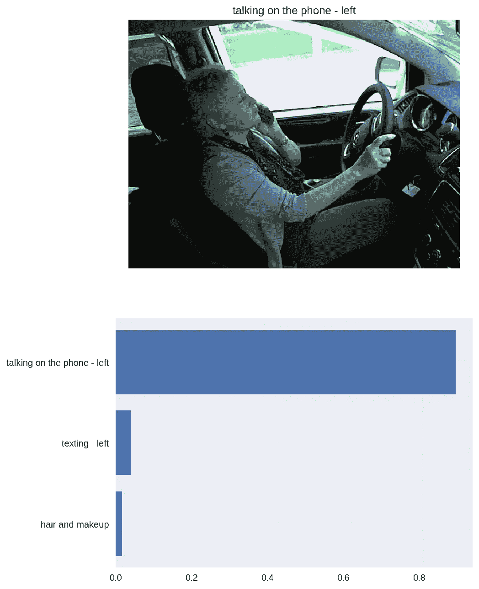

Talking on the phone-Left

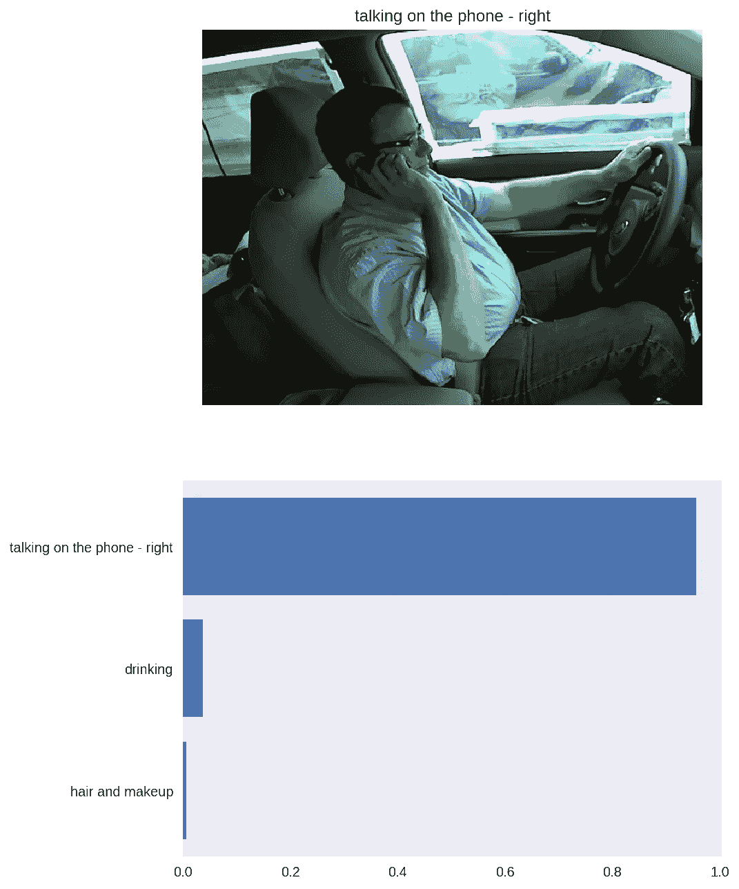

Talking on the phone-Right

# 未来的工作

*   使用 Raspberry Pi 实时检测分心的驾驶员
*   尝试通过调整模型来提高精确度
*   尝试不同的预训练模型

你可以在我的 GitHub 上查看完整的项目:

 [## 虚拟驾驶员/分心驾驶员检测

### 检测路上分心司机的 CNN 模型

github.com](https://github.com/viritaromero/Distracted-Driver-Detection) 

# 参考

**国营农场分心司机 Kaggle 比赛**

 [## 国营农场分心司机检测

### 计算机视觉能发现分心的司机吗？

www.kaggle.com](https://www.kaggle.com/c/state-farm-distracted-driver-detection) 

**实时分心驾驶员姿势分类**