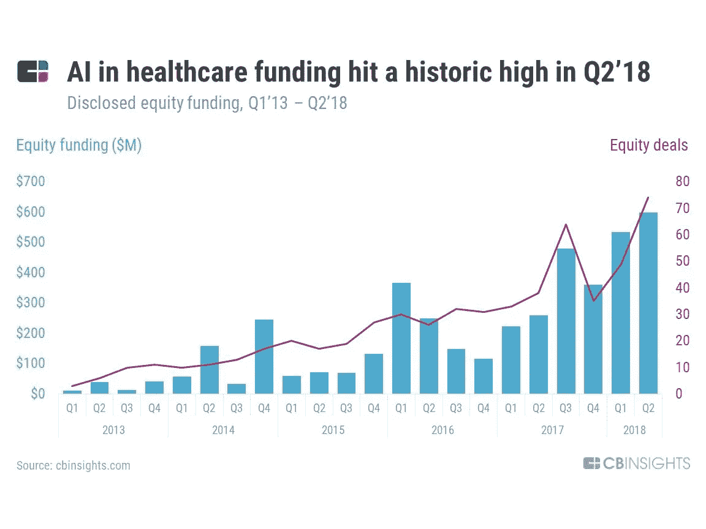
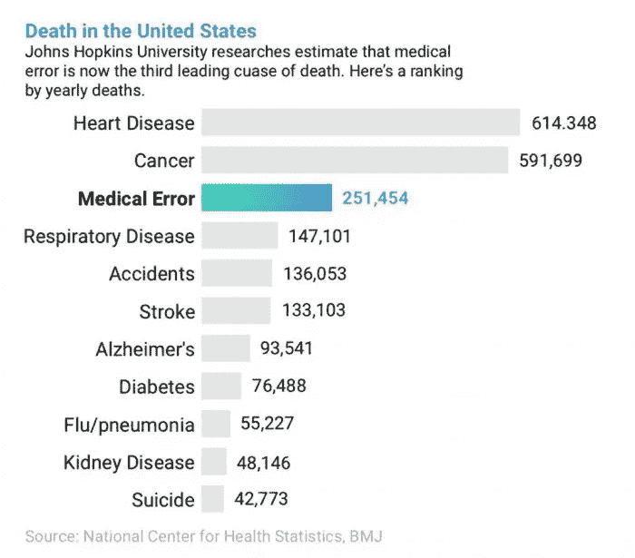
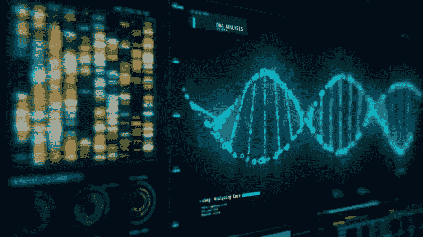

# 人工智能开发:医疗保健真的需要实施基于人工智能的解决方案吗？

> 原文：<https://medium.datadriveninvestor.com/ai-development-does-healthcare-really-need-implementation-of-ai-based-solutions-e0deb867cf1b?source=collection_archive---------31----------------------->

人工智能(AI)处于创新的前沿。从无人驾驶汽车到检测威胁生命的疾病，人工智能几乎在我们生活的每个部分都得到了利用。

人们经常争论 AI 给我们带来的好处更多还是问题更多，但很难否认它能解决一个人解决不了的问题。让我们以医疗保健行业为例，因为医疗保健资金的人工智能在 2018 年第二季度创下了历史新高。

几十年前，我们能想象到由于科技的发展，医学上正在发生的事情吗？我们不会考虑像最近中国生物智能系统在分析大脑图像时以 2:0 战胜人类这样的事件，因为机器人已经在医学上使用了 30 多年。但我们会思考人工智能可以解决我们今天生活中的挑战。

**“怎么这么快就这么晚了？”**

头号挑战是节省时间。在生活的各个领域，仍然有许多日常工作需要大量的人力，在医学领域，这种耗时的活动有时成本太高。

在医疗保健行业， [86%的错误](https://www.himss.org/jhim/archive/volume-17-number-1-2003)是管理上的，因此完全可以预防。大多数错误都是由错误的系统、流程和条件造成的，它们导致人们犯错误或未能防止错误。

例如，患者数据没有标准格式或中央存储库。当患者文件以不可读的 pdf 格式通过传真、电子邮件发送，或者以手写笔记的图像形式发送时，提取信息变得非常耗时，甚至是不可能的。**物体检测**是借助机器学习工程可以轻松解决的事情之一。

根据季节来管理患者流量是可能的:AI 模型可能会根据以前季节的信息来预测可能的游客数量，这使得调整时间表和在医务人员之间分配负担成为可能。

CactusSoft 的机器学习工程师 Nikita Krylov**警告说:“唯一的要求是，数据必须足够大，并且具有最高的质量，才能正确地分析它，并建立有效的人工智能模型。”。**

Nikita Krylov, Machine Learning engineer at CactusSoft

对象检测还可以用于识别医学图像中的癌症、肺炎和其他异常，充当牙医的助手(帮助牙齿分类或通过需要修复的牙齿的 X 射线检测)等等。

**医疗差错是美国第三大死亡原因**

第二个同样重要的问题是人为因素。如果把你的健康甚至生命托付给一个你从未谋面的医生都很困难，那对机器来说意味着什么呢？

在美国，每年大约有 251，454 人死于医疗事故，约翰·霍普金斯大学的研究人员[估计这是美国第三大死亡原因。然而，最近的数据表明，这些数字可能要高得多。](https://www.psnetwork.org/obstacles-to-patient-safety-2/)

在许多方面，我们现在已经在临床上有了非常简单的人工智能形式，例如，识别 EKG 中异常节律的工具。异常的心跳模式会触发警报，引起临床医生的注意。这是一台试图复制人类的计算机，人类理解这些数据并说，“这看起来不正常。可能是个问题。”

现在，随着越来越多的人使用可穿戴设备跟踪他们的睡眠模式或脉率，我们有能力分析更大、更复杂的数据源，如完整的电子健康记录，甚至可能是从日常生活中提取的数据。

去年，CactusSoft 的工程师开发了一种人工智能应用，它应该可以提高使用机器学习测量无创动脉血压(ABP)的准确性。

“我们使用了几个信号，ECG + PPG，找到了三种可能的 ABP 预测方法:脉搏波传导时间(ECG 和 PPG 峰之间的时间)；PPG 曲线分析；以及使用神经网络(具有原始数据)的端到端解决方案。据透露，由于第三种方法的近似值，机器学习只能用于前两种方法。 **Nikita Krylov** 说:“因此，我们开发了一个用于心率频谱分析的人工智能应用程序，它使用了来自微控制器或记录文件的数据。

这种基于人工智能的医疗保健解决方案的发展让我们可以认为，人工智能将为这个领域带来许多重要和至关重要的东西。这仅仅是开始。

据预测，到 2023 年，全球医疗 IT 市场的价值将达到惊人的 2231.6 亿美元(T7)，这部分是由人工智能和机器学习推动的。

**来源**:[https://cactussoft . biz/blog/2019/01/21/ai-development-in-health care/](https://cactussoft.biz/blog/2019/01/21/ai-development-in-healthcare/)