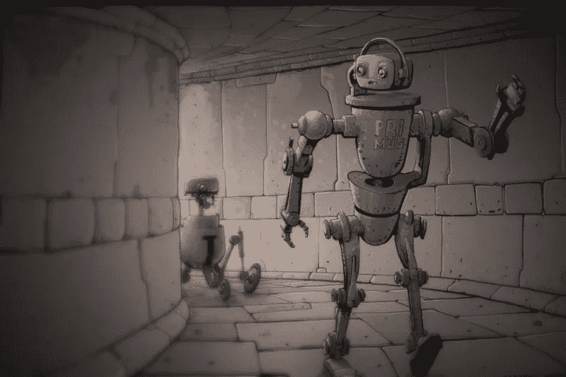

# 人工智能开发“脑细胞”在迷宫比赛中击败人类

> 原文：<https://medium.datadriveninvestor.com/ai-develops-brain-cells-to-beat-humans-in-race-through-maze-aee35e3da86a?source=collection_archive---------42----------------------->

## 使用人工智能解决导航问题的研究人员最终获得了一个系统，该系统开发了类似于帮助哺乳动物确定方向的虚拟脑细胞。



AI navigation take inspiration from animals

**10 秒内？**寻找最佳路径的人工神经网络现在可以学习模仿哺乳动物导航脑细胞的功能，帮助我们直观地选择捷径。([读理科](https://www.sparrho.com/pinboard/animals-help-ai-navigate-better/241636/?utm_source=briefing_20180518&utm_medium=email&utm_campaign=citation_%3C%3C%20Test%20First%20Name%20%3E%3E%3C%3C%20Test%20Last%20Name%20%3E%3E))

**什么，AI 现在有脑细胞了？**算是吧！但最酷的是，科学家们并不想创造脑细胞。他们向一个空白的“神经网络”输入信息，以模拟大脑中负责空间意识的部分。令他们惊讶的是，他们最终获得了一个模仿网格细胞的人工智能，网格细胞形成了一个想象的六边形网格，帮助哺乳动物确定自己的方向。([关于网格单元的更多信息](https://www.sparrho.com/item/place-cells-grid-cells-and-the-brains-spatial-representation-system/1adb5f/pinboard/241636/?utm_source=briefing_20180518&utm_medium=email&utm_campaign=citation_%3C%3C%20Test%20First%20Name%20%3E%3E%3C%3C%20Test%20Last%20Name%20%3E%3E))

**为什么这些虚拟网格细胞是大新闻？因为他们让系统在寻找捷径方面击败了人类和传统的人工智能。在这项研究中，两种算法都学会了穿过迷宫，通过一扇紧闭的门。当门后来被打开时，只有装有电网的人工智能认为这是一条捷径，让它节省了三分之二的路程。([阅读更多](https://www.nature.com/articles/d41586-018-04992-7?utm_source=briefing_20180518&utm_medium=email&utm_campaign=citation_%3C%3C%20Test%20First%20Name%20%3E%3E%3C%3C%20Test%20Last%20Name%20%3E%3E))**

**这个 AI 是怎么学会找捷径的？**奇怪的是，研究论文背后的人并不知道，但他们明白是什么起了作用——当人工智能表现良好时，他们会给它“奖励”,这是一种叫做强化学习的方法。这导致了人工智能发展出一种寻找捷径的卓越能力。([关于强化学习的更多信息](https://www.sparrho.com/item/unsupervised-predictive-memory-in-a-goal-directed-agent/1bc2b0e/pinboard/241636/?utm_source=briefing_20180518&utm_medium=email&utm_campaign=citation_%3C%3C%20Test%20First%20Name%20%3E%3E%3C%3C%20Test%20Last%20Name%20%3E%3E))

**太神奇了，所以 AI 现在也在向动物学习？可以这么说。其他研究人员成功地训练了一个神经网络，使其行为像狗一样，并发现它发展了视觉智能，能够识别食物、生物和障碍。这个程序还学习了狗会在什么表面上跑，它们会避开什么。将这些数据编码到系统中需要付出更多的努力。([阅读更多](https://www.sparrho.com/item/who-let-the-dogs-out-modeling-dog-behavior-from-visual-data/1bc5b81/pinboard/241636/?utm_source=briefing_20180518&utm_medium=email&utm_campaign=citation_%3C%3C%20Test%20First%20Name%20%3E%3E%3C%3C%20Test%20Last%20Name%20%3E%3E))**

**所有这些是如何推进这个领域的？**这些结果加强了神经科学和人工智能设计之间的联系。“虚拟”网格细胞证实了现有的关于真实世界的知识，并提出了绘制大脑功能的方法。他们还提出了如何开发人工智能导航的想法——例如让无人机在倒塌的建筑物中寻找幸存者。看来动物可以教机器人一两招！

```
**A little help from a friend, called Kelp**University of Washington researchers used a malamute dog, [Kelp](https://www.theverge.com/2018/4/14/17234570/artificial-intelligence-dogs-research-science-learning?utm_source=briefing_20180518&utm_medium=email&utm_campaign=citation_%3C%3C%20Test%20First%20Name%20%3E%3E%3C%3C%20Test%20Last%20Name%20%3E%3E), to gather canine data.They mounted a GoPro camera on his head and attached motion sensors to his body.With this kit, they’ve recorded Kelp going on about his daily routine and matched the motion data with the video.Having fed it into the neural network, the AI was able to predict the dog’s behaviour from visual clues.For example, if someone threw a stick, the virtual dog would run to fetch it. Read more about dogs' facinating behaviours that the algorithm had to ingest [here](https://www.jenreviews.com/dog-behavior-problems/).
```


Endre Szvetnik

这项研究由策划

Endre Szvetnik 是 Sparrho 的高级编辑。Endre 与 Sparrho Heroes 合作，策划、翻译科学研究并将其传播给更广泛的公众。在 Sparrho 上阅读这个故事。

(Psst，Endre 精选 [12 篇研究论文](https://www.sparrho.com/pinboard/animals-help-ai-navigate-better/241636/?utm_source=briefing_20180518&utm_medium=email&utm_campaign=paper_count_%3C%3C%20Test%20First%20Name%20%3E%3E%3C%3C%20Test%20Last%20Name%20%3E%3E)为您节省 801.9 分钟)