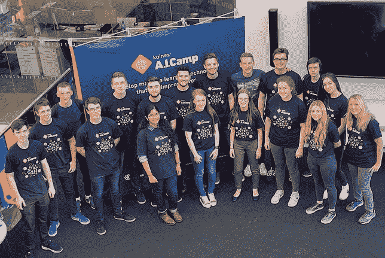
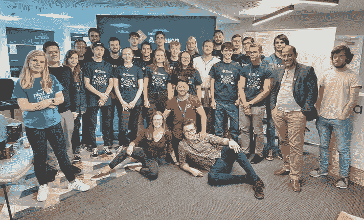
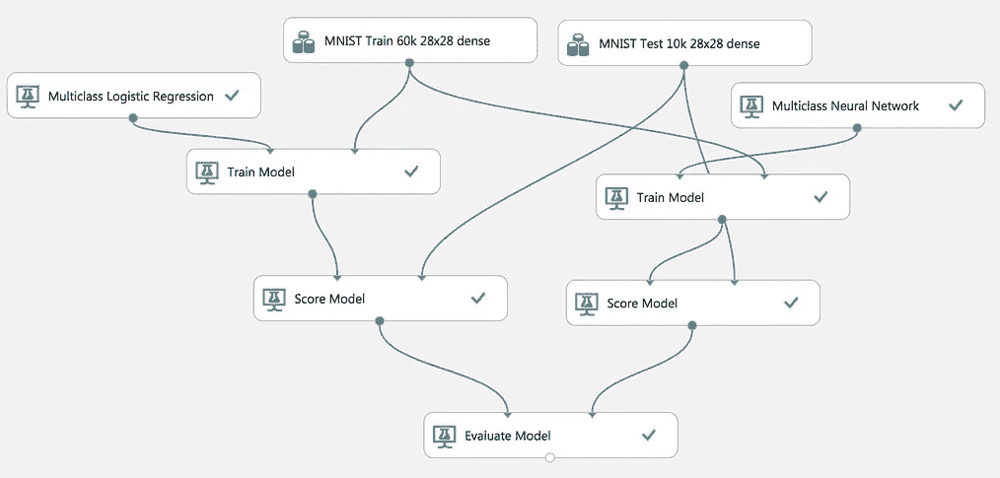
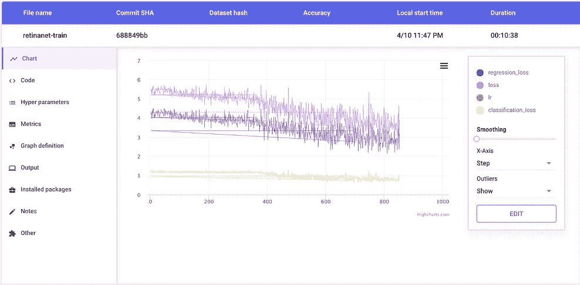
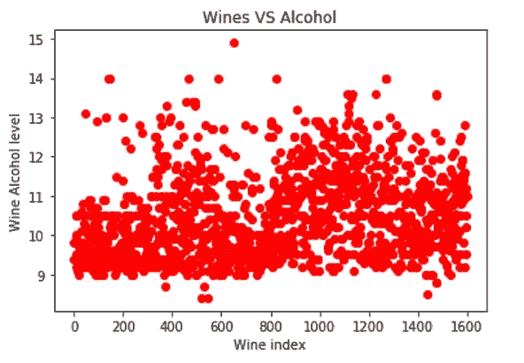
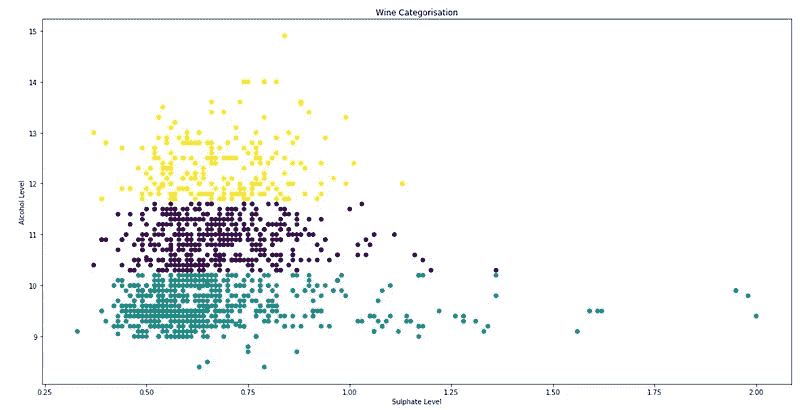
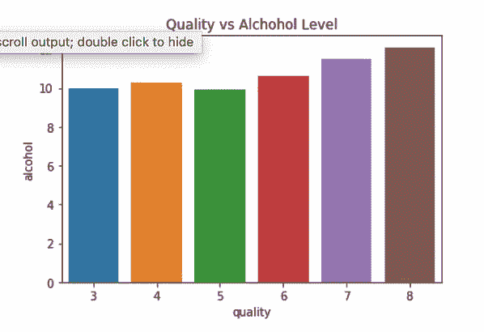

# 我一点也不知道

> 原文：<https://medium.datadriveninvestor.com/ai-dont-have-a-clue-8e8fe029d73a?source=collection_archive---------14----------------------->

> 除非你尝试去做一些超出你已经掌握的事情，否则你永远不会成长罗纳德·奥斯本。

人工智能和机器学习是最近的热门话题，似乎随着媒体对它的大肆宣传，你需要大量的资格和经验才能开始。在所有这些宣传之下，人工智能和机器学习使用与所有编程语言相同的基础知识，基本的数学和解决问题的技能。一旦你认识到它并不像看起来那么神秘和可怕，你将很快发现你有能力开始人工智能，即使你不知道从哪里开始。这就是这篇博客的由来。

*在我们进入如何开始人工智能的本质之前，这里有一个简单的介绍。*

我是 Kainos 应用创新部门的一名软件工程师，在过去的 8 周里，我一直是 AI Camp 的导师之一。我与人工智能的旅程始于去年贝尔法斯特的第一个人工智能营地，并在那里成长，今年我有机会计划和教授 2018 年的人工智能营地。

A.I.Camp 2017 Belfast (Left), A.I.Camp 2018 Birmingham (Middle), A.I.Camp 2018 Belfast (Right)

现在这个问题已经解决了，让我们来谈谈人工智能入门的一些技巧。这些是我和其他学生一起工作时发现的要点，在开始涉足人工智能和机器学习的广阔领域时，它们对我帮助最大。

# 从小处着手

当你开始考虑人工智能和机器学习时，一个误解是，在短时间的工作后，你会有一个高度准确的模型和一个完美的成品。作为初学者，最好从代码或项目的最小部分开始；我们都想编码一个完美的预测和模型，但这需要时间，所以任何微小的准确性好或坏都是朝着正确方向迈出的一步。在改进和调整代码以使其更好之前，首先要做的是了解为什么会得到这样的结果。

# 使用工具让你的生活更轻松

当你第一次谷歌“人工智能入门”时，一堆文章和博客充斥着屏幕，但它们通常是技术性的，或者它们只是用最少的解释向你扔代码。有一些很棒的初学者工具，比如**微软 Azure 机器学习工作室**平台，它是免费的，允许用户从预加载的数据集制作和训练模型；从这里开始是理解模型和数据集的一个很好的可视化方法，而不必接触代码。当你进入更多的编码和更复杂的模型时，有时你可能会调整一个模型而忘记给你最好结果的代码。像 **Comet ML** 这样的工具可以让你图形化地看到你所使用的模型性能和度量，这样你就可以回顾你所训练的模型，并在一个地方保存它们的记录。

Microsoft’s Machine Learning Studio (Left) & Comet ML (Right)

# 了解您的数据

拥有数据是能够开始机器学习的关键，但最重要的部分是你理解你拥有的数据。当你创建一个模型，在你的数据集上训练它，然后给它你想要预测的新数据，你想要理解它给你的输出，这来自于了解你的数据。使用 python 中的图形库(如 Seaborn 和 Matplotlib)有很好的方法来可视化数据，这些图形库允许创建各种类型的图形。了解数据集也很重要，这样才能知道将哪些数据放入模型中，从而可以将数据预处理成正确的格式。

MatplotLib and Seaborn Graphs

# 了解一些基础知识

机器学习是基于数学和模式识别的，所以从长远来看，理解这背后的一些基础知识会有所帮助。您将在代码中使用的模型将基于某种形式的代数，如多变量函数或线性代数，对此有一个基本的了解将有助于您理解您的模型。理解机器学习背后的理论概念也是很好的，即使是在更高的层面上，也有一些很好的文章和教程，如 medium series A 初学者 AI/ML 指南([https://medium . com/machine-learning-for-humans/why-machine-learning-matters-6164 fa f1 df 12](https://medium.com/machine-learning-for-humans/why-machine-learning-matters-6164faf1df12))和 SciKit learn 的这个很好的教程(【http://scikit-learn.org/stable/tutorial/basic/tutorial.html】)。

# 不要惊慌

我在人工智能和机器学习工作的经历中听到的最好的一点是，我们仍然处于研究领域，而不是工程领域。这意味着 AI 和机器学习每年仍在以巨大的步伐扩张和不断变化；因此，没有人指望你在短时间内掌握所有的知识。网上和教科书上有大量的信息，可能会让人不知所措，但只要记住迈出一小步，一次专注于理解一个领域，最终它们会全部到位。

# 准备好开始了吗？

人工智能和机器学习将对各种行业产生巨大影响，让人们能够跟上它的发展步伐将是其成功的关键。这篇博客的主要观点是向初学者展示，在这个领域开始和发展是可行的，你不需要有几个学位。从人工智能开始将是一个陡峭的学习曲线，但一旦它全部到位，它将值得花时间和精力。