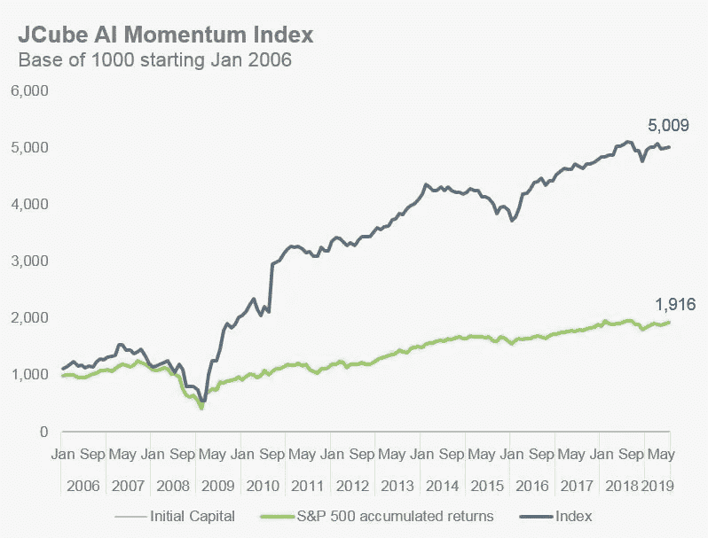

# 人工智能驱动的投资策略

> 原文：<https://medium.datadriveninvestor.com/ai-driven-investment-strategy-e24d99d09046?source=collection_archive---------6----------------------->

2017 年至 2018 年，使用人工智能推动知情投资决策的对冲基金数量增加了两倍。

然而，对大多数人来说，保持高于市场的回报极具挑战性，一些人工智能相关的 ETF 亏损近 16%。

DDI 的一个研究伙伴成功地在数据科学家、“宽客”和过时的金融理论家中脱颖而出。

JCube Capital Partners 认为，投资管理领域的人工智能研究不仅仅是关于算法和计算，在过去的 13 年里，每年的平均回报率超过 33%。高质量的见解主要来自指导数据转换和解释的深层领域研究。

JCube Momentum I 是 JCube 的第一个指数。

这是一个基于动量的策略，建立在 90 个已知具有回报可预测性的工程因素上，决策引擎使用多个机器学习模型组装而成。

以下是 JCube 系统的一些特征:

1.我们不是对历史数据应用基于人类的规则(例如排序)，而是对原始数据和工程数据训练多个机器学习模型(见脚注)，以最大化各种市场制度的回报。

2.然后，我们创建一个决策机，它被训练成一个概率加权的学习模型集合，这个集合最能代表当前的市场机制。

3.我们的模型和数据特征被选择，然后被结构化，以允许经济上的可解释性。

(脚注:包括但不限于随机森林、梯度增强、前馈神经网络、卷积神经网络和递归神经网络)

要了解更多关于 JCube 的数据驱动管理账户服务以及投资信号服务，请在 [**这里注册您的兴趣**](http://www.jcubefund.com/managedaccount/) 。有空缺时，他们的一名团队成员会为您提供更多信息。