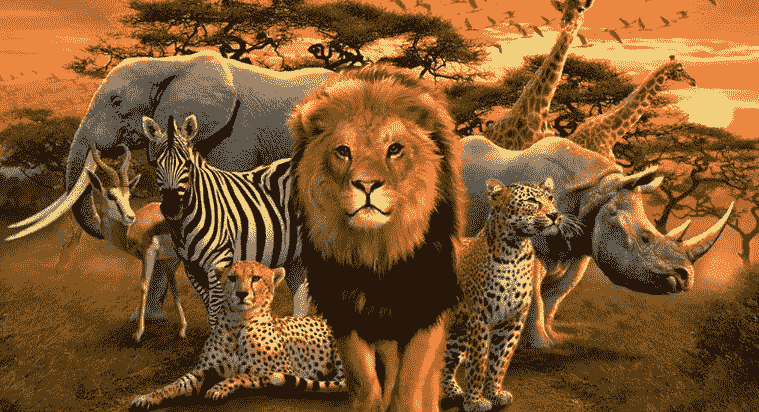
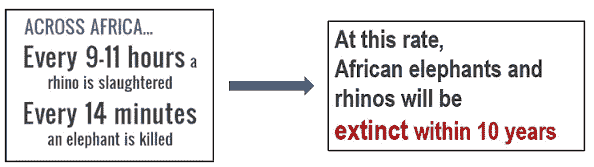
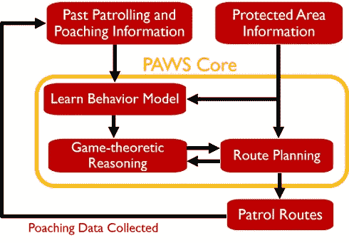
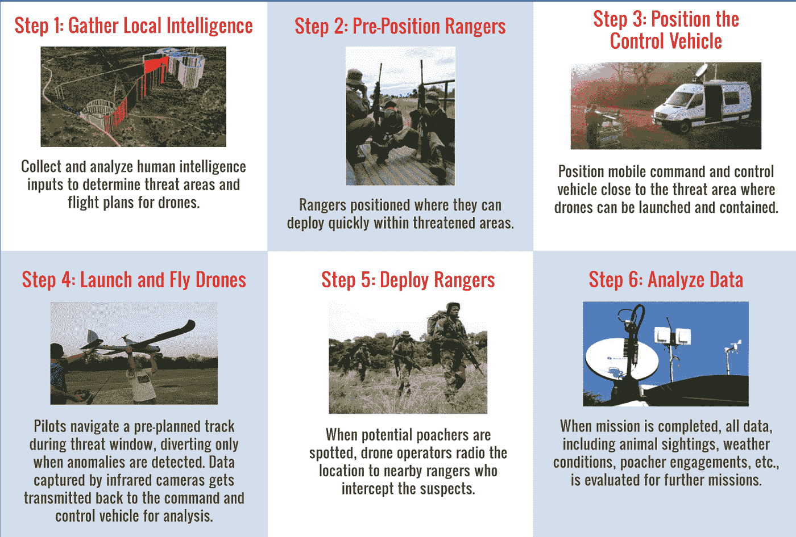
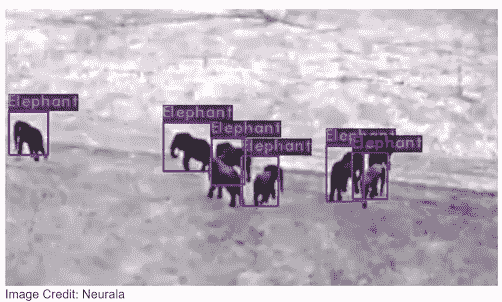
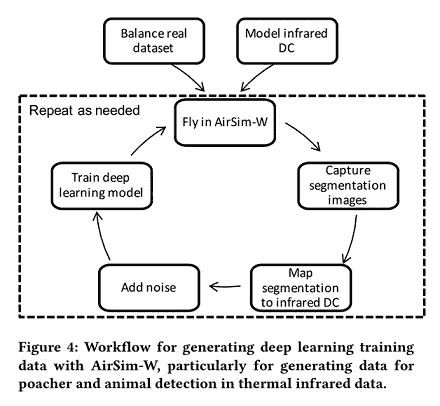
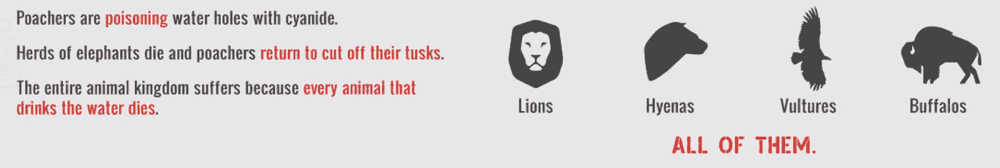

# 智能野生动物保护的人工智能、无人机和博弈论

> 原文：<https://medium.datadriveninvestor.com/ai-drones-and-game-theory-for-smart-wildlife-conservation-7c1a27adc151?source=collection_archive---------0----------------------->

# 背景

随着人口的持续增长，我们的行为正在将我们共享的地球上的生命推向大规模灭绝。人类活动导致物种灭绝**的速度是几个世纪**，而自然灭绝需要几百万年。**偷猎**在这场人类铅破坏中扮演了重要角色，一些物种的数量正急剧下降到临界/不可持续的水平。根据[林德伯格基金会](http://lindberghfoundation.org/):

为了打击偷猎和重建濒危物种的数量，一些国家建立了受保护的野生动物保护区和保护机构，负责保护这些大型保护区。然而，这些努力还不足以对抗偷猎。偷猎者已经走上高科技之路，他们利用夜视镜和全球定位系统捕杀大象和犀牛，以获取它们的象牙和角。因此，当巡逻被用作保护大量储备的主要方法时，有必要创造“智能”巡逻。

多亏了人工智能，现在有了一种以不同方式解决这个问题的方法。人工智能被用于在**“巡逻者对偷猎者”游戏**中获胜，并对偷猎采取更多的预防措施。

让我们来看两个以“聪明的方式”对付偷猎者的项目:

1.  **PAWS** (野生动物安全保护助手):基于**博弈论和决策树**的方法。
2.  **Air Shepherd** ，一个由林德伯格基金会创建的程序:一种基于**无人机、微软 Azure 和深度学习**(图像处理)的方法。

# 1.爪子

受保护物种生活的保留地和土地通常太大，无法一直巡逻，这给了偷猎者一个优势。

PAWS 使用机器学习**来预测偷猎者下一步将攻击哪里**，然后将这些预测与**博弈论推理相结合来设计巡逻路线**。关于当地的信息和收集的关于以前巡逻和偷猎活动的数据被用作其模型的输入，然后该模型计算随机巡逻策略(以一组巡逻路线及其概率的形式)。PAWS 然后向巡逻者建议从该策略中取样的巡逻路线。

他们的实验室实验和真实世界的现场测试都表明，使用**决策树集合是最好的 ML 方法**。他们认为决策树更优越，还因为它们是一种“白盒”解决方案——领域专家(例如，环保主义者、公园管理员)可以很容易地查看学习到的模型(这只是一组逻辑规则)，并确定决策树是否对偷猎者的行为做出合理的推断。

PAWS 有趣的一面是使用了**计算博弈论**。他们以“巡逻者对偷猎者”游戏的形式来看待这个问题。这有助于他们更好地理解偷猎者可能采取的策略，并通过人工智能模拟在游戏中保持领先。

对于对细节感兴趣的读者，PAWS 目前利用了以下论文中描述的 SUQR 行为模型:“[分析安全游戏中对手建模的有效性](http://teamcore.usc.edu/papers/2013/aaai2013_suqr.pdf)”。

# 2.空中牧羊人

Air Shepherd 是一个无人机项目，旨在帮助拯救非法偷猎和濒临灭绝的非洲象和犀牛。

“空中牧羊人”使用**无人侦察机**，它们在空中无声飞行，带有**红外传感器**，为反偷猎任务量身定制，在夜间定位偷猎者。这些无人机通过无线电向护林员实时报告它们的位置。通过这种方式，当发现潜在的偷猎者时，附近的护林员可以在为时已晚之前前来救援。你可能会问，**“为什么是晚上？**“流浪者拥有白昼。但是到了晚上，风水轮流转。几乎所有对大型动物的偷猎都发生在一夜之间。偷猎者收集关于猎物行踪的情报，然后——在夜幕的掩护下——行动捕杀。

循序渐进的过程:

空气牧羊人正在积极培育新技术，以领先于偷猎者。他们的一些投资领域包括:基于激光和雷达的传感器、大数据分析、先进的电池技术、神经网络和图像中的对象识别:

Air Shepherd 最近一直在测试一款名为 [SPOT](https://youtu.be/Ny0XGUPpawg) 的工具，用于使用**微软 Azure 在长波热红外无人机视频中自动检测偷猎者。**

下面是他们在 AirSim-W **—** 中的深度学习工作流程，这是一个专门为野生动物保护领域设计的模拟环境 **—** 看起来是这样的:

你可以在这篇文章中找到完整的细节: [AirSim-W:一个用无人机保护野生动物的模拟环境](https://www.cais.usc.edu/wp-content/uploads/2018/05/bondi_camera_ready_airsim-w.pdf)

用他们自己的话来说，这是一个成功故事的例子:“在一个每月有多达 19 头犀牛被杀的地区飞行，六个月来没有一例死亡。”

偷猎者还通过采用新的策略不断向这些组织抛出**新的挑战**。例如，从最新趋势来看:

# 结束注释

我们看到了两种不同的方法来解决偷猎问题。它们不是完美的解决方案，并且两种方案都有许多未解决的问题，例如，由于缺乏用于实时发送数据的连通性而导致的问题。不考虑缺点，帮助濒危物种是 AI 的一个伟大用例。我决定写这篇文章的主要原因是:

*   **意识到这些问题很重要——大自然并没有与我们分离。**
*   人工智能 **和微软 Azure** 非常有趣和有创意的用例

我将以这个想法结束这篇文章:

> ***“还有时间。时间意味着希望——但不是没有行动。”***

# 喜欢用直观的方式学习 AI/ML 概念？

*本文原载于我的* [***ML 博客***](https://towardsml.com/) *。在那里查看我的其他作品，并且跟随*不要错过最新的！

此外，请帮助我接触那些可以通过点击“鼓掌”按钮从中受益的读者。谢谢，学习愉快！🙃

P.S .我会定期在 [LinkedIn](https://www.linkedin.com/in/samiakhalid/) 上发布有趣的 AI 相关内容。如果你想从人工智能世界获得每周一次的简短课程，欢迎你跟我来！

# 参考资料和进一步阅读

[PAWS:野生动物安全保护助手](http://teamcore.usc.edu/people/Paws/index.html#overview)

[空气守护者](http://airshepherd.org/)

[无人机保护野生动物的机器学习](https://www.cais.usc.edu/projects/machine-learning-for-wildlife-conservation-with-uavs/)