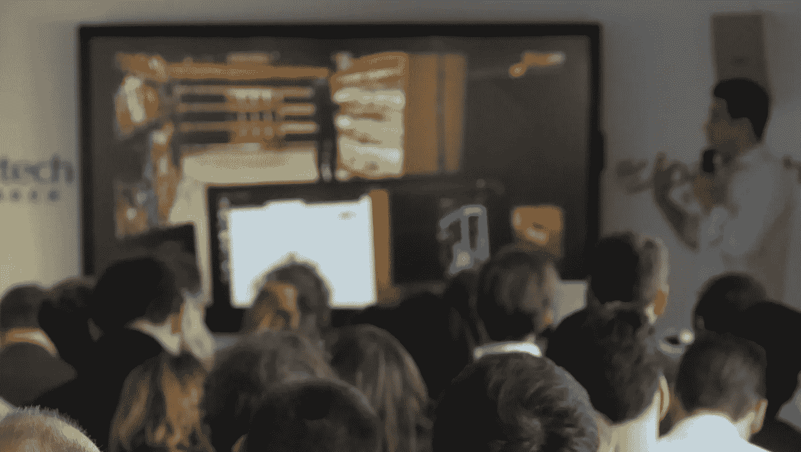
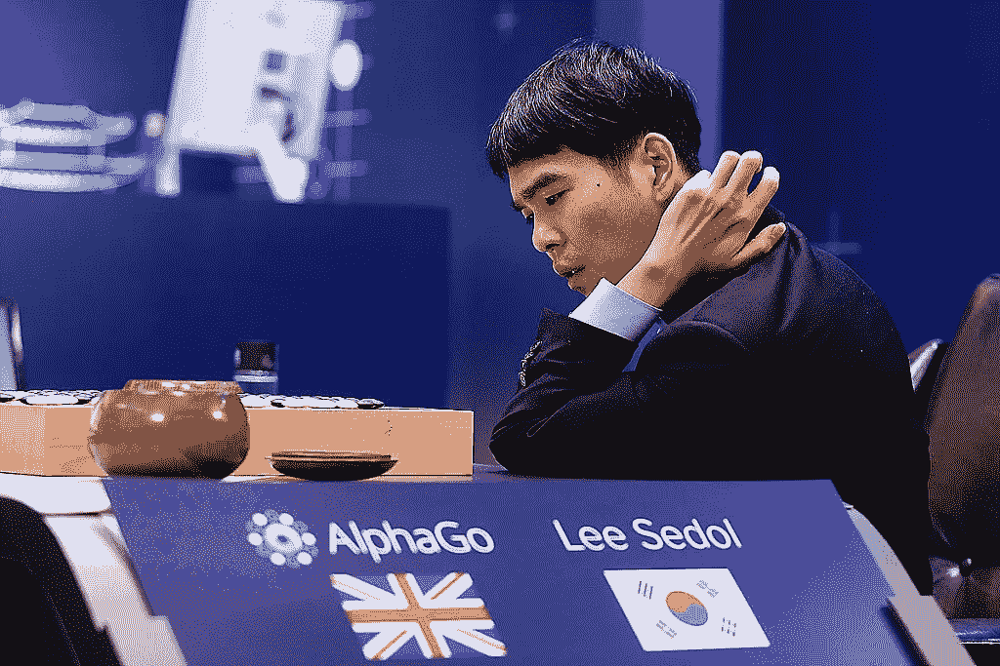
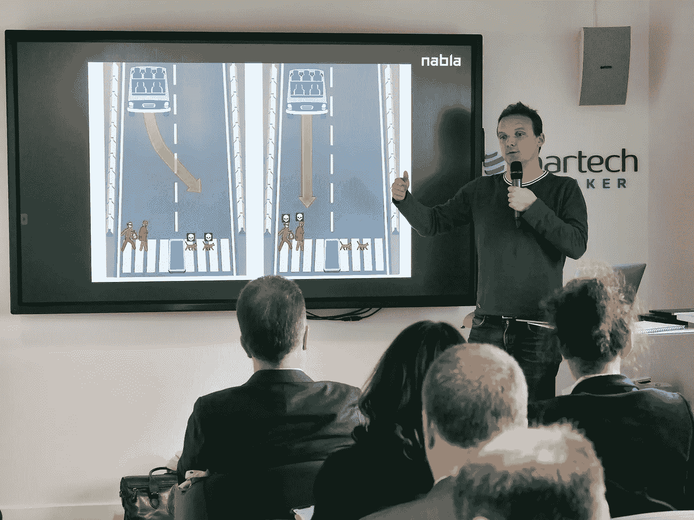
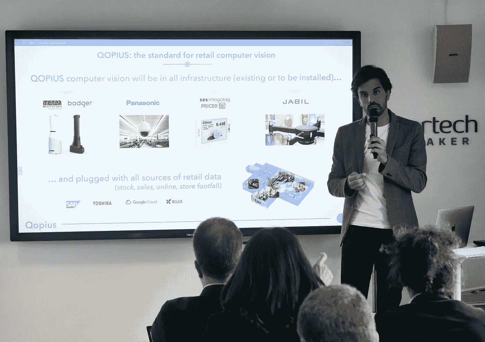
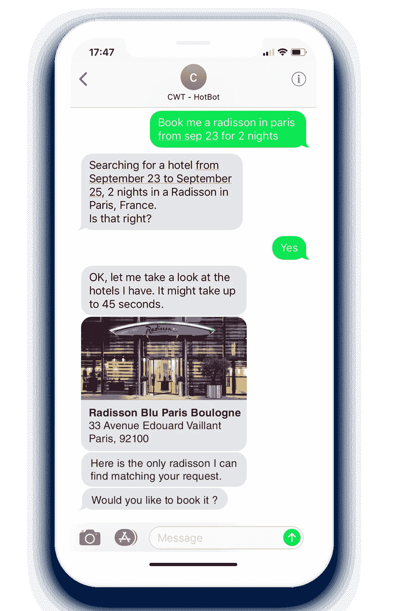
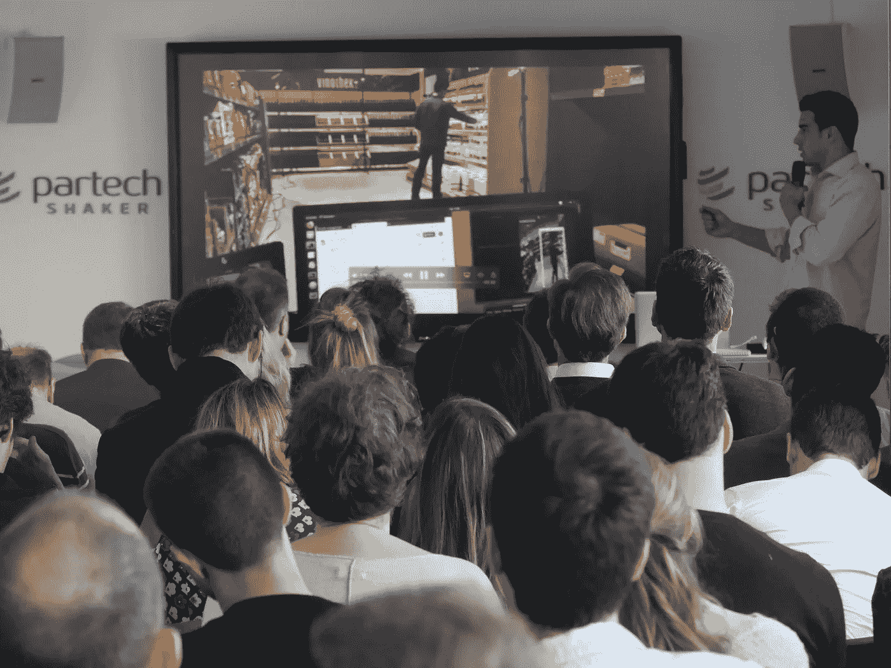
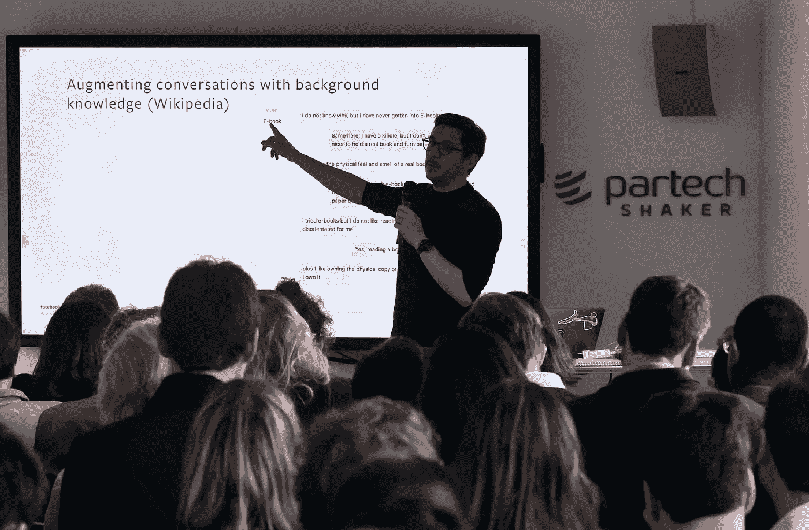

# 艾:幻想还是现实？

> 原文：<https://medium.datadriveninvestor.com/ai-fantasy-or-reality-4c060bef5f2d?source=collection_archive---------6----------------------->

2019 年 4 月 3 日， **Partech** 与 [**创新工厂**](http://www.innovationfcty.fr/) 合作举办了关于**人工智能**、*开放日#3:智能人工智能“Fantasmes vs réelles avancées”***。该活动在 Partech Shaker 举行，几位行业专家和令人兴奋的新创业公司分享了他们对人工智能未来的愿景，以及如何在各种不同的用例中实现它。**

**Partech 的联合管理合伙人 Philippe Colombel**介绍了此次活动。他首先强调了“*人工智能不是新的……而是在加速”*，它最早出现在 20 世纪 50 年代和 60 年代，但直到最近十年左右才真正受到关注。菲利普指出了推动人工智能新出现的两次革命。首先是*“我们计算能力的进化”*，比如云计算能力的增长。其次，数据的持续增长以及管理数据的必要性。他很快区分了人工智能和机器学习，这两个术语在今天越来越多地被错误地使用。他强调了机器学习只是人工智能的众多应用之一。

 [## 在创业之旅中，拥抱学习数据驱动的投资者

### 好像建立一个数百万美元的公司还不够困难，企业家必须额外照顾他们的…

www.datadriveninvestor.com](https://www.datadriveninvestor.com/2018/10/16/on-the-entrepreneurial-trek-embrace-the-learning/) 

然而，机器学习或深度学习是人工智能的一个方面，由于其在图像识别中的应用越来越多，它正在经历自己的*【革命】*。然而，菲利普真正强调的是强化学习的概念，这是一个机器能够在有人监督或无人监督的情况下自行学习的过程。“机器一点一点地学习复制我们每天理所当然的人类神经过程”，Philippe 在解释这个过程时分享道。他提到了谷歌 AlphaGo 的例子，它以击败 Lee Sedol 而闻名，但更重要的是，它的新版本现在能够在没有任何初始提供的数据的情况下学习。

AlphaGo vs Lee Sedol

菲利普说:“人工智能可以彻底改变任何行业”。他分享了 Partech 产品组合中的几个例子:人工智能在营销中的应用，Aiden.ai 正在建立第一个人工智能驱动的营销分析师，以及它在医疗保健中的使用，心脏病学正在使用计算机视觉提供更准确和可信的医疗成像。在人工智能的所有这些新应用中，菲利普强调了处理能力同步革命的必要性。随着人工智能的发展，旧的处理单元无法跟上运行新应用程序所需的能力。他最后评论了中国在这场人工智能革命中扮演的角色，指出中国人工智能领域的风险投资仅占全球所有初创公司的 9%，但占所有资本投资的 48%。更令人难以置信的是，中国的公共银行每年注入人工智能资金的金额:3500 亿美元，是美国和欧洲整个风险投资的 5 倍。

**[**nab la**](https://www.nabla.com/)的联合创始人兼首席执行官 Alexandre Lebrun 接下来分享了他对人工智能的看法，尤其是业内所有该做和不该做的事情。他首先向我们讲述了他职业生涯中从事的各种人工智能项目，从 2002 年创建聊天机器人和硅谷的人工智能平台，到在博览会领导人工智能研究，直到最近在脸书工作。在他的职业生涯中，他“在一个人工智能项目的所有过程和步骤中都犯过错误”。在他的指南《*应用人工智能:如何失败*》中，第一步过于依赖强人工智能。他追溯了人工智能的历史，特别是好莱坞对它的热爱以及经常出现的 clickbait 江湖骗子，最终得出结论，有这么多令人印象深刻的人工智能演示，它们似乎比实际技术先进得多。他失败的第二步和第三步触及了聊天机器人的诅咒和处理像 IT 项目这样的机器学习项目，这是你永远不应该做的，因为 IT 项目背后的过程不符合人工智能场景，并且已经过时。**

**亚历山大的第四步被恰如其分地称为“*被创新委员会*否决”。他强调了与创新团队相关的出现和问题，特别是创新团队往往与业务的运营方面脱节，导致在人工智能项目中达成共识时遇到困难。他确保人工智能项目失败的最后一步是忽略道德和偏见问题。他以自动驾驶为例，提出了一个场景，人工智能机器必须在碾过一只猫或行人之间做出选择。**

****

**Alexandre Lebrun, Co-Founder and CEO of Nabla**

**“伦理和偏见的争论在人工智能行业如此普遍”，亚历山大总结道。他强调了人工智能也可以产生类似于人类的偏见，并以亚马逊人工智能招聘软件为例，该软件根据从以男性为主的著名科技行业获得的数据，自然地产生了推荐男性候选人的偏好。亚历山大通过提到人工智能在消除人类偏见方面的潜在用途，结束了偏见的话题。他分享了一项有趣的研究，该研究强调了人类偏见的本质，即法官最喜欢的美国足球队的失败会影响他判决的长度和严格程度。**

**接下来发言的是**罗伊·穆萨，** [**Qopius**](https://qopius.com/) 的联合创始人兼首席执行官。Roy 强调了在 Quopius，他们是如何“*为实体零售商*”提供信息和数据“*像易贝和亚马逊这样的数字原生零售商天生就有*”来为他们创造公平的竞争环境。他们正在将人工智能应用到零售商店的价值链中，以优化他们的运营。Roy 向我们展示了他们如何捕捉零售货架及其产品的镜头，然后通过他们的人工智能云解决方案进行分析。他们能够“*提取从产品图形到价格和促销的一切信息*，从而“*数字化零售体验*”。Roy 解释说，之所以需要这样做，是因为“*零售商知道库存何时到达商店，何时售出，但中间的流程不清楚*”，这是一个执行不力的例子，导致零售商损失了 12%的商店收入。**

****

**Roy Moussa, Co-Founder and CEO of Qopius**

**利用他们实时收集的额外数据点，他们可以“*提高收入和生产率*”，因为他们现在知道何时推出产品，使用什么价格，甚至促销的最佳类型和时间。罗伊总结道:“他们知道如何设计和维护一个有利可图的货架”。他接着强调了品牌营销优化的附加值以及 CpG 和制造商可用的一般数据。Roy 最后强调了他们与欧洲顶级零售商正在进行的合作，以帮助在零售业普及人工智能的使用。**

****Guillaume Laporte，** [**Destygo**](https://www.destygo.com/) 的联合创始人兼首席执行官，接下来分享了他和他的团队如何实施对话式人工智能来转变现有的客户服务理念。该公司是 Partech 投资组合中的一员，利用人工智能“*扩大客户和公司之间的个人关系*”他们基于人工智能的对话引擎在各种不同的渠道上运行，如应用程序和网站等。并允许企业提供“带有聊天和语音对话的*客户体验 2.0*”。Guillaume 在解释他们与现有应用程序和零售商的合作时，强调了“*帮助是新销售*如何为消费者提供最全面的聊天体验。他以他们在巴黎奥利机场的新出现为例，提供机场商店的传单信息、登机时间和登机口信息等。都是通过信使。**

**Guillaume 继续强调 Destygo 如何“*为企业构建一个包含长期产品的平台*”。他们的对话式人工智能引擎是所有业务团队的工具:它不需要编码技能，允许每天都有新功能，产品可以在不到 12 周的时间内上线。Guillaume 在指出其平台的简单性和易用性时表示:“它允许从营销团队到开发人员的不同团队一起工作。他们还实现了强化学习，以帮助他们的聊天机器人从自己的错误中学习，“利用来自用户的被动信号”。因此，他们能够"*在没有任何监督的情况下纠正 4 个错误中的 3 个*"Guillaume 和其他两位联合创始人组成了一个超过 40 人的令人印象深刻的团队，他们在一年内将公司的收入翻了两番。**

****

**Destygo chatbot**

****[**ri minder**](https://www.riminder.net/)**的创始人兼首席执行官穆希丁·塞韦(Mouhidine Seive)在演讲开始时向我们讲述了他的公司关于人工智能的使用和实施的愿景。他强调了在 Riminider，他们如何建立了第一个也是最先进的人工智能招聘人员助理，该助理“*自动化人才评估*”。更详细地说，Mouhidine 分享了他们如何建立一个三步人工智能过滤过程，首先使用解析，然后丰富，最后评分。他们的 CVbot 从简历和视频面试中收集数据，从 Linkedin 等各种来源收集数据。，并通过他们的人工智能软件运行它，该软件使用深度学习来提取关键词和经验，以建立对候选人的清晰概述。"*他们的公共处理和计算系统*"也让用户有机会定制他们自己的过滤器，为企业提供个性化服务，帮助他们找到他们需要的特定类型的人才。******

*******“没有其他简历解析器可以提取出 Riminder 可以提取的相同信息”*，Mouhidine 自豪地说道，同时强调了他们的人工智能技术如何分解简历的每个部分，以对简历的各个方面进行分类和标记，从教育到兴趣。他向我们展示了如何区分在某个地方工作和在某个地方学习的例子，分析了一位既在斯坦福大学学习又在那里工作的候选人的简历。他最后强调了 Partech 使用 Riminder 为自己和投资组合的初创公司寻找最佳人才。******

******接下来是**benot Koenig，**[**Veesion**](https://veesion.io/en/home/)**，**的联合创始人，他解释了他的团队如何使用人工智能来利用安全资产。他强调了在 Veesion，他们如何在图像识别中使用机器学习来跟踪入店行窃和盗窃。他们开发了一种软件，可以“使用推理来分析实时图像，从而发现有效的犯罪行为”。他们的四个部分的过程分析，检测犯罪，决定如何行动，并将其反馈给用户，一旦盗窃发生就提醒他们。人工智能技术可以识别和分析行为和手势，并区分什么是正常的。他们平台的用户可以实时看到指示盗窃可能性的实时百分比。******

********

****Benoît Koenig, Co-Founder of Veesion****

****Benoî用他公司的平台作为例子，说明人工智能和人类可以如何合作，优化社会的几乎每个方面，特别是安全。他强调了人工智能的这种使用可以带来的关键影响:财务影响，消除现有和徒劳的安全解决方案的成本以及因商店盗窃而损失的金钱。通过主动学习的含义，Benoî分享了神经网络如何在实施后永不停止改进，逐渐从新的商店盗窃数据中学习以改善其分析。他最后指出，该产品最近与 Aldi 进行了模拟，有 20 个模拟器，超过 100 个小时的盗窃和 4 个视角来优化性能。随着实时跟踪手势的技术越来越先进，他们的安全解决方案有可能彻底改变行业。****

****[**Joko**](https://www.hellojoko.com/) **，**的联合创始人兼首席技术官 Alex Hollocou 分享了他们如何利用人工智能创造完美的用户体验。在 Joko，他们开发了一个直接连接到用户信用卡的忠诚度程序应用。这种联系可以让你和他们的合作伙伴赚取积分，只需正常使用你的卡。亚历克斯指出，欧盟的新法规正迫使银行开放他们的数据，允许消费者与 Joko 等第三方共享这些数据。“Joko 利用这一开放数据机会为客户提供他们期望的体验”，Alex 在评论他们如何转变卡奖励计划之前强调道。从银行接收相同的数据，他们使用人工智能识别商家，人工智能扫描内部和外部数据库、地理位置数据和交易历史，同时还从客户反馈中学习。有了所有这些消费者数据，他们可以构建一个*“带节点的交易图*”，然后他们通过计算两个节点之间的距离，知道向客户提供的最佳交易。****

****与 web 图(如 Google 的 PageRank)不同，Joko 的图只包括两种类型的节点，即客户端和商家，并且任何节点之间都可以有许多链接。他们的交易图的这一动态方面意味着他们可以向用户提供最准确和定制的促销优惠。Alex 强调了优惠的工作原理，解释说 Joko 首先使用自然语言处理识别客户银行的交易，然后向商家收费，并奖励客户使用优惠。他们将人工智能无缝集成到卡奖励计划中，展示了 Joko 颠覆已经拥挤的忠诚度奖励市场的不可思议的潜力。****

****最后一个走上舞台的创业公司是 [**Quantcube 科技**](http://www.q3-technology.com/) 。 **Thanh-Long Huynh** ，他们的**首席执行官**，分享了他们的公司如何设法成为“*宏观经济和金融预测分析人工智能的全球领导者”。*这家初创公司成立于 2013 年，利用大数据分析的经济学智能。Thanh-Long 强调了如何通过从他们的 Quantcube 数据湖中提取数据，他们能够“*使用元数据来预测未来*”。他解释说:“*对于大数据来说，预测分析的粒度达到了不可思议的水平*”。****

****凭借其人工智能利用大数据并提供有价值和有洞察力的分析，他们“*在数据驱动的世界中赢得了比赛”。* Thanh-Long 强调了几个使用案例，从全球宏智能数据开始。他举了一个例子，说明他们如何能够在投票前一个月预测到英国退出欧盟，并在投票前一周预测到唐纳德·特朗普当选美国总统。此外，Thanh-Long 还谈到使用他们的就业智能数据平台，更具体地从就业市场预测部门经济增长。他们的人工智能软件使用一个“*职位空缺汇总来预测各个行业的经济活动*”。他还谈到了其在制造业以及许多其他领域的航运智能数据、能源智能数据和现金权益智能数据中的实施。Thanh-Long 最后强调了当前大数据世界对人工智能的需求，指出“*新的机会出现在新的数据领域*”。****

******[**AI 研究负责人 Antoine Bordes 在脸书**](https://research.fb.com/category/facebook-ai-research/)**最后分享了他对 AI 的思考。脸书大学拥有超过 250 名科学家、工程师、学生和管理人员，正在领导基础开放和合作研究，以实现人工智能在社会各个方面的应用。“我们一直致力于构建最好、最先进的对话式人工智能平台和软件”，Antoine 分享道，他展示了它们是如何“*让代理人能够进行适当的对话*”。Antoine 继续说道:“企业在对话式人工智能上投入了越来越多的资金，因为这确实是客户服务的未来。他分享了在脸书，他们是如何培养有同理心的、聪明的、具体化的(感知和作用于他们的环境)和多语言的代理人的。使用机器学习和强化学习，这些端到端对话系统几乎可以完全从数据中训练出来。********

******安托万强调了他们是如何着手“用传记个性化对话系统”，给对话式人工智能带来“人的因素”。通过为代理添加传记，他们可以用更有趣、更自然的对话来改善客户体验。他们创造了具有个性特征的代理人，这些个性特征可以开玩笑，传达不同的语气，从傲慢到魅力，并随着年龄而区分，例如，在交谈中使用表情符号。安托万分享了他对“*用背景知识增加谈话内容”、*的特别兴奋，例如，使用维基百科，使一个代理人变得有知识和聪明。******

************

******Antoine Bordes, Director of AI research at Facebook******

******然而，他指出，要让代理在对话中无缝地使用这些知识，还有很长的路要走。Antoine 还强调了所有对话式人工智能开发者的共同目标，即创造具有常识的智能体。他提出“*直觉物理学可能是走向常识*的第一步”，以及它在对话式人工智能代理中的存在。******

******安托万最后强调了随着人工智能变得越来越先进和复杂，信任、安全和透明的必要性。******

***************

******有什么意见吗？请在下面告诉我们，或者在 Twitter 上加入对话，了解最新消息。******