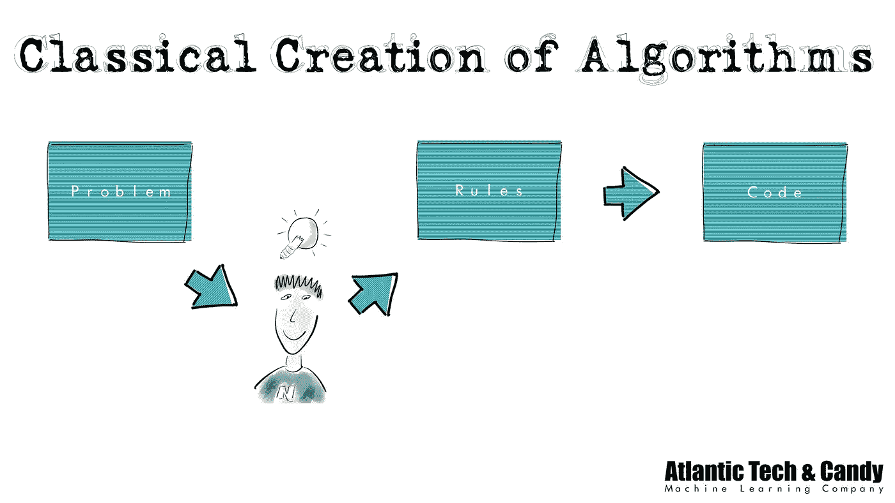
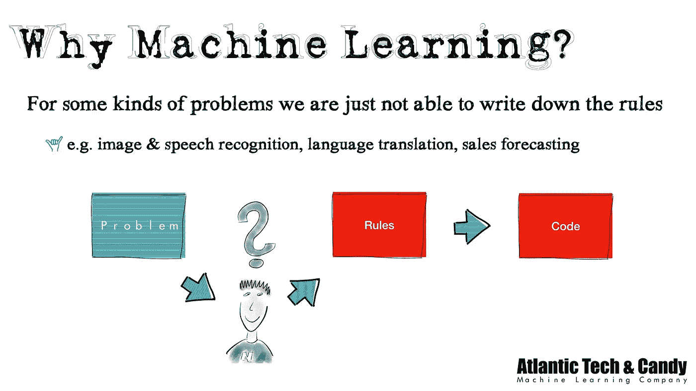

# 面向所有人的人工智能:为什么我们需要机器学习

> 原文：<https://medium.datadriveninvestor.com/ai-for-everyone-why-we-need-machine-learning-81de7b6b7f64?source=collection_archive---------2----------------------->

We are not able to write down the “concept” of an elephant

当向公司或政治家咨询人工智能时，我经常会收到一些听起来很简单的问题，如“*为什么我们需要像机器学习这样的东西？”*。但让我们面对现实:我们大多数人工智能专家都不太擅长向普通大众解释这个话题。

随着人工智能对工业、经济和社会的影响越来越大，我们必须在这方面做得更好。我们必须学会如何以可理解的方式传达基本思想。因为大多数重要的决定是由非专家做出的:政治家和经理。

我们对*明智的*决策感兴趣。

## 没有数学，没有代码

这个挑战伴随着一个基本的限制:我们不能在解释中使用数学或代码。大多数商业人士、政策制定者和普通大众都不应该写一行代码或掌握所需的数学知识。请记住，我们的目标不是让他们成为专家，而是让他们了解基本原则。

所以，我们来试试。当我说*尝试的时候，我是认真的。我们必须尝试和实验。有些方法可行，有些可能会失败。但对我们这些专家来说，有一点是肯定的:教学是学习的最佳来源之一。走这条路会加深我们对这件事的理解。*

> [旁注:当谈到机器学习时，我基本上指的是深度学习——导致当前人工智能炒作的方法。但我不想从解释机器和深度学习的区别开始，因为这与大多数人无关。]

## 为什么我们需要像机器学习这样的东西？

这个问题的简单答案是:我们想用计算机来自动化某些过程。但这又引出了下一个问题。在过去的 50 年里，我们使用计算机实现了自动化流程。那么，有什么区别呢？为什么传统的计算机编程方式是不够的？

## 什么是算法？

电脑上运行的一切都是所谓的算法。让我们看看算法的核心定义:

> 在数学和计算机科学中，算法是如何解决一类问题的明确说明(维基百科)

首先要注意的是，这个定义并不局限于代码或特定的编程语言。算法的一个基本特征是它可以用明文写下来。

烹饪食谱可以被认为是一种算法(只要它不包含像 *circa* 或*盐来品尝*这种需要个人判断的指令)。它是一系列遵循特定规则的步骤。

# 经典的编程方式

对计算机编程的经典方式依赖于对算法的这种一般理解。它适用于应用程序、游戏、会计软件或在线商店，仅举几例。

开发人员或产品经理分析问题并找出规则。在开发团队中，这些规则被写在不同种类的人类可读文档中，如规范、backlog 等。

这种规则的例子有:“如果你销售一件产品，你必须增加 x%的增值税”，或者“在数据库表 xyz 中存储库存产品的数量。”

然后，开发人员将这些规则翻译成可以在计算机上运行的编程代码。

无论是正式写下来还是仅仅在头脑中执行:识别这些规则是这个过程中的关键步骤。它允许交流、解释和分析预期的行为。

# 经典方法失败的地方

这里的要点是:有一系列的问题，我们无法识别和明确地写下这些规则。这涉及到图像和语音识别、自然语言处理或识别数据中的复杂模式等问题。

我们能够用眼睛识别物体，与他人交谈，或理解书面文字。但是我们不能写下来，我们的大脑是如何做到的，它遵循什么规则来完成这个魔术。

尽管我们知道一些规则，但我们似乎面临着一个基本的限制。自然太复杂，有太多的变化、微妙和细微差别，无法用一组有限的(明确的)规则来涵盖它。

你自己也很容易搞清楚。试着定义一只大象的概念，它将涵盖上面拼贴画中所有不同的图像。它们都有不同的形状和颜色。尺寸、环境或材料。有些是真的，有些是雕像，有些是画。

尽管如此，我们还是可以识别它们，即使你只能看到一只大象的眼睛。

所以，这就是*为什么*我们在这种情况下需要不同的方法。我们不能明确地写下规则和概念*。*

## *什么是机器学习？*

*当然，你想知道，什么是机器学习。但是这种方法的细节超出了这篇博文的范围，因为它只处理了*为什么*我们需要其他东西的问题。*

*只是给你一个想法。机器学习基本上是一种数学方法，其中系统分析数据(图像、声音文件、文本等)。)对于某些模式。诀窍在于，系统会自己找出要寻找的模式(通常是通过分析成千上万个例子)。系统*隐含地*学习规则(例如识别大象)，我们正努力明确地写下这些规则*。**

## *就这些吗？*

*问题的答案"*为什么我们需要像机器学习这样的东西？*“可能看起来有点王道。但这已经暗示了很多。*

*例如，你现在可以决定，对于你的问题，是需要经典的还是机器学习的方法。*

*如果你能够识别并写下你的任务的规则，你最好使用传统的方法。(科学中也有例外，我们知道规则，但经典方法计算量太大)。*

*机器学习的使用通常仅限于经典方法失败的非常特定的任务集。这些任务通常嵌入在许多经典编码的步骤中。*

*如果有人想卖给你一个标签为“*AI”*的系统，让他们向你解释机器学习具体用在哪里(以及为什么)。很多经典软件只是换了个名字叫“AI”。*

*你现在可以发现它了。*

## *还有什么？*

*如果你想了解更多我对人工智能/机器学习的看法，可以考虑关注我的 [YouTube 频道](https://www.youtube.com/channel/UC8BWSP-f1RcGxJ8vuesgOiA)。*