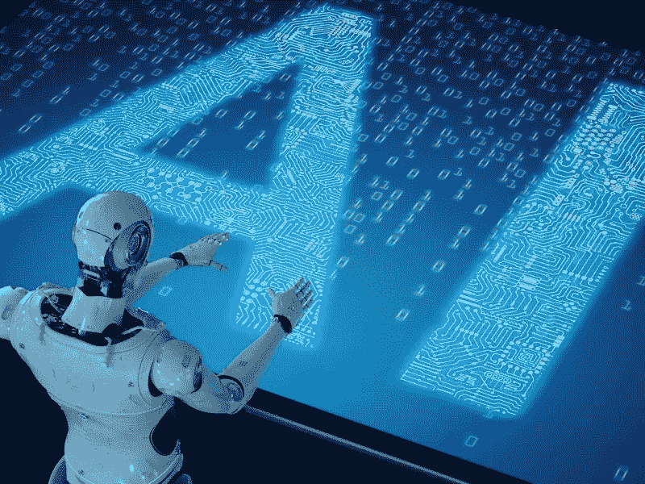

# 用于医疗保健现代化和康复的人工智能

> 原文：<https://medium.datadriveninvestor.com/ai-for-modernization-and-rehabilitation-in-healthcare-d9cba11e079?source=collection_archive---------4----------------------->

> “最终，人工智能将实现所有这些服务的非物质化、非货币化和民主化，极大地改善 80 亿人的生活质量，推动我们更接近一个富足的世界。” *—彼得·迪亚曼蒂斯*

**人工智能是关于现代化的**，通过技术的智能应用，采用现有的工作方式并重新思考它们。一个很好的例子是人工智能被用来重新思考患者沟通的方式，最终提供更多支持和改善结果。

Equadex 已经做到了这一点，它使用一种人工智能工具来促进自闭症患者之间的对话，这些人不会说话，或者有语言障碍，难以与朋友和家人沟通。如果没有人工智能，默认的方法是要求家人与服务员会面，服务员会用一个携带象形图卡的物理活页夹来鼓励交流。Equadex 开发的应用程序解决方案 Helpitco 包含一个完整的象形图数据库，用户可以将口头文本转换为一系列图像。他们还计划扩展这项技术来帮助不会说话的儿童和患有其他潜在疾病如阿尔茨海默氏病的成人。

人工智能还支持聊天机器人，这是一种有效的自动化、现代化版本的支持，可以作为简单问题的第一接触点。甚至语音助手也可以在未来的医院中占有一席之地，在建筑物周围提供路标，甚至只是帮助外科医生在漫长的手术过程中播放音乐和获取信息。

然后是制造业的好处，制药公司也不例外。基于云的系统可以提供实时和预测性的分析，跟踪生产的各个方面，并且可以通过任何连接互联网的设备进行访问。许多这些系统还使用人工智能来提供主动建议，这些建议旨在简化供应链和生产流程。

然后是维护和修理。即使有世界上所有的清单，人类也会犯错，经常忘记进行日常维护，或者根本没有时间去做。电梯制造商蒂森克虏伯(ThyssenKrupp)甚至正在使用人工智能来开发数百种错误代码，告诉维护团队任何给定的电梯都需要进行哪些维护。这项技术可能对更大的多层医院有用，但同样的概念也可以在其他地方实施。

也许最重要的是，人工智能非常擅长过滤海量数据，以确定任何给定用例的最相关信息。制药公司可以利用这一点，以及社交网络上发布的大量聊天记录，来监控他们的药物在获得 FDA 批准并上市销售后的表现。任何不良反应都可以记录下来，药物可以不断进行评估，以监测其随时间推移的效力。

# 修复

人工智能不仅仅是简化治疗和消除医疗保健行业的低效。在康复方面，它也有一些令人兴奋的潜在用途，无论是通过为聊天机器人提供动力，帮助照顾老人，还是通过提供专门为某些类型的病人设计的新型软件。

例如，《标准晚报》(Evening Standard)最近报道了一项改变生活的人工智能治疗，其中人工智能被用来帮助一名患有帕金森症的平面设计师重新画画。29 岁时，艾玛·劳顿被诊断出患有帕金森病，随着她的颤抖越来越明显，她发现自己越来越难以完成工作。“我依靠同事来帮助画草图，”她解释道，“作为一名设计师，这很令人沮丧。我从没想过它能被修好。我承认情况不会好转。毕竟，多年来一直没有新药。我从没想过还能画画。能够写作是一项相当艰巨的任务。”

正如《标准晚报》解释的那样，现有的帕金森氏症治疗方法往往侧重于替换体内的多巴胺，但它们已经 50 多年没有更新过了，随着时间的推移，效果越来越差。但是艾玛很幸运地接受了一种由张海燕博士领导的微软科学家团队倡导的新型治疗。

作为英国广播公司“大生活修复”系列的一部分，这种治疗是为后代录制的(让我们面对现实吧，是娱乐)，它依赖于一种手腕佩戴的设备，该设备产生微小的振动来平衡艾玛的颤抖，并稳定她的手。“我们偶然发现了可以帮助很多人的东西，”她解释道。“当我开始使用它时，它激发了我去做任何我想做的事情的信心。我意识到我还可以做更多的事情。这让我意识到我掌握着自己的未来和职业。”

这个故事有一个快乐的结局，尽管它仍然是一种实验性的治疗方法，还没有准备好大规模推广。微软研究团队正在继续测试该设备，并监测其对其他患者的有效性，而我们的移动健康与帕金森英国公司合作，创建了“一个管理症状的应用程序库”。

至于艾玛呢。她现在在英国帕金森公司担任应用和设备项目负责人，帮助带头为同病相怜的患者开发新的解决方案。“帕金森氏症有 40 多种症状，”她说。“因此，没有一刀切的治疗方法或个人。这些应用程序帮助人们创建他们自己的工具包，无论他们需要睡眠、吞咽或重组记忆方面的帮助。它们有助于调节症状，因此吞咽应用程序是一个提醒用户吞咽的计时器。这很简单，但很有效。”

这些基于技术的非侵入性治疗对医疗保健的未来至关重要，而人工智能将为它们提供动力。“一个男人觉得他必须离开他的工作，因为他一直流口水，”艾玛解释说。“但这种应用程序让管理这些症状变得非常简单。我们希望未来在这些应用中更多地使用人工智能。人工智能对我来说是医疗保健的未来。这很迷人，让我们成为超人，高高在上，从远处看事物，帮助我们做出明智的决定。以后希望万物相食。因此，你的智能冰箱将连接到你的可穿戴技术，并警告你昨晚吃的东西可能会导致有点抽筋，如果你不能走路，你应该避免旅行。它让我们能够掌握自己的状况。”

# 想了解更多？

在我的书《医疗保健的未来:人类和机器合作获得更好的结果》中，我更多地谈到了人工智能及其对医疗保健行业的影响。点击此处为自己购买一份。