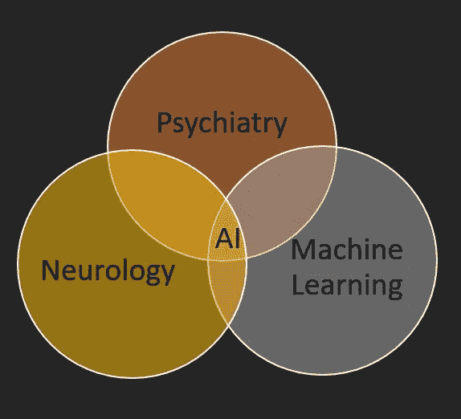

# AI 为无意识(自我):

> 原文：<https://medium.datadriveninvestor.com/ai-for-unconscious-self-6d8947b3239a?source=collection_archive---------12----------------------->

通过写这篇文章，我想接触人工智能和机器学习领域的专家和先驱。在我的自我宣传结束时，我希望我的问题能得到澄清，并对这个主题有更好的理解。也希望能激发更多的问题；答案是未知的。

我们都知道人脑由意识和无意识部分或白质和灰质组成。头脑的完整结构在这里描述[。如果说我们对无意识自我的了解是如此之少，这很有趣，很奇怪，但也令人鼓舞；或许是因为它“不自觉”！科学家发现并声称，了解或倾听你的内在自我或无意识对人类的精神状态是健康的。](http://www.lalitnarula.com/structure-of-mind.html)[限制意识](https://medium.com/@lalitrenuu/restriction-of-consciousness-cbf647b149ff)就是其中一种方法。

今天，我们知道人工智能系统已经在一些有意识的活动中挑战并超越了人脑，如下围棋、下棋等。人工智能系统已经学会如何在不受我们干扰的情况下驾驶汽车；人类。有许多这样的重大成就，正因为如此，我们已经开始信任，有时不信任这些系统。

> 假设人工智能工具是为了与人类一起工作而不是取代人类，我向各位专家提出的问题是，大脑无意识部分的人工智能算法会发生什么变化？我们试图创造这样的算法吗？AI 甚至能和人类的无意识抗衡吗？我们正在做什么来教授这些系统关于人类直觉和感觉的知识呢？在进化尺度上，人工智能将如何与我们和我们过去的历史(比人工智能的年龄更老)联系起来？与意识不同，无意识是个人的，对个人来说是唯一的(就像一个人的遗传密码)，AI 只用于有意识的推理&用例吗？还有谁在问这些问题？

当人类睡觉时，他们的无意识大脑会激活，让有意识的大脑休息一下。[梦](https://medium.com/@lalitrenuu/the-purpose-of-dreams-64d593862a02)在这个时期形成并被观察。梦是怪异和象征性的。人工智能能模仿我们的梦吗？我们能否制造出一种人工智能算法或系统来复制、取代甚至在很小的程度上模仿人类无意识的自我？

# ***参考文献:***

> 头脑的结构:[http://www.lalitnarula.com/structure-of-mind.html](http://www.lalitnarula.com/structure-of-mind.html)
> 
> 梦的目的:[http://www.lalitnarula.com/purpose-of-dreams.html](http://www.lalitnarula.com/purpose-of-dreams.html)
> 
> 意识的限制:[http://www.lalitnarula.com/home.html](http://www.lalitnarula.com/home.html)