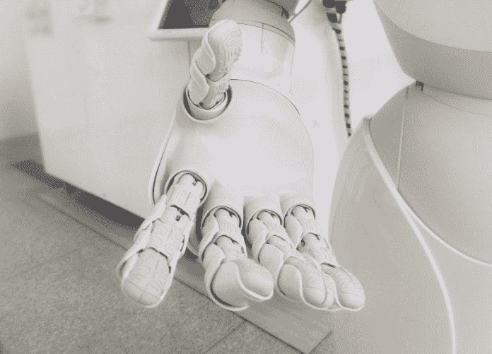
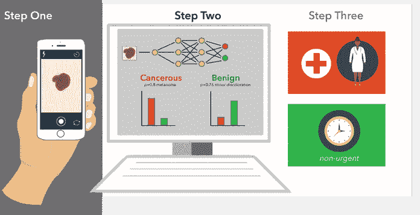
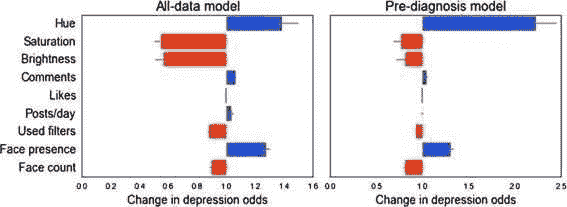
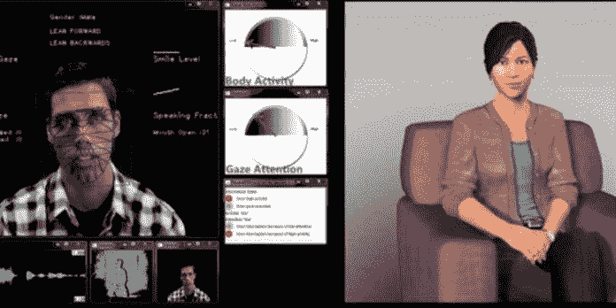
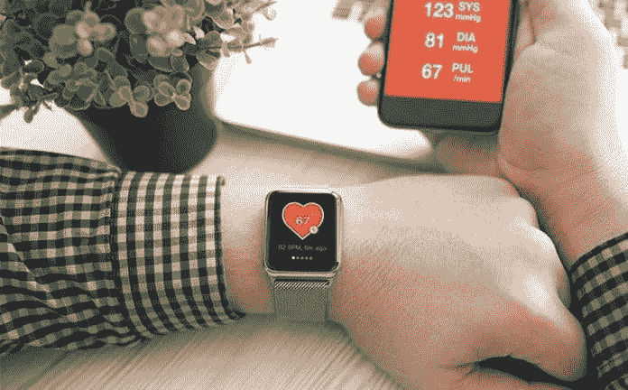
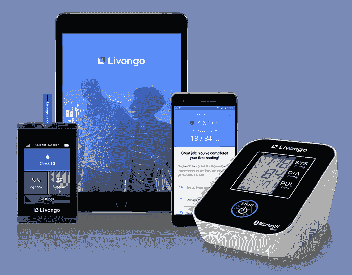
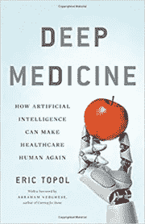

# 人工智能:未来健康的润滑剂

> 原文：<https://medium.datadriveninvestor.com/ai-future-healths-lubricant-27dbedfae2c9?source=collection_archive---------16----------------------->

## 皮肤癌和虚拟心理医生。抑郁症和 Instagram。如果没有人工智能，我们会怎样？

## 皮肤癌和虚拟心理医生。抑郁症和 Instagram。如果没有人工智能，我们会怎样？

皮肤癌是最常见的人类疾病之一，最常见于澳大利亚和新西兰，但每年也有 540 万美国人被诊断患有该疾病。耗资超过 80 亿美元。幸运的是，如果诊断得足够早，预后是好的。

[*Harvard*](http://sitn.hms.harvard.edu/flash/2017/software-complementing-hardware-artificial-intelligence-clinic/)

几年来，我们的智能手机一直非常有助于实现这个幸福的结局。皮肤病和病变的自拍照可以被发送到一系列应用程序，这些应用程序部署了 [AI](https://www.datadriveninvestor.com/glossary/artificial-intelligence/) 神经网络，从远处对它们进行分析。照片当然不是识别恶性肿瘤的完美方法——活检提供了更重要的信息。但在选择哪些患者需要活检，哪些患者只需要确保一切正常方面，人工智能和算法的表现已经好于看着相同图像的认证皮肤科医生。(研究结果见于埃里克·托普在《深度医学》。章节:“医生和模式。”)

 [## 医疗保健的未来正在被一场大型技术入侵所塑造|数据驱动型投资者

### 过去十年，全球经济的所有部门都经历了大规模的数字颠覆，而卫生部门现在…

www.datadriveninvestor.com](https://www.datadriveninvestor.com/2018/11/02/the-future-of-healthcare-is-being-shaped-by-a-big-tech-invasion/) 

最近 Instagram 用[深度学习](https://www.datadriveninvestor.com/glossary/deep-learning/) AI 做了一个有趣的实验。从人们上传的图像中，它可以预测他们中的哪些人有抑郁倾向吗？是的，人工智能可以——尽管不是 100%准确。然而，人工智能的准确性得分优于普通医生，尽管不如精神病医生高。

[*EPJ Data Science*](https://epjdatascience.springeropen.com/articles/10.1140/epjds/s13688-017-0110-z)

显然，分析 Instagram 图片的主要颜色、是否有人以及上传的频率和时间具有超出普通人感知能力的预测能力。脸书在评估健康风险的类似努力中，开发了人工智能算法，分析其用户的部分帖子，以确定自残风险。该公司声称，算法相当成功——但前爱情品牌脸书不愿意透露算法细节。

预测虚拟心理医生的到来似乎是有把握的。研究表明，我们更容易向虚拟心理医生透露我们精神生活的私人细节，而不是真实的东西，因为我们更确信虚拟心理医生永远不会评判我们。这就是智能共情机器人的优势。

但是，我们在舒适的家中通过键盘与之交流的虚拟心理医生有更多的优势:他们比人类心理治疗师收集和分析更多的心理状态迹象。例如，人工智能虚拟心理医生将通过语速、短语长度、连贯性、音量等来记录你的讲话——并且会比人类专业人员做得更勤奋。此外，在与你的心理医生交谈时，你的实际键盘行为将被分析反应时间、打字速度、表情符号的使用等——再次揭示了比人类心理医生所能观察到的更多的深层心理状态。

[*Business Insider*](https://www.businessinsider.com/virtual-shrinks-may-be-better-2014-8?international=true&r=US&IR=T)

除此之外，你的面部、抽搐和眼球运动所泄露的所有微小情绪只有面部识别人工智能才能注意到——并保存为数据。什么样的人工智能生物传感器将告诉你的虚拟心理医生关于心律和心率、呼吸运动、叹息和声音调制的信息(这些被称为“诚实的信号”，因为没有病人可以操纵它们)。所有这一切都表明，在不太遥远的未来，人工智能心理医生将与守旧派竞争，有时甚至超过守旧派。(埃里克·托普在《深度医学》。章节:“没有模式的临床医生”)

# 从浅到深:传感器社会的兴起

上面的例子说明了疾病管理的未来——更深刻地说，也说明了健康管理的未来。这是一场影响不断扩大、无处不在的革命。

背后有两个关键因素。一个是传感器社会的兴起。想想我们通过点击键盘进行的大量搜索。想想身体植入物和健康(风险)应用程序测量我们的身体功能，从血糖水平的心律到呼吸能力，再加上我们的心理功能，从压力水平到在线抑郁评估。想想我们拍摄的与身体健康相关的自拍照，从皮肤斑点到潜在的眼疾，再到孩子身上的麻疹迹象。考虑一下我们对虚拟助手提出的问题和要求。总而言之，这可以归结为传感器社会的兴起，其中大量的健康相关数据被大量的传感器设备永久收集；所有这些仅仅在十年前还不存在，现在正迅速变得普遍。

[*Peerbits*](https://www.peerbits.com/blog/wearable-healthcare-apps-solutions-for-better-tomorrow.html)

疾病和健康管理未来背后的第二个因素是，我们现在有人工智能的算法来分析生活在传感器社会中的所有数据，这些数据都有 24/7 360 度实时监控。这将共同改变我们当前“肤浅”的健康产业——基于与我们的医生长时间分离的孤立接触——走向一个深度的健康产业，在这个产业中，我们几乎连续不断地受到细致的监控、警告和建议，其范围、深度和质量都比以前更大。所有这些都有丰富的实时数据支持。完全由 AI 赋能和监督。

# 以利翁戈为例

Livongo 是一个数字健康平台。它专注于帮助糖尿病患者。最近，患有高血压、[体重挑战和精神问题的患者也可以在平台上找到一个仁慈的地方。扩张将会继续。糖尿病患者每天必须做出许多微小的健康决定，为此咨询医生是不可行的。在 Livongo，患者可以相互交流，但更重要的是，该平台可以持续收集每个患者的血糖水平数据。](https://www.datadriveninvestor.com/glossary/weight/)

[*Wearable Technologies*](https://www.wearable-technologies.com/2018/09/livongo-announces-first-blood-pressure-monitor-with-cellular-connectivity-in-u-s/)

当情况变得危险时，教练会在 30 秒内告诉病人该做什么。根据危险程度，教练可以是人也可以是机器人。根据紧急程度的不同，双方都可以或多或少地进行交流。Livongo 收集的数据不仅仅是血糖水平。它知道每个病人的病史、一段时间内的药物治疗、饮食习惯和健身运动。基于所有这些数据——其数量之大没有真正的医生能够消化——Li vongo 所做的不仅仅是广播警告。它提醒你吃药。它预测你的高潮和低谷，在最后一段时间鼓励你，在第一段时间挑战你提高。基于对你是谁、是什么让你兴奋、是什么激励和激怒你以及什么是吸引你的最佳时刻的更深入的了解，Livongo 可以有力地推动你选择更健康的生活方式。

Livongo 并不是唯一的数字疾病/健康管理平台。有昂多:“随时随地为糖尿病患者带来最好、最更新的护理。”有奥马达:“赋予慢性病患者设定和实现健康目标的权利”。所有平台都有相同的 DNA:完全数字化，每次点击都变得更智能，由远程技术持续监控，实时运行和交付，自动化程度无与伦比，但同时为所有人提供深度个性化服务，同时精心挑选如何让你应对疾病和改善健康。

# 期待什么？

*   期待数字健康平台在全球范围内的稳步崛起。有些将专注于帮助你充分应对特定的疾病。其他人将专注于预防，例如改善您的健康。所有都将显示出扩张的趋势，因为在这里和其他任何地方，软件吃掉它的一切，所以当一个平台在帮助糖尿病方面表现强劲时，它将倾向于扩张到邻近的疾病和健康领域。最终，是一个赢家通吃的平台将占据主导地位，还是我们将看到百花齐放，这都是不确定的。在数字世界，赢家通吃的动态总是紧迫的。但是当涉及到疾病和健康的私人问题时，我们可能更喜欢高度专业化的平台。
*   预计传统医院将会衰落。这将是一个谨慎、平衡的下降，因为当涉及到人类生命时，没有人鼓励“快速移动和打破东西”的技术心态。但是，当你可以在自己舒适的“家庭医院”里通过远程技术进行监测、监督和咨询时，为什么还要呆在医院里呢？
*   当你感冒了，或者对一种神秘的新身体症状感到担忧时，不要指望传统的家庭医生会是你的第一个接触点。它将逐渐成为你的站台教练。机器人还是人类。蔻驰会更了解你——这要归功于你与他/她/它分享的微小数据[交换](https://www.datadriveninvestor.com/glossary/exchange/)瞬间的雪崩，而你几乎没有注意到。你的教练将由三个 P 驱动:预防性的，精确的，个性化的服务。
*   期待焦点从治疗疾病到增进健康的转变。收集到的平台数据同样可以进行分析。想象一下特定疾病管理平台和通用数字健身平台之间的协作。我们已经超越了避孕药。
*   期待你的平台教练成为专家，让你少生病多健康。始终以 AI 数据分析为导向。这个平台和它的教练将会在用深度个性化的建议来轻推你的艺术上表现出色。
*   预计很多人，无论是患病者还是健康者(最后，几乎所有最后一类人都会屈服于第一类)，都会感到数字平台及其工具赋予了他们权力，让他们能够在生活中发挥更大的作用。对于患者来说，会感觉到更多的服务和照顾，在质和量上，这意味着:更多的独立。对于健康的人来说，这意味着更多的生活乐趣。

这些平台代表着医疗保健领域一种强有力的替代方案的到来。它将邀请我们集体质疑传统卫生制度和机构的文化和习惯。**这些平台将教育我们变得更加苛刻。**

[Deep Machine — Eric Topol](https://amzn.to/2N8NZIY)

在商业层面上，数字平台代表了一条通向医疗保健的新路。老路是通过家庭医生到医院和现有体制内的相关医疗保健公司。数字平台打破了这种局面，拥有足够的创新能力和数据，可以从根本上改变竞争领域。这些平台建立了新的渠道，通过这些渠道可以提供护理，从更深入的知识数据库中获得力量——不断训练和更新，完善和个性化，只有人工智能可以做到这一点。

因此，预计品牌忠诚度会发生变化。你会忠于你熟悉的医生，还是会学会更多地依赖你的虚拟教练？当你的数字平台向你推荐一种你不认识的品牌的药物时，你是否足够信任它而采纳它？这是否会促使你不再坚持在药品包装上印有大制药公司的标识？你更信任谁，与你关系密切的数字平台，还是大型制药公司？

当然，期待大型制药公司和数字平台之间的密切合作和合并。重大变革即将到来。它们会是什么样子，尤其是谁将占据主导地位，将取决于我们如何共同应对数字平台——是信任还是犹豫，或者两者兼而有之。与此相关的是，我们如何与大型制药公司打交道，以及他们如何与我们打交道。信任将是关键。

**关于作者:**
*Carl Rohde 博士教授是一位关于“未来预测&创新”的国际主题演讲人——具有学术深度和实践现实性。在过去的十年中，他与 50 所大学和 10，000 多名学生合作。目标:让所有人都参与到更多的趋势和创新中。罗德在阿姆斯特丹、巴塞罗那和上海都有研究职位。卡尔·罗德还领导着全球市场和趋势研究人员的虚拟网络*[*www.scienceofthetime.com*](https://www.scienceofthetime.com/?source=post_page---------------------------)*。*

作为一个教育知识机构(大学、理工学院或其他),你有兴趣参与国际酷城搜索并想了解更多吗？[请点击这里](https://scienceofthetime.com/service-title-2/?source=post_page---------------------------)。

在 Twitter 上关注[Carl Rohde](https://twitter.com/CarlRohde?source=post_page---------------------------)并在 Medium 上关注[。](https://medium.com/@carlrohde?source=post_page---------------------------)

*原载于 2019 年 8 月 28 日 https://www.datadriveninvestor.com**的*[T22。](https://www.datadriveninvestor.com/2019/08/28/ai-future-healths-lubricant/)