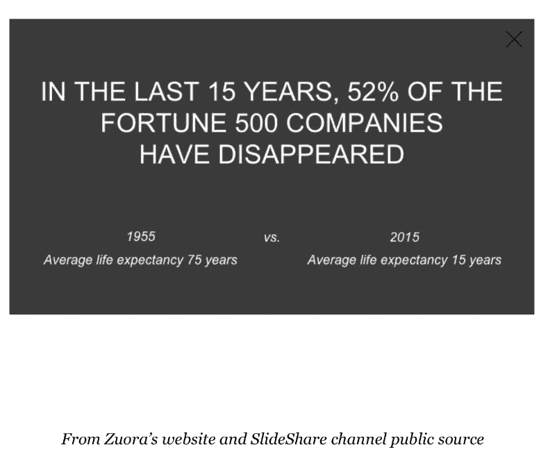

# 人工智能游戏化提高业务成果

> 原文：<https://medium.datadriveninvestor.com/ai-gamification-for-improved-business-outcomes-cdfe6de6ff26?source=collection_archive---------1----------------------->

Michał Parzuchowski on Unsplash

> “人类智能和人工智能(HI + AI)之间的关系必然是一种共生关系。探索这种共同进化的未来的挑战和潜力是下一个世纪最大的故事，在这个世纪里，发展速度的接近是必要的。”—布莱恩·约翰逊

像 DeepMind 这样的实体通过游戏分析说明了人工智能(AI)的进步，以及人工智能随后识别人类竞争对手未注意到的获胜模式的能力。这里展示了 HI + AI 的发展速度。

 [## 人工智能与创造力:梦想成真|数据驱动的投资者

### 人工智能总是让我着迷。不仅作为一套有用的工具，不断发展，而且作为一个…

www.datadriveninvestor.com](https://www.datadriveninvestor.com/2019/01/28/ai-creativity-deep-dream-comes-true/) 

想象一下将基于人工智能的游戏化应用于期望的商业问题和假设的结果。例如，给定一组足够广泛的数据，企业可能会问人工智能系统，实现收入最大化的最佳策略是什么？收入有许多变量，这就是为什么它会成为一个引人注目的初始问题。收入流背后的变量数量很好地映射了德州扑克的无限可能性。

最近，卡耐基梅隆大学和脸书大学尝试将人工智能应用于德州扑克。德州扑克 AI 模型的设计者简化了游戏模型，将一手牌中的无限变量减少到非常少的几个，他们认为是关键的几个变量。人工智能模型设计者观察到，一个输掉的赌注会影响玩家的下一个赌注，人工智能设计者将其称为后悔因素。人工智能设计者利用他们人工智能模型中的后悔值来赢得后续的手牌，即使只是轻微的。每次，一系列的小胜利都会导致整个游戏的胜利。

这些例子和无数其他例子都很有针对性，理由很充分。AI 的弱点是泛化。今天的人工智能模型是有针对性的，为特定的情况，特定的模式而构建。

是什么让 AI 和神经网络擅长模式识别？

今天在人工智能标题下的是神经网络的基础形式。这些系统也被称为机器学习，当定义神经网络的层变得足够深时，被称为深度学习。这些系统从相对简单的 python 代码到运行起来非常复杂和昂贵的系统。神经网络是一个代码库，当运行时，它构建一系列节点，每个节点包含一些接受输入并生成输出值的逻辑。

神经网络在一列节点中的节点数量和一行节点的深度方面有所不同。一列中的节点从前一列中的所有节点获取输入，并将其输出发送到后一列中的所有节点。从设计上来说，这种多层互连节点的网络类似于大脑中的神经元网络，尽管是以非常小的方式。注意:作为复杂性的比较，人类大脑中大约有 860 亿个神经元。

神经网络神经元内的代码是专门设计的，以相对于成功的想法来提炼其输出。成功的概念是由每个模型定义的。假设成功的想法是区分包含猫脸的图像(保持相对简单)。由互连节点阵列组成的神经网络需要“学习”猫脸的图案是什么样子。

训练神经网络的过程是提炼每个相互连接的神经元如何将它们的值传递给它们连接的神经元以实现“成功”结果的过程。对各种不同的猫脸图像进行足够的训练，产生成功的改善曲线，这意味着神经网络正在它们连接的神经元之间形成正确的值模式，以在下一次呈现独特图像时统计地确定猫脸。

识别各种复杂程度的模式是当今人工智能及其组成神经网络的优势和核心价值。

将人工智能/神经网络模式识别机器应用于商业，能够使公司比人类更快地看到数据中有意义的模式。比非人工智能竞争对手更快地知道在哪里以及如何应用人工智能来识别并适应不断变化的商业环境的公司，使这些公司能够进一步扩展其市场广度。

> “公司计划在人工智能上投入大量资金——到 2022 年将高达 776 亿美元……优化决策是人工智能的目的。”
> 
> [为人工智能驱动的未来培养你的领导者](https://www.gallup.com/workplace/267410/develop-leaders-driven-future.aspx)

今天的人工智能采用限制通常分为两大类。首先，人力资源有限。对数据科学家或建立人工智能模型的人工智能专业人员的需求很高，但可用的资源库很少。第二个典型的约束是适当标记的数据。企业有丰富的数据，这些数据需要为后续的 AI 模型做准备。

像 DotData 这样的初创公司将有助于解决其中的一些限制。事实上，人工智能初创公司作为企业人工智能工作的首选顾问的需求越来越大。

> “人工智能和机器学习是今年所有人的首选，首席信息官向初创公司寻求这些解决方案的可能性是向老牌供应商寻求的两倍。超过 80%的高管(81%)表示，他们正在投资人工智能和人工智能，其中大多数(67%)依赖于创业公司"[对于人工智能能力，首席信息官更喜欢与创业公司合作](https://www-forbes-com.cdn.ampproject.org/c/s/www.forbes.com/sites/joemckendrick/2019/10/31/for-artificial-intelligence-capabilities-cios-prefer-to-work-with-startups/amp/)

为了解决今天的企业人工智能采用限制，访问现有的企业数据将需要更加无摩擦，在理想世界中无摩擦。此外，利用数据中包含的财富的能力需要是无摩擦的，消除当前构建人工智能神经网络模型和训练所得模型所需的人类专业知识障碍。

让我们考虑一下我们所认为的“游戏”的抽象模型换句话说，假设我们建立了一个游戏抽象的人工智能模型，在这个模型中我们可以适应任何游戏的实现。当 AI 模型运行时，win 的思想是期望的输出。结果是一个足够一般化的基于人工智能的游戏模型。当应用于任何游戏规则时，人工智能模型将分析规则约束内的模式，以找到导致“赢”输出的移动模式。

现在，让我们把这个人工智能模型搬到商业环境中。我们可以将业务问题等同于“赢”的定义，并将问题所针对的业务数据等同于游戏规则。给定一个问题，人工智能引擎将遍历数据，目标是获得问题的最有效解决方案，即获胜。不可避免地，像围棋和德州扑克一样，会产生人类范式之外的模式，即商业价值模式。

如果你已经做到这一步，那么你可能会意识到人工智能模型是特定的，有点昂贵。那么，考虑到目前为止提到的资源限制，这种情况在未来几年内会如何发展呢？亚马逊的 Alexa 有一个命令库 [SDK，一个技能包](https://developer.amazon.com/docs/smapi/quick-start-alexa-skills-kit-command-line-interface.html)，使其他人能够编写特定领域的命令。Alexa 甚至有了一个[以业务为中心的实现，尽管还很早，而且命令有限。](https://www.techrepublic.com/article/cheat-sheet-alexa-for-business/)然而，很容易看出业务的趋势，最终将产生一个扩展到通用业务数据模式识别命令库的词汇表。

不难想象在不久的将来，首席财务官戴上虚拟现实耳机“玩”他们公司的财务数据模型，并能够要求系统人工智能显示数据模式，从而提高利润率。或者，想象一位戴着虚拟现实耳机的首席执行官正在查看代表公司机会宇宙的数据集，并要求系统人工智能提取整个机会宇宙中最大的公共属性数据集，以产生最大的市场差异。

实现这一场景没有技术障碍，只要你愿意，就一定会成功。

业务问题定义了数据环境和成功参数。定义了这两个要素，让游戏开始吧。

参考资料:

*   AI 在六人德州扑克中击败专业人士，[https://www . Google . com/amp/s/www . new scientist . com/article/2209631-AI-beats-professionals-at-six-player-Texas-Hold-Em-poker/amp/](https://www.google.com/amp/s/www.newscientist.com/article/2209631-ai-beats-professionals-at-six-player-texas-hold-em-poker/amp/)
*   DeepMind 的 AI 在最新的对决中击败了世界最佳围棋选手，[https://www . new scientist . com/article/2132086-deep minds-AI-beats-worlds-best-Go-player-in-latest-face-off/# ixzz 63 vrxvtfy](https://www.newscientist.com/article/2132086-deepminds-ai-beats-worlds-best-go-player-in-latest-face-off/#ixzz63vrXvTfY)
*   DeepMind AI 现在紧跟'星际争霸 II '特级大师，https://www . engadget . com/2019/10/30/deep mind-AI-星际争霸-II-特级大师/
*   但是什么是神经网络呢？深度学习，第一章，https://youtu.be/aircAruvnKk
*   AI 将从算法进化到同事的 5 种方式，https://www . techrepublic . com/article/5-ways-AI-will-evolve-from-algorithm-to-co-worker/
*   对于人工智能能力，首席信息官更喜欢与创业公司合作，https://www-Forbes-com . cdn . amp project . org/c/s/www . Forbes . com/sites/joemckendrick/2019/10/31/for-Artificial-Intelligence-Capabilities-CIO-preferred-To-Work-Startups/amp/
*   Alexa 技能工具包，https://developer . Amazon . com/docs/custom-Skills/built-in-intent-library . html
*   Alexa for Business，https://www . Google . com/amp/s/www . techrepublic . com/Google-amp/article/cheat-sheet-Alexa-for-Business/
*   为人工智能驱动的未来培养你的领导者，https://www . Gallup . com/workplace/267410/develop-Leaders-Driven-Future . aspx
*   https://www.bbc.co.uk/sounds/play/m0009zbj，戴密斯·哈萨比斯告诉吉姆·艾尔·哈利利他为什么要创造人工智能

 [## DotData 筹集了 2300 万美元用于自动化数据科学任务

### DotData 是一家位于加利福尼亚州圣马特奥的自动化工具提供商，致力于实现数据科学流程的可操作性，目前…

翻转它](http://flip.it/GJ_aTR) 

️ 2019 Malcolm P. Dickson 保留所有权利