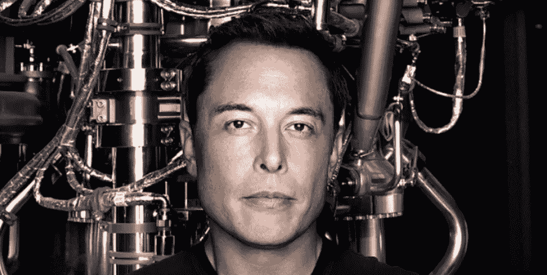

# 艾，世纪骗局

> 原文：<https://medium.datadriveninvestor.com/ai-hoax-of-the-century-8f2cb7b853a3?source=collection_archive---------0----------------------->

人工智能“威胁”背后的大众媒体歇斯底里接近震耳欲聋的强度。除非你住在山洞里，否则你每天都会接触到大量关于人工智能的文章和电视节目，根据媒体报道，这些威胁着人类的生存。就在今天早上，在几分钟的时间里，我看到了几篇文章，如果是真的，我会爬回我的穴居人洞穴，尽可能远离人工智能。

首先，纽约时报作家莫林·多德(Maureen Dowd)在她的《名利场》(Vanity Fair)文章中积极地滔滔不绝地谈论“阿尔法男性”埃隆·马斯克(Elon Musk)，他的*“十亿美元的十字军东征将阻止人工智能启示录*”和*从机器学习霸主手中拯救人类*。莫琳，有点脱离她的角色，似乎真的被那些邪恶的人工智能“*可能比唐纳德·川普*更糟糕的存在威胁”的想法吓坏了。她还引用了马斯克的名言“人工智能将像病毒一样消灭人类”。

令人惊讶的是，这一可怕威胁的答案似乎是将我们易犯错误的、多肉的和必死的身体与我们永恒的思想分开，并与那些讨厌的硅人工智能融合。《卫报》作家奥利维亚·索隆也引用了马斯克的话，她写道“*人类必须成为半机器人才能保持相关性*”并且“人工智能将会让人类成为‘家猫’”。但是等等，一切还没有结束，埃隆·马斯克正在研究“*可注射网状神经蕾丝，以实现与机器的共生*”。我们终究可以得救！“神经花边”的想法似乎可疑地类似于古老的人工智能“直接进入你的大脑”的梦想，绕过那些限制人类感官的东西，这些东西对严肃的思考来说只是一种麻烦。这项简单创新的技术"*将在 4-5 年内全部可用*。往好里说，它不会起作用，往坏里说，它会导致严重的脑损伤。

身体和精神的分离是人工智能先知的主要困扰。《卫报》似乎特别关注人工智能，在另一篇题为“你的动物生活结束了”的文章中。“机器生活已经开始，”长生不老之路，发现"*延长生命的技术——通过上传思想独立于身体存在——只需几年时间*"我想大概是 4-5 年吧？这篇文章引用了人工智能和“认知科学”领域的一份名副其实的名单:理查德·道金斯(Richard Dawkins)，他声称“*必须有可能用化学方法或在计算机中构建生命”*，汉斯·莫拉维克(Carnegie Mellon)的认知科学教授，他确信*“人类物种的未来将涉及大规模抛弃我们的生物身体*，雷·库兹韦尔(Ray Kurzweil)， 一个著名的思想上传的倡导者声称“*在电子系统上运行的人脑模拟将比我们的生物大脑运行得快得多。”*

相当值得注意的是，这些科学幻想家中的许多人似乎都受到了他们“*终生阅读科幻小说”*的启发，正如 Oculus 软件团队的领导者 Michael Abrash 在他的脸书 F8 主题演讲中直言不讳地说的那样。《卫报》的文章引用了超人类学家和“计算神经科学家”Randal Koene 的话，他在阅读了 Arthur C Clarke 的 *The City and the Stars* 后解决了头脑上传的棘手问题。首先，你扫描一个人大脑中的相关信息——神经元及其连接。该扫描然后成为受试者大脑神经网络重建的蓝图，然后转换为计算模型。关键在于基质的独立性，即存在于人体之外。在我看来，山达基在这方面可能比人工智能领先一步。

另一个超人类主义者，尼克·博斯特罗姆，牛津大学战略人工智能研究中心主任，批评人性是一个“正在进行的工作，一个半生不熟的开端，我们可以以“理想的”方式学习和重塑”。负责任地使用科学技术，我们将设法成为比现在的人类有更大能力的后人类。就智力而言，超人类能够带着完美的记忆和理解阅读国会图书馆的每一本书。

这样的奇迹已经让我自卑了。所有这些可能很有趣，但我想说明一个更重要的观点。为什么我们的常青藤大学会给那些观点如此幼稚的研究者终身职位？为什么大众媒体会放大他们的青少年梦想，并通过在所有频道上无休止、令人作呕地重复这些想象的威胁来恐吓数百万美国公民？

答案可能来自德高望重的斯蒂芬·霍金，他最近声称“*我们需要某种形式的世界政府来保护我们免受技术和人工智能升级的影响。*“再加上另一个人工智能的大支持者谷歌的执行董事长埃里克·施密特也是五角大楼国防科学委员会的主席，以及埃隆·马斯克是五角大楼的常客，答案可能会开始出现。被凶残的人工智能吓得魂不附体的人们可能更愿意批准不断增加的军事预算，同时寻求世界政府的保护，尽管这些目标可能是矛盾的。

好消息是。首先，显而易见的是，我们的“主流”媒体不再那么主流了。事实上，广播媒体，像印刷和电视一样，似乎正在消亡。他们仍然可以摧毁思想和人民，他们仍然可以发动战争和增加军事预算，但他们的盔甲上有裂缝。他们创造了特朗普现象，以阻止共和党初选期间的其他候选人，但他们无法阻止他最终成为美国总统。而且，就像谚语中的巫师学徒一样，他们把 AI 精灵从瓶子里拿出来了，但他们可能无法把它放回去。当它失败时，他们将失去已经萎缩的观众的信任。根据最近的盖洛普民意测验，消费者对美国大众媒体的信任度从 2002 年的 55%下降到今天的不足 20%。但是对于大众媒体来说，隧道的尽头也许有一线光明。网飞首席执行官雷德·哈斯汀斯最近表示，50 年后，它的客户可能是人工智能，而不是人类。问题已解决:)