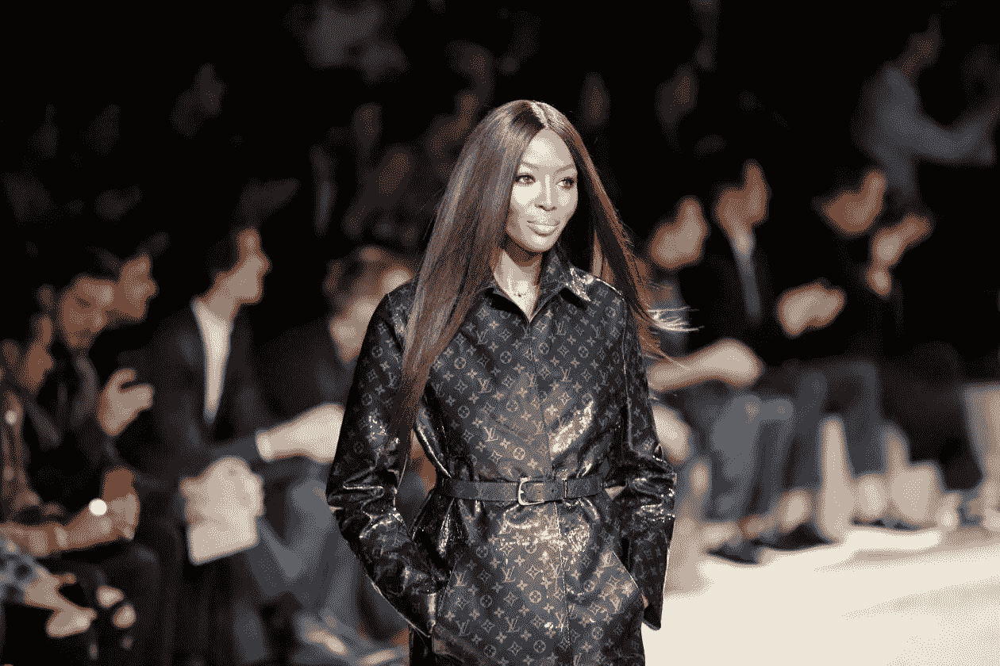
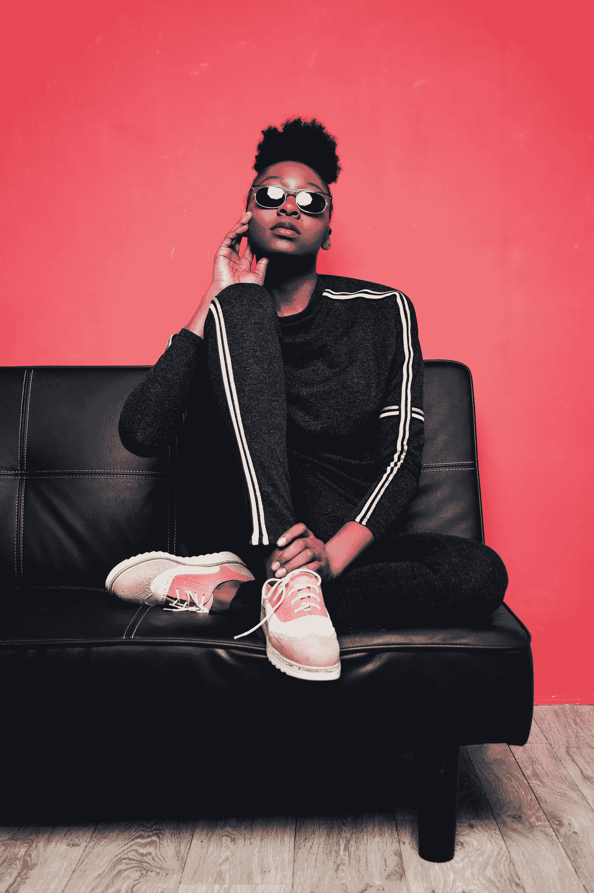
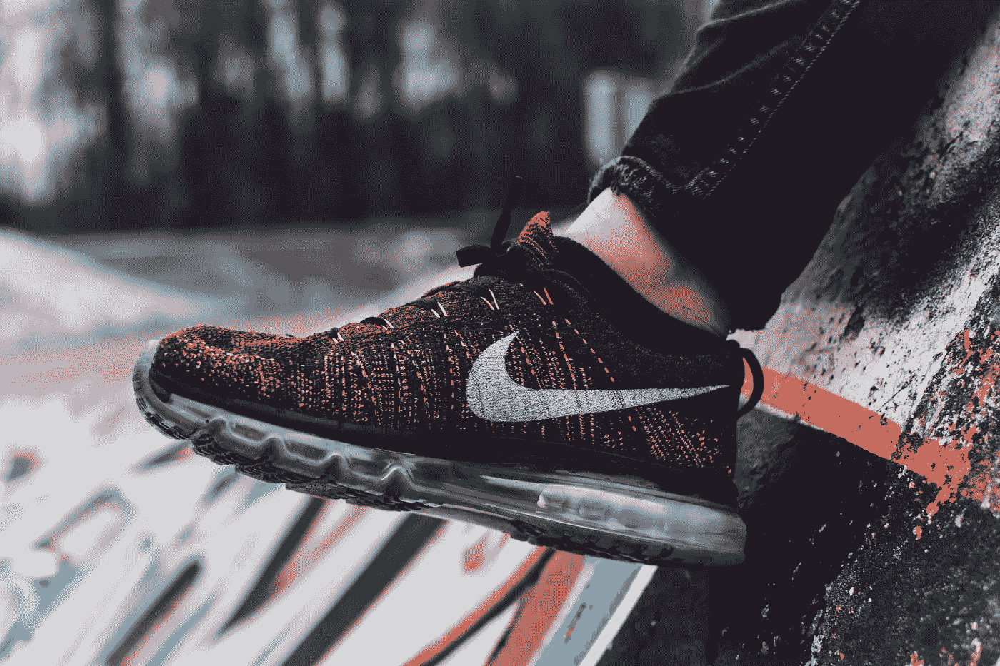
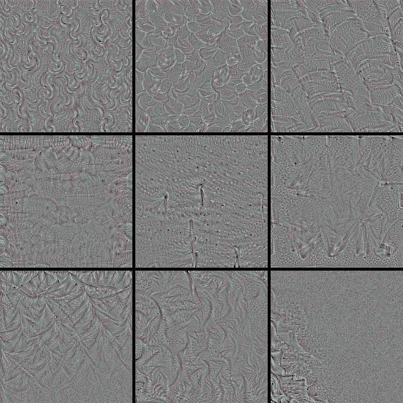
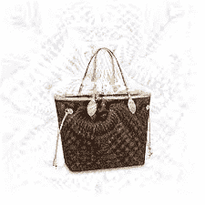

# 人工智能识别 2019 年时尚产业趋势

> 原文：<https://medium.datadriveninvestor.com/ai-identifying-the-fashion-industry-trends-75a1437d4838?source=collection_archive---------9----------------------->

在这篇文章中，我们将窥视时尚产业的背后，看看什么品牌的趋势和风格，所以我们可以人工智能可以改善什么。

picture [credits](https://qz.com/quartzy/1194798/only-black-is-the-new-black-a-cultural-history-of-fashions-favorite-shade/)

嗨，新年快乐！！！

在我们开始之前，花一点时间来感谢又一年。现在，我们可以开始阅读 2019 年的第一篇文章了。

人工智能正在一次一次地革新一个行业，我们已经看到了效率、质量和供应的显著提高。仅去年一年，就出现了许多公司，一些公司转向将人工智能纳入其产品。一些例子可以是:

*   **Cocoon Cam Clarity 婴儿监视器—** 这款智能婴儿监视器摄像头可以判断婴儿是否在呼吸，并向用户发送实时数据和警报。它还允许与婴儿进行双向互动，而不需要任何可穿戴或服装附件。机器学习算法和安装在婴儿摇篮上方的高清摄像头使这成为可能。
*   **deep mind alpha fold**——一个生成蛋白质 3D 模型的系统，比以往任何系统都要精确得多——在生物学的核心挑战之一上取得了重大进展。

这只是冰山一角。**深度学习**机器学习的一个子集是 2018 年大部分突破的主要贡献者，因为它可以从大数据中学习复杂的表示。我们可以清楚地看到，人工智能可以改变各种行业，如生物医学、农业、机器人和许多其他行业。**统治世界！！！**🤣🤣🤣

# 现在说了这么多，2019 年 AI 能为时尚行业做什么。

首先，让我们了解一下时尚行业的核心是什么——这个行业以展示和商业化奢华、权力和奢侈而闻名。谁不喜欢鹤立鸡群？

有一些原则和技术，公司不仅用来脱颖而出，而且用来区分彼此，这就是品牌诞生的地方。品牌以标志开始和结束，时尚品牌通过广泛的视觉线索，如颜色、图案和形状来传达其独特性。

# 如果我们可以教计算机学习和个性化用户体验，会怎么样？

时尚行业已经发生了转变，耐克、阿迪达斯、博柏利和李维斯等大品牌正在进行大量的研究和实施，这些大品牌正在从个性化跑鞋到帮助购物者的聊天机器人等方方面面实施人工智能。

# 让计算机理解这种视觉队列怎么样？

[Inside a CNN](https://blog.keras.io/how-convolutional-neural-networks-see-the-world.html) , notebook [link](https://colab.research.google.com/drive/1TSPAt-BObD6crflmF7P-dKCMQ0gIpASX#scrollTo=Uy9DpwTJcgZT&line=186&uniqifier=2)

在这种情况下，计算机视觉是我们的首选领域。上面的图像足够接近和生动地展示了计算机如何看到和辨别品牌之间的差异。

> 如果你是一个极客，你可以访问这个笔记本并在这里玩它。

从计算机的角度来看这个世界令人惊奇。

随着计算机视觉最近的成功和在线商务的兴起，将计算机变成视觉专家是一件非常令人兴奋的事情。时尚行业不断变化的格局提供了一个独特的机会，可以利用目前可用的大数据计算算法来获得任何个人时尚专家都无法获得的知识和专业技能。

根据这篇**的论文，进行了一项研究，要求 Amazon Mechanical Turk 上的 5 个人根据标志的可见性将箱包类别中的每个产品图像标记为三组中的一组:(I)标志(ii)重复标志或字母组合图案时的重复标志(iii)无标志。46%的数据集图像包含徽标，51%不包含徽标。他们使用的分类器分别正确预测了(一)、(二)、(三)中 65.01%、68.67%、54.46%的品牌。这是非常重要的，因为组(iii)构成了数据集的大部分，并且证实了深度分类器学习所有三个组的独特视觉特征。**

**以前有一些非常有趣的研究，解决了服装兼容性和推荐，风格和趋势识别。**

**利用计算机视觉，我们可以量化深层表征，以分析和解释时尚品牌的视觉特征。从字面上了解时尚公司使用什么技术来使他们的品牌脱颖而出，我们也可以知道检测时尚产品标志图像的算法部分和检测模式的系统部分的相关性。**

****需要记住的要点:****

*   **人工智能正在改变许多行业**
*   **时尚行业可以使用人工智能来创造更好的产品和客户体验**
*   **人工智能还可以通过模式识别，在检测品牌方面超越人类专家，即使没有商标。**

**对于坚持到最后的你，这里有一张额外的定制图片:**

****

**感谢您的阅读！！！**

**如果你喜欢，请留下尽可能多的掌声，因为我为你这样做——今年我有令人惊叹的项目和内容，如果你不想错过我每周三的新文章，请关注我。**