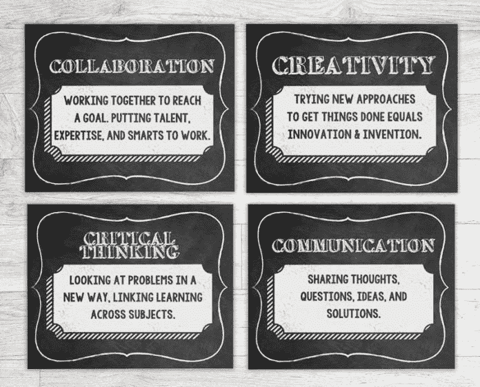
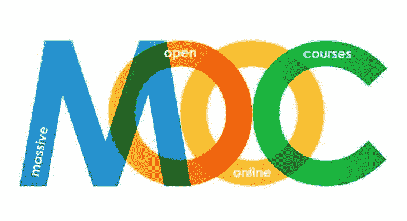

# 教育中的人工智能:治愈还是毒害？

> 原文：<https://medium.datadriveninvestor.com/ai-in-education-cure-or-poison-5ae3e7f80a9f?source=collection_archive---------4----------------------->

## 人工智能将使学习更有效率。和地狱。

只要你想一分钟，你就会发现我们的教育制度是多么可悲。19 世纪是如何组织的。因此，非常不适合 21 世纪。一位老师站在一班学生面前。当学生运气好，老师有能力和积极性时，这是常有的事，他(或她，当然)已经尽他所能准备了一堂课，带着他所有的奉献和职业热情。

却发现相当多的学生更喜欢升级他们的脸书账户，查看他们的 WhatsApp 消息，或者分享一个令人捧腹的 Snapchat——有时是秘密的，有时是公开的。这伤害了他的感情——尤其是当他对课程内容充满热情的时候。结果是悲剧性的:失望的老师和心不在焉的班级，显然没有得到他们想要的和需要的。

这种 19 世纪的教学模式已经持续太久了。学生变了。当从事一个项目时，他们确切地知道在互联网上哪里可以找到相关的工具和信息。任何一个仍然在他们面前进行单向交流的老师，无论如何充满激情地进行，都没有抓住要点。

只有当老师真正专注于他们需要知道的东西时，学生才会集中注意力——此时此地。如果不是，反复无常的脸书等是更好的选择。(千禧一代被定性为[代瞬时](https://www.ft.com/content/254d71b2-4a08-11e8-8ee8-cae73aab7ccb)是有原因的！)当然，学校和大学可以通过在课堂上关闭 Wi-Fi 来反击。这更像是回到了 19 世纪的状况，忽视了互联网也可以给课堂带来的赋权潜力。坚持 19 世纪真的是在我们当前时代获得成功的最佳解决方案吗？

> *简单地问:你想知道什么？*

我相信许多老师和教授都认识到了上述情况。怎么招架？我向我所在的荷兰丰蒂斯大学的一位领先的教育创新者提出了这个问题:埃里克·斯拉茨。他的回答响亮而清晰。“卡尔，作为未来预测者，你很有经验。你在四大洲的 52 所大学教授过大师课。在这个最激动人心的城市，你被上海市授予未来预测与创新教授职位。简单地告诉你的学生。此外，通知他们今天课程的一般主题。并且简单地问:你想知道什么？”我听从了他的建议:告诉学生我的专业知识和今天的课程主题，并从那里开始，这意味着跟随他们的问题。一开始，我感到不自在——我能回答学生的问题吗？我的学生也感到不自在。他们不能再躺着，被动地等待老师是否足够冷静，他的表现是否会超越社交媒体的微妙之处。现在他们被迫思考他们想知道的事情。事实证明，他们也发现很难离开 19 世纪。但是我们成功了，现在我的评估分数正在上升。学生得到他们需要的和真正想知道的。作为一名教师，我更了解他们的需求、兴趣和激情。这是一个双赢的局面。欢迎来到 21 世纪。

> 这就是为什么基于技能的教育成为如此热门的词汇。

# 教师角色的变化

[*etsy.com*](https://www.etsy.com/listing/239042923/classroom-printables-the-4-cs-21st)

我的解决方案是将 19 世纪单向交流的不充分的教育环境转变为更具吸引力和互动性的 21 世纪教育环境，但它并不是独立的。毕竟，传统教育的过时特征是众所周知的。在我们这个快速流动的社会中，知识机构必须让学生为未来的工作做好准备，而这些工作现在可能还不存在。因此，预测这些学生需要什么知识是一个挑战。少关注实际知识，多关注他们在 21 世纪成功职业生涯所需的技能会更容易一些，因为这些技能更容易预测。这就是为什么以技能为基础的教育成为如此时髦的词。我所在的荷兰丰蒂斯大学的教育围绕着四种被确定为 21 世纪必备的 C 技能:创造力、沟通、协作和批判性思维。很明显，你不可能在 19 世纪“单向交流”的框架内练习这些技能。和许多其他学校一样，我们学校的另一个流行词是基于挑战的学习。基于挑战的学习是基于学生在社会生活和未来职业生活中遇到的真实挑战——以及他们想要解决的挑战。这是一种更实用、更实用、更具协作性的教育方式:完全面向 21 世纪。

当我们全面进入 21 世纪，人工智能将会、能够或者应该扮演什么样的角色？我们将看到 MOOCs(大规模开放在线课程)如何解放教育。以及人工智能是如何在其中发挥作用的。我们还将探索下一步:细致的监督教育。在这里，人工智能的作用加深了，直到我们可能不再对它感到舒服。事实上，我们会对此感到非常不舒服，以至于在一些令人惊讶的地方，教育将再次主要转向线下。

# MOOCs 已经长大了

[*Educational Technology*](https://educationaltechnology.net/massive-open-online-courses-moocs-definitions/)

可能第一个关于[人工智能](https://www.datadriveninvestor.com/glossary/artificial-intelligence/)的 MOOC 来自美国硅谷的斯坦福大学。它始于 2011 年秋季，有 160，000 名学生参加，其中 14%完成了课程。一种新的教育形式诞生了。它的酷举世闻名，主要是在硅谷。

**mooc 的优势很明显:**

*   更多的学生可以选修适合课堂的课程。
*   一些最成功的 MOOCs 由顶尖的国际大学传播。接下来是斯坦福大学，哈佛商学院提供令人兴奋的课程。在不到十年的时间里，MOOCs 变得如此受欢迎，以至于最好的课程提供商已经成为自己的品牌:Coursera(3700 万学生)，EdX(1800 万)，XuetangX(1400 万)，uda city(1000 万)。2018 年 12 月的数字。
*   相比线下教育，MOOCs 便宜。这解释了为什么他们在新兴国家的有志学生中如此受欢迎。尽管 MOOCs 相对便宜，但这种商业模式仍然有效，因为更多的学生可以加入在线课程。一个好的 MOOC 也可以提升提供大学的品牌声誉。
*   MOOCs 提供了课堂上不可能实现的灵活性和个性化。每个参与者都可以遵循自己的教育时间路径，自行决定休息时间。不仅在一节课内，而且在它们之间。传统的“一刀切”已经结束。
*   我们可以从加入 mooc 中学到很多，但 mooc 也可以从跟随我们中学到很多。他们接收大量关于人们如何学习、何时、何地、在什么时间段、以什么频率等的数据。他们还学习如何激励不同类型的学生。他们甚至学会了如何预测未来的动机下降，以及如何应对。人工智能是理解我们在慕课过程中产生的大量数据点的完美工具。MOOCs 诞生于网络。因此，他们向学生学习的方法也是在网上诞生的:人工智能算法和编码处于领先地位。

与传统教育相比，MOOCs 有诸多优势，听起来好得令人难以置信。然而，随着 MOOCs 的成熟，相对劣势也变得明显起来:

首先，很多开始网络课程的人并没有学完。毕业率很低。这可能表明缺乏成功，但也许我们不应该以完成率来评判 MOOCs。这可能有点太像 19 世纪的思维了。大概很多开 MOOC 的同学只是想探索。入学门槛比线下教育订阅低很多，为什么不试一试呢？可能很多人在课程中闲逛，只关注他们此时此地真正感兴趣的部分。他们现实的当务之急是——再一次:这是*一代瞬间的* —而不是完成整个课程并获得证书的愿望。

[*National Communication Association*](https://www.natcom.org/communication-currents/instructor%E2%80%99s-corner-partnering-university-communications-office-teach-social)

在线教学显然是孤独的。这让学习变得格外艰难。因此，最好的 MOOCs 正在深入广泛地提高课程的互动质量。当学生被问及他们最欣赏在线课程的什么时，他们经常提到在线小组经历。人们在交流时会变得活跃。MOOCs 必须牢记这一普遍观点。人工智能产生的洞察力可以帮助软化孤独的问题，迎接挑战。他们更好地教导 MOOC 提供商，什么样的学生真正需要一个互动的时刻，在什么时间点，用什么样的方法。老师一定要干预吗？一个合作学生能有足够的帮助吗？还是需要加入一个合作团体？是的，MOOCs 孤独会让人失去动力。但人工智能的算法开始知道如何克服这一点，每个人都有自己独特的方式。

最后但同样重要的是，MOOCs 还有一个缺点。是的，他们的人工智能学习方法允许以个性化的准确性适应我们特定的学习风格，这远远超出了传统课堂的可能。但当我们更进一步时，这种强大的优势可能会成为对我们私人生活的侵犯。MOOCs 正以我们无法控制的神秘方式监视着我们。从这个意义上说，MOOCs 正在成为一种让人感觉不舒服甚至毛骨悚然的监控文化的一部分。为了说明这一点，让我们继续讨论教育的下一步:人工智能主导的监控教育。

# 人工智能主导的监控教育

*“学生们在英国开放大学开始远程学习课程一周后……一个计算机程序将会预测他们的最终成绩。一种监测新员工阅读了多少在线教科书，以及他们参与网络学习论坛的热情程度的算法，将把这些信息与每个人的社会经济背景数据进行交叉引用。它将找出那些可能失败的人，并指出他们将从哪里开始挣扎。”*

这是《金融时报》一篇关于教育的未来，或者至少是未来之一的文章的开头一句话。它生动地展示了人工智能的力量，它可以让我们更加高效和有效地学习，但也展示了对它的监控变得多么激烈——以及这可能会令人感到多么毛骨悚然。Expect 应用程序可以监控学生学习、社交、锻炼和睡觉的时间，以及具体时间。毫无疑问，它们将有助于提高比赛成绩。它们也可能与我们的财务状况和贷款行为的数据相结合。所有这些数据点都将被人工智能分析，以推动我们克服动机学习下降和危机。会有用的。基于所有这些数据点，导师可以获得每个特定学生在每个可能的时刻辍学风险的精确信息。在这个人工智能主导的监控教育环境中，导师可以准确地跟踪学生阅读的内容，以什么速度和以什么专注度阅读。人工智能主导的监控甚至能够区分屏幕后面的学生是否在安静地呼吸，因为她非常专注，或者因为她已经睡着了。

[*Genetec*](https://www.genetec.com/solutions/industries/education)

家长倾向于欣赏人工智能主导的监控教育的优势。毕竟研究一个孩子花费很大。学生自己比较暧昧。我们不都应该这样吗？被浪漫化的前人工智能时代的自由学生生活还会剩下什么？我们不都直觉地觉得，没有一定的自由，真正的学习是无法开花结果的吗？而 AI 主导的监控教育的严密监控不就是扼杀了那种自由吗？这难道不会导致人类生活和学习的最终“货币化”吗？下一代学生不会变成半机械人一样的机器，比上一代表现得更好，但却神秘地失去了一些人性吗？这都是基于“自愿”吗？因为当邻居的孩子进入人工智能主导的监控教育，使他们成为更好的表演者时，把自己的孩子放在后面有多明智？另一方面，正如亚历克斯·比尔德(Alex Beard)在他的书《天生的学习者》(Natural-born Learners)中所反映的那样，尽管具有所有的个性化和灵活性，但人工智能主导的监控教育难道不是在大量生产“大规模生产、不假思索、高性能的无人机，这些无人机能够通过 ace 测试，但缺乏在世界上真正成功的社交和情感技能”？

# 酝酿中的反运动

[*Agriturismo Club Le Cannelle*](https://www.clublecannelle.com/en/tuscany-vacation-offers/digital-detox-vacation-o153.html)

这些问题既富有哲理，又令人不安。因此，一场运动正在兴起，希望平衡我们的教育和生活中对技术的过度依赖。在许多地方，数字戒毒是一个新的时髦词。那些实践它的人，包括我自己的丰蒂斯大学的许多学生，主要发现他们是多么上瘾。(让你的数字排毒日变得多么困难，*而不是*在社交媒体上说出来！)说到无科技/低科技教育，有一个地方出人意料地走在了前面:硅谷！在那些把我们这些人变成科技迷的公司里工作的科技家庭，越来越多地把他们的孩子送到华德福学校，在那里接触科技受到很大的限制(直到 13、14 岁)，在那里学习是通过玩耍、实践和社区来完成的。在家庭餐桌上，史蒂夫·乔布斯是一个技术拒绝者:禁止使用手机。比尔和梅林达·盖茨的孩子也有相似之处:低科技教育。

显然，技术革命的领导者认为，教育中过多的技术，包括人工智能编程的学习，可能是有害的。当人工智能监控进入教育领域时，它可能会分散我们获取决定 21 世纪成功的四种 C 技能的注意力:创造力、沟通、合作和批判性反思。这些是人类非常重要的能力。

**他们应该被 AI 赋能。未被覆盖。**

**关于作者:**
*Carl Rohde 博士教授是一位关于“未来预测&创新”的国际主题演讲人——具有学术深度和实践现实性。在过去的十年中，他与 50 所大学和 10，000 多名学生合作。目标:让所有人都参与到更多的趋势和创新中。罗德在阿姆斯特丹、巴塞罗那和上海都有研究职位。卡尔·罗德还领导着全球市场和趋势研究人员的虚拟网络*[*【www.scienceofthetime.com】*](https://www.scienceofthetime.com/?source=post_page---------------------------)*。*

作为一个教育知识机构(大学、理工学院或其他),你有兴趣参与国际酷城搜索并想了解更多吗？[请点击这里](https://scienceofthetime.com/service-title-2/?source=post_page---------------------------)。

在 Twitter 上关注[Carl Rohde](https://twitter.com/CarlRohde?source=post_page---------------------------)并在 Medium 上关注[。](https://medium.com/@carlrohde?source=post_page---------------------------)