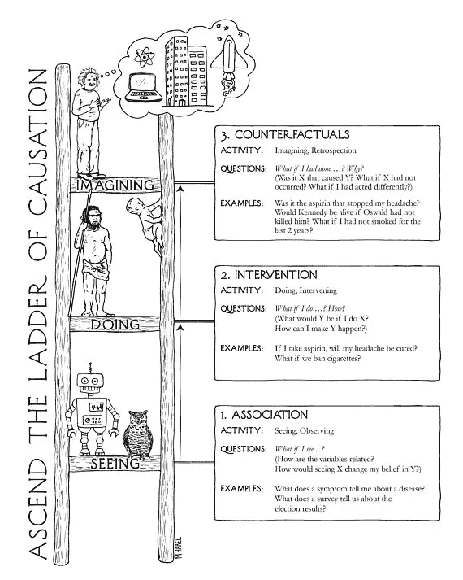

# 金融中的人工智能:突破炒作(附案例研究)

> 原文：<https://medium.datadriveninvestor.com/ai-in-finance-cutting-through-the-hype-with-case-studies-f361518b00d4?source=collection_archive---------1----------------------->

正如我在[中写的，称艾是在虚张声势](https://medium.com/@gjlr2000/calling-ais-bluff-9ef275943168)，当“大众媒体炒作”开始时，就在“负面新闻开始”之前，我们目前正生活在“膨胀预期的顶峰”(点击上一篇博客查看著名的[炒作周期](https://en.wikipedia.org/wiki/Hype_cycle))。

媒体似乎也无法区分人工智能的局限性，甚至称其为“创造性”(例如，“[机器创造力击败一些现代艺术](https://www.technologyreview.com/s/608195/machine-creativity-beats-some-modern-art/)”)，并展示人工智能技术生成的美丽图片:

All this pictures were generated by computers

另一个炒作的例子是在 AlphaGo 击败围棋世界冠军之后记者们的愤怒:

> 这一壮举标志着通用人工智能道路上的一个里程碑，通用人工智能不仅可以在棋盘游戏中击败人类。因为 AlphaGo Zero 是从一张白纸开始自己学习的，所以它的才能现在可以转化为一系列现实世界的问题。

我将尝试解释人工智能的局限性(和机遇)— [在其他地方](http://www.oliverwyman.com/our-expertise/hubs/the-future-of-data-and-analytics.html?_lrsc=d87dc99f-7601-4dc1-9ed7-b4489e41de57)你可以找到人工智能可以带来革命性变化的例子，但在这篇博客的结尾，我将向你展示人类可以在金融领域做些什么，而机器(目前)还做不到。

## 打破炒作

在我之前的[博客](https://medium.com/@gjlr2000/calling-ais-bluff-9ef275943168)中，我区分了人工通用智能(AGI)和狭义人工智能(NAI)。AGI 是科幻小说中的东西——当机器可以完成人类可以完成的任何任务。从商业角度来看，我们关心 NAI——机器能比人做得更好、更快、更便宜的活动(生产率提高)。

我发现 AI 是一个结合了许多不同技术的术语，每种技术都略有不同。然而，最被炒作的是与*机器学习、*以及非常重要的:它们都是狭义人工智能的例子。

我还发现下面的气泡图很有帮助:

[source](https://towardsml.com/2018/02/17/machine-learning-an-overview-and-the-essential-algorithms/)

该图还允许我们找出解决业务问题所需的机器学习技术。

另一个非常有用的图表可以帮助我们理解应该使用哪种技术(但是，它缺少强化学习分支):

[[source](https://blogs.sas.com/content/subconsciousmusings/2017/04/12/machine-learning-algorithm-use/)]

我过去写过一些案例研究，展示了现在实现这种技术是多么容易。例如:

**识别信用卡诈骗:**气泡图中没有直接显示，但是如果你按照*机器学习—监督学习—分类*你会发现‘身份诈骗检测’。在我的案例研究 [**AI 作为金融领域的白盒**](https://medium.com/@gjlr2000/ai-as-a-white-box-in-finance-e6f3216aa7e7) (点击链接)中，我解释了如何使用监督分类技术识别欺诈交易。

**贷款信用评级:**另一个分类的例子，我解释一下如何把信用卡诈骗用的方法一字不差地用于贷款信用评级: [**讲解 AI —一个信用评级案例分析**](https://medium.com/@gjlr2000/explaining-ai-a-credit-rating-case-study-2f6704816760) 。

**金融制度识别**:遵循*机器学习—无监督学习—聚类*分支我写了一个可以自动识别金融序列中不同制度的系统示例:[**利率聚类**](https://medium.com/@gjlr2000/rates-clustering-611a3af9b294) 。

**市场预测:**图中提到了这个例子:*机器学习—监督学习—回归。*一个的例子(不太成功但能让我们理解所需的过程)是 [**为什么金融系列 LTSM 预测失败**](https://medium.com/@gjlr2000/why-financial-time-series-lstm-prediction-fails-4d1486d336e0) 。

**情感分析**:另一个*机器学习的例子——监督学习——分类；* [**(揭秘)情绪分析**](/sentiment-analysis-in-finance-a4b3016a9fc0) 解释了分析师如何尝试将文章中提到的公司的新闻分类为看涨或看跌——希望作为市场移动信息的替代来源。但当你看到应用于 r/wall street bets([**Reddit 分析**](https://lamatuk.medium.com/reddit-analysis-b42c8cbaf4f3) )的结果时，你会意识到正确的训练数据的重要性(剧透，上面的例子使用电影评论情绪应用于聊天室上的亵渎语言)。

还有，确保你注意到了机器学习—强化学习—游戏 AI(alpha go 分支)和*机器学习—监督学习—分类(*与图像分类生成相关的分支；作为副产品，您可以生成看起来像您试图分类的图像)。我没有一个形象的例子，但是你可以运行像塞万提斯 那样的[**写作的例子，看看神经网络如何从头开始“学习”一种语言和写作风格，然后以同样的风格“写作”。**](https://medium.com/@gjlr2000/writing-like-cervantes-61a63c964d82)

就像魔术一样，一旦你知道它是如何制作的，你就会注意到相似之处(获取大量数据/使用需要大型计算机的方法),睁开眼睛你就会看到它的局限性。

## 狭义人工智能的局限性

在朱迪亚·珀尔(Judea Pearl)的《为何之书》(The Book of Why 中，他介绍了下面这幅漫画，其中他很有帮助地描绘了一个机器人(目前代表狭义人工智能——包括 AlphaGo)处于“因果关系”阶梯的第一级。

他反对奈的论点可以归结为:

> 完全因果模型是一种形式的**先验**知识，你必须将其添加到你的分析中，以便在不实际进行干预的情况下获得因果问题的答案。**光靠数据推理不会给你这个**。[ [来源](http://www.inference.vc/untitled/)

这篇[ [博客](http://www.inference.vc/untitled/)]更详细地解释了允许你开发因果模型的“单独数据”的无能。

在金融领域，开发因果模型是我们的饭碗:

*   意大利政治正在推高收益率吗？
*   特朗普大选对股市有什么影响？
*   汽油价格上涨对通胀和美联储有什么影响？

Pearl 刚刚展示了单靠数据无法自动构建这些模型！因为机器人(今天)没有“先验”知识，也没有能力进行随机控制测试，他们无法回答这个问题。

另一个例子:统计学家非常熟悉“虚假相关性”的概念，甚至有一个网站收集了几个荒谬的概念(比如斯克里普斯全国拼字比赛获奖单词中的[字母和被毒蜘蛛杀死的人数](http://www.tylervigen.com/spurious-correlations))。我们发现这很有趣，因为我们有“先验”知识，蜘蛛根本不在乎拼写比赛单词中有多少个字母，但机器人不仅缺乏这种知识，*它也无法从数据中推导出这种知识*(用目前炒作的技术——事实上这是一个热门的研究领域)。

所有这些“创造力”言论的最后一颗钉子是梯子的最后一级:想象力。一旦我们近距离观察“创建”图像和文字的算法机制，你会注意到有新的概念没有产生。[狮子人](https://en.wikipedia.org/wiki/Lion-man)(世界上已知最古老的动物形状雕塑)，它以想象自然界中没有的东西而闻名，被誉为人类和尼安德特人之间的区别(注意因果关系阶梯上的第二级——尼安德特人就此止步)

## 金融专业人士能做(N)AI 不能做的事情有哪些？

因此，金融分析师可以像穴居人一样思考，并爬上因果关系阶梯的第二级):

*   开发因果经济模型，
*   识别可能影响变量的隐藏机制，
*   理解变量对新金融工具的影响，

仍然可以就业，但最重要的是，当人工智能技术被用来筛选堆积如山的数据时，bat 将不得不整理并解释这些输出。

但是为了安全起见，财务分析师应该能够爬到梯子的第三级——从事需要想象力的项目:

*   想象新的情景(积极的或消极的)，即“黑天鹅”
*   开发新的金融工具，

这个专业人员将达到第三等级——超过尼安德特人的专业人员。