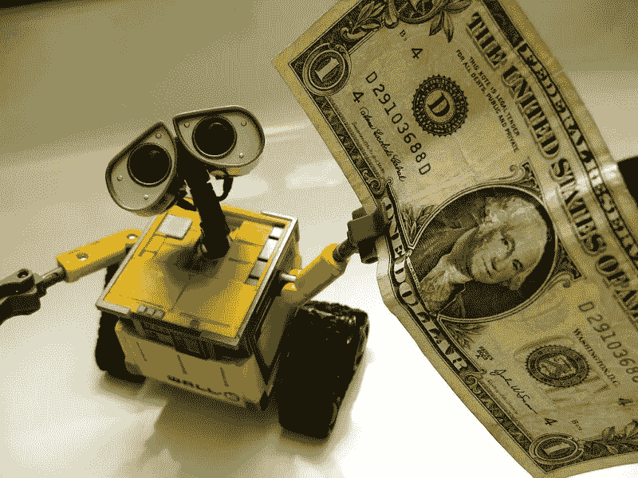

# 金融中的人工智能:信任还是不信任？

> 原文：<https://medium.datadriveninvestor.com/ai-in-finance-to-trust-or-not-to-trust-55e99c28e875?source=collection_archive---------15----------------------->

虽然这两个领域看起来像是天造地设的一对，但现在人工智能实际上能为你做什么——结果有多可靠？

人工智能是各种技术和方法的总称，这些技术和方法使机器能够执行复杂的任务。作为人工智能目前最广为人知的应用，机器学习(ML)是一种使用算法浏览数据以得出结论的实践——因此，执行复杂任务的本质在于从数据中学习的能力，而无需特别告知这样做。

鉴于详细记账在金融领域的重要性，人工智能和人工智能似乎很自然地拥有改变金融的巨大潜力，使记录和**的**更有效地使用** **改变它们的保存方式**。**

当然，几十年来，计算机已经能够比人类更快地执行机械计算。不同之处在于，有了认知分析，计算机获得了学习能力——大部分数据**不再适合电子表格**。

机器学习技术有很多，但可以分为三大块，每一块都有特定的作用，就是颠覆金融:

*   监督学习
*   无监督学习
*   强化学习

**监督学习**旨在使用样本数据进行基于趋势的预测。在金融环境中，当提供历史数据时，算法能够检测出具有最佳预测能力的关系。具体来说**，基于回归的监督学习**方法旨在预测基于输入变量的输出。这可以将金融建模作为一个整体提升到下一个层次:即提高敏感性分析的质量。在“黑箱过程”的研究和分析中，输出是几个输入的不透明函数，其中一些难以研究和分析，**无监督学习**将用于识别大量变量之间的关系。

在**无监督学习**中，在不知道哪些变量是从属变量，哪些是独立变量的情况下，给了一台机器来自资产的一整套回报。基于确定的相似性概念对数据进行聚类可以为寻找相关性提供一些思路:确定具有高和低波动性、上升和下降的利率或通胀的历史制度。

**强化学习**的目标是选择一系列连续的行动，以最大化最终(累积)回报，这意味着为期望的输出执行最佳行动。对交易者来说听起来不错？

在我看来，将这一想法付诸实践的最令人印象深刻的例子之一是 JP 摩根自己的工具 [LOXM](http://www.businessinsider.com/jpmorgan-takes-ai-use-to-the-next-level-2017-8) 。它的创建是为了以最快的速度和最优的价格执行股票交易，并在不引起市场波动的情况下出售大量股权。其核心是一种强化学习算法，学习根据当前市场条件选择**最优价格、期限和订单规模**。

**深度学习方法**，既可以被监督也可以不被监督(虽然一般是被监督的)，特别适合处理非结构化的大数据集。例如，它的宝贵用途在于能够处理假设的金融数据序列，以估计市场修正的概率。

机器学习方法的美妙之处在于，它既有基础理论的潜力，也有非常实用的经济应用的潜力。让我们继续讨论人工智能如何改变你的金融业务的实际例子:

**风险评估和欺诈**

金融机构本质上是风险管理者，负责监管各种金融风险，包括市场、信用、运营、货币、流动性等。

人们创造了许多工具和模型来估计风险，比如说，发放贷款的风险。有趣的是，即使一个非常复杂的信用评分算法通常最终也会将客户分配到一个**相当标准化的利率组**——或者干脆拒绝请求。结果，许多承销系统错过了大量合格的借款人。

用一般的社会人口数据(移动设备、社交媒体网络等等)来增加信用评分会导致巨大的收集和处理成本。然而，在制定一个评估借款人信誉的成功模式时，并非所有这些信息实际上都是必要的。构建、验证和部署风险模型的**速度和简易性**是为特定案例找到最佳解决方案的关键——有[工具](https://ginimachine.com/)可以帮助你做到这一点。

然而，在我看来，解决方案要复杂得多，因为有很多机会太好了，不能错过。例如，如果数据可以用来定制利率，使其对金融机构，甚至对客户更有意义，会怎么样？

一旦到位，这种系统还可以作为参考**指出异常行为**，如异常高的取款金额或可疑的地理活动。

根据[德勤](https://www2.deloitte.com/content/dam/Deloitte/us/Documents/audit/us-ai-risk-powers-performance.pdf)的研究，检测欺诈的常规方法是“使用计算机对照规则集分析大量结构化数据。例如，欺诈专家将为电汇设定一个 1 万美元的门槛，这样任何超过这个数额的交易都会被计算机标记出来，以便进行进一步的调查”。显然，这种结构化数据分析的方法会产生**太多的误报**。

就行业而言，**不够敏感意味着风险敞口高得难以承受**——一种简单设计的确认交易正当的方式将使客户更加安全，并有助于人工智能系统学习和自我完善。

**客户体验 2.0**

自从智能手机出现以来，银行业一直在利用应用程序来卸载物理办公室并加快客户需求的执行。这些功能已迅速成为客户联系的标准点，但与此同时，对更加个性化和人性化的体验的需求也在增加。很棘手，是吧？

一项[经济咨询调查](http://www.information-age.com/artificial-intelligence-transforming-financial-services-today-123464987/)显示，45%的金融服务高管非常重视创造个性化的客户体验。根据全球消费者银行调查，**客户对金融产品和数字渠道的满意度参差不齐**。例如，“36%的受访者既不精通金融，也不精通数字”，而只有“16%的人两者都懂”(EY，2016 年)

聊天机器人——一个即时消息和/或语音识别系统——在某种程度上模仿了与客户服务代表的互动，客户服务代表能够同时执行你的请求。聊天机器人提供即时联系，跨系统集成，以标准但个性化的方式做出响应。此外，由于数据驱动，他们逐渐学会通过**询问简单的问题来澄清一些不太明确的要求，从而改善客户体验。**

这是一个适合所有客户群体的完美组合——从多任务快节奏的千禧一代到通过交谈得到安慰的老年人。

**PFM(个人理财)**

银行业让客户感觉更聪明的一个步骤是分享分析数据:你在休闲上花了多少钱？与上个月相比如何？虽然这是一个好的开始，但如果没有可操作的见解，人们往往很难调整自己的习惯。所以，说了“A”之后，说“B ”,让你的客户更好地控制自己的支出。

这是聊天机器人改进的第二步。许多正在进行中的例子之一是[奥利维亚](https://www.olivia.ai/)——人工智能技术与 PFM 聊天机器人的结合，与外部应用程序集成:

**信任艾还是不信任？**

这是个问题。这个领域的新颖性和偶尔出现的可解释性困难常常让高管们过于担忧。金融科技尤其是一个严格遵守法规和治理的行业，数据泄露或其他安全故障可能是灾难性的。

最重要的是要认识到，在目前阶段，人工智能和人工智能仍然是**辅助技术**来帮助建议策略和结果的概率。人类的专业知识仍然是一个关键，人类不会去任何地方——只是获得一个杠杆来做出更明智的决定。这是非常值得的。到 2035 年，人工智能将有能力推动 20 个国家的经济增长 40%。AI 和 ML 有能力消除财务决策中的猜测，使其更加稳定，增强客户体验，并递归地改进系统本身。

数据分析技能变得与市场知识同等重要— **但绝不认为一个可以构成另一个**！这两种技能需要以平衡的方式加以利用，以正确地**解释和理解数据模式背后的经济学和推理**。因此，在“最好的时代”推动你的业务向前发展的人的理想形象应该是一名全面了解市场运作方式的数据科学家。

**来源**

大数据和人工智能战略:摩根大通公司的报告:[https://](https://medium.com/the-future-of-financial-services/)valuesimplex.com/articles/JPM.pdf

金融服务讲故事:[https://medium.com/the-future-of-financial-services/](https://medium.com/the-future-of-financial-services/)

ey 全球消费者银行调查:[http://www . ey . com/GL/en/industries/financial-services/Banking-capital-markets/ey-global-Consumer-Banking-Survey-2016](http://www.ey.com/gl/en/industries/financial-services/banking---capital-markets/ey-global-consumer-banking-survey-2016)

为什么人工智能是风险管理的游戏规则改变者:[https://www2 . Deloitte . com/content/dam/Deloitte/us/Documents/audit/us-ai-risk-powers-performance . pdf](https://www2.deloitte.com/content/dam/Deloitte/us/Documents/audit/us-ai-risk-powers-performance.pdf)