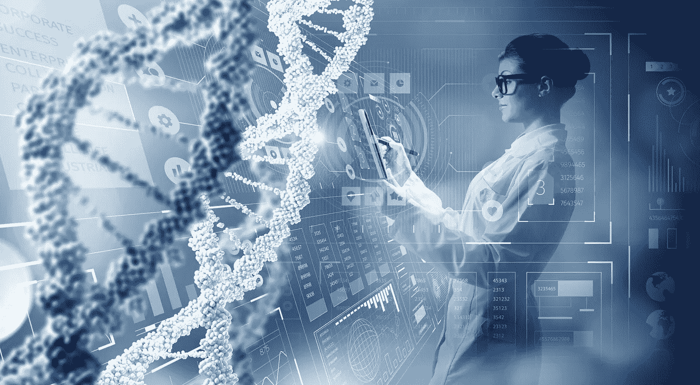

# 医疗保健中的人工智能—快速概述

> 原文：<https://medium.datadriveninvestor.com/ai-in-healthcare-an-overview-633005a68abf?source=collection_archive---------6----------------------->

人工智能的影响在大多数领域都被过度炒作和低估，它正在催化医疗保健领域的革命性用例。深度学习已经从识别猫和狗走了很长一段路，现在可以进行独立的基于图像的诊断，精确度相当于或优于(人类)医生。肿瘤、骨折、中风的 x 射线或基于扫描的诊断，电诊断可以完全通过算法来完成。虽然这些选项中有几个已经获得了 FDA 的批准，可以开始临床试验或用于生产，但研究人员正在尝试通过自拍诊断来检测约 50 种眼睛颜色异常的疾病(Nature，2018)和通过体味(散发的分子)进行诊断。

AI is changing Healthcare in countless ways

使用来自可穿戴设备或行为观察的数据，如步态、驾驶模式、[鼠标使用](https://www.wsj.com/articles/clues-to-parkinsons-disease-from-how-you-use-your-computer-1527600547?mod=e2tw)等的变化。，机器学习算法可以预测生理(特别是神经或心血管)或精神疾病的发作，协助管理糖尿病或癫痫等慢性疾病，甚至提出实时警告。无监督或半监督的技术，如聚类，可以帮助发现个人和群体健康的模糊模式。在大多数情况下，与使用标准回归的现有方法相比，使用监督学习算法对患者进行预后评估和警告获得了高达 2 倍的更好结果。

机器学习在很大程度上也是精准医疗进步的原因。[个性化治疗](https://www.ecnmag.com/news/2018/09/researchers-use-ai-treat-metastatic-cancer-patient?cmpid=horizontalcontent)，随着基因组和分子测序正在改变[癌症治疗](https://www.sciencedaily.com/releases/2018/08/180801115237.htm)。识别罕见疾病和收集最新的医疗信息现在只需一次语音查询。[帮助个人健康管理或回答基本问题的聊天机器人越来越受欢迎。临床试验设计更加知情，效率提高了数倍——确定受益最大的患者，](https://www.babylonhealth.com/)[使药物发挥作用的特征](https://www.prnewswire.com/news-releases/new-research-partnership-will-leverage-berg-interrogative-biology-platform-and-identify-novel-biomarker-and-targets-for-diagnosis-and-treatment-of-alzheimers-disease-300570276.html)，为现有药物找到不同的应用，所有这些都由人工智能的不同分支提供动力。在更标准和常规的情况下，我们离完全机器人手术不远了，因为它们已经通过跟随手的运动来帮助提高手术精度。

自动化诊断和处方可以帮助更好地利用严重受限的医疗资源，实现早期和更快的检测，通常会导致更高效和有效的行动过程。在发展中国家，人工智能可以为人们提供医疗保健服务。医院管理部门正受益于数据的[预测能力](https://www.forbes.com/sites/bernardmarr/2016/12/13/big-data-in-healthcare-paris-hospitals-predict-admission-rates-using-machine-learning/#35d981c779a2)通过自动化部分操作，如人员配备、日程安排、后勤、文件编制、整合患者反馈等。在和门诊患者[中监测预后已经证明了人工智能可以在可靠的程度上执行一项任务。](https://spectrum.ieee.org/the-human-os/biomedical/diagnostics/in-hospital-intensive-care-units-ai-could-predict-which-patients-are-likely-to-die)

撇开医疗剧变得不那么激动人心不谈，算法的接管将取决于它们接受训练的数据，这些数据解释了基于图像的诊断的进展，因为输入数据和预测结果之间的关系相对简单。当这种联系不太明显，或者有一个以上的统计学上有意义的答案时，事情就变得模糊不清了，我们需要依靠医生。IBM 的沃森在最初的大肆宣传之后，最近因几次[失误](https://www.healthnewsreview.org/2017/02/md-anderson-cancer-centers-ibm-watson-project-fails-journalism-related/)而受到审查，其中大部分失误是由于数据不足和被误导的预期。从数据采集开始还有很长的路要走，医疗保健数据长期以来一直是无组织和无结构的。随着自然语言处理从医疗记录、日志、笔记等中提取信息并标准化口述和抄本，以及数据收集变得直截了当，人工智能将成为不可或缺的盟友。