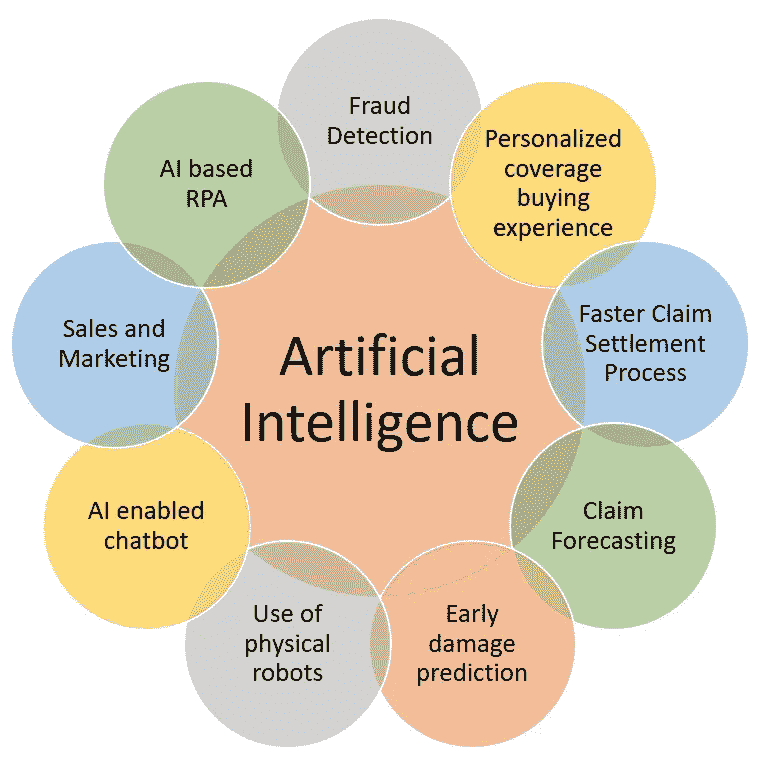

# 保险业中的人工智能

> 原文：<https://medium.datadriveninvestor.com/ai-in-insurance-industry-be2a4ac61c12?source=collection_archive---------7----------------------->

人工智能(AI)已经成为每个行业不可或缺的一部分，保险也不例外。保险行业已经开始利用人工智能的力量来改善流程，加快理赔周转时间，并自动化许多其他日常运营问题。

行业正在利用或可以利用人工智能及其衍生物(例如:机器学习、深度学习、RPA 等)的一些领域是:

> **欺诈检测** —几十年来，处理欺诈索赔一直是行业面临的一大挑战。然而，在今天人工智能技术的帮助下，我们可以分析索赔是否具有欺诈性质，这个红旗可以进一步帮助保险代理人相应地处理索赔。
> 
> **个性化的保险购买体验** — AI 可以根据用户的人口统计数据、在线行为(如果有的话)以及通过聊天机器人、电子邮件等各种渠道与保险公司互动时收集的数据，帮助保险公司设计并向用户建议个性化的保险计划和保费。
> 
> **更快的理赔流程** —索赔周期的许多流程可以自动化，以使整个流程更加顺畅和快速，例如通过捕获的数据和图像自动验证索赔，根据索赔周期中的技能集自动将索赔分配给合适的人员。
> 
> **索赔预测** —人工智能还可以根据历史数据、天气报告和通过其他渠道收集的数据，帮助预测索赔和向保险公司支付的款项。这将有助于公司提前规划财务状况。
> 
> **早期损害预测** —人工智能和机器学习可以帮助预测损害，并在损害发生前进行预测。这将有助于保险公司采取必要的预防措施，以避免损害或尽量减少其影响。
> 
> **使用物理机器人** —人工智能驱动的设备，如机器人或无人机，可以帮助简化整个理赔流程，缩短周转时间。它还可以帮助保单承保和定价。
> 
> **人工智能聊天机器人** —人工智能聊天机器人能够取代人类助理，提供随时可用、快速高效的客户服务。聊天机器人可以拥有自然语言处理(NLP)和情感分析能力，以准确理解客户用他们自己的语言在说什么。
> 
> **销售和营销** —借助人工智能技术进行客户细分和聚类有助于目标营销，并有助于以更有效的方式获得客户。
> 
> **基于人工智能的机器人流程自动化(RPA)** —基于人工智能的机器人流程自动化可以帮助自动化日常重复性任务，并且不需要人工干预决策。它可以帮助组织自动化其多个流程，节省人力资源成本，并提供更快的交付以及更高的准确性。

除了上面列出的领域，人工智能还可以在多个方面提供帮助。然而，它需要正确的技能和资源来实现。另外， ***数据*** 和 ***耐心*** 是在这个领域取得成功的两个关键，因为没有一个 AI 产品在发布的第一天是 100%准确的。任何一个 AI 产品的成熟和精准度的提高都需要时间。