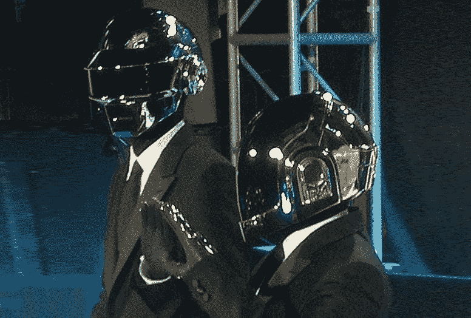
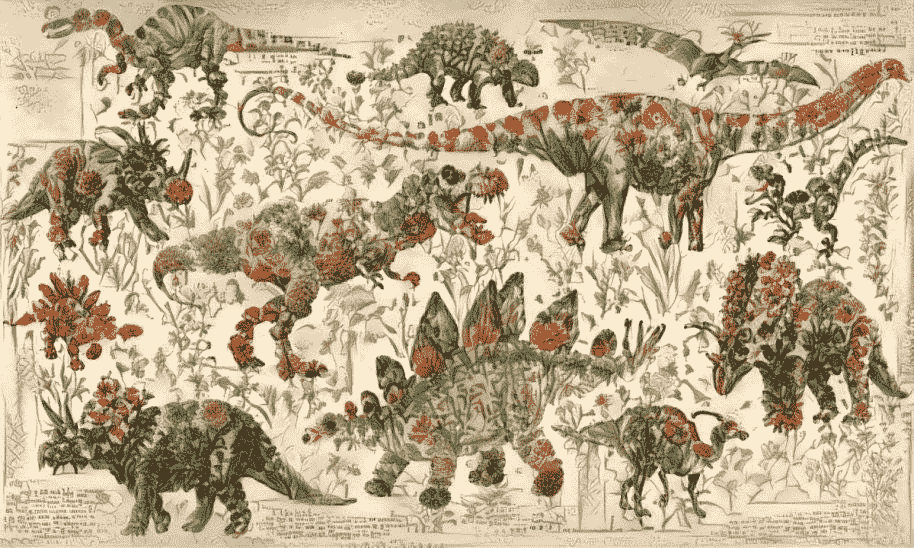
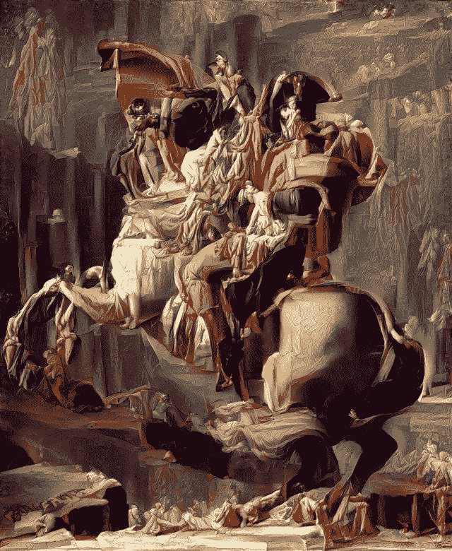

# 营销中的人工智能-瞄准 2019 年

> 原文：<https://medium.datadriveninvestor.com/ai-in-marketing-taking-aim-on-2019-d69b8fb21a9c?source=collection_archive---------23----------------------->

人工智能已经是 2018 年营销领域的热门话题——我们可以期待在 2019 年看到什么趋势？

[最初发表于 MarTech Advisor](https://www.martechadvisor.com/articles/machine-learning-amp-ai/ai-in-marketing-taking-aim-on-2019/)

# 数据是怎么想的？

2018 年，关于人工智能的文章不必仅仅由一个人类来写！所以我做了一个简单的人工智能来预测 2019 年的趋势。利用谷歌对过去一年人工智能营销主题的网页量的估计，我们使用这些数据来训练一个机器学习模型(即人工智能)。人工智能预测:

*   人工智能*数据*和*工具*大幅增长。
*   上升趋势是*聊天*和*创意* AI。
*   AI *目标*和*自动化*继续缓慢稳定增长。
*   AI *意图*和*声音*营销预计收效甚微。
*   至于艾和，那是在下降，我们已经过了的巅峰。

这些预测听起来很有道理，可能是对的，但它们就像星座一样可靠！人工智能的好坏取决于它所依赖的数据。这里的数据就像稀粥一样——稀薄、低质量，并且有一些奇怪的团块——这使得模型不可靠。此外，就其本质而言，人工智能只能学习已经显现的模式——它们无法预测突破性的变化。例如，这个 AI 还不能看到 Alexa 和 Google Home 如何改变人们使用互联网的方式。

# 1.正如蠢朋克所预言的:更大、更快、更强。

但我相信这些预测是正确的，当他们说人工智能营销工具将会增长。期待看到更多的活动自动化优化。还有更多的方式来表达价格(如 CPCV，CPE)，智能系统将这些转换成 CPM。用蠢朋克的话说，2019 年的人工智能将是:更大、更快、更强。

蠢朋克是著名的穿得像机器的音乐家。迄今为止，一些目标一直是这样的:公司都在谈论人工智能，但在幕后，人类的劳动可能比允许的要多。最终，性能将从炒作和希望中筛选出质量。随着 AI 的好处越来越多，那些真正能交付的厂商会大放异彩。

# 2 聊天商务的增长

电子商务正在发展:两种人工智能技术正在一起将这个领域从视觉转移到语言。第一个是*语音*，Alexa 和 Google Home 将语音驱动的计算带到了美国的主流——美国近五分之一的成年人可以使用智能扬声器。[1]第二个是聊天，聊天机器人——能够进行简单对话的人工智能——已经从垃圾邮件发送者的领地，变成了一种声誉良好的快速客户服务工具。SkyScanner 率先使用其聊天机器人界面进行航班查询，在 2018 年 2 月超过了 100 万次旅行者互动。[2]Skyscanner 的产品管理副总裁菲利普·菲利波夫认为,“语音是一个自然的归宿……随着时间的推移，随着技术的进步和流程变得更加自然，语音将会回归”[3]

对话式商务的连锁效应将撼动营销。网络浏览，就像现实世界中的购物，让你调查许多产品，主要是可视化的。对话是一种更受限制的形式。这将意味着什么？顺口溜又回来了，随着听到的选项越来越少——通常只是第一个——SEO 将变得至关重要。我们还可以期待一种新类型的广告出现:有用的人工智能助理广告。

# 3 意图驱动的广告

意图广告是你认识到购物者想要达到的目的。这已经是一种强大的技术了。但目前它专注于搜索关键词，并依赖营销人员手动将他们的产品与显示意图的搜索短语联系起来。预计这种情况将会改变，机器学习会自动识别意图，包括来自社交媒体和电子邮件等其他来源的意图，并自动将意图与产品匹配。

获取数据是这里的关键。谷歌、脸书和亚马逊占据垄断地位，这将限制创新的速度和目标。然而，2019 年应该会在旅游等细分市场看到一些突破性的基于意图的服务。例如，认识到这样的旅程:爱丽丝正在做关于假期的白日梦，爱丽丝正在积极地比较假期，爱丽丝需要保险，爱丽丝回家了。在顶端，意图驱动的广告将模糊广告和顾问之间的界限。用户会主动选择与那些能够很好地理解他们需求的系统合作。这反过来将导致恼人的过期广告的消亡——那些广告(就像你已经在国外时的旅游广告)在网络上跟随你，追逐上周的搜索。

# 4 个人工智能创意

一台机器肯定不能有创造力吗？告诉 Deep Dream，谷歌的自省图像分析人工智能可以产生幻觉和不可否认的原始图像。一种密切相关的技术称为深度风格，可以智能地组合艺术品。例如，这里有 AI + Chris Rodley 的优秀 Dino-Flowers，以及 Reddit 用户 Vic8760 的超现实主义 drapery/Napoleon。

也有人工智能音乐家，例如 JukeDeck 可以自动创作音乐来搭配视频。

尽管这些系统令人印象深刻，但它们并不真正知道自己在做什么。他们将各种风格糅合在一起，而不是做有目的的创造性工作。所以 AI 暂时不会取代创作团队。我们谈论“深度学习”，但今天的人工智能就像池塘和水坑一样深——而人类思维的深处仍然是一片未知的海洋。然而，AI 将成为顶级创意团队的重要助手。机器善于探索许多选项:例如尝试不同的措辞、颜色和股票图像选择。这些选择可以与性能指标联系起来，提供反馈以自动选择最佳选项，并训练人工智能。像 Phrasee 这样的公司在这方面处于领先地位。Phrasee 将自动生成文章和邮件列表帖子的标题和标语，并估计哪一个表现最好。通过这种方式，AI 助手可以让我们更好地探索和验证想法。

# 5 位人工智能企业家

2019 年可能会看到第一批人工企业家——人工智能系统发现市场机会，并创造电子商务业务来满足它。这将是一场翻天覆地变化的微妙开端:机器雇佣人类，而不是相反。但就目前而言，它将仅限于 dropship 模式下的快速电子商务，即利基在线商店充当消费者和制造商之间的桥梁。

更主流的是，我们将看到越来越多的人工智能助手被用来起草和优化媒体支出计划。人们仍将做出战略决策，这些软件助手将越来越多地自动化和微调设置。

例如，总部位于爱丁堡的电视分析公司 TV Squared 有一个名为“Predict”的人工智能媒体规划师。它分析你的广告的历史表现，然后建议一个电视支出计划，为你量身定做，让你的钱发挥最大效用。在 Good-Loop，我们正在开发一个类似的购买数字媒体空间的工具。与此同时，AppNexus 等大型交易所正在让人工智能优化购买成为市场结构的一部分，CPV 定价等工具与智能 CPM 竞价挂钩。

# 结论

人工智能变得越来越重要。它已经从小众，到流行语，到主流，营销人员不能忽视它。对于 2019 年，每个主要机构都应该有一个人工智能战略。

不要担心，2019 年将会是机器人霸主掌权的一年。人工智能的发展在于支持系统、自动化和优化。策略和创造力仍然掌握在人类手中——至少目前如此！

# 参考

[1]TechCrunch[https://TechCrunch . com/2018/03/07/47-300 万美国成年人有权使用智能音箱报告说/](https://techcrunch.com/2018/03/07/47-3-million-u-s-adults-have-access-to-a-smart-speaker-report-says/)

[2]SkyScanner chatbot[https://econsultancy . com/SkyScanner-chatbots-pass-million-unique-traveller-interactions/](https://econsultancy.com/skyscanner-chatbots-pass-one-million-unique-traveller-interactions/)

[3] Google Home vs 亚马逊 Alexa[https://www . Forbes . com/sites/johnkoetsier/2018/05/25/massive-reversal-Google-Home-sales-explode-483-to-beat-Amazon-for-smart-speaker-crown/](https://www.forbes.com/sites/johnkoetsier/2018/05/25/massive-reversal-google-home-sales-explode-483-to-beat-amazon-for-smart-speaker-crown/)

# 图片致谢

蠢朋克:(抄送)詹姆斯·沃特利。照片可以与属性一起使用。[https://en . Wikipedia . org/wiki/Daft _ Punk #/media/File:daftpunklapremiere 2010 . jpg](https://en.wikipedia.org/wiki/Daft_Punk#/media/File:Daftpunklapremiere2010.jpg)

深恐龙:克里斯·罗德利，联系复制权。[https://chrisrodley.com/2017/06/19/dinosaur-flowers/](https://chrisrodley.com/2017/06/19/dinosaur-flowers/)

深度梦境示例——(抄送)凯文·杜利[https://www.flickr.com/photos/pagedooley/19529912369](https://www.flickr.com/photos/pagedooley/19529912369)。可以和 attribution 一起使用。

drapery/Napoleon: Vic8760，联系复制权。优质版:[https://www . deviantart . com/vic 8760/art/Napoleon-Bonaparte-A2-664952584](https://www.deviantart.com/vic8760/art/Napoleon-Bonaparte-A2-664952584)