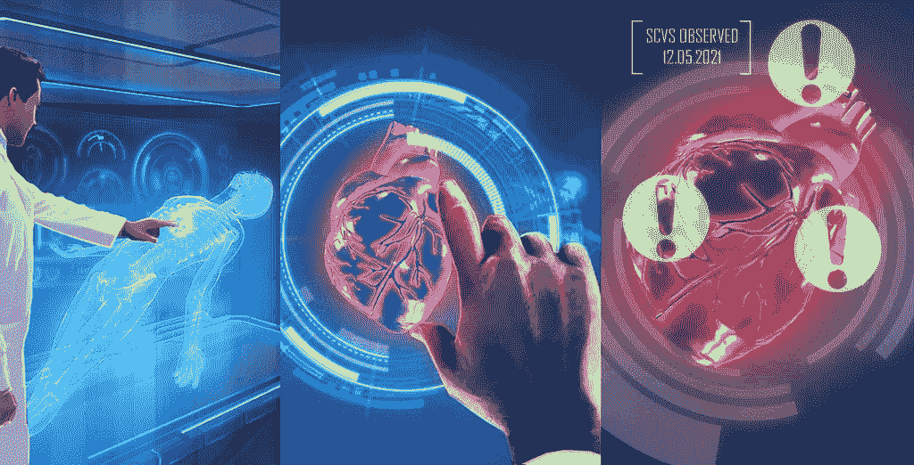

# 医学成像中的人工智能

> 原文：<https://medium.datadriveninvestor.com/ai-in-medical-imaging-d3d470641146?source=collection_archive---------3----------------------->

有很多关于使用人工智能分析医学成像的传言，包括来自 IBM 和 T2 谷歌的高利润努力。有多少是炒作，有多少是现实？我们可以无休止地讨论技术的现状，但非常清楚的是创新的需要。

# **成像是新的物理**

2017 年，美国完成了约 6 亿张放射学图像，其中 x 射线占 50%，这一数字多年来一直在持续增长。这种趋势有许多原因:

*   **设备** —更多更好的成像设备
*   **传统** —医学领域普遍认为成像可以带来更好的诊断和治疗
*   **满意度** —强调患者满意度，因为患者觉得他们在完成成像后得到了更好的护理
*   **法律**——减少诉讼风险，因为成像可以增加医疗决策的确定性，即使信息太多有时和太少一样危险

# **权衡:不是成本，而是人**

但是增加成像有一个很大的代价:成本。我们特别谈论的是训练有素的人员来分析图像。放射学是“幸福之路”(放射学、眼科、麻醉、皮肤病学，也被认为是具有良好工作生活平衡的四个专业)中的第一个字母，但现实是成像的增长增加了工作量，远远超过了放射科医生的供应。举例来说:梅奥的一项研究发现，在短短十年内，放射科医生已经从每分钟阅读 3 幅核磁共振图像增加到 12 幅。

当然，市场会自我调整，我们应该期待在这个过度劳累的领域出现更多的专家。但是，医学并不是一个完美的市场，事实上它是相当受管制的，这意味着供应/需求受到许多限制的调节，加上需要十年的时间来培养新一代从医学院到放射科医生。这个问题在新兴市场更为严重，这些市场正跨越式地直接进入更多的影像领域，医生严重匮乏。

# **人工智能作为解决方案**

总的来说，我坚信人工智能不会很快夺走医生的工作，而是会帮助他们提高效率，满足日益增长的需求。如果你是该领域的企业家或正在考虑创业，你可能会听说过 Arterys 在心脏 MRI 或体素云方面的努力，这些努力已经在中国广泛部署。它实际上是一个[更大的名单，获得了大量的风险投资](https://medium.com/@DrHughHarvey/the-a-z-guide-to-radiology-ai-companies-showcasing-at-rsna-2017-8c9976db90df)。我们显然有许多问题需要解决:

*   **可解释性**——我们并不总是知道如何解释一个人工智能如何得到一个特定的预测，FDA 和公众舆论将如何演变到这一点？
*   **灵敏度和特异性**——机器出现假阳性和假阴性时怎么办？
*   **隐私** —我们需要在保护患者数据和使其足够可用之间找到正确的平衡，以便算法可以利用其他个人的学习。

但人工智能对我们来说是关键，不仅能够提供更好的医疗服务，还能为更多人提供服务。

我妻子是斯坦福大学的放射科医生，我定期与其他放射科医生交流。这些都是专注于实践见解的有目的的短文(我称之为 GL；dr —良好的长度；确实读过)。如果它们能让人们对某个话题产生足够的兴趣，从而进行更深入的探索，我会感到非常兴奋。我在三星的创新部门工作，该部门名为[*NEXT*](http://samsungnext.com/)*，专注于 deep tech 中软件和服务的早期风险投资，这里表达的所有观点都是我自己的。*

