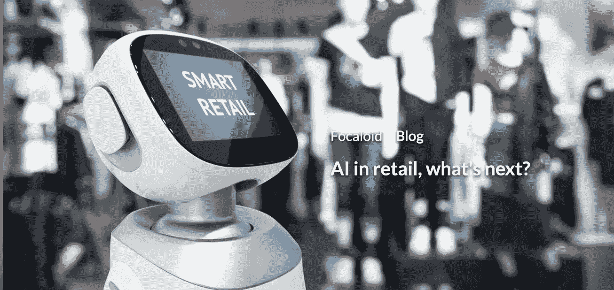

# 零售中的 AI，下一步是什么？

> 原文：<https://medium.datadriveninvestor.com/ai-in-retail-whats-next-e0fe60a940f7?source=collection_archive---------19----------------------->

当我们谈论人工智能时，大多数人认为它是科幻电影中看到的东西。然而，科幻电影也有很多现实的内容。这是因为它们只是碰巧是一种可能性的推测。

事实证明，科幻电影对人工智能的描述可能非常正确。这是因为今天，[机器](https://www.focaloid.com/services/machine-learning)似乎变得越来越聪明。这可能意味着巨大的影响。

人工智能只是指能够像人类一样思考的机器，通常在计算和技能方面超过人类的能力。这些机器还能够从过去的经验中学习，同时处理大块的数据，以便轻松解决复杂的问题，并对语言做出反应，同时还能够做出逻辑决策/预测。

在最近的谷歌 I/O 18 大会上，我们得到了一个关于谷歌助手的演示，这是非常令人费解的。这场对话看起来像是与人类进行的，而它是通过一个[人工智能](https://www.focaloid.com/services/artificial-intelligence)系统自动完成的。

就人工智能在零售业的应用而言，我们看到它的最佳形式是自学习算法。通常，算法只有一个目的。例如，可能已经编写了一个算法来为客户推荐正确的产品。为此，可能需要处理大量数据。然后，该算法将从响应和结果中学习，以便进一步改进自己，获得第二次满意的体验。如此循环往复，算法不断自我完善，达到意想不到的极限。

*亦读:*

*   [人工智能的伦理](https://www.focaloid.com/blog/the-ethics-of-ai)
*   [人工智能能力和类人机器人的发展](https://www.focaloid.com/blog/growth-in-ai-capabilities-and-humanoids)

人工智能最受欢迎的零售应用是个性化。现在，当谈到个性化时，没有人会拥有客户的所有数据。而人类也许能够弄清楚一个人在商店里买了什么。但他可能不一定能弄清楚这个人在互联网上寻找什么，他们在社交媒体上喜欢什么类型的帖子，以及他们对什么品牌最感兴趣。即使一个人设法获得关于顾客的所有这些信息，他/她也不可能将这些信息放在一起以得出令人满意的结论。

然而，人工智能系统有可能基于如此大量的数据开发出一个结果。这是因为人工智能系统能够以非常快的速度同时进行几项计算。

类似地，在零售业中进行预测是人工智能正在开发的另一个应用。这在供应链领域感受最为强烈。通过学习购物者的习惯和销售，算法有可能学习并预测一般客户的未来购物习惯。

综合上述所有例子，显然人工智能在零售业的前景是相当光明的。

*本文原载于我们* [*公司博客*](https://www.focaloid.com/blog) *。*

#机器学习#数据处理#人工智能