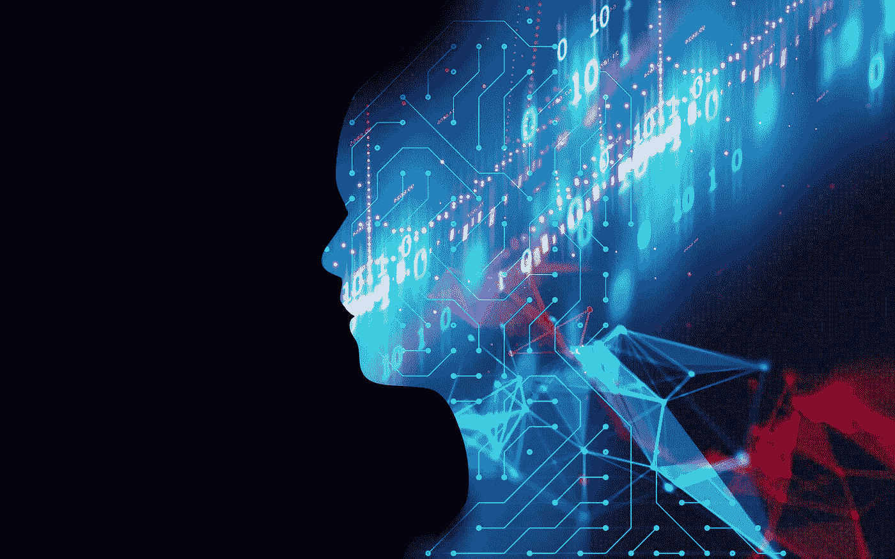
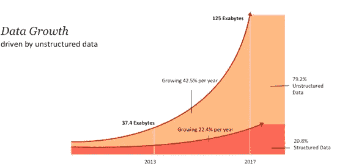
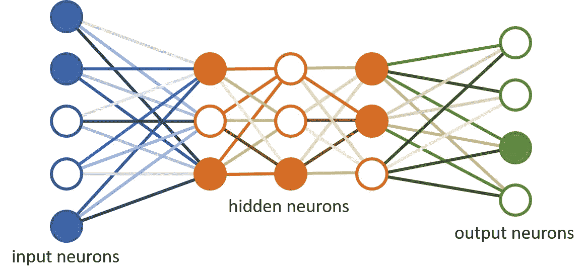
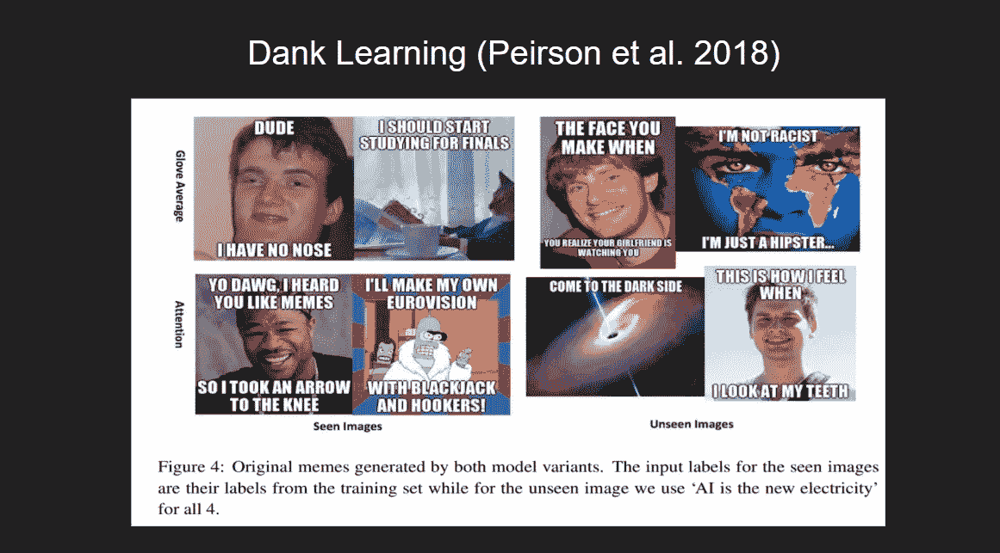
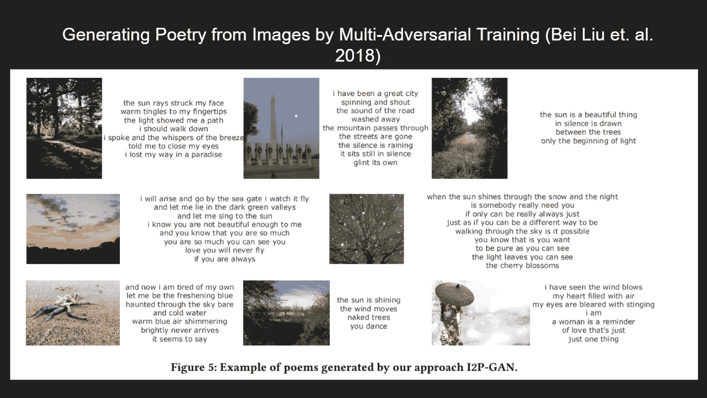

# 数据时代的人工智能。

> 原文：<https://medium.datadriveninvestor.com/ai-in-the-data-age-4a532146cfb6?source=collection_archive---------24----------------------->

“我们是历史的中间产物。生得太晚探索地球，生得太早探索星辰。”

有一天，我在网上偶然发现了这句话，它让我开始思考。从表面上看，这种想法的症结是令人沮丧的。在地球上各种各样的沙漠、海洋、森林、热带、高山森林和永久冻土的广阔景观中，无论我们漫游到哪里，我们永远不会是第一个踏上这个地方的人。简而言之，我们在地球上的生活将被已经被思考和探索过的思想和地方所玷污。

The exploration of the South Pole by Roald Amundsen in 1911.

但是回顾历史，在我们之前一百年，分别在 1909 年和 1911 年，人类探索了北极和南极。从那以后，我们取得的进展令人震惊。1903 年，人类成功地发明了第一架重于空气的动力飞机。到 1959 年，我们登上了月球，尽管是坠毁。

虽然看起来我们现在的时代没有我们已经离开的时代，或者随着星际旅行的到来而预示的时代那么令人兴奋，但我们现在的日子是严峻和没有结果的事实是一种误解。

首先，人工智能和深度学习正在推动计算机科学、大数据分析、经济学和包括语言学和音乐在内的其他各种领域的创新，并且正在以前所未有的规模和势头进行。

# 为什么是这样，为什么是现在？

人工智能并不是一个新概念。这个术语本身已经有 50 多年的历史了，最早是由约翰·麦卡锡在 1955 年创造的。经典人工智能首先集中在手工制定的规则(if-then-else 语句)上，以引出计算机的智能行为，而机器学习和深度学习等现代方法使用复杂的统计和计算模型来复制人类在某些任务中的行为。到目前为止，它已经在一些狭义的领域和环境中显示出巨大的成果。

 [## 人工神经网络优于人类的 6 个领域

### 客人五年前，研究人员在软件的准确性方面取得了一个突然的相当大的飞跃，可以解释…

venturebeat.com](https://venturebeat.com/2017/12/08/6-areas-where-artificial-neural-networks-outperform-humans/) 

最近人工智能的热潮，主要是由深度学习的子领域推动的，是计算领域两个发展的症状——我们在数字时代产生的天文数据量和几个并行计算设备的发展，如 GPU，或谷歌最近的 TPUs 或张量处理单元。

A recent study shows the world’s total data is doubling every two years.

# 使这成为可能的主要理论突破是什么？

当前时代的大多数人工智能创新都是由深度学习驱动的，利用我们正在生成的大量数据，通过使用 GPU 或 TPU 对其进行训练。机器学习和深度学习由可以“从数据中学习”的计算模型组成。

假设给你一张榴莲和百香果的图片。你研究这些图像，给出任意数量的榴莲或西番莲的图像，你就能分辨出哪个是哪个。深度学习方法的工作方式类似，只是它们需要大量的所述图像来训练它们，以便能够预测输入图像是榴莲还是西番莲。

深度学习依赖于一种称为神经网络的计算模型，这种模型是由人类脑细胞及其细胞间连接激发的。

A typical Neural Network. Data flows from the input neurons to the output side, undergoing several operations in between, outputting the necessary data we need and have trained it for.

对于在物体检测和自动驾驶汽车中使用的计算机视觉，我们使用一种称为卷积神经网络(CNN)的神经网络架构的变体，由 Yann Le Cun 等人构建。艾尔。基于人类的视觉皮层。

Data Being Processed by a CNN

神经网络的其他几种变体也存在，促成它们显著成功的统一因素是它们利用数据和处理能力的能力。

# 使用人工智能构建的一些令人兴奋的应用程序:

这就是人工智能真正吸引了世界各地人们注意力的地方。更早的时候，研究可能被视为纯粹的学术追求，广泛脱离生活的主要实际方面，这是非常正确的，但现在，随着 AI 涉足艺术，文化和前所未有的破坏社会结构，它已经成为一个非常有趣的话题。

我将举例说明研究人员发现的人工智能和深度学习的一些古怪应用:

Dank Learning, developed at Stanford is a meme generating engine that given images, generates sarcastic meme-like text for the same.

In a recent paper from Kyoto University, researchers have made a system using GANs to generate poetry from images so that the poems give a lyrical description of image being processed.

最后，我们有谷歌大脑团队的 Magenta，它在人工智能增强艺术方面做了一些有趣的工作。

 [## 品红

### 一个探索机器学习在艺术和音乐创作过程中的作用的研究项目。

magenta.tensorflow.org](https://magenta.tensorflow.org/) 

下面是 Magenta 通过潜在空间可视化在音乐中创造新的和新颖的声音的工作演示:

[https://www.youtube.com/watch?v=iTXU9Z0NYoU](https://www.youtube.com/watch?v=iTXU9Z0NYoU)

世界各地的其他几个实验室正在与深度学习合作，以创造新的方法，以人类的方式利用人工智能，帮助我们解决人类今天面临的许多问题。

# 现在怎么办？

最后，我想引用斯坦福大学人工智能实验室主任费·李非关于当今人工智能最重要的观察之一。她强调人工智能人性化的一面，并认为我们可以以一种良性的方式使用它，增强我们对生活和目标的意识，而不是削弱它。

> “我经常告诉我的学生不要被‘人工智能’这个名字误导——它一点也不人工。人工智能是由人类制造的，旨在由人类来表现，并最终影响人类的生活和人类社会。"
> 
> 费-李非

