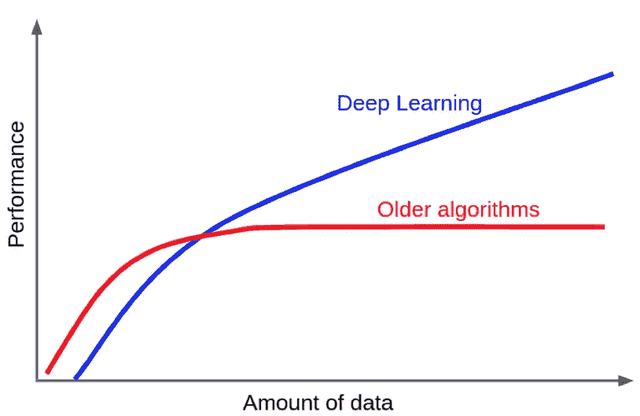
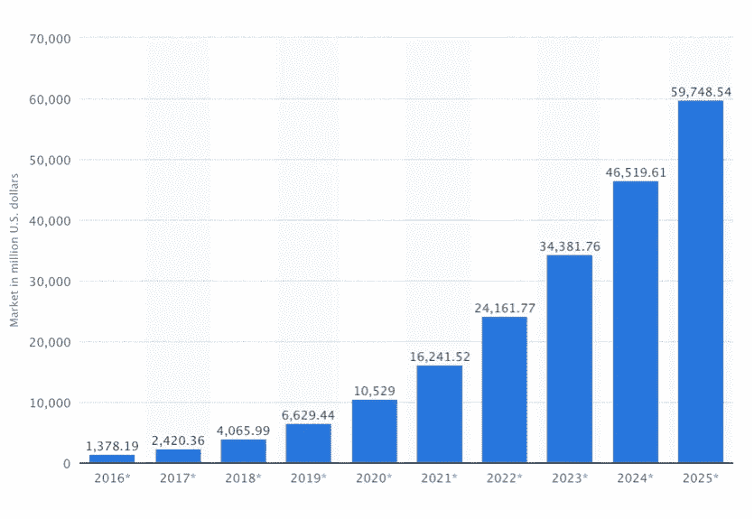
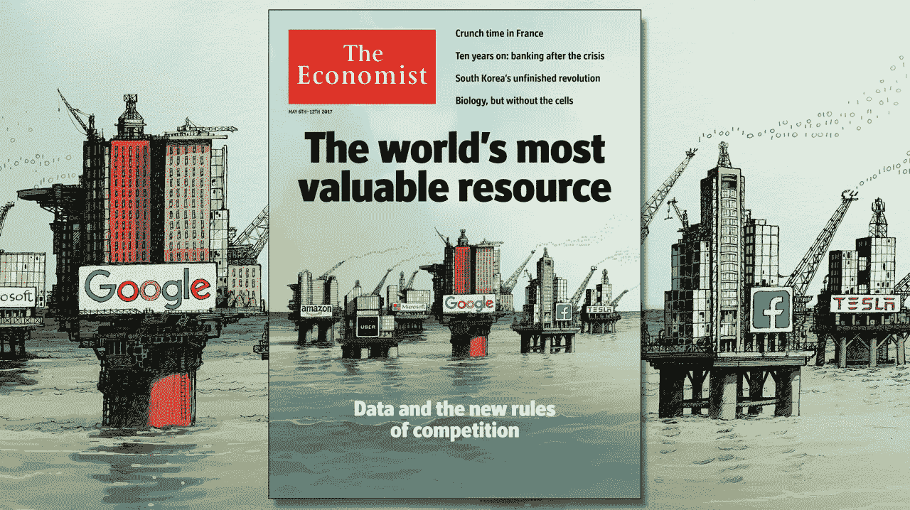

# 中西部的人工智能

> 原文：<https://medium.datadriveninvestor.com/ai-in-the-midwest-5e24dbef4b18?source=collection_archive---------1----------------------->

> 以下是我在我们最近的 Prepare.ai 大会上的开场白。2018 年 5 月 8 日，来自全国各地的 300 多名与会者和 30 名发言者齐聚圣路易斯，分享关于人工智能的见解和学习。太棒了！

早上好，欢迎来到首届 Prepare.ai 人工智能大会。Prepare.ai 是一个 501c3 非营利组织，总部设在圣路易斯。我们的使命是让你为人工智能带来的机遇和挑战做好准备。本次会议是这一使命的中心舞台，我非常感谢你们今天来到这里分享这一使命。

我们是在一年多前由圣路易斯的两位连续科技企业家大卫·卡兰迪什和克里斯·西姆斯创立的，他们认为人工智能的高潮是一个关键的成功因素，可以决定我们城市的经济未来。Prepare.ai 致力于进行 ai 研究，连接人，创建资源，协调类似于这种事件；所有这些都是为了让所有人都能参与人工智能革命。

# 人工智能革命

虽然头条新闻和嗡嗡声很难错过，但让我通过回顾事实，为您带来人工智能革命的焦点。

新的深度学习技术，由大数据和计算能力的不可思议的激增而实现，已经打开了传统方法停滞不前的全新前沿。

Deep Neural Net Performance Trends

这释放了新的商业价值。人工智能在 2017 年已经是一个 20 亿美元的市场，预计到 2025 年将每年增长 50%，让我再说一遍，每年增长 50%，达到 600 亿美元的全球市场！

Global AI Market Size Projections. Source: [https://www.tractica.com/nwsroom/press-releases/artificial-intelligence-software-revenue-to-reach-59-8-billion-worldwide-by-2025/](https://www.tractica.com/nwsroom/press-releases/artificial-intelligence-software-revenue-to-reach-59-8-billion-worldwide-by-2025/)

在今天的会议中，你将看到人工智能的能力，以及为什么它如此重要。从重新定义交通部门的自动驾驶汽车到震撼医疗保健世界的自动化医疗诊断。在接下来的几年里，这些新形式的机器智能将变得无处不在；从根本上破坏了工作的意义…生活的意义…甚至在某些情况下，对人类的意义。

人工智能的力量将加速生产力，提高福祉，并推动前所未有的财富创造。整个行业将以我们从未经历过的代内速度兴衰，

我们有责任公平分配收益和成本。个人和社区不会不知不觉地陷入技术洪流中。

# 圣路易斯的 AI

你可能不知道的是，圣路易斯已经成为全国和全球人工智能创新的中心。就在这个地铁站里，一支由数据科学家、学者、工程师和商业人士组成的大军正在人工智能开发和部署的先锋队中强劲奔跑。

让我非常明确地说:人工智能革命不是硅谷或纽约市少数几个精选社区的领域。这一对话是全球性的，因为有三个跨领域和前所未有的发展:

1.  令人兴奋的对开源计算机代码的可访问性——工具和知识被协作构建并自由共享。
2.  **在视频论坛，如大型在线公开课(MOOCs)上，从世界领先的专家那里学习的能力**
3.  **大量公开可用的数据集**有数百万甚至数十亿的数据点供机器学习算法消化和训练…

## **圣路易斯优势 1:人**

这场革命仍处于早期，在中心地带，我们完全有能力抓住先发优势——我们有一大批专业人士和学生，他们拥有在人工智能革命中茁壮成长的所有必备技能:

*   构建 AI 所需的技能:*数学、科学、统计、分析*
*   部署人工智能的技能:*设计、沟通、管理、战略*
*   以及有效利用人工智能的技能:*综合、护理、教学、创造力*

## 圣路易斯优势 2:数据

《经济学人》将数据称为数字经济中的“新石油”。在圣路易斯，我所描述的这支队伍已经在运营着一些全国最大的数据管道。为医疗保健、金融服务、运输、能源等行业处理和管理大量信息。

The Economist: Data is the New Oil

## 圣路易斯优势 3:文化和心态

最后，我认为还有一个更抽象的战略优势不应该被忽视:我们的中西部文化实用主义。

当有如此多的宣传时，

当有这么多危险的时候，

必须采取慎重的态度。有许多方法可以应对这场人工智能革命:在一个极端，你可以把头埋在沙子里，假装什么都没有改变。在另一个极端，你可以不顾后果地加速前进——如果你的商业模式是可行的，或者如果有道德后果。

我认为我们的生态系统在“展示给我看”的状态中拥有正念和勇气的正确平衡，能够成为人工智能领域的成功领导者。

我想今天在座的所有人。人工智能会议…我想你们就是我想要的在人工智能革命中驾驶这艘船的人。

谢谢大家！

*戴夫·科斯特纳罗是* [*产能*](http://www.capacity.com/) *的首席数据官，也是*[*prepare . ai*](http://www.prepare.ai/)*的技术总监。第二届 Prepare.ai 年会将于 2019 年 4 月在圣路易斯举行。在*[*prepare . ai*](http://www.prepare.ai)*加入邮件列表，保持更新。*