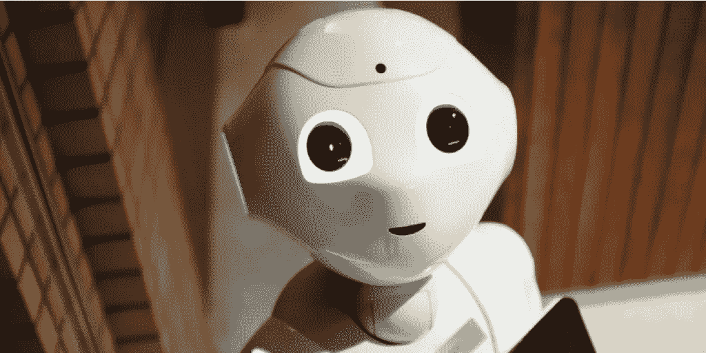

# 人工智能在工作领域的应用

> 原文：<https://medium.datadriveninvestor.com/ai-in-the-world-of-work-bf790f22d7a4?source=collection_archive---------38----------------------->

人工智能是工作世界中越来越重要的力量。围绕大数据和机器学习的机会扩展了人工智能的能力，关于人工智能在工作领域的文章每天都像打地鼠一样涌现。但是，尽管自动化和机器人是人力资源技术的杰出补充(当然，我们自己的聊天机器人是最好的例子之一)，当我们谈论工作世界中的人工智能时，我们真正需要思考的是什么？

我会在以后的博客中补充这些想法，但首先想到的也是最基本的一点是:

只有在真正的人类思维的驱动下，人工智能才会在工作领域取得成功。

技术从根本上来说是中立的——它没有先入之见，没有先天条件，也没有情感。这是一本白纸——一本空白的书。也就是说，直到人类参与进来，并且“作者”把他们的世界观印在技术上。

*“在每一个数据或人工智能应用的背后，都坐着一个有偏见的人。”*

在这里，偏见听起来像是一种疾病，但它并不像听起来那么可怕。通常，人类创造技术来解决问题——他们的心是在正确的地方，只要正确的思考和规划已经完成，技术将补充人类的存在。

当我们没有充分考虑到人类物质世界的影响因素时，事情就会变得混乱。

我们中的许多人都有过这样的经历:购买了一项显然可以解决我们所有问题的技术，却发现它背后的人和流程并没有为此做好准备。人工智能在工作领域也是如此——如果你在寻找具有前瞻性思维的系统，那么定位具有前瞻性思维的人和流程也很重要，这样技术才能称赞人，而不是相反。

**但它比这更深刻……**

让我们从人类的角度来考虑人工智能，并更详细地观察它。

最近有人谈到用人工智能取代人类招聘人员，人工智能可以检测求职者脸上最轻微的表情，并根据收集的数据得出关于一个人的感情和性格的结论。这里的自然假设是，人工智能可以评估求职者比人类好到什么程度。从候选人的角度来看，有一些方法可以改善就业机会，这是可以学习的。

这项技术本身不会完美无缺——它可能会被前述的学习反应所操纵，围绕机器的训练可能会出现问题:它在哪些人脸上接受过训练？它能够收集的数据是否足够可靠，足以排除人们的就业机会？在此基础上，这甚至可能是歧视吗？

我认为，在工作领域，这不是好的人工智能实践。在这种情况下，技术应该帮助人类做他们的工作，而不是完全取代他们——特别是当招聘过程应该促进人与人之间的互动时。

希望这个例子表明，在工作世界的许多人的方面仍然需要人类，当谈到人工智能时，在许多优秀的选择中有糟糕的选择。作为人类，我们有责任确保我们在工作领域的人工智能选择会放大而不是降低人类的价值、公平和幸福。

用苹果首席执行官蒂姆·库克的话来说，*“我不担心人工智能赋予计算机像人类一样思考的能力，我更担心人们像计算机一样思考，没有价值观或同情心，不考虑后果。”*

*最初发表于*[T5【www.people-first.com】](https://www.people-first.com/blog/ai-in-the-world-of-work/)*。*

