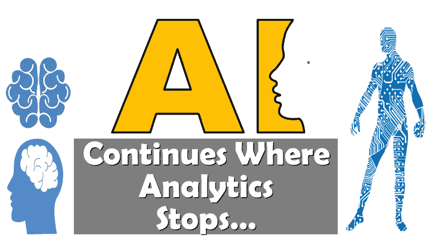
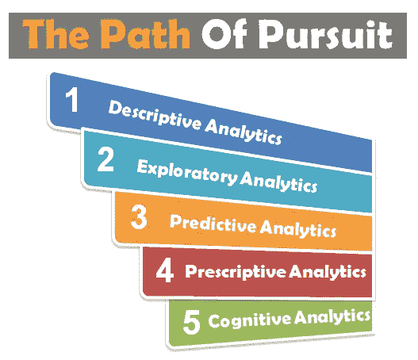
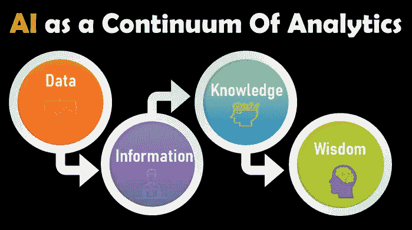

# 人工智能在分析停止的地方继续…

> 原文：<https://medium.datadriveninvestor.com/ai-is-a-new-buzzword-but-there-has-been-a-lot-of-talk-around-analytics-and-prospects-over-a-decade-b38469d78389?source=collection_archive---------19----------------------->

人工智能是一个新的流行词，但过去十年来，围绕分析和前景已经有了很多讨论。在这里，我们提出了一个观点，即人工智能是一个连续的分析

让我们看看如何...

数据科学和分析的不同方法起源于统计领域。

另一方面，人工智能已经从计算机科学中脱颖而出，成为研究“智能代理”的实践和科学。

> 大卫·l·普尔的《人工智能:计算代理的基础》(第二版)

方法是将 AI 视为用一个新的维度扩展常规分析，即认知分析，这是现有分析形式的扩展。传统分析停留在基于统计技术的规定性分析。人工智能使我们能够在分析中拥有认知能力——在分析中模仿人类智能

传统分析侧重于信息(BI 或商业智能)层面，并像传统预测分析一样将其扩展到模式和预测的提取。但是，在将此扩展到显示智慧的系统时，我们进入了人工智能的领域。人工智能以智慧的形式提供了自主性，以根据原始数据的推断做出自动决策。因此，人工智能可以成为创造智能系统的推动者，并扩展传统的数据科学。

因此，人工智能和分析可以被视为一个连续体，而不是分离的。它还推动了对人工智能科学家的强烈需求，数据科学家在跨学科业务中工作，为客户提供人工智能和分析解决方案。

**关闭思路:**

人工智能是分析的持续扩展，赋予应用程序智慧和自主权，其中分析在人类利用预测和其他类型的分析做出决定的水平上停止。然而，服务于这些级别的根和核心算法基于类似的基础算法，如基于机器学习的分类、回归或聚类。只有人工智能通过其视觉和 NLP 算法在非结构化数据上更强大。

我希望这是对分析和人工智能统一方法的公开呼吁。