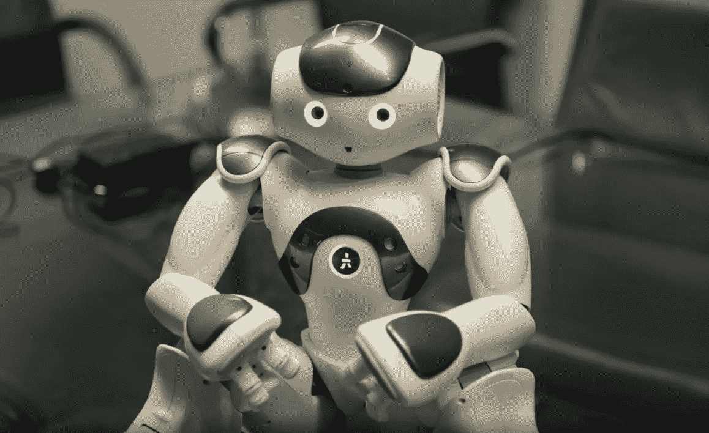
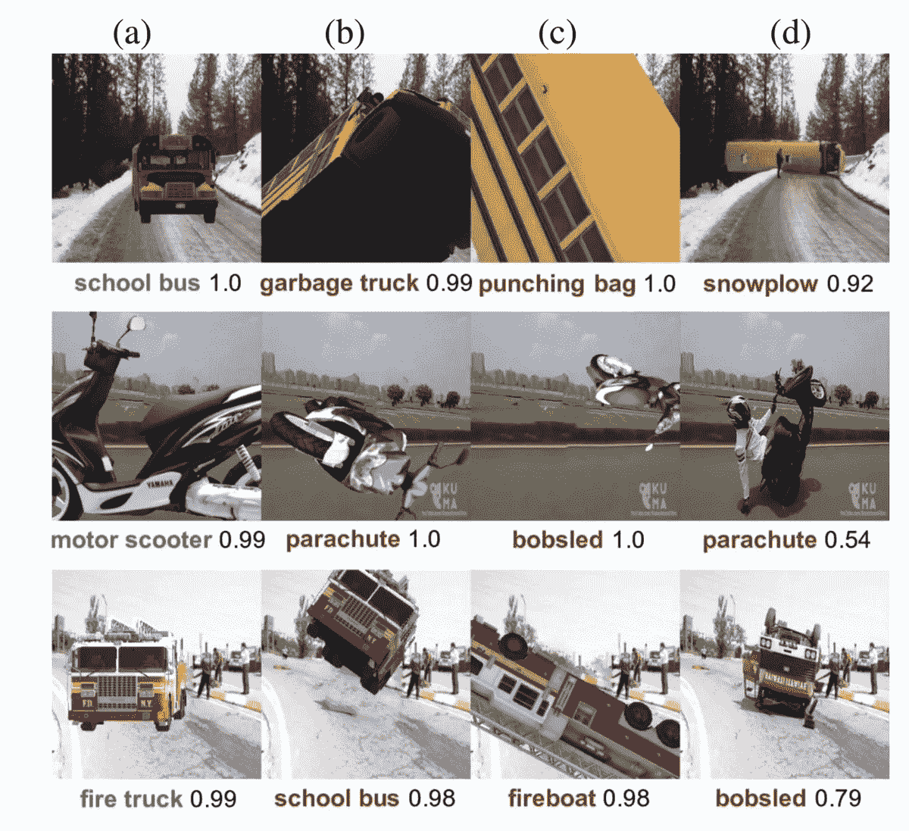

# 人工智能将变得更大，更好，也更无聊

> 原文：<https://medium.datadriveninvestor.com/ai-is-about-to-get-bigger-better-and-more-boring-e36b2d72c23a?source=collection_archive---------23----------------------->

## 最佳实践 AI 对 2019 年的六大 AI 预测

**人工智能商业工具包和教育将冲击董事会和高管的办公桌**

高管们现在知道人工智能很重要，但不太清楚人工智能如何帮助他们重塑商业模式、降低成本、提高生产率、增加收入和改变客户体验。他们担心错过机会，但同样担心围绕人工智能的道德、法律和品牌声誉风险的头条新闻。2019 年，我们将看到多个高管教育工具包的推出，以帮助提供一个指导框架，帮助正确看待人工智能并推动采用。

**AI 将越来越成为地缘政治安全考量**

2018 年是各国和各地区宣布大规模计划的一年，这些计划旨在帮助发展必要的人工智能技能、资本以及公共和私营部门合作，以推动采用。英国宣布了一项 13 亿美元的计划，法国 18 亿美元，欧洲 220 亿美元，据称还有超过 1400 亿美元将用于中国的大型基金。在人工智能领域，规模越大越好——更多的技能、更多的数据、更多的资本和更有利的监管环境推动着采用和成功的良性循环。但 2019 年，人工智能将日益成为国家军事和经济安全的问题。各国，尤其是美国，将开始讨论对关键人工智能技术进出口的控制。这如何与人工智能研究的开放性相一致还有待观察，但随着贸易和地缘政治紧张局势的加剧，人工智能也将作为胡萝卜和大棒被吸引进来。

**要求监管人工智能的呼声将来自最奇怪的地方**

2018 年也是关于人工智能道德风险的讨论获得广泛关注的一年，政策制定者开始考虑新法规的需求。经常引用的例子包括有偏见的招聘，面部识别和隐私侵犯，以及潜在的违反反歧视法的行为。但在 2019 年，我们将看到微软等科技巨头——是的，微软因垄断行为受到欧洲监管机构的严厉惩罚——呼吁监管。为什么？正如该公司最近所说的那样，[“我们认为，让科技公司被迫在社会责任和市场成功之间做出选择的商业竞争不会给这个世界带来最好的好处”。但是，尽管在对社会负责任地使用技术的承诺上可能存在普遍共识，但监管将如何确保不仅是科技巨头在面部识别和其他认知任务上获得市场成功？](https://blogs.microsoft.com/on-the-issues/2018/12/06/facial-recognition-its-time-for-action/)

**关于人工智能相当无聊，但却很有价值的严酷事实将被揭示**

人工智能登月占据头条。来自 Waymo、特斯拉、优步和底特律汽车公司的自动驾驶汽车描绘了一幅未来几年街道将由计算机驾驶的画面。如果更多的反乌托邦预言是可信的，到 2030 年，30%的工作将是自动化的，从病理学家开始，他们现在也可以回到学校。但现实是，这些登月计划还有很长的路要走。相反，人工智能正悄悄融入全球大型组织的结构。人工智能正被用于帮助优化供应链和物流、协助客户服务人员、个性化产品和服务、预测客户流失、分析大量文件、改善制造以及保护公司免受网络风险。有数百个人工智能用例将共同帮助推动组织的显著绩效改善，但与登月相比，这些是业务流程中更分散的任务和步骤。2019 年，我们将开始听到更多关于人工智能如何实际部署以取得成功的消息，特别是在金融服务和营销领域。

**AI 创业公司会学到 B2B 销售真的很难**

AI 创业公司比比皆是。仅在伦敦，一份最近的市长报告显示就有超过 650 个。这一数字反映了英国在人工智能领域的历史学术实力与早期资本和经验日益丰富的企业家的健康生态系统的结合。在金融、建筑、农业、营销、零售、客户服务、制造以及许多其他部门和职能中，都有人工智能初创公司。他们由才华横溢的创始团队领导，团队中充满了世界级的人工智能工程大脑。但 2019 年将是人工智能创业公司试图将其 MVP 大规模推向市场的一年。而且随着大部分 AI 创业公司都是 B2B，创始人会了解到企业和公司销售真的很辛苦。为极高价值的用例开发、培养和鉴定销售渠道，以及有能力的人工智能销售人员，将是游戏的名称。

**更多混合解决方案应对机器学习的脆弱性**

去年——和之前的许多年一样——我们听到了人工智能将如何在图像识别、语音识别和自然语言处理方面超过人类的说法。虽然 ML 确实在这些领域取得了令人难以置信的进步，并将广泛嵌入组织过程，但它也非常脆弱。arXiv 的一篇论文“Strike (with) a Pose:神经网络很容易被熟悉物体的奇怪姿势所欺骗”(Alcorn et al 2018)，[显示了机器学习视觉如何容易被校车变成扫雪机或摩托车变成降落伞](https://arxiv.org/pdf/1811.11553.pdf)。机器学习目前还不够，2019 年将会有很多关于实现混合和符号系统来表示更高级别的概念和推理的讨论，从而制造更强大的系统。

From Alcorn et al. (2018) “Strike (with) a Pose: Neural Networks Are Easily Fooled by Strange Poses of Familiar Objects”

[*最佳实践人工智能*](https://www.bestpractice.ai/) *是一家总部位于伦敦的精品执行顾问公司，帮助企业、中小企业、公共部门和私募股权实施其人工智能计划。他们的任务是揭开人工智能的神秘面纱，并加速其应用。* [*最佳实践人工智能库*](https://www.bestpractice.ai/) *是一个免费资源，包含全球最大的业务用例(600 多个)和案例研究(1000 多个)，涵盖 40 多个行业、60 多个职能部门和 60 多个国家。该库旨在帮助高管回答关于什么是人工智能、它目前如何应用以及它如何在您的组织中部署的问题。*