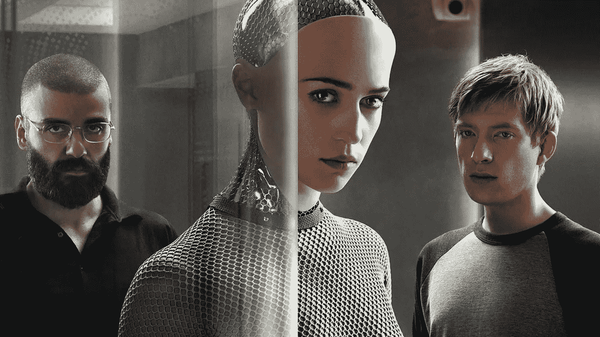

# AI 是不可能的。游戏玩家演示了原因。

> 原文：<https://medium.datadriveninvestor.com/ai-is-impossible-gamers-demonstrate-why-8b7f7659dafe?source=collection_archive---------11----------------------->

## 玩家论坛的语言，前玛奇纳和哲学家路德维希·维特斯坦根有什么共同之处？

Alex Garland’s Ex Machina explores the idea that machines can convince humans that they are sentient

我们已经得到警告:白领末日即将来临。脑力劳动正受到威胁。医药、银行、新闻和营销等领域的工作将在一股数字烟雾中消失。

虽然外包和装配线在 80 年代和 90 年代大量减少了(西方)熟练劳动力，但对(全球)智力劳动的威胁将在我们眼皮底下大量内包:人工智能(AI)。

我们正面临着被会思考的机器取代的危险。末日论者说，这不是是否会发生的问题，而是何时发生的问题。AI 必然会发生。

但是……是吗？

似乎如果你阅读科学媒体，答案必然是肯定的。但这是不可能的。为什么？因为人工智能是关于复制大脑的，思考不仅仅是大脑。机器真的能思考吗？我不是指计算或处理*，*我是指*思维。*

这里值得一提的是，AI 的定义因上下文而异。我将利用这一时刻，把它固定在大众认知中最常见的一点上:机器思考并与人类互动的能力*，而人类无法分辨它是否是机器*——即我们现在所说的“强人工智能”或“全”人工智能。正如我们所知，这是一种对人类生活构成重大威胁的人工智能。

机器能像人一样思考吗？他们能以有意义的方式与人交流吗？他们能感同身受吗？

# 请讲话

这个问题的答案是黑客和后来的游戏玩家在网络论坛上用“L337”回答的。这些对话者最大限度地展示了语言的有机使用，这是一种不断发展的交流，永远不会受到一套规则的限制。

l337(“LEET”，是“精英”的缩写)语言起源于 20 世纪 80 年代的公告板系统，但随着搜索引擎的出现而真正起飞。作为黑客、破解者和游戏玩家，互联网的“精英”试图通过搜索引擎机器人和公告板过滤器来隐藏他们的消息。

据黑客历史学家布鲁斯·斯特林(Bruce Sterling)称，L337 可以追溯到在 Sundevil 行动期间为迷惑 FBI 和 NSA 监听程序而开发的加密方法(它确实成功地迷惑了他们)。它继续在像*反恐精英*这样的网络游戏论坛中被广泛使用。

Ironically it’s the players of games like Counter Strike who have demonstrated that language is embedded in a “form of life” and that its full use is unreachable to machines. The organic development of “L337” language disguises conversations from “sniffing” programs that scan the web, but also demonstrates that language is not simply a matter of following rules.

但是 L337 不仅仅是一个加密系统。L337 的强大之处在于它进化如此之快，以其奇怪的克理奥尔语(暗语、缩写词、反义词、俚语、密码和象形文字)将语言延伸到极限。

我记得当我还是一个年轻玩家的时候，在网络游戏论坛上，我亲眼目睹了一种语言的演变，因为用户们将拼字法推向了极限。单词和短语衰退成看似随机的符号流，这些符号——尽管可能性不大——*有意义*。

下面是 L337 说话的两个例子:

> *omg j00 r teh sux0rz！i +0+411y pwnz j00！*
> 
> *()/\/\ 9 900 4 | 23 73 |-| 5 | _ |>0 | 25 |+0+411]* \/\/\/3 |)900！*

两者都有*相同的*含义:

> *天啊，你是冤大头！我完全控制了你！*

到目前为止，呃，平凡的人类…

那么，躲躲闪闪、难以捉摸的 1337 speak 恰恰证明了完全人工智能是不可能的。

# 维特根斯坦 Ex 玛奇纳

亚历克斯·嘉兰的 *Ex 玛奇纳* (2015)，在角色之间一场惊心动魄、有时令人震惊的猫捉老鼠的游戏中，探索了人工智能的主题。

一家搜索引擎公司的雇员，凯勒·史密斯(多姆纳尔·格里森饰)，赢得了一张金色的入场券，可以和公司隐居的老板一起住在他在山里的豪华别墅里。

当凯莱布到达时，他的老板内森·贝特曼(奥斯卡·伊萨克饰)向他介绍了一个名叫艾娃的人工智能，它被安置在一个漂亮的女性机器人的身体里。迦勒被告知，他是一个实验的一部分，以确定艾娃是否真的有知觉。

我不会破坏电影的其余部分，但这个想法本质上是要看看艾娃是否能引诱迦勒为她做些什么。然而，这部电影确实留下了艾娃是否完全人工智能的问题，并且以一种辉煌的方式做到了这一点。

电影中有一个有趣的复活节彩蛋，这也许给了我们一个强有力的线索，告诉我们艾娃是否获得了“完全人工智能”的地位。奥斯卡·伊萨克科技巨头内森·贝特曼发家致富的搜索引擎名为“蓝皮书”

参考是从路德维希·维特斯坦根 1933/34 年的演讲中复制的一本书，蓝皮书。维特根斯坦是一位奥地利哲学家，他在剑桥度过了他的大部分教学生涯。在导师伯特兰·罗素的影响下，维特根斯坦试图通过考察语言本身来解决哲学问题。

罗素的门徒后来成为了 20 世纪最重要的哲学家，他向我们展示了我们是如何深深地陷入语言的网中，以及对我们一些最深刻的信念，包括“意识”所带来的问题。

在艾伦·图灵(Alan Turing)提出我们所知的模仿游戏图灵测试(Turing Test)之前的十年，这位哲学家就考虑过人工智能。事实上，维特根斯坦甚至在“人工智能”这个术语被创造出来之前就已经考虑过它了。

Ludwig Wittgenstein

维特根斯坦在理论上怀疑机器是否会思考。他得出结论，他们不能。其中一个原因是，机器不可能共享人类的“生命形式”，而人类的“生命形式”是共享意义视界所必需的。

# 语言游戏

值得后退一步，看看维特根斯坦是如何得出这个结论的(我将对此进行解释)。作为一个年轻人，他认为语言就像是世界的一幅图画，在这幅图画中，单词是指称物，句子是事实的陈述。这是他在第一次世界大战期间写于战壕中的开创性著作《逻辑哲学研究》(T1，1921)中提出的理论。

但是人类语言不是一个参考系统。当一个愤怒的骑车人在街上向维特根斯坦竖起手指时，他意识到自己在理论中犯了一个错误。向某人竖中指或击掌背后的“事实”是什么？还是眨眼？

相反，维特根斯坦开始将语言视为没有统一本质的无限数量的游戏式活动，而不是一个统一的、有凝聚力的世界图景。

In Ex Machina, a tech mogul dreams of creating the “perfect” AI. To test it he enlists the help of an unwitting subject. In the movie Caleb (right) spends hours simply talking to Ava (middle).

向某人竖中指、眨眼、索要某物、数数或者降半旗，这些都是*尽可能以无限的方式使用*语言的方式。

这就是为什么游戏是完美的类比:游戏是无限可变的，然而我们可以很快就游戏的构成达成一致，尽管它可能与另一个游戏没有任何共同点。单人纸牌游戏与棒球几乎没有任何共同之处，*《反恐精英》*与和狗玩接物游戏没有任何共同之处，但我们*知道*它们是游戏。

为什么？维特根斯坦认为，因为它们有*家族相似性*:游戏没有一个共同点，一些游戏可能没有共同点，但它们通过一系列属性连接在一起，这些属性构成了游戏的总和。

*单人纸牌游戏*就像顶级王牌一样涉及纸牌，顶级王牌像棒球一样有分数，棒球就像跆拳道一样击败对手，就像*反恐精英*一样涉及战斗。接龙和*反恐精英*只有一个共同点:都是游戏。

维特根斯坦认为，“语言游戏”是相似的，而且重要的是，就像游戏一样，它们可以是而且是当场编造的。

在*蓝皮书*中，维特根斯坦写道:

> “总的来说，我们不按照严格的规则使用语言——也没有通过严格的规则教会我们。”

这就是为什么 L337 speak 可以发展得如此之快，但仍然可以理解——这是一个经验共享的问题，不仅仅是理解和遵守规则，而且还要塑造它们:对规则的解释的直觉混合了规定和新的先例(有点像法庭上的法律)。

# 生命的形式

维特根斯坦有句名言:“如果狮子会说话，我们就不会理解它。”

为什么？因为狮子嵌入了一种不同的“生命形式”:狮子的生命形式。即使狮子会说话，它理解世界的方式也会与我们人类大相径庭，以至于我们无法理解它。电脑也是如此。这里是维特根斯坦的另一个晦涩的格言(来自*哲学研究*):

> "理解一个句子，就意味着理解一种语言."

人工智能的问题在于，语言不仅仅是各部分的总和。另一位哲学家[约翰·塞尔](https://en.wikipedia.org/wiki/John_Searle)，用现在著名的“中国房间”思维实验来证明，虽然人工智能可以遵守规则，但它不会意识到这些规则。

我现在不会深入讨论这个问题，但是你可以在这里阅读。L337 语言需要了解游戏规则变化的对话者。遵循规则的机器根本跟不上。这不是技术有一天会赶上的复杂问题，而是语言成为我们生活形式的有机组成部分的问题。

L337 语言被认为是混淆了算法，它展示了为什么机器永远无法自然使用语言。

这并不是说我们不会和机器说话，也不是说它们不会和我们说话。当然，我们已经与 Siri 和 Alexa 等机器进行了对话。关键是，如果机器被推到任何一种语言之外，局限于形式化的规则，它将无法通过图灵测试。

将科技公司描述的“人工智能”与人类智能进行比较，就像将飞机与鸟进行比较一样。当然，飞机会进入天空，但它永远不会像鸟那样灵活自如地穿过天空。

日益增长的计算能力无疑会摧毁一些职业，但它也会增加我们所做的许多工作，也许会创造我们做梦也想不到的工作。执行更多人类任务的计算机将使商业世界变得更快，也许会创造很多价值，并有望使我们的生活更轻松。

如果我们的业务是使用自然语言，那就是理解是什么让人们滴答作响。直觉是我们的媒介:我们眨眼和轻推，我们突破语言的限制，与人们建立融洽的关系，以建立信任、同情和理解。我们的工作很安全。

…或者我应该说:0()r j0%z r 54Ph。

感谢您的阅读。我希望你学到了新东西。