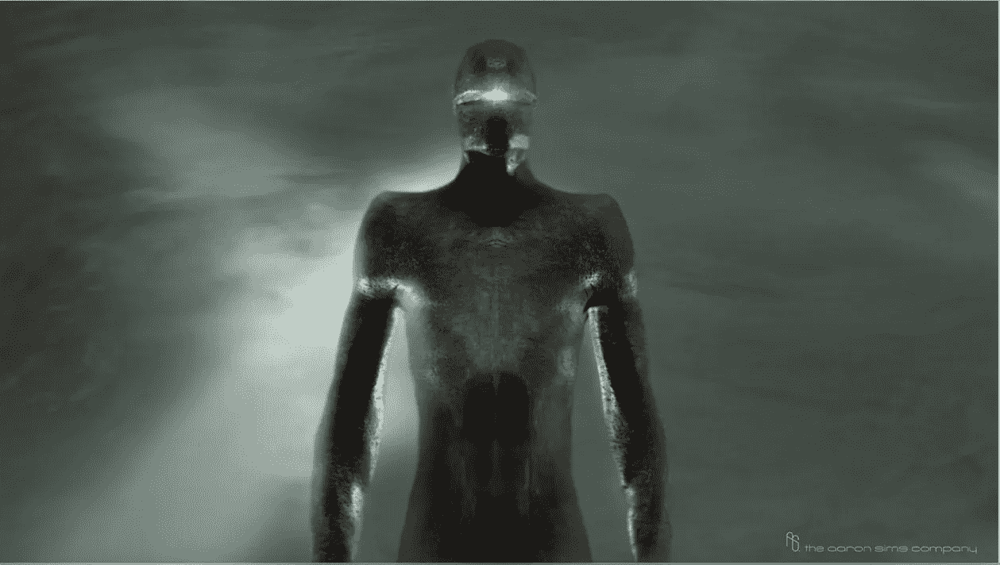
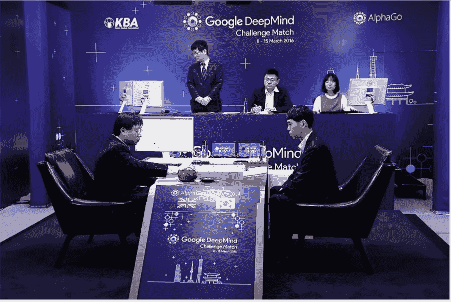
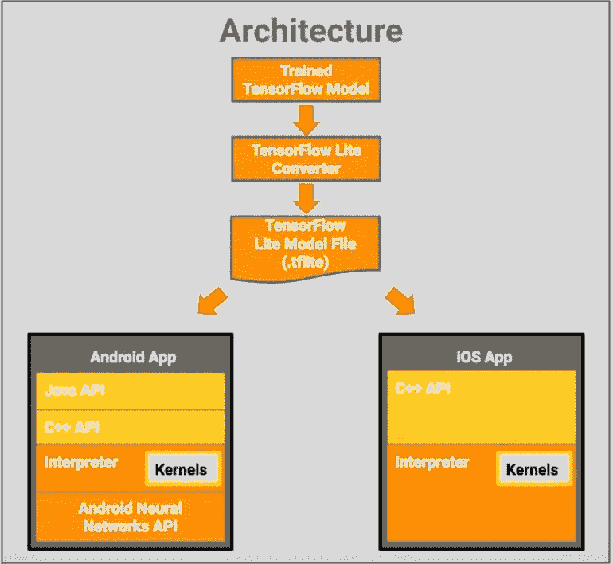

# 人工智能不是机器人，但它可以让我们变得比其他情况下更聪明

> 原文：<https://medium.datadriveninvestor.com/ai-is-not-robots-3228f27e1f84?source=collection_archive---------10----------------------->

当大多数人听到“*人工智能(AI)* 这个词时，他们会想到“*杀手机器人*”就像“*地球静止的那一天*”中的 [**Gort**](https://en.wikipedia.org/wiki/Gort_(The_Day_the_Earth_Stood_Still)) 。

但是人工智能不是机器人，机器人也不是人工智能。事实上，最近的人工智能的区别在于它的“学习”能力，这就是为什么今天的人工智能被称为“ [***机器学习***](https://en.wikipedia.org/wiki/Machine_learning) ”。有许多类型的机器人没有学习能力。也有许多机器学习应用程序没有物理体现，人形或其他。

谷歌旗下的人工智能应用“deep mind”**”打败了人类围棋世界冠军，“T22”[**Lee Sedol**](https://en.wikipedia.org/wiki/Lee_Sedol)，三局两胜，毫无体能可言。事实上，DeepMind 的 AlphaGo 靠的是[**AJA Huang**](https://en.wikipedia.org/wiki/Aja_Huang)**，**此处图为左边的**，**做它的手。在 AlphaGo“决定”下一步棋后，黄博士在棋盘上放置了一些石头。黄博士背后的*头脑*是 [AlphaGo](https://www.wired.com/tag/alphago/) 。**

** [## 模式和机器人:一个复杂的现实数据驱动的投资者

### 哈耶克的名著《复杂现象理论》(哈耶克，1964)深入探讨了复杂性的话题，并断言…

www.datadriveninvestor.com](https://www.datadriveninvestor.com/2019/03/04/patterns-and-robotics-a-complex-reality/) 

如果 DeepMind 包含在本田的 [**阿西莫**](https://en.wikipedia.org/wiki/ASIMO) 人形机器人中，它可以决定自己的动作**和**并实际执行它们。然而，所有这些对话都贬低了人工智能的真正机会，即让人类而不是机器人变得比我们更聪明，就像 AlphaGo 让黄博士看起来比没有 AlphaGo 的情况下更好。

AlphaGo Zero 相反，AlphaGo Zero 的神经网络依靠的是 [**强化学习**](https://en.wikipedia.org/wiki/Reinforcement_learning) **:** 自玩中的一个老技巧。

> “alpha Go Zero”*从零开始捡起围棋“*，根本没有研究任何人类的棋局。AlphaGo Zero 只用了三天时间，就与自己的旧版本进行了较量，并以 100 比 0 获胜。

本质上，AlphaGo Zero 是通过和自己对弈来训练的。在训练期间，“*它实际上坐在桌子的两边:同一个软件的两个实例相互面对。*

也许人工智能如何让人类变得更聪明的最好例子是在麻省理工学院研究人员最近的一篇论文中描述的，他们在论文中描述了如何使用“ [**彩票假说**](https://towardsdatascience.com/how-the-lottery-ticket-hypothesis-is-challenging-everything-we-knew-about-training-neural-networks-e56da4b0da27) ”比以前理解的更经济地建立神经网络，这是一种机器学习。([https://openreview.net/pdf?id=rJl-b3RcF7](https://openreview.net/pdf?id=rJl-b3RcF7))

> 一个随机初始化的密集神经网络包含一个被初始化的子网网络，使得当被隔离训练时，它可以在最多相同次数的迭代训练后匹配原始网络的测试精度。

旧的 AlphaGo 依靠计算密集型的蒙特卡罗树搜索来完成围棋场景。节点和分支创建了一个比 AlphaGo 实际需要的大得多的树。AlphaGo Zero 从零开始，没有专家指导，效率更高。它只使用了一台电脑和四个谷歌定制的 [TPU1](https://www.theregister.co.uk/2017/04/06/google_ai_chips_trounce_intel_nvidia/) ( [**张量处理单元**](https://en.wikipedia.org/wiki/Tensor_processing_unit) (TPU))使用谷歌的机器学习平台的芯片、 [**Tensorflow**](https://www.tensorflow.org) **、**来进行比赛，相比 AlphaGo 的几台机器和 48 个 TPU，

由于 Zero 不依赖于人类的游戏性，并且匹配的数量较少，它的蒙特卡罗树搜索也较小。谷歌声称，其 TPU 的能力是同等功耗的任何现有芯片的 10 倍以上。这是摩尔定律的三代，或者说几乎是传统计算的七年进步。

谷歌已经在提供 TensorFlow 模型，这些模型是包含机器学习网络的逻辑和知识的数据结构，经过训练可以解决特定问题。"[**TensorFlow Lite**](https://www.tensorflow.org/lite/guide)"为 Android 和 Apple 移动和物联网(IoT)设备提供转换和运行 tensor flow 模型所需的工具。

这意味着可以为便宜得多的机器和各种问题解决应用程序开发机器学习应用程序。这些发展类似于当软件应用程序可用于任天堂游戏机时发生的发展，同时也用于大型主机应用程序，如美国宇航局用于绘制月球飞行路径或处理整个美国的人口普查数据的应用程序。

任何认为这是牵强附会的人只需要回忆一下 [**摩尔定律**](https://en.wikipedia.org/wiki/Moore%27s_law) 或者 IBM 创始人 [**托马斯·沃森的**](https://en.wikipedia.org/wiki/Thomas_J._Watson) 名言“*我认为可能有五台计算机的世界市场*”。

成千上万的人工智能应用可能会有市场。人工智能应用正在快速地沿着开发学习曲线发展。当他们这样做的时候，他们会让我们每个人都变得比我们想象的更“聪明”。当然比 Gort 甚至聪明多了，他用令人生畏的激光眼试图恐吓人类！**