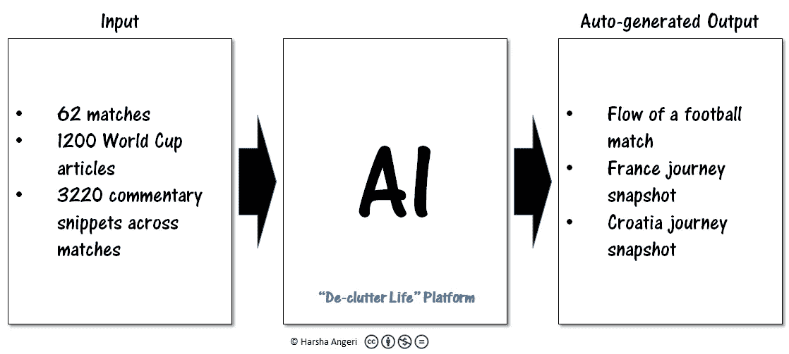
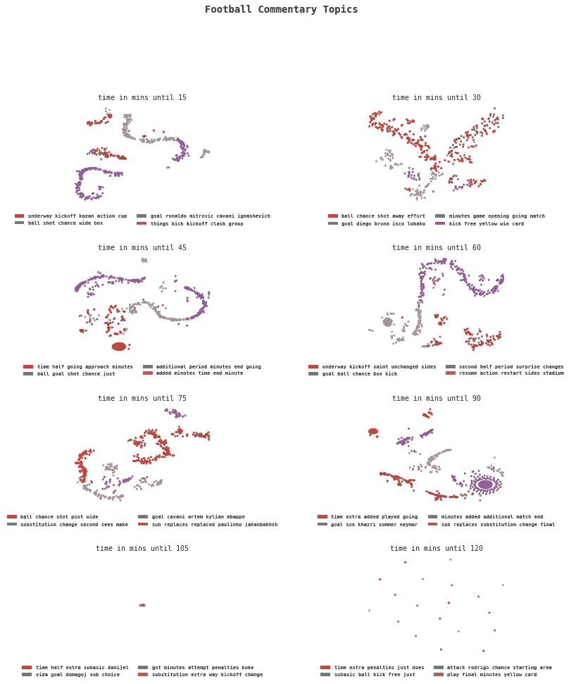
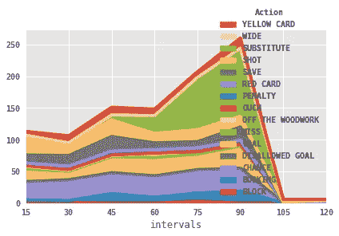
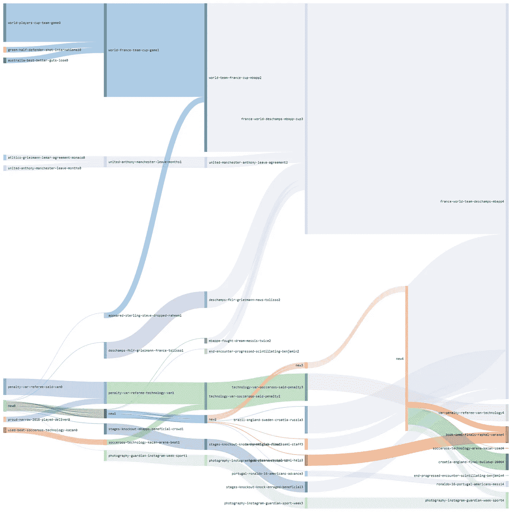
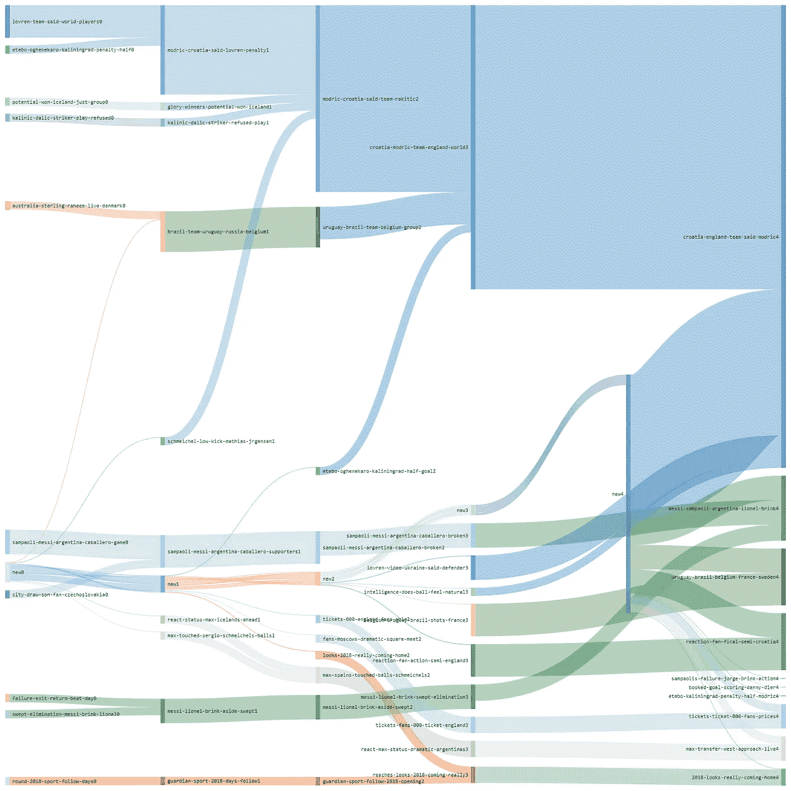

# AI 是 2018 年 D: FIFA 世界杯决赛

> 原文：<https://medium.datadriveninvestor.com/ai-is-the-d-fifa-world-cup-final-2018-c23a28d24a87?source=collection_archive---------5----------------------->

**什么是 D？**

*罚球区*(俗称“D”)从罚球区外缘开始划，距离罚球区 9.15 米；这和罚球区一起，标志着除了点球手和防守守门员之外的所有球员在点球时的禁区。当罚点球的时候，它可以让球员远离禁区。与任意球相比，清理杂物是确保射门转化率高的关键。这里 AI 是 d。

**这有助于预测吗？**

不，预测是没有用的。AI 将整理所有的信息，并给出两队在大日子到来之前的旅程的快照。

我就不能看书吗？为什么是 AI？

你可以阅读。只是每个权威来源将有 1000 篇文章，如果你没有看过比赛，你就不会知道比赛中发生了什么，除非你通读现场的文字评论。AI 将“智能地”处理这些信息，并在接下来的几分钟内为您提供一个快照，正如您在下面阅读的那样。节省了令人难以置信的时间和精力，并保证快照中没有人为偏见。下图说明了人工智能将会做什么。关于整理生活的更多细节和例子，请看我之前的博客([人工智能整理生活](https://medium.com/datadriveninvestor/ai-to-de-clutter-life-fc9c11d84776))

**为什么会有效？**

世界杯每场比赛都有很多文章写。此外，还有实时文本评论流，每分钟都在描述比赛是如何进行的。这些都是由经验丰富的评论员和足球巨星撰写的。在成千上万的这些文本文档中，有许多可以挖掘的见解。你可以把它看作是人工智能提供的“群体智慧”。

嗯，让我兴奋？

好的。下面是一件艺术品。

开玩笑的。这是本届世界杯足球赛的典型流程。[“去杂波生活”](https://medium.com/datadriveninvestor/ai-to-de-clutter-life-fc9c11d84776)人工智能引擎处理了 3000 多个评论片段，并在 90 分钟的比赛中识别出特定时间段内的主要事件(加时赛+30)。你可以清楚地看到在前 15 分钟有一些进球机会。接下来的 15 分钟，更多的射门和任意球。可能一些进球会接踵而至，当然犯规会导致黄牌。上半场在 45 分钟结束，艾发现虽然有更多的射门，但也有关于额外时间的讨论。当下半场开始时，有时一名球员会在更衣室里出人意料地被换下，艾强调了这一点。大多数情况下，团队保持不变，因为人工智能的数字。随着比赛在 60 分钟后加快速度，人们可以看到更多的镜头变得突出。教练试图通过换人来控制比赛，在 60 分钟后换人，一直到 90 分钟。本届世界杯有许多后期进球，这反映在 75-90 分钟的窗口。

这是机器关键动作的另一种表现。60 分钟后，人们可以看到比赛的节奏在加快。

很少有比赛(4 场)进入加时赛，因为它们主要是在淘汰赛阶段，因此 90 分钟后的数据很少。围绕点球大战的讨论越来越多，球员苏巴西奇被确定。他碰巧是克罗地亚的守门员，有着出色的点球记录。克罗地亚出现在 50%进入加时赛的比赛中。

AI 看着简单的英语文本，在没有人监督的情况下，通过自己的学习，展示了一场足球比赛的完整流程。让你感兴趣了？

**雅力，跟我说说入围的两个人吧？**

先从法国说起吧。下面你可以找到 2018 年世界杯报道法国的文章的主题内容流。每个“主题”在无监督学习算法中被识别，其解释来自该主题背后的文档。

France 2018 World Cup Topic Flow

**唷，上面写了什么？**

这是艾眼中的法国之旅。

1.  “法国世界队德尚·姆巴普”——德尚是法国世界杯球队的经理，姆巴普是他们的核心球星
2.  “var 点球裁判车技术”——视频辅助裁判(VAR)首次用于世界杯法国和澳大利亚的比赛
3.  “socceroos technology arena Kazan used”—VAR 引起了广泛关注，这从多个主题线索中可以明显看出。法国是第一个受益者，他们战胜了澳大利亚
4.  “最终遭遇闪耀的本杰明”——与阿根廷的 16 强比赛中闪耀的一轮，本杰明·帕瓦尔(后卫)打进了世界杯最佳进球之一。法国以 4 比 3 击败阿根廷的精彩比赛
5.  罗纳尔多 16 葡萄牙裔美国人梅西——南美球队乌拉圭淘汰了罗纳尔多率领的葡萄牙队，并与法国队进行了四分之一决赛。c 罗和梅西同一天淘汰
6.  “预定半决赛拉斐尔·瓦拉内”——拉斐尔·瓦拉内的头球帮助法国队赢得四分之一决赛并进入半决赛
7.  克罗地亚英格兰 2006 年决赛——英格兰的媒体报道在英语媒体中显著增加。对英格兰和克罗地亚比赛的准备对于决定谁将在决赛中对阵法国是巨大的。法国是 2006 年后第一次进入决赛。

克罗地亚怎么样？

下面是克罗地亚征战世界杯决赛圈的话题流

Croatia 2018 World Cup Topic Flow

1.  “Etebo Kaliningrad penalty half modric”——在加里宁格勒的第一场比赛中，Oghenekaro Etebo 的乌龙球和下半场路卡·莫德里奇的点球是克罗地亚在小组中排名第一的关键，这使克罗地亚与法国、乌拉圭、比利时、葡萄牙、阿根廷和巴西打成平局。一个乌龙球让他们的旅程完全不同！！
2.  梅西·桑帕约里阿根廷莱昂内尔·布林克——一场值得铭记的比赛。赢得世界杯的热门之一，阿根廷的第二场比赛。克罗地亚气势汹汹，横扫他们，把阿根廷、莱昂内尔·梅西和主教练桑帕约逼到了淘汰的边缘。克罗地亚受到了关注。阿根廷一蹶不振
3.  “桑帕利斯失败 jorge brink 行动”——多个主题线索表明结果是巨大的，并导致了对阿根廷队内部分裂和教练失败的指控。克罗地亚在足球界掀起了轩然大波
4.  乌拉圭巴西比利时法国瑞典——克罗地亚在四分之一决赛中的一些队友
5.  “2018 年看起来真的要回家了”——英格兰被“它要回家了”的口号所吸引，暗指世界杯将在英格兰举行。与克罗地亚的半决赛见证了很多欢呼
6.  “门票，000 名球迷的价格”——俄罗斯的淘汰导致主场观众发售了一部分门票，10000 多名英格兰球迷欣然接受，观看了他们对克罗地亚的比赛
7.  克罗地亚国家队队长莫德里奇欢呼他们的国家队对英格兰的决定性胜利
8.  “反应球迷决赛半决赛克罗地亚”——克罗地亚支持者在萨格勒布疯狂庆祝进入决赛
9.  丹尼·迪尔的黄牌——英格兰失利后，关于换人的时机有很多讨论。丹尼·罗斯和埃里克·迪尔都作为替补上场。克罗地亚的制胜一球是在那之后打进的

**有办法得到更多吗？**

在主题流时间线中向后看，提供了更多关于法国和克罗地亚的子主题。这里有一些琐事

*   “卡利尼奇-达利奇-前锋-比赛-拒绝”——马里奥·曼祖基奇，克罗地亚前锋在半决赛中攻入制胜一球。你知道吗，克罗地亚有一名来自 AC 米兰尼克拉·卡利尼奇的前锋，他在拒绝参加对尼日利亚的比赛后被遣送回家，因为主教练兹拉托·达利奇受够了他的态度。克罗地亚在没有 AC 米兰前锋的情况下进入决赛
*   “曼联-安东尼-曼彻斯特-离开几个月”——法国教练德尚的选择不仅基于天赋，还基于法国队如何作为一个团队运作。这意味着许多顶尖人才在俄罗斯看不到。德尚并不依赖于过去的辉煌(来自水晶宫的马马杜·萨科)，他自己过去的忠诚(来自托特纳姆热刺的穆萨·西索科)或者球员在大俱乐部的事实(来自曼联的安东尼·马夏尔和来自阿森纳的亚历山大·拉卡泽特)

我们将何去何从？

当你坐下来观看决赛的时候，请记住这两位教练已经从前面引领并接受了新的理念。你也是。艾。

Medium 说这是一篇 7 分钟阅读的文章。在那段时间里，你阅读了 1000 多篇文章，分析了 62 场比赛的 3220 条评论。感谢人工智能。

AI 可以帮助[【整理生活】](https://medium.com/datadriveninvestor/ai-to-de-clutter-life-fc9c11d84776)。想象一下，到 2020 年，各行各业预计将产生 47 Zeta 字节的信息。人工智能可以帮助整理餐厅评论、新闻文章、电影评论和技术趋势。

数据掌握着真理。代码+AI 可以解锁。

在人工智能的世界里，数据很重要，情报也很重要。

注意:有兴趣在其组织/产品中实施上述知识产权的公司可以通过 [Linkedin](https://www.linkedin.com/in/harshaangeri/) 联系